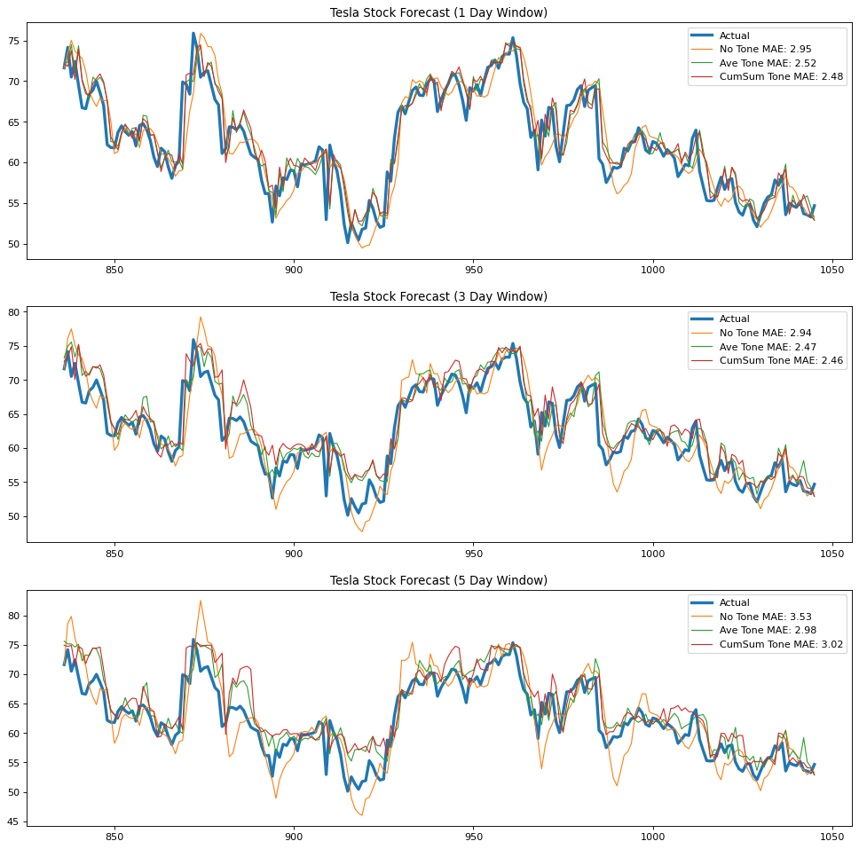

# Predicting Stock Index with Systematic Risk

Big Data and Cloud Computing Final Project by Marvee dela Resma, Patrick Guillano La Rosa, Miguel Carlo Pingol, and Christian Alfred Soriano - March 14, 2022. The code, analysis, and the full report are included in the <a href="https://github.com/pgplarosa/Predicting-Stock-Index-with-Systematic-Risk/blob/main/md/Technical%20Report.md">Technical Report</a>. If you have any questions regarding this study, please send me a message via  <a href="https://www.linkedin.com/in/patricklarosa/">LinkedIn</a>.

## Executive Summary

News headlines serve as flagships for the events that dictate the rise and crash of equity as the stock market is held under the pervasive influence of media. This begs the question of: how we can use the availability of news information to methodically quantify the effect of media on a company’s stock price? Using data freely available from the GDELT project and Yahoo Finance, this study leveraged Amazon Web Services as a platform for Pyspark which the authors utilized to combine company stock price information and an aggregated media tone from several reports coming from different news sources. The Closing Price for several companies was then modelled using the Merlion Time Series DefaultForecaster using an 80% Train and 20% Test split. Tesla Stock produced a MAE of 2.47 when the cumulative sum of the daily media tone from different sources is included as feature and forecasted using the last value of a 3-Day Sliding Prediction Window. When back testing is utilized with the model’s prediction, the study produces a return of -9.64 compared to -61.67 when using moving averages, showing definite improvement. To further refine the results coming from this study, the authors suggest the following: keyword choice augmentation when scraping web articles from the GDELT project, a granular incorporation of long and short range data coming also coming from GDELT, pre-processing steps and hyperparameter tuning for the Time Series models utilized, and finally, company profiling to refine the selection criteria of entities suited for this methodology.

## Sample Results
Outputs of other company stocks and methods can be seen in the <a href="https://github.com/pgplarosa/Finding-Patterns-in-the-Presidentiables-Tweets/blob/main/ML2%20Final%20Report.html">Technical Report</a>.
<table> 
<tr>
<td><b>TESLA</b></td>
</tr>
<tr>
<td></td>
</tr>

</table>
