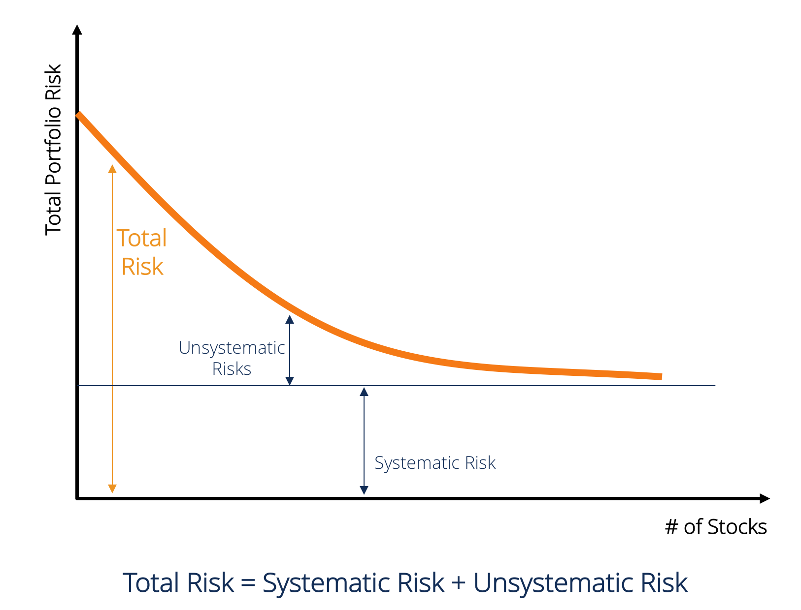
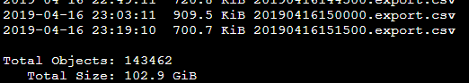
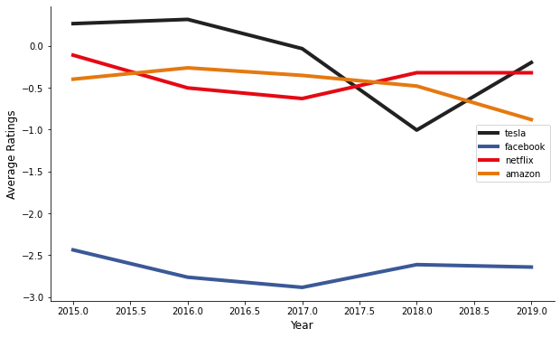
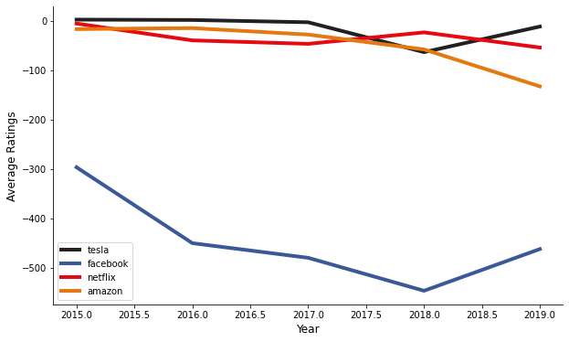
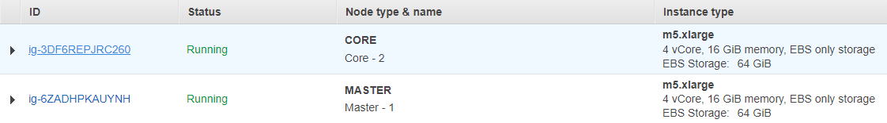
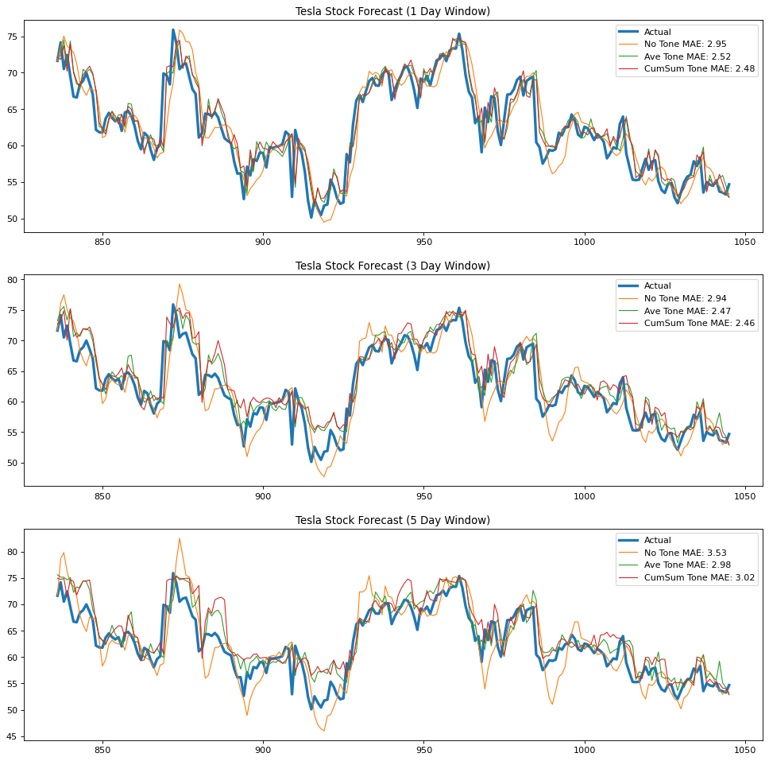
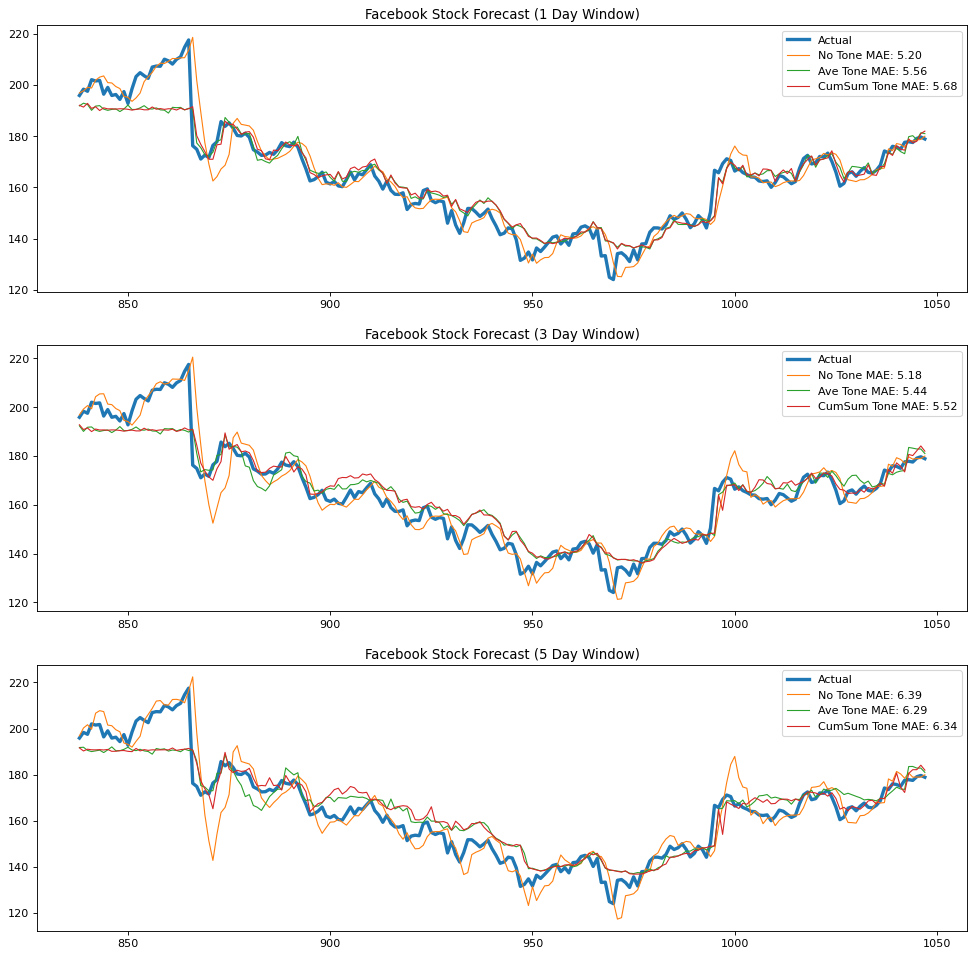
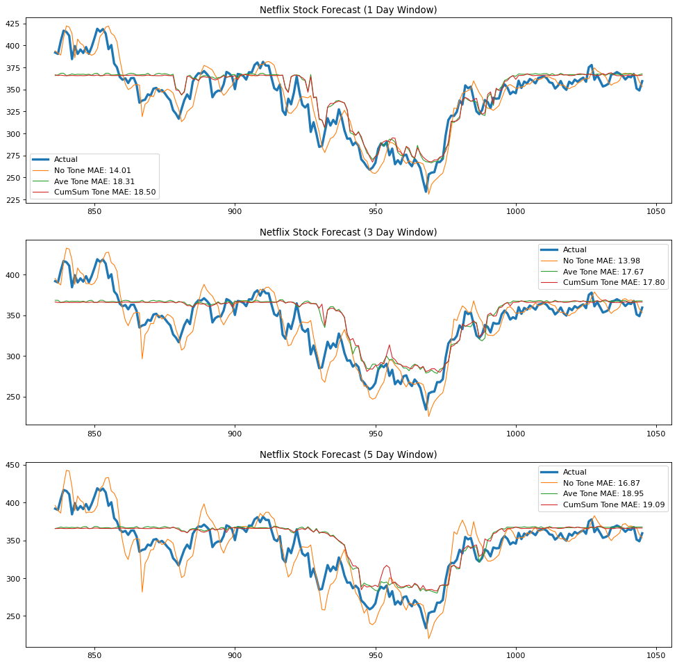
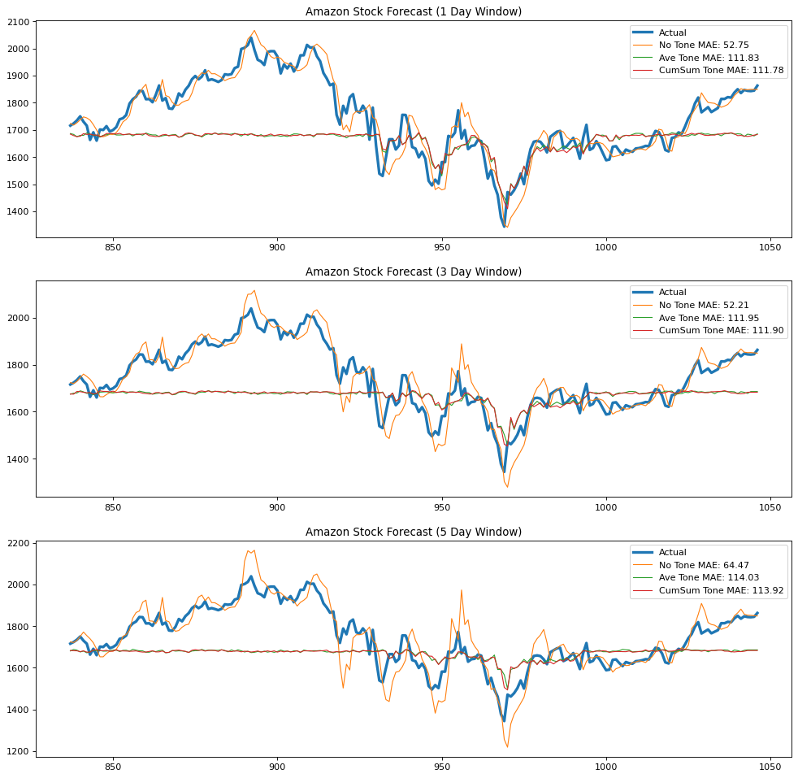

# I Know You Got The Feels: Predicting Stock Index Using GDELT v2 Events Daily Average Tone


```python
display(Image(filename="img/banner.png"))
```


## 1. Executive Summary

<p style="text-align:justify">News headlines serve as flagships for the events that dictate the rise and crash of equity as the stock market is held under the pervasive influence of media. This begs the question of: how we can use the availability of news information to methodically quantify the effect of media on a company’s stock price? Using data freely available from the GDELT project and Yahoo Finance, this study leveraged Amazon Web Services as a platform for Pyspark which the authors utilized to combine company stock price information and an aggregated media tone from several reports coming from different news sources. The Closing Price for several companies was then modelled using the Merlion Time Series DefaultForecaster using an 80% Train and 20% Test split. Tesla Stock produced a MAE of 2.47 when the cumulative sum of the daily media tone from different sources is included as feature and forecasted using the last value of a 3-Day Sliding Prediction Window. When back testing is utilized with the model’s prediction, the study produces a return of -9.64 compared to -61.67 when using moving averages, showing definite improvement. To further refine the results coming from this study, the authors suggest the following: keyword choice augmentation when scraping web articles from the GDELT project, a granular incorporation of long and short range data coming also coming from GDELT, pre-processing steps and hyperparameter tuning for the Time Series models utilized, and finally, company profiling to refine the selection criteria of entities suited for this methodology.</p>


```python
from datetime import datetime
import math 

import pandas as pd
import matplotlib.pyplot as plt
import plotly.graph_objects as go
from plotly.subplots import make_subplots
import plotly
from IPython.display import HTML
from IPython.display import Image as _image

import pickle
from backtesting import Backtest, Strategy
from backtesting.lib import crossover
from backtesting.test import SMA

plotly.offline.init_notebook_mode()

COLORS = ['#4db4d7']

HTML('''<script>
code_show=true; 
function code_toggle() {
 if (code_show){
 $('div.input').hide();
 } else {
 $('div.input').show();
 }
 code_show = !code_show
} 
$( document ).ready(code_toggle);
</script>
<style>
.output_png {
    display: table-cell;
    text-align: center;
    horizontal-align: middle;
    vertical-align: middle;
    margin:auto;
}

tbody, thead {
    margin-left:100px;
}

</style>
<form action="javascript:code_toggle()"><input type="submit"
value="Click here to toggle on/off the raw code."></form>''')
```

## 2. Problem Statement

_How might we measure the effect of media sentiments on stock prices?_

## 3. Motivation

<p style="text-align:justify">Systematic risk represents the volatility and dynamics of the stock market reliant on factors outside of the companies involved such as government policy and mass media. It is unpredictable and impossible to completely avoid. Therefore, there is benefit in being able to incorporate this in models used to predict the stock index. [3]</p>

<p style="text-align:justify">Mass media acts as a representation of systematic risk, as its influence is pervasive throughout society and its institutions, the stock market included. Our study wanted to see how much influence mass media has in forecasting the closing price of a company's stock. For example, continuous negative press on a company can influence its stock price to go down continuously throughout that period. Being able to predict the early signs of the downtrend can mean selling early and net loss is minimized.</p>


```python
display(HTML('''<center style="font-size:12px;font-style:default;"><b>
Figure 1. Portfolio Risk.
</b></center>'''))

display(_image(filename="img/risk.png"))
```


<center style="font-size:12px;font-style:default;"><b>
Figure 1. Portfolio Risk.
</b></center>





## 4. Data Source

<p style="text-align:justify">The GDELT project has almost 250 million event record for a worldwide range of categories from 1979 up to the present. It is a network connecting each record’s themes, locations, personalities, organizations, and locations with corresponding emotional assessments. It is meant to be a repository and a representation of the world’s behavior recorded through events. It covers most of the world events and provide details such as people or groups involved, its context and what tone the record reflects. Different media such as broadcast, print, and web news released by several media sources worldwide are recorded[1].</p>

<p style="text-align:justify">The dataset used for this study is the events dataset which has over 143,000 files and is 102 GB in size. The events dataset is a table updated every 15 minutes. The dataset in the AWS open registry covers data from 2015 to Q1 2019. GDELT events dataset has several features, 61 in total, but we chose the following features to be in the final dataset:</p>


```python
display(HTML('''<center style="font-size:12px;font-style:default;"><b>
Figure 2. Initial Data Size Scan.
</b></center>'''))

display(_image(filename="img/datasize.png"))
```


<center style="font-size:12px;font-style:default;"><b>
Figure 2. Initial Data Size Scan.
</b></center>





<p style="text-align:justify">The <b>average tone</b> serves as the key feature to forecast a company’s stock price in this study. It is the average “tone” of all documents containing one or more mentions of this event. The common values range between -10 and +10, with 0 indicating neutral.  It is used for filtering the “context” of events as a subtle measure of the importance of an event and as a proxy for the “impact” of that event.  This provides only a basic tonal assessment of an article. This also ranges from -100 to 100. [2]</p>

<p style="text-align:justify">For the corresponding stock information for each company analyzed, we utilized Yahoo Finance which is one of the largest sources of stock quotes and other financial information available. It holds information for over 37 thousand stocks for over 50 countries.</p>

<center style="font-size:12px;font-style:default;"><b>
Table 1. GDELT Chosen Feature List
</b></center>

| Feature Name | Description |
| :- | :- |
| Date Added | stores the date the event was added to the master database |
| Actor1Name | first of two actors involved in the event. It could be proper or formal names, names of countries and cities, ethnic groups, religious groups, etc |
| Actor2Name | second of two actors involved in the event. It could be proper or formal names, names of countries and cities, ethnic groups, religious groups, etc |
| URL | the URL or citation of the news report the event was found in |
| Average Tone | a quantitative measure of the positive, negative, or neutral sentiment for the event record |

## 5. Data Exploration

### 5.1 Plot of time series of tone

<p style="text-align:justify">Let us visualize the average tone score and cumulative average tone score of the companies for each year to get the trend of the sentiments for the written artciles.</p>


```python
tesla_tone = pd.read_csv('data/tesla.csv')
fb_tone = pd.read_csv('data/facebook.csv')
nf_tone = pd.read_csv('data/netflix.csv')
amzn_tone = pd.read_csv('data/amazon.csv')

for tone in [tesla_tone, fb_tone, nf_tone, amzn_tone]:
    tone['Date'] = (tone['DATEADDED'].astype('str')
                                     .apply(lambda x: datetime(int(x[:4]), 
                                                      int(x[4:6]), 
                                                      int(x[6:]))))
    tone.drop('DATEADDED', axis=1, inplace=True)
    tone['year'] = tone.Date.dt.year.astype('int')
    tone = tone.groupby('year')['Daily Average Tone'].mean()

display(HTML('''<center style="font-size:12px;font-style:default;"><b>
Figure 3. Plots of time series tone score.
</b></center>'''))

display(HTML(f'''<h3 style="text-align:center">
                Average Yearly<b style="color:{COLORS[0]}">
                 tone score</b>  of the companies
                </h3>'''))

fig, ax = plt.subplots(figsize=(10, 6))
names = ['tesla', 'facebook', 'netflix', 'amazon']
colors = ['#212121', '#3b5998', '#e50914', '#e47911']
for tone, name, color in zip([tesla_tone, fb_tone, nf_tone, 
                       amzn_tone], names, colors):
    (tone.groupby('year')['Daily Average Tone'].mean()
         .plot(color=color, lw=4, ax=ax, label=name))
    plt.xlabel("Year", fontsize=12)
    plt.ylabel("Average Ratings", fontsize=12)

ax.legend()
ax.spines['top'].set_visible(False)
ax.spines['right'].set_visible(False)    
plt.show()

tesla_cumsum_tone = pd.read_csv('data/tesla_cumsum.csv')
fb_cumsum_tone = pd.read_csv('data/facebook_cumsum.csv')
nf_cumsum_tone = pd.read_csv('data/netflix_cumsum.csv')
amzn_cumsum_tone = pd.read_csv('data/amazon_cumsum.csv')

for tone in [tesla_cumsum_tone, fb_cumsum_tone, 
             nf_cumsum_tone, amzn_cumsum_tone]:
    tone['Date'] = (tone['DATEADDED'].astype('str')
                                     .apply(lambda x: datetime(int(x[:4]), 
                                                      int(x[4:6]), 
                                                      int(x[6:]))))
    tone.drop('DATEADDED', axis=1, inplace=True)
    tone['year'] = tone.Date.dt.year.astype('int')
    tone = tone.groupby('year')['Daily Average Tone'].mean()
    
display(HTML(f'''<h3 style="text-align:center">
                Average yearly<b style="color:{COLORS[0]}">
                cumulative tone score</b>  of the companies
                </h3>'''))

fig, ax = plt.subplots(figsize=(10, 6))
names = ['tesla', 'facebook', 'netflix', 'amazon']
colors = ['#212121', '#3b5998', '#e50914', '#e47911']
for tone, name, color in zip([tesla_cumsum_tone, fb_cumsum_tone, 
                              nf_cumsum_tone, amzn_cumsum_tone], 
                             names, colors):
    (tone.groupby('year')['Daily Average Tone'].mean()
         .plot(color=color, lw=4, ax=ax, label=name))
    plt.xlabel("Year", fontsize=12)
    plt.ylabel("Average Ratings", fontsize=12)

ax.legend()
ax.spines['top'].set_visible(False)
ax.spines['right'].set_visible(False)    
plt.show()
```


<center style="font-size:12px;font-style:default;"><b>
Figure 3. Plots of time series tone score.
</b></center>


<h3 style="text-align:center">
                Average Yearly<b style="color:#4db4d7">
                 tone score</b>  of the companies
                </h3>





<h3 style="text-align:center">
                Average yearly<b style="color:#4db4d7">
                cumulative tone score</b>  of the companies
                </h3>





<p style="text-align:justify">We can observe that Tesla has always been consistent at the top of the tone score except for the 2018 where there is a news about its owner Elon Musk over fraud charges and news about the Tesla car crash during its autopilot. Aside from that year, it remained to the top of the tone scores. We can also see that Facebook is far behind at the bottom in terms of the tone score. Overall, most of these big companies have negative tone score of news articles</p>

### 5.2 Plot of time series of stocks

<p style="text-align:justify">Let us also visualize the actual performance of stocks during the same period of study from 2015 to 2019.</p>


```python
def show_candlesticks(df, symbols='All'):
    """
    Figure that shows the candlesticks of a market
    Parameters
    ===========
    df                  dataframe 
                        object having data 
    symbol              list 
                        symbols you want to graph (recommended 1 symbol only)
    """
    # create figure object for suplots
    fig = make_subplots(rows=1, 
                      cols=1,
                      subplot_titles=[symbols])
    # update figure size
    fig.update_layout(
    autosize = False,
    width = 950 * 1,
    height = 500 * 1,
    paper_bgcolor = "LightSteelBlue"
    )

    # loop through all the symbols needed to plot
    row = 1
    col = 1
    df_market = df.copy()
    fig.add_trace(
        go.Candlestick(x=df.index,
                  open=df_market['Open'],
                  high=df_market['High'],
                  low=df_market['Low'],
                  close=df_market['Close'], 
                  ),
                  row=row, col=col
        );


    fig.show();
```


```python
tesla = pd.read_csv('data/tesla_complete.csv').set_index('Date')
fb = pd.read_csv('data/facebook_completed.csv').set_index('Date')
nf = pd.read_csv('data/netflix_completed.csv').set_index('Date')
amzn = pd.read_csv('data/amazon_completed.csv').set_index('Date')

display(HTML('''<center style="font-size:12px;font-style:default;"><b>
Figure 4. Plot of time series actual stock prices.
</b></center>'''))

for stock, title in zip([tesla, fb, nf, amzn], 
                        ['Tesla', 'Facebook', 'Netflix', 'Amazon']):
    show_candlesticks(stock, title)
```


<center style="font-size:12px;font-style:default;"><b>
Figure 4. Plot of time series actual stock prices.
</b></center>


<div>                            <div id="48524474-5bf9-49af-9bad-cf754b909b0c" class="plotly-graph-div" style="height:500px; width:950px;"></div>            <script type="text/javascript">                require(["plotly"], function(Plotly) {                    window.PLOTLYENV=window.PLOTLYENV || {};                                    if (document.getElementById("48524474-5bf9-49af-9bad-cf754b909b0c")) {                    Plotly.newPlot(                        "48524474-5bf9-49af-9bad-cf754b909b0c",                        [{"close":[40.891998291015625,42.34199905395508,43.422000885009766,41.46799850463867,40.821998596191406,40.75199890136719,41.4379997253418,40.667999267578125,39.46599960327149,39.9119987487793,40.48799896240234,40.1259994506836,38.7760009765625,38.17599868774414,38.06399917602539,38.74800109863281,38.2140007019043,37.73600006103516,39.13999938964844,38.94599914550781,40.141998291015625,39.130001068115234,39.61600112915039,39.92599868774414,40.34400177001953,38.86000061035156,37.0,38.11399841308594,37.75400161743164,37.51800155639648,38.20000076293945,40.619998931884766,40.650001525878906,41.53400039672852,42.01800155639648,42.18000030517578,41.95600128173828,41.492000579833984,41.56600189208984,41.34000015258789,41.358001708984375,41.05400085449219,41.88199996948242,43.88800048828125,43.720001220703125,43.68600082397461,46.310001373291016,46.09600067138672,46.4900016784668,45.209999084472656,45.20600128173828,46.10200119018555,46.59000015258789,46.08599853515625,47.36000061035156,47.321998596191406,47.89799880981445,48.948001861572266,48.63600158691406,48.81999969482422,49.76800155639648,49.75,49.428001403808594,48.869998931884766,49.124000549316406,49.54600143432617,49.492000579833984,49.48600006103516,50.290000915527344,50.15999984741211,49.88999938964844,49.66999816894531,49.79800033569336,49.18399810791016,49.82799911499024,51.257999420166016,51.20000076293945,50.13999938964844,50.28200149536133,50.13800048828125,50.07600021362305,50.624000549316406,52.08200073242188,52.37799835205078,52.50199890136719,51.95800018310547,53.53400039672852,53.03400039672852,53.757999420166016,53.417999267578125,52.40399932861328,53.652000427246094,53.83000183105469,56.00400161743164,55.94400024414063,53.57600021362305,50.992000579833984,51.58399963378906,51.83000183105469,52.43199920654297,53.130001068115234,52.62799835205078,53.33599853515625,54.93199920654297,56.45199966430664,53.354000091552734,53.57400131225586,53.43999862670898,53.08200073242188,50.60200119018555,52.9640007019043,52.76399993896485,53.358001708984375,53.22999954223633,51.99800109863281,53.25600051879883,54.0260009765625,49.22600173950195,48.50199890136719,48.22800064086914,47.4739990234375,47.63399887084961,48.50199890136719,48.630001068115234,50.99800109863281,52.14400100708008,51.04999923706055,48.43600082397461,46.15399932861328,43.77399826049805,44.00600051879883,44.96799850463867,48.59799957275391,49.69599914550781,49.8120002746582,47.72600173950195,49.53799819946289,49.11399841308594,48.38600158691406,49.63399887084961,49.78200149536133,49.69599914550781,50.04800033569336,50.63800048828125,50.7140007019043,52.45000076293945,52.41400146484375,52.124000549316406,52.84000015258789,52.1879997253418,52.21200180053711,52.624000549316406,51.38199996948242,49.68600082397461,49.33000183105469,49.68000030517578,47.97600173950195,49.51399993896485,49.22999954223633,48.29199981689453,46.391998291015625,45.34400177001953,44.13800048828125,43.11600112915039,43.84999847412109,43.3759994506836,44.262001037597656,45.402000427246094,45.619998931884766,42.60599899291992,42.01800155639648,41.81800079345703,43.05199813842773,42.06999969482422,42.59199905395508,42.32600021362305,41.38600158691406,42.757999420166016,41.66999816894531,46.32600021362305,46.354000091552734,46.47200012207031,45.06600189208984,43.29999923706055,43.81600189208984,42.5880012512207,41.4379997253418,42.86199951171875,42.79999923706055,44.2140007019043,44.36000061035156,44.00199890136719,43.54999923706055,43.650001525878906,45.928001403808594,46.321998596191406,46.05199813842773,47.4379997253418,46.39799880981445,46.54199981689453,46.07600021362305,46.22600173950195,45.34400177001953,44.90399932861328,45.41400146484375,43.40399932861328,43.71599960327149,44.21799850463867,46.902000427246094,46.678001403808594,46.09199905395508,46.512001037597656,45.9900016784668,45.93999862670898,46.11399841308594,45.790000915527344,47.4379997253418,47.61800003051758,48.00199890136719,44.68199920654297,44.68600082397461,43.80799865722656,43.130001068115234,42.20000076293945,41.56999969482422,41.99399948120117,40.0620002746582,41.23600006103516,40.99800109863281,40.94400024414063,39.7400016784668,39.99399948120117,40.5099983215332,39.2760009765625,38.71200180053711,37.61399841308594,37.93999862670898,38.2400016784668,39.38800048828125,36.555999755859375,34.69599914550781,35.066001892089844,32.52000045776367,29.597999572753903,29.649999618530277,28.733999252319336,30.0939998626709,30.20800018310547,31.03400039672852,33.73600006103516,33.354000091552734,33.316001892089844,35.54800033569336,35.44200134277344,35.79999923706055,37.48600006103516,38.06800079345703,38.38600158691406,37.27000045776367,37.667999267578125,39.14799880981445,40.20800018310547,41.05799865722656,40.52000045776367,41.74399948120117,41.0359992980957,41.5,43.02999877929688,43.667999267578125,44.38600158691406,45.2760009765625,46.54800033569336,47.66400146484375,46.84799957275391,44.51599884033203,45.54999923706055,46.05199813842773,46.0260009765625,45.37799835205078,45.95399856567383,47.51800155639648,49.39799880981445,51.09400177001953,53.08399963378906,51.43999862670898,50.01399993896485,49.98400115966797,49.56399917602539,50.90599822998047,50.37200164794922,50.902000427246094,50.7760009765625,49.4739990234375,49.99399948120117,49.65800094604492,50.75,50.36399841308594,50.74800109863281,50.29399871826172,49.54199981689453,48.152000427246094,48.36000061035156,46.4640007019043,44.512001037597656,42.305999755859375,42.98600006103516,41.78400039672852,41.73799896240234,41.79199981689453,41.45600128173828,41.52199935913086,41.65800094604492,40.93199920654297,42.23400115966797,43.04199981689453,44.055999755859375,43.24399948120117,43.58200073242188,43.91600036621094,45.02399826049805,44.608001708984375,44.64599990844727,43.9119987487793,43.79199981689453,43.79800033569336,44.13600158691406,46.46799850463867,47.104000091552734,45.87200164794922,43.757999420166016,43.57400131225586,42.992000579833984,43.540000915527344,43.58599853515625,43.09400177001953,43.93999862670898,43.922000885009766,39.33200073242188,39.27999877929688,38.630001068115234,39.709999084472656,40.358001708984375,42.03799819946289,42.45600128173828,43.29999923706055,42.79600143432617,42.88800048828125,43.1879997253418,43.35599899291992,44.95600128173828,44.93000030517578,44.50600051879883,44.305999755859375,44.08000183105469,45.25,45.05199813842773,45.672000885009766,44.09999847412109,44.45399856567383,46.00199890136719,45.902000427246094,45.698001861572266,46.12200164794922,46.95800018310547,46.00199890136719,45.43999862670898,45.15800094604492,46.12200164794922,46.00600051879883,45.23199844360352,45.81600189208984,45.130001068115234,44.98199844360352,45.12200164794922,45.11800003051758,44.72200012207031,44.64799880981445,44.70199966430664,45.0,44.58599853515625,44.96799850463867,44.52399826049805,44.19200134277344,43.99800109863281,43.040000915527344,42.26800155639648,42.402000427246094,40.15399932861328,39.555999755859375,40.56600189208984,40.34199905395508,39.47200012207031,38.89400100708008,39.65999984741211,39.209999084472656,39.28200149536133,40.08399963378906,41.08000183105469,41.26800155639648,40.928001403808594,41.04399871826172,41.2859992980957,41.4900016784668,41.79800033569336,41.1619987487793,41.25400161743164,40.13999938964844,40.805999755859375,42.7400016784668,42.28200149536133,41.69200134277344,40.20000076293945,39.321998596191406,40.18999862670898,40.02000045776367,40.30199813842773,40.04800033569336,39.30199813842773,38.79199981689453,39.81999969482422,40.71200180053711,39.81999969482422,40.01800155639648,40.55199813842773,40.46799850463867,40.448001861572266,40.80199813842773,39.99399948120117,39.54600143432617,38.15800094604492,37.604000091552734,37.48400115966797,38.11199951171875,38.641998291015625,38.98799896240234,38.012001037597656,37.06999969482422,37.71200180053711,36.290000915527344,36.75400161743164,36.7859992980957,37.73199844360352,37.00400161743164,36.90399932861328,38.23400115966797,38.62799835205078,39.33000183105469,39.2239990234375,37.91400146484375,37.880001068115234,36.3759994506836,36.29399871826172,37.36000061035156,37.16999816894531,38.630001068115234,38.45800018310547,38.43600082397461,38.48600006103516,39.630001068115234,39.73799896240234,39.51599884033203,40.49800109863281,40.54600143432617,41.757999420166016,41.540000915527344,41.68999862670898,42.667999267578125,43.90599822998047,43.948001861572266,42.93600082397461,42.73799896240234,43.39799880981445,45.39799880981445,45.34999847412109,45.80199813842773,46.25600051879883,45.9739990234375,45.94599914550781,45.917999267578125,47.54999923706055,47.11600112915039,47.672000885009766,48.75199890136719,48.94599914550781,49.78400039672852,50.922000885009766,50.89400100708008,50.50199890136719,50.59000015258789,50.1259994506836,50.38600158691406,49.84799957275391,50.310001373291016,50.26599884033203,51.55400085449219,51.49599838256836,52.41600036621094,53.84000015258789,53.84600067138672,56.119998931884766,56.19599914550781,55.95199966430664,53.790000915527344,54.44599914550781,55.47800064086914,54.70199966430664,51.198001861572266,51.400001525878906,49.24599838256836,49.99800109863281,50.00400161743164,50.09600067138672,50.31399917602539,50.242000579833984,49.71799850463867,49.374000549316406,48.97999954223633,48.73799896240234,49.23400115966797,51.59999847412109,51.14599990844727,52.40999984741211,52.29999923706055,52.38399887084961,50.13600158691406,51.00199890136719,50.95600128173828,52.63199996948242,54.04399871826172,55.4900016784668,55.47600173950195,55.58399963378906,55.65999984741211,59.70399856567383,60.7400016784668,59.0,59.7400016784668,60.507999420166016,62.47800064086914,61.742000579833984,59.36800003051758,60.79999923706055,60.28799819946289,60.04999923706055,61.104000091552734,60.50199890136719,61.119998931884766,61.60599899291992,62.757999420166016,62.03400039672852,61.72600173950195,62.81399917602539,64.56600189208984,63.77799987792969,62.20399856567383,59.09199905395508,61.66999816894531,61.4379997253418,64.25199890136719,65.04399871826172,64.62000274658203,64.96199798583984,63.17599868774414,63.402000427246094,61.22200012207031,62.61199951171875,62.16600036621094,62.06999969482422,60.77199935913086,62.04399871826172,63.36600112915039,65.02799987792969,67.0199966430664,68.2020034790039,68.0739974975586,67.97000122070312,69.46399688720703,70.56999969482422,71.93000030517578,74.0,71.46399688720703,71.802001953125,75.19000244140625,76.13200378417969,75.06800079345703,74.27999877929688,73.95999908447266,74.447998046875,75.27999877929688,76.52200317382812,76.69000244140625,75.49800109863281,72.4739990234375,74.24800109863281,72.1500015258789,72.3219985961914,70.52400207519531,65.41799926757812,61.76599884033203,62.64400100708008,63.209999084472656,65.44400024414062,65.90399932861328,64.68199920654297,65.55599975585938,63.91400146484375,65.64800262451172,65.052001953125,65.98400115966797,65.68000030517578,68.50399780273438,67.91999816894531,68.7699966430664,66.89199829101562,67.01399993896484,64.69400024414062,63.91400146484375,65.1780014038086,69.41799926757812,71.38200378417969,71.03399658203125,73.04399871826172,72.70600128173828,71.08000183105469,71.5739974975586,72.76000213623047,72.46600341796875,72.58200073242188,70.38400268554688,69.49199676513672,67.5719985961914,68.2699966430664,70.55400085449219,70.58599853515625,69.61000061035156,69.13200378417969,69.47200012207031,70.63600158691406,71.18000030517578,71.08000183105469,69.91799926757812,68.90599822998047,70.12200164794922,68.68000030517578,72.73799896240234,72.55000305175781,73.24600219726562,75.52799987792969,75.96199798583984,77.0,75.0199966430664,74.78199768066406,73.2959976196289,70.21800231933594,68.99800109863281,69.05000305175781,68.19400024414062,67.91999816894531,68.22000122070312,68.30599975585938,69.62799835205078,71.00199890136719,71.06600189208984,71.3759994506836,68.58799743652344,71.11799621582031,70.91999816894531,71.13600158691406,71.11399841308594,70.12000274658203,71.1500015258789,71.93000030517578,70.36199951171875,69.0199966430664,67.40399932861328,67.46800231933594,65.16799926757812,65.23400115966797,64.17400360107422,64.01599884033203,66.30599975585938,64.21600341796875,59.85200119018555,61.21799850463867,60.555999755859375,61.209999084472656,60.87799835205078,60.59799957275391,60.59799957275391,63.08000183105469,61.7400016784668,62.2599983215332,62.5,63.0099983215332,61.74800109863281,63.5620002746582,62.52000045776367,63.11000061035156,63.36199951171875,63.5099983215332,61.507999420166016,61.77000045776367,61.305999755859375,61.040000915527344,60.7400016784668,62.652000427246094,62.24800109863281,63.0260009765625,65.78199768066406,68.20600128173828,67.80599975585938,67.5780029296875,68.69000244140625,67.77400207519531,66.22000122070312,65.7959976196289,66.33200073242188,65.04000091552734,63.45800018310547,62.32799911499024,63.071998596191406,62.27000045776367,64.10600280761719,63.45000076293945,62.92399978637695,63.31600189208984,67.28199768066406,66.73799896240234,66.95999908447266,67.58999633789062,67.24400329589844,68.01200103759766,69.43199920654297,68.91400146484375,70.00399780273438,70.31199645996094,70.55799865722656,69.1780014038086,67.52799987792969,68.56999969482422,69.90599822998047,69.16400146484375,70.86199951171875,69.8499984741211,68.75,66.6259994506836,66.79399871826172,69.0,63.04600143432617,62.08399963378906,63.14599990844727,64.73200225830078,64.46199798583984,66.81400299072266,67.0979995727539,66.9540023803711,66.66000366210938,69.23400115966797,70.41000366210938,71.48400115966797,70.197998046875,68.61199951171875,66.18599700927734,67.02400207519531,66.66999816894531,65.63999938964844,66.45999908447266,65.81999969482422,65.43399810791016,69.10199737548828,68.36799621582031,65.32599639892578,65.12000274658203,64.2699966430664,62.71200180053711,62.11000061035156,63.305999755859375,61.81999969482422,60.30799865722656,60.83599853515625,55.83599853515625,51.555999755859375,53.22600173950195,50.49599838256836,53.50600051879883,57.38800048828125,61.14400100708008,59.86000061035156,57.93199920654297,60.93999862670898,60.18600082397461,58.81600189208984,60.06800079345703,58.242000579833984,57.53799819946289,58.66999816894531,60.01599884033203,58.04800033569336,56.67399978637695,56.69200134277344,56.13800048828125,57.09600067138672,58.81600189208984,58.77999877929688,59.98400115966797,60.22999954223633,56.88999938964844,58.81800079345703,60.55400085449219,60.39400100708008,61.369998931884766,61.00400161743164,60.21200180053711,58.39400100708008,56.83599853515625,57.29600143432617,56.90800094604492,55.36399841308594,56.89799880981445,55.00199890136719,55.81399917602539,55.56999969482422,55.77000045776367,56.75199890136719,58.34400177001953,56.94599914550781,58.36399841308594,59.34799957275391,58.22600173950195,63.900001525878906,63.21799850463867,63.53200149536133,66.41999816894531,68.55400085449219,68.95600128173828,71.54399871826172,71.63400268554688,74.16600036621094,70.51000213623047,72.44400024414062,69.50199890136719,66.72599792480469,66.60199737548828,68.4000015258789,68.9000015258789,69.98600006103516,68.58999633789062,67.01399993896484,62.172000885009766,61.83200073242188,61.77999877929688,63.70199966430664,64.49400329589844,63.79199981689453,63.34199905395508,63.77399826049805,62.02000045776367,64.53800201416016,64.7699966430664,64.0459976196289,62.71599960327149,60.63999938964844,59.48600006103516,61.74800109863281,61.33000183105469,59.43600082397461,58.03400039672852,59.62799835205078,60.167999267578125,69.90799713134766,69.63400268554688,68.39800262451172,75.91400146484375,74.06800079345703,70.48999786376953,71.0979995727539,71.28199768066406,69.52799987792969,67.73799896240234,67.08999633789062,61.09999847412109,61.6879997253418,64.37999725341797,64.3280029296875,64.0199966430664,64.56400299072266,63.854000091552734,62.37200164794922,61.00199890136719,60.630001068115234,60.33200073242188,57.790000915527344,56.14799880981445,56.18999862670898,52.64799880981445,57.09999847412109,55.88800048828125,58.108001708984375,57.891998291015625,59.040000915527344,58.96799850463867,56.992000579833984,59.80400085449219,59.66600036621094,59.81999969482422,59.93600082397461,60.198001861572266,61.91600036621094,61.50400161743164,52.95399856567383,62.13999938964844,60.20399856567383,58.959999084472656,56.36600112915039,52.38999938964844,50.11199951171875,52.560001373291016,51.3759994506836,50.44599914550781,51.75600051879883,51.917999267578125,55.31800079345703,54.35599899291992,52.78200149536133,52.0,52.18999862670898,58.82799911499024,57.70000076293945,62.97200012207031,66.18000030517578,66.97000122070312,65.9800033569336,67.46399688720703,68.85600280761719,69.28199768066406,68.27999877929688,68.21199798583984,69.63200378417969,70.27999877929688,70.10199737548828,66.25599670410156,67.74600219726562,68.80000305175781,69.68800354003906,70.86199951171875,70.69400024414062,69.49800109863281,67.63800048828125,65.16600036621094,69.19999694824219,68.78399658203125,69.5739974975586,68.23400115966797,70.09600067138672,71.697998046875,71.94000244140625,72.61199951171875,71.59400177001953,73.02999877929688,73.35199737548828,73.31999969482422,75.35800170898438,73.14199829101562,69.68399810791016,67.40599822998047,66.59400177001953,63.07600021362305,63.95399856567383,59.07799911499024,65.21800231933594,63.22600173950195,66.77400207519531,66.55999755859375,62.02399826049805,60.071998596191406,63.53799819946289,66.99199676513672,67.06999969482422,67.70600128173828,68.99400329589844,69.4520034790039,66.87999725341797,68.88600158691406,69.20999908447266,69.46199798583984,60.45199966430664,59.78400039672852,57.51800155639648,58.30199813842773,59.40800094604492,59.2760009765625,59.492000579833984,61.75400161743164,61.40399932861328,62.44200134277344,62.57799911499024,64.2699966430664,63.44400024414063,61.50199890136719,61.15999984741211,62.56800079345703,62.36199951171875,61.63399887084961,60.75400161743164,61.57600021362305,61.12799835205078,60.512001037597656,58.24599838256836,58.94200134277344,59.75400161743164,59.571998596191406,62.948001861572266,63.97600173950195,58.95800018310547,57.071998596191406,55.30799865722656,55.24800109863281,55.31800079345703,56.82799911499024,58.18399810791016,56.672000885009766,57.79199981689453,57.992000579833984,55.08599853515625,53.89799880981445,53.49399948120117,54.720001220703125,54.80400085449219,52.90599822998047,52.08399963378906,53.55400085449219,54.96599960327149,55.7239990234375,55.97200012207031,57.83599853515625,57.17599868774414,58.36199951171875,53.555999755859375,54.992000579833984,54.63999938964844,54.46200180053711,55.21200180053711,53.68399810791016,53.540000915527344,53.2760009765625,54.672000885009766],"high":[41.23400115966797,42.48799896240234,43.52000045776367,43.63999938964844,41.45800018310547,41.428001403808594,42.21799850463867,41.709999084472656,40.667999267578125,40.04800033569336,40.50400161743164,41.23799896240234,40.150001525878906,38.89799880981445,38.70000076293945,39.23600006103516,38.88999938964844,38.34999847412109,39.18199920654297,39.742000579833984,40.17599868774414,40.917999267578125,39.79800033569336,40.09999847412109,40.757999420166016,39.71799850463867,37.858001708984375,38.45000076293945,38.75199890136719,38.459999084472656,38.64599990844727,41.54999923706055,41.012001037597656,42.18000030517578,42.07400131225586,42.33000183105469,42.59999847412109,41.89799880981445,41.917999267578125,41.83399963378906,41.3759994506836,41.56999969482422,42.150001525878906,44.3759994506836,44.29600143432617,44.15999984741211,47.75,47.09999847412109,46.99399948120117,46.57799911499024,46.354000091552734,46.94599914550781,47.900001525878906,46.89400100708008,47.49599838256836,47.68199920654297,48.57600021362305,49.27000045776367,49.65999984741211,48.97800064086914,49.880001068115234,49.97999954223633,50.20000076293945,49.54800033569336,49.32400131225586,49.720001220703125,50.400001525878906,49.900001525878906,50.36000061035156,50.57400131225586,50.31999969482422,49.880001068115234,50.14400100708008,49.86000061035156,49.93999862670898,51.75,51.54800033569336,50.79999923706055,50.874000549316406,50.69200134277344,50.25600051879883,50.6879997253418,52.87200164794922,52.69200134277344,52.7599983215332,52.880001068115234,53.59999847412109,53.470001220703125,54.28200149536133,53.821998596191406,53.18999862670898,54.18399810791016,54.52399826049805,56.4900016784668,56.3380012512207,55.040000915527344,52.15999984741211,52.59000015258789,52.59999847412109,52.5099983215332,53.198001861572266,53.49800109863281,53.43999862670898,55.108001708984375,57.33000183105469,54.70000076293945,53.88800048828125,53.97999954223633,54.21799850463867,52.88600158691406,53.08000183105469,53.57799911499024,53.38800048828125,53.87200164794922,53.34199905395508,53.34400177001953,54.20000076293945,51.0,48.74599838256836,48.59400177001953,47.86000061035156,47.95399856567383,49.29600143432617,49.58599853515625,51.31800079345703,52.18999862670898,52.130001068115234,50.9119987487793,48.7599983215332,46.27999877929688,46.18000030517578,45.59999847412109,48.95000076293945,50.290000915527344,50.9900016784668,49.20000076293945,49.57600021362305,50.41600036621094,48.81800079345703,49.83200073242188,50.84999847412109,50.14400100708008,50.04800033569336,50.84999847412109,50.91999816894531,52.57600021362305,53.09999847412109,52.76399993896485,54.31399917602539,52.52999877929688,52.41600036621094,52.68999862670898,53.38199996948242,51.95800018310547,50.94599914550781,50.47999954223633,49.70000076293945,49.540000915527344,49.96799850463867,48.60599899291992,47.540000915527344,46.14400100708008,44.874000549316406,44.59999847412109,44.50400161743164,44.18999862670898,44.34600067138672,46.09600067138672,46.22999954223633,45.720001220703125,42.96200180053711,43.06999969482422,43.17599868774414,43.41999816894531,42.68999862670898,42.75,42.32600021362305,43.15999984741211,42.88800048828125,46.54800033569336,46.91600036621094,46.672000885009766,46.59799957275391,44.7400016784668,43.89599990844727,43.79999923706055,42.59799957275391,42.99599838256836,43.20000076293945,44.2760009765625,45.23799896240234,45.0,43.83599853515625,44.20000076293945,46.16600036621094,46.45000076293945,46.85599899291992,47.59999847412109,47.720001220703125,47.4900016784668,46.65399932861328,47.1259994506836,45.7599983215332,45.5,45.698001861572266,45.150001525878906,44.18399810791016,44.44400024414063,46.97600173950195,47.55199813842773,47.18000030517578,47.16600036621094,47.310001373291016,46.68999862670898,46.3759994506836,46.39599990844727,47.54399871826172,48.72600173950195,48.68999862670898,46.2760009765625,45.37799835205078,44.0099983215332,43.6879997253418,44.0880012512207,42.88999938964844,42.74800109863281,42.52999877929688,42.0,41.01399993896485,42.09400177001953,40.25600051879883,40.64599990844727,41.09999847412109,40.7140007019043,39.56399917602539,38.652000427246094,38.25600051879883,38.74800109863281,39.90399932861328,38.624000549316406,36.78799819946289,35.19599914550781,34.599998474121094,31.43000030517578,31.95800018310547,30.99399948120117,32.652000427246094,31.402000427246094,32.59000015258789,33.86800003051758,34.59000015258789,33.49800109863281,35.78200149536133,36.34600067138672,35.900001525878906,37.70399856567383,38.400001525878906,39.27000045776367,39.18999862670898,37.70399856567383,39.48400115966797,40.805999755859375,41.93999862670898,41.5,41.874000549316406,42.65800094604492,41.88399887084961,43.34400177001953,43.79399871826172,44.51599884033203,45.70000076293945,46.89599990844727,47.97600173950195,47.79800033569336,46.94599914550781,45.77799987792969,46.96200180053711,46.47600173950195,47.09999847412109,47.48400115966797,49.58000183105469,50.42399978637695,51.3120002746582,53.54800033569336,53.86800003051758,52.16400146484375,51.79800033569336,50.36000061035156,51.09999847412109,51.36800003051758,50.91999816894531,51.6619987487793,50.874000549316406,50.73199844360352,50.18000030517578,50.79999923706055,51.47600173950195,51.14599990844727,51.0,50.68600082397461,49.68600082397461,48.63800048828125,47.78200149536133,46.891998291015625,45.72800064086914,43.27399826049805,43.22999954223633,41.89400100708008,43.09600067138672,42.33399963378906,42.2400016784668,42.630001068115234,41.9640007019043,43.0620002746582,43.358001708984375,44.11000061035156,44.52000045776367,43.74800109863281,44.27199935913086,45.05199813842773,45.18600082397461,44.95000076293945,44.47999954223633,43.98199844360352,44.38800048828125,44.18000030517578,46.88800048828125,48.16999816894531,47.06600189208984,45.59400177001953,45.15399932861328,44.43999862670898,44.380001068115234,43.608001708984375,43.99800109863281,44.75,44.51399993896485,41.18999862670898,39.5099983215332,39.02399826049805,39.762001037597656,40.810001373291016,42.35599899291992,42.70000076293945,43.64799880981445,42.90800094604492,43.04600143432617,43.624000549316406,43.96200180053711,45.35599899291992,45.5,45.11800003051758,44.98799896240234,44.54999923706055,45.417999267578125,45.81999969482422,45.959999084472656,45.56999969482422,44.900001525878906,46.27799987792969,46.0,46.672000885009766,46.152000427246094,47.055999755859375,47.32600021362305,45.9739990234375,45.93999862670898,46.172000885009766,46.400001525878906,45.91999816894531,46.30799865722656,45.9739990234375,45.51399993896485,45.33000183105469,45.900001525878906,45.4379997253418,44.96599960327149,45.13199996948242,45.03400039672852,45.02199935913086,45.698001861572266,45.43000030517578,44.7599983215332,44.571998596191406,44.08000183105469,43.22200012207031,42.52000045776367,42.220001220703125,40.63999938964844,40.650001525878906,41.29999923706055,39.97800064086914,39.98400115966797,40.27399826049805,39.698001861572266,39.58399963378906,40.50400161743164,41.13999938964844,41.88600158691406,41.54999923706055,41.400001525878906,41.45600128173828,42.0359992980957,42.20000076293945,41.99599838256836,41.650001525878906,41.46599960327149,40.99599838256836,43.13399887084961,42.66400146484375,42.630001068115234,40.84199905395508,40.26399993896485,40.82799911499024,40.43999862670898,40.7760009765625,40.18000030517578,40.2859992980957,39.678001403808594,39.89400100708008,41.33200073242188,40.59999847412109,40.31399917602539,40.790000915527344,40.9379997253418,40.63800048828125,42.7400016784668,41.06399917602539,40.49800109863281,39.70000076293945,38.540000915527344,38.29399871826172,38.69200134277344,38.858001708984375,39.49800109863281,38.400001525878906,38.321998596191406,37.7760009765625,37.650001525878906,37.2859992980957,36.94599914550781,37.89799880981445,38.59999847412109,37.77799987792969,38.29399871826172,39.12799835205078,39.448001861572266,39.869998931884766,39.34600067138672,38.37799835205078,37.70600128173828,36.97600173950195,37.77799987792969,37.31600189208984,38.68000030517578,38.5,38.76800155639648,38.88399887084961,40.25600051879883,40.59999847412109,40.14799880981445,40.51800155639648,40.88999938964844,41.79999923706055,42.44599914550781,41.99800109863281,42.68999862670898,44.45000076293945,44.7599983215332,43.84000015258789,43.5,44.06600189208984,45.59999847412109,45.49599838256836,46.0620002746582,46.38399887084961,46.400001525878906,45.99599838256836,46.13999938964844,47.56999969482422,47.992000579833984,47.94200134277344,49.73600006103516,49.20000076293945,50.178001403808594,50.959999084472656,51.69200134277344,51.14799880981445,50.59999847412109,51.05799865722656,51.178001403808594,50.63999938964844,50.48400115966797,50.43600082397461,51.56399917602539,52.0,52.672000885009766,54.23600006103516,54.18999862670898,56.15800094604492,57.47800064086914,56.448001861572266,56.0,54.57799911499024,56.27999877929688,56.68999862670898,52.93199920654297,51.650001525878906,49.672000885009766,50.20000076293945,50.970001220703125,50.65599822998047,50.380001068115234,50.34000015258789,50.77799987792969,50.01399993896485,49.73199844360352,49.29999923706055,49.369998931884766,51.624000549316406,52.20000076293945,53.150001525878906,53.06600189208984,52.90999984741211,52.959999084472656,51.01399993896485,51.53400039672852,52.77799987792969,54.11399841308594,56.13600158691406,55.91999816894531,56.400001525878906,55.93600082397461,59.79999923706055,60.96200180053711,60.97600173950195,60.38800048828125,60.53799819946289,62.74599838256836,62.69400024414063,61.68999862670898,61.47800064086914,60.79999923706055,60.167999267578125,61.32400131225586,61.83000183105469,61.27999877929688,62.11000061035156,62.79600143432617,62.900001525878906,62.61800003051758,62.959999084472656,65.44999694824219,65.53199768066406,64.30599975585938,61.55400085449219,61.709999084472656,62.757999420166016,64.39800262451172,65.0999984741211,65.19999694824219,65.4000015258789,64.04000091552734,64.01200103759766,62.92599868774414,62.78799819946289,63.29999923706055,62.874000549316406,62.14599990844727,62.20000076293945,63.39400100708008,65.0979995727539,67.25599670410156,68.5780029296875,68.97599792480469,68.57599639892578,69.68800354003906,71.89800262451172,72.0999984741211,74.37999725341797,75.3740005493164,72.9000015258789,75.19999694824219,76.8499984741211,75.09200286865234,75.60199737548828,75.33999633789062,75.7760009765625,75.39800262451172,77.0,77.39800262451172,77.38999938964844,75.27999877929688,74.3479995727539,74.19999694824219,73.35399627685547,74.2699966430664,69.447998046875,64.15799713134766,63.400001525878906,63.5880012512207,65.45600128173828,66.62000274658203,66.31999969482422,65.68399810791016,65.41999816894531,65.82599639892578,66.33000183105469,66.04399871826172,66.25199890136719,68.68000030517578,69.12000274658203,69.0999984741211,69.5,67.91999816894531,68.2979965209961,64.88999938964844,65.42400360107422,70.0,71.4540023803711,71.89600372314453,73.71600341796875,74.0,73.33000183105469,72.25199890136719,73.53199768066406,73.0979995727539,73.30000305175781,72.66000366210938,70.80000305175781,69.16400146484375,68.447998046875,70.697998046875,71.33200073242188,71.13800048828125,69.47000122070312,69.80999755859375,70.69400024414062,71.68800354003906,71.51799774169922,71.0979995727539,70.19599914550781,70.49600219726562,69.95600128173828,72.74199676513672,73.75199890136719,73.61399841308594,75.59200286865234,76.0,77.9219970703125,76.47799682617188,75.6500015258789,75.36599731445312,73.9800033569336,71.49400329589844,70.24800109863281,70.2979965209961,68.55000305175781,68.93599700927734,68.73999786376953,69.70999908447266,71.7239990234375,71.48799896240234,72.0199966430664,70.3499984741211,71.1259994506836,71.5199966430664,71.95600128173828,71.697998046875,70.89600372314453,71.24400329589844,72.5999984741211,71.43000030517578,70.91000366210938,69.98999786376953,68.55999755859375,67.5,66.0459976196289,64.91799926757812,64.75599670410156,66.38999938964844,66.52200317382812,61.73799896240234,61.25,61.5,61.29999923706055,61.37799835205078,60.891998291015625,61.672000885009766,63.36000061035156,63.27000045776367,62.49800109863281,63.62799835205078,65.33399963378906,63.09999847412109,63.64599990844727,63.48400115966797,63.28200149536133,63.46799850463867,64.0,63.59999847412109,62.13999938964844,62.06399917602539,61.65399932861328,61.59999847412109,62.678001403808594,63.72600173950195,63.39599990844727,65.802001953125,68.28800201416016,68.84400177001953,69.48799896240234,68.77999877929688,69.34600067138672,68.2979965209961,66.62000274658203,66.74800109863281,66.18399810791016,64.78800201416016,63.5359992980957,63.16400146484375,63.28200149536133,64.4219970703125,65.05000305175781,63.709999084472656,63.448001861572266,67.40399932861328,67.76000213623047,67.4000015258789,68.96199798583984,68.08200073242188,69.0,69.80000305175781,70.45999908447266,70.11799621582031,71.56600189208984,72.0999984741211,70.94999694824219,69.83999633789062,68.80000305175781,70.16999816894531,69.65399932861328,71.23799896240234,71.93199920654297,70.38999938964844,68.89399719238281,67.24400329589844,69.19999694824219,69.7239990234375,64.19599914550781,63.61600112915039,64.83799743652344,65.23400115966797,66.8239974975586,68.6240005493164,68.16799926757812,67.93800354003906,69.48799896240234,70.99800109863281,71.80000305175781,71.99800109863281,71.0479965209961,69.73400115966797,67.04399871826172,67.55000305175781,67.27400207519531,66.5,66.66000366210938,65.697998046875,69.44200134277344,69.44200134277344,67.96199798583984,66.56999969482422,65.4800033569336,64.1500015258789,63.25,64.48799896240234,63.76399993896485,62.25,61.51800155639648,60.854000091552734,53.73600006103516,54.19200134277344,52.06600189208984,54.66999816894531,57.67399978637695,61.25199890136719,61.85599899291992,61.900001525878906,61.41999816894531,61.79600143432617,60.790000915527344,60.790000915527344,59.93199920654297,58.43399810791016,60.04800033569336,60.20199966430664,59.99599838256836,58.32400131225586,57.417999267578125,57.03200149536133,57.15800094604492,58.89400100708008,59.74599838256836,60.16400146484375,61.369998931884766,57.608001708984375,59.37200164794922,61.19200134277344,61.54999923706055,61.402000427246094,62.59799957275391,61.7760009765625,60.98799896240234,57.391998291015625,57.762001037597656,57.8380012512207,56.93000030517578,58.29800033569336,57.59999847412109,55.98199844360352,56.22200012207031,55.928001403808594,57.29999923706055,59.00199890136719,58.07400131225586,58.38999938964844,59.79999923706055,59.560001373291016,64.43399810791016,66.0,64.89600372314453,66.93199920654297,70.99400329589844,69.44000244140625,71.75,72.93399810791016,74.74600219726562,74.0,72.8759994506836,73.24199676513672,70.44999694824219,67.69400024414062,68.70999908447266,70.15799713134766,71.40399932861328,70.77200317382812,72.95600128173828,66.49800109863281,62.87799835205078,62.41400146484375,63.70399856567383,65.53600311279297,64.38800048828125,64.64600372314453,63.91600036621094,63.03200149536133,64.947998046875,65.0999984741211,64.70800018310547,64.64800262451172,61.09999847412109,61.54399871826172,61.92399978637695,62.13999938964844,61.53799819946289,59.220001220703125,59.66400146484375,60.59999847412109,69.99800109863281,71.0,70.99600219726562,77.49199676513672,76.52799987792969,73.4020004272461,72.0,72.63800048828125,71.83999633789062,68.89800262451172,68.45600128173828,65.35399627685547,61.70000076293945,64.95800018310547,64.7760009765625,65.46399688720703,64.7699966430664,64.48799896240234,63.7760009765625,62.369998931884766,60.91999816894531,61.0620002746582,59.63800048828125,57.35599899291992,58.23400115966797,53.66999816894531,57.20600128173828,56.400001525878906,58.5,59.0,59.46599960327149,60.17399978637695,60.52799987792969,60.0,61.19599914550781,60.11600112915039,60.59999847412109,60.91999816894531,62.77799987792969,62.992000579833984,55.59999847412109,62.28799819946289,63.36800003051758,60.91999816894531,58.79999923706055,54.97600173950195,53.55199813842773,53.354000091552734,53.10200119018555,52.45000076293945,52.39799880981445,52.65599822998047,55.47600173950195,56.540000915527344,54.20000076293945,53.93199920654297,52.37200164794922,59.58599853515625,60.88800048828125,64.19999694824219,67.9800033569336,69.43199920654297,67.58000183105469,68.4000015258789,69.56800079345703,69.83999633789062,68.79199981689453,69.76000213623047,70.23600006103516,71.51599884033203,70.80000305175781,69.95600128173828,68.94000244140625,69.4219970703125,69.71600341796875,71.13999938964844,73.3499984741211,69.95999908447266,70.62000274658203,67.5,69.24400329589844,69.39199829101562,69.65599822998047,69.5,70.31999969482422,73.19999694824219,73.73600006103516,73.47599792480469,75.89800262451172,73.19599914550781,74.43399810791016,74.38200378417969,75.48799896240234,75.5739974975586,73.13999938964844,70.30999755859375,69.4020004272461,66.05799865722656,64.69400024414062,62.900001525878906,65.39399719238281,64.43399810791016,67.24800109863281,67.84200286865234,63.0260009765625,61.880001068115234,63.59999847412109,67.3479995727539,68.802001953125,68.69999694824219,69.0780029296875,69.68199920654297,68.5,69.76000213623047,70.4000015258789,70.30000305175781,65.4260025024414,61.59999847412109,58.900001525878906,58.73600006103516,59.70399856567383,59.492000579833984,59.71200180053711,61.79999923706055,62.3120002746582,63.220001220703125,63.060001373291016,64.48799896240234,64.8479995727539,62.93999862670898,61.4900016784668,63.720001220703125,63.63800048828125,62.54999923706055,61.354000091552734,61.59999847412109,62.30799865722656,61.2599983215332,60.64799880981445,59.29999923706055,60.58000183105469,60.402000427246094,63.2599983215332,64.0,61.42599868774414,59.79999923706055,56.79999923706055,56.30199813842773,56.93999862670898,57.11800003051758,58.25600051879883,57.61399841308594,58.39799880981445,59.07799911499024,56.74399948120117,55.61000061035156,54.65999984741211,54.99399948120117,55.290000915527344,54.560001373291016,52.63600158691406,54.05199813842773,55.07400131225586,56.06600189208984,56.03200149536133,57.84000015258789,57.88800048828125,59.23400115966797,54.2400016784668,55.220001220703125,56.23199844360352,55.0,55.67599868774414,54.09999847412109,54.38999938964844,53.7760009765625,55.0],"low":[40.52000045776367,40.75,41.96200180053711,41.26599884033203,40.34000015258789,40.51599884033203,40.44400024414063,40.560001373291016,39.16600036621094,39.06399917602539,39.44200134277344,40.02999877929688,38.43000030517578,37.650001525878906,37.52000045776367,38.20199966430664,37.95000076293945,37.4640007019043,37.959999084472656,38.78799819946289,38.62200164794922,38.90599822998047,39.124000549316406,39.49399948120117,39.95000076293945,38.540000915527344,36.27999877929688,36.36000061035156,37.68199920654297,37.209999084472656,38.0,39.5,40.22800064086914,41.17399978637695,41.2239990234375,41.79999923706055,41.810001373291016,41.09999847412109,41.31999969482422,41.257999420166016,40.70000076293945,40.77000045776367,40.86199951171875,42.3380012512207,43.43000030517578,43.60200119018555,44.400001525878906,45.60599899291992,45.5260009765625,45.03400039672852,44.08200073242188,45.422000885009766,45.82600021362305,45.63999938964844,44.04999923706055,46.7400016784668,47.0620002746582,47.63800048828125,48.45000076293945,48.25,48.5,49.20000076293945,49.22999954223633,48.27399826049805,48.47200012207031,49.00199890136719,49.29999923706055,49.11000061035156,49.0099983215332,49.88600158691406,49.49399948120117,49.2599983215332,49.402000427246094,49.141998291015625,49.13600158691406,50.0620002746582,50.82799911499024,49.70000076293945,50.08599853515625,50.04199981689453,49.20199966430664,49.81999969482422,50.40399932861328,52.00400161743164,52.02000045776367,51.13800048828125,51.7140007019043,52.74399948120117,53.04999923706055,53.20000076293945,52.13999938964844,52.79999923706055,53.56999969482422,54.6619987487793,55.2599983215332,52.15399932861328,50.86199951171875,51.358001708984375,51.56399917602539,51.209999084472656,52.10200119018555,52.41600036621094,52.63199996948242,53.650001525878906,54.507999420166016,53.310001373291016,52.172000885009766,53.05400085449219,52.78400039672852,50.15800094604492,50.36800003051758,52.400001525878906,52.422000885009766,53.02399826049805,51.41400146484375,51.667999267578125,52.08000183105469,47.2239990234375,47.678001403808594,47.209999084472656,46.88800048828125,46.54800033569336,47.82400131225586,48.354000091552734,50.10200119018555,50.71200180053711,51.00400161743164,48.380001068115234,46.10200119018555,39.0,43.82400131225586,43.10200119018555,46.1619987487793,48.31399917602539,49.10200119018555,47.39400100708008,47.95600128173828,49.0,47.63999938964844,48.810001373291016,49.65999984741211,49.06600189208984,48.94599914550781,49.93399810791016,49.900001525878906,50.57600021362305,52.13800048828125,51.5,51.15999984741211,51.17399978637695,51.51599884033203,51.242000579833984,51.22999954223633,49.321998596191406,49.09199905395508,48.46799850463867,47.42599868774414,46.98600006103516,48.82600021362305,47.11600112915039,45.82400131225586,44.262001037597656,43.672000885009766,43.05400085449219,42.22600173950195,43.08599853515625,42.7400016784668,44.57400131225586,44.98799896240234,40.400001525878906,41.7599983215332,41.53799819946289,42.0,41.50199890136719,41.65999984741211,42.12799835205078,40.77799987792969,41.44400024414063,41.54999923706055,45.040000915527344,45.8380012512207,45.900001525878906,44.86199951171875,43.21599960327149,42.72600173950195,42.53200149536133,41.30400085449219,41.15999984741211,42.27999877929688,42.50400161743164,44.060001373291016,42.71599960327149,42.93600082397461,43.0,44.07600021362305,45.402000427246094,45.81600189208984,46.209999084472656,46.24599838256836,46.0,45.53200149536133,45.22999954223633,44.84000015258789,44.14400100708008,44.72800064086914,43.32799911499024,42.9739990234375,43.59999847412109,44.14599990844727,45.96200180053711,45.858001708984375,46.21599960327149,45.92599868774414,45.6259994506836,45.65599822998047,45.108001708984375,45.90999984741211,47.13399887084961,47.67399978637695,43.79999923706055,44.0,43.19599914550781,42.73400115966797,42.15399932861328,40.59999847412109,41.0620002746582,40.0,38.67599868774414,39.45000076293945,40.15599822998047,38.25,39.00400161743164,39.805999755859375,39.17599868774414,37.7760009765625,37.15399932861328,36.48199844360352,37.61600112915039,36.54999923706055,36.04600143432617,34.0359992980957,33.39799880981445,31.54800033569336,29.200000762939453,28.209999084472656,28.347999572753903,29.399999618530277,28.739999771118164,30.82200050354004,31.336000442504883,32.95399856567383,32.5,33.970001220703125,34.73600006103516,33.56800079345703,35.040000915527344,37.0,37.84400177001953,36.540000915527344,36.29999923706055,36.84400177001953,39.5,39.47999954223633,40.43999862670898,40.55799865722656,40.13399887084961,41.06600189208984,42.12799835205078,42.29999923706055,43.40399932861328,44.0,45.61199951171875,47.0,46.512001037597656,44.40599822998047,43.0,45.0,45.06600189208984,45.29999923706055,45.00199890136719,46.650001525878906,48.72800064086914,48.0,50.68999862670898,50.902000427246094,49.604000091552734,49.060001373291016,48.72600173950195,49.46599960327149,50.209999084472656,49.82400131225586,50.33200073242188,48.25,48.29999923706055,49.38199996948242,49.141998291015625,50.152000427246094,49.87799835205078,49.880001068115234,49.48799896240234,47.5620002746582,46.9640007019043,46.32400131225586,44.08000183105469,41.95800018310547,41.62200164794922,41.36000061035156,41.0,41.209999084472656,40.73199844360352,41.34000015258789,41.58399963378906,40.80400085449219,41.54999923706055,41.459999084472656,43.27000045776367,43.172000885009766,43.0359992980957,43.30199813842773,43.810001373291016,44.150001525878906,44.29999923706055,43.37799835205078,43.422000885009766,43.60200119018555,43.09000015258789,44.30400085449219,46.52199935913086,45.4119987487793,43.68399810791016,43.53200149536133,42.50600051879883,43.0260009765625,42.70000076293945,42.900001525878906,43.64599990844727,43.762001037597656,39.150001525878906,38.42599868774414,37.94599914550781,37.57400131225586,39.88199996948242,40.59999847412109,41.80400085449219,41.20000076293945,41.59999847412109,41.79999923706055,42.60200119018555,42.900001525878906,43.902000427246094,44.64400100708008,44.05799865722656,44.209999084472656,43.928001403808594,43.65999984741211,44.95000076293945,45.0,43.81999969482422,43.7760009765625,44.27399826049805,45.060001373291016,45.38399887084961,45.31999969482422,46.04800033569336,45.8759994506836,44.27999877929688,44.84199905395508,44.40999984741211,45.47999954223633,45.21799850463867,45.33000183105469,44.92399978637695,44.68199920654297,44.80799865722656,44.98600006103516,44.68199920654297,44.560001373291016,44.45800018310547,44.50600051879883,44.5359992980957,44.560001373291016,44.44400024414063,44.15399932861328,43.76399993896485,43.0,42.104000091552734,41.72999954223633,40.09999847412109,39.2400016784668,39.79999923706055,40.141998291015625,39.27199935913086,38.7400016784668,38.81999969482422,38.68999862670898,38.97200012207031,39.27999877929688,39.79999923706055,41.0,40.78200149536133,40.3120002746582,40.59999847412109,41.13399887084961,41.29999923706055,40.922000885009766,41.05199813842773,40.11600112915039,39.90999984741211,41.650001525878906,41.76399993896485,41.624000549316406,40.04199981689453,39.15999984741211,39.93199920654297,39.6619987487793,40.08399963378906,39.40999984741211,39.2599983215332,38.400001525878906,38.652000427246094,39.61199951171875,39.40999984741211,39.48199844360352,40.04999923706055,40.2400016784668,40.02000045776367,40.33000183105469,39.96599960327149,39.1619987487793,37.62200164794922,37.50199890136719,37.40800094604492,37.19200134277344,38.0099983215332,38.25199890136719,36.790000915527344,36.08399963378906,36.59999847412109,35.63800048828125,36.40999984741211,36.242000579833984,36.422000885009766,37.0,36.88199996948242,36.742000579833984,37.79999923706055,38.72800064086914,38.90999984741211,37.900001525878906,37.5,36.20000076293945,36.0,36.50199890136719,36.5359992980957,37.0,37.90800094604492,38.1619987487793,38.23600006103516,38.59999847412109,39.35200119018555,39.47800064086914,39.52000045776367,39.96799850463867,40.5,41.48199844360352,41.29999923706055,41.54199981689453,42.88399887084961,43.43999862670898,42.82400131225586,42.33599853515625,42.19200134277344,42.86199951171875,44.38999938964844,45.09000015258789,45.59999847412109,45.37799835205078,45.33599853515625,45.11600112915039,45.917999267578125,46.874000549316406,47.11600112915039,48.150001525878906,48.60200119018555,49.09999847412109,49.93000030517578,50.36000061035156,50.150001525878906,49.70399856567383,49.41999816894531,49.540000915527344,49.810001373291016,49.54199981689453,49.93600082397461,50.1259994506836,51.28400039672852,51.2400016784668,53.22999954223633,53.22200012207031,54.10200119018555,55.72200012207031,55.28799819946289,53.70000076293945,52.83000183105469,54.80199813842773,54.52000045776367,51.11199951171875,50.040000915527344,48.402000427246094,48.77999877929688,49.821998596191406,49.65399932861328,49.79999923706055,49.50199890136719,49.66400146484375,49.06399917602539,48.59999847412109,48.59999847412109,48.555999755859375,49.20399856567383,50.854000091552734,51.8120002746582,52.2400016784668,51.76399993896485,50.04800033569336,50.10200119018555,50.65999984741211,51.00199890136719,51.95000076293945,55.0,55.108001708984375,55.44200134277344,55.26399993896485,56.91600036621094,58.90599822998047,58.84000015258789,58.81999969482422,59.43000030517578,61.742000579833984,61.09999847412109,59.26399993896485,59.060001373291016,59.73600006103516,59.58000183105469,60.422000885009766,60.04600143432617,60.08399963378906,61.20399856567383,61.172000885009766,61.79999923706055,61.5,61.59999847412109,62.96200180053711,63.3120002746582,62.09000015258789,58.152000427246094,59.36000061035156,61.16400146484375,61.81999969482422,63.624000549316406,63.91999816894531,64.30599975585938,62.50600051879883,63.02799987792969,61.09999847412109,61.0620002746582,62.040000915527344,61.36000061035156,60.69599914550781,61.08000183105469,61.5620002746582,63.262001037597656,65.1520004272461,67.03199768066406,67.45800018310547,67.18599700927734,66.84200286865234,67.99400329589844,71.02799987792969,72.04399871826172,70.95999908447266,70.1240005493164,73.3219985961914,75.26200103759766,73.2979965209961,74.0199966430664,73.55999755859375,73.94599914550781,73.60399627685547,74.71399688720703,75.87000274658203,74.62000274658203,72.40399932861328,72.50399780273438,70.81999969482422,71.92400360107422,70.30000305175781,65.26599884033203,61.2599983215332,61.47600173950195,60.6259994506836,62.86000061035156,64.9000015258789,63.99399948120117,64.24400329589844,62.68999862670898,63.13199996948242,64.64399719238281,64.83999633789062,65.16000366210938,66.00199890136719,66.83000183105469,67.6240005493164,65.25800323486328,66.50199890136719,64.20800018310547,63.22600173950195,62.24399948120117,68.62999725341797,68.66000366210938,70.55000305175781,71.4800033569336,71.79000091552734,70.93199920654297,70.7239990234375,72.5199966430664,71.8740005493164,72.50399780273438,70.31800079345703,69.16000366210938,66.37000274658203,67.4739990234375,67.66000366210938,69.947998046875,69.45999908447266,67.94400024414062,67.75,69.4000015258789,70.56400299072266,70.73799896240234,69.1780014038086,68.31199645996094,68.69000244140625,68.45999908447266,70.0,72.08000183105469,71.91799926757812,72.5260009765625,74.54000091552734,75.53600311279297,74.71399688720703,74.21399688720703,72.9020004272461,70.1760025024414,68.57599639892578,68.18000030517578,68.0999984741211,67.08000183105469,67.72000122070312,67.10199737548828,66.25599670410156,69.91999816894531,70.2699966430664,70.44999694824219,68.53399658203125,69.10600280761719,70.2300033569336,70.52799987792969,70.73600006103516,69.43199920654297,70.01399993896484,70.82599639892578,69.63999938964844,68.86799621582031,67.25,67.23200225830078,64.71199798583984,64.63999938964844,63.33200073242188,63.45000076293945,64.03600311279297,64.052001953125,58.5260009765625,59.0260009765625,59.80199813842773,60.00600051879883,60.2599983215332,59.2599983215332,60.369998931884766,59.821998596191406,61.380001068115234,60.29999923706055,62.2599983215332,62.630001068115234,60.95000076293945,61.742000579833984,62.36800003051758,62.20000076293945,61.902000427246094,62.78400039672852,60.24599838256836,60.90800094604492,61.0099983215332,60.12200164794922,60.20000076293945,60.0,62.209999084472656,62.25199890136719,62.75,66.00599670410156,67.30000305175781,67.37999725341797,67.1520004272461,67.51599884033203,66.05999755859375,65.00800323486328,65.44200134277344,64.96399688720703,63.31600189208984,62.150001525878906,61.90800094604492,62.0,62.20000076293945,63.11000061035156,61.13600158691406,62.400001525878906,63.09999847412109,65.4800033569336,66.0,66.6520004272461,66.73400115966797,66.95999908447266,67.94999694824219,68.74800109863281,68.5199966430664,69.83999633789062,70.19999694824219,68.7040023803711,67.27999877929688,67.14199829101562,67.65599822998047,68.43399810791016,69.03800201416016,69.72599792480469,68.10199737548828,66.5999984741211,64.69999694824219,67.13200378417969,62.91999816894531,58.95199966430664,61.25,62.50199890136719,63.70399856567383,64.4800033569336,66.3280029296875,66.30000305175781,66.63400268554688,66.94999694824219,69.41999816894531,70.47200012207031,70.00199890136719,68.44400024414062,66.01399993896484,64.59400177001953,65.85800170898438,65.40599822998047,64.3479995727539,65.25399780273438,64.4739990234375,65.30000305175781,65.30000305175781,64.78600311279297,64.22000122070312,63.81399917602539,61.93399810791016,61.75199890136719,62.03799819946289,61.63600158691406,60.09000015258789,58.27199935913086,55.43600082397461,50.41999816894531,49.641998291015625,48.917999267578125,50.89799880981445,50.400001525878906,57.63999938964844,59.09999847412109,57.84199905395508,58.73600006103516,59.93199920654297,58.73600006103516,59.19599914550781,57.80199813842773,56.50199890136719,57.63199996948242,57.709999084472656,57.95000076293945,56.46599960327149,55.69200134277344,55.45000076293945,55.29999923706055,56.76599884033203,58.5,58.64400100708008,59.555999755859375,55.04600143432617,55.90399932861328,59.03400039672852,59.79999923706055,60.0099983215332,60.821998596191406,59.81600189208984,58.32400131225586,56.09999847412109,56.3120002746582,56.79399871826172,54.79999923706055,56.2599983215332,54.68399810791016,54.79999923706055,54.97800064086914,55.12200164794922,55.22999954223633,56.31999969482422,56.58599853515625,56.76800155639648,58.709999084472656,57.34799957275391,59.49599838256836,62.71599960327149,63.43000030517578,64.5,67.5999984741211,67.95999908447266,69.31999969482422,70.25,70.9000015258789,69.25,70.4000015258789,69.25399780273438,66.4000015258789,65.5,65.16000366210938,67.9000015258789,69.22200012207031,68.48200225830078,65.97000122070312,61.9379997253418,59.24399948120117,60.400001525878906,61.59999847412109,63.84000015258789,63.01399993896485,62.55400085449219,61.84999847412109,61.25,61.70000076293945,63.25,62.80199813842773,62.34199905395508,58.571998596191406,58.5099983215332,58.900001525878906,60.72800064086914,59.06800079345703,57.22600173950195,57.81399917602539,58.59999847412109,64.63200378417969,68.50599670410156,68.36399841308594,67.83000183105469,73.42400360107422,69.14600372314453,69.19999694824219,69.80400085449219,69.41999816894531,66.4280014038086,66.76399993896484,60.70600128173828,57.63999938964844,61.79999923706055,62.93399810791016,63.619998931884766,63.880001068115234,61.762001037597656,62.23799896240234,60.73799896240234,59.54399871826172,59.720001220703125,57.59999847412109,55.43600082397461,55.7760009765625,50.45000076293945,54.20000076293945,54.709999084472656,55.72999954223633,57.0359992980957,57.30400085449219,57.6259994506836,55.09999847412109,56.09999847412109,58.66600036621094,59.07400131225586,58.71599960327149,59.29999923706055,60.22200012207031,61.38199996948242,52.11199951171875,60.209999084472656,59.83000183105469,58.31399917602539,55.53400039672852,52.0,49.79999923706055,50.65999984741211,49.55400085449219,49.805999755859375,50.402000427246094,50.90800094604492,52.448001861572266,53.15999984741211,52.59999847412109,50.70000076293945,50.51800155639648,52.41999816894531,57.14599990844727,60.20199966430664,61.33000183105469,65.30000305175781,64.4520034790039,65.81999969482422,66.94599914550781,68.18199920654297,66.02799987792969,67.21800231933594,68.16000366210938,69.68800354003906,69.0459976196289,66.06800079345703,66.44000244140625,67.43000030517578,67.80799865722656,69.02400207519531,70.57599639892578,66.70999908447266,67.4800033569336,65.11000061035156,65.0,67.0999984741211,68.44200134277344,67.91000366210938,67.6520004272461,70.4000015258789,70.4000015258789,70.1520004272461,71.52999877929688,70.6240005493164,72.0459976196289,73.03199768066406,73.3499984741211,72.86599731445312,68.7760009765625,66.73799896240234,65.947998046875,62.374000549316406,62.48799896240234,59.040000915527344,58.81800079345703,60.29999923706055,63.68199920654297,65.052001953125,59.7599983215332,59.47600173950195,60.54600143432617,63.54999923706055,65.40399932861328,66.29399871826172,66.35800170898438,67.75399780273438,66.80000305175781,66.9000015258789,68.69999694824219,68.83000183105469,59.94599914550781,59.09999847412109,56.3380012512207,55.85599899291992,57.90999984741211,57.54999923706055,58.36000061035156,59.698001861572266,58.79999923706055,60.70000076293945,60.3759994506836,62.45000076293945,63.124000549316406,60.59999847412109,59.70000076293945,62.09999847412109,61.92399978637695,61.11399841308594,60.20000076293945,60.77999877929688,61.09400177001953,59.79999923706055,58.09999847412109,58.41999816894531,59.400001525878906,57.75400161743164,60.11000061035156,62.1619987487793,58.380001068115234,56.555999755859375,54.02000045776367,54.87799835205078,54.84999847412109,55.178001403808594,56.09999847412109,56.21200180053711,56.540000915527344,57.65800094604492,54.880001068115234,53.459999084472656,52.69200134277344,53.2599983215332,53.68999862670898,52.79999923706055,50.891998291015625,52.88600158691406,53.63600158691406,55.02000045776367,54.900001525878906,56.25600051879883,56.7760009765625,57.43399810791016,52.11800003051758,53.22200012207031,54.0880012512207,53.922000885009766,54.57799911499024,53.119998931884766,53.36600112915039,51.72600173950195,52.94400024414063],"open":[40.83399963378906,41.0,42.15599822998047,43.13199996948242,41.45800018310547,40.98799896240234,40.79999923706055,41.380001068115234,40.540000915527344,39.36199951171875,39.84999847412109,40.56999969482422,39.84199905395508,38.87799835205078,37.69200134277344,38.22999954223633,38.75,37.790000915527344,38.400001525878906,39.08599853515625,38.992000579833984,40.400001525878906,39.4900016784668,39.70000076293945,40.31600189208984,39.65399932861328,37.81399917602539,37.16999816894531,38.70600128173828,37.7400016784668,38.04600143432617,39.59999847412109,40.50199890136719,41.63999938964844,41.68600082397461,41.970001220703125,42.0880012512207,41.7140007019043,41.492000579833984,41.540000915527344,40.99800109863281,41.35599899291992,41.15999984741211,42.5,43.65399932861328,44.09999847412109,44.512001037597656,46.95000076293945,46.0099983215332,46.07799911499024,45.98799896240234,45.63600158691406,47.55199813842773,46.81999969482422,44.20000076293945,47.198001861572266,47.257999420166016,48.02199935913086,49.52199935913086,48.9640007019043,48.7859992980957,49.400001525878906,49.68600082397461,49.42599868774414,48.60599899291992,49.07600021362305,49.5359992980957,49.70199966430664,49.40599822998047,50.20000076293945,50.28200149536133,49.78400039672852,49.63999938964844,49.5,49.20000076293945,50.16999816894531,51.08000183105469,50.380001068115234,50.652000427246094,50.04199981689453,49.93999862670898,50.0260009765625,50.43399810791016,52.400001525878906,52.47999954223633,52.43000030517578,52.06399917602539,53.39599990844727,53.290000915527344,53.77799987792969,52.38999938964844,52.959999084472656,54.22200012207031,56.040000915527344,55.7760009765625,55.0,51.86399841308594,51.81600189208984,52.44400024414063,52.45000076293945,52.41999816894531,53.34799957275391,52.84400177001953,54.5,55.0,54.0099983215332,52.25400161743164,53.93000030517578,53.47600173950195,52.48600006103516,51.150001525878906,52.854000091552734,52.53799819946289,53.52000045776367,53.257999420166016,52.00199890136719,52.71599960327149,49.90800094604492,48.71599960327149,47.630001068115234,47.43000030517578,47.0,47.97200012207031,49.448001861572266,51.11199951171875,51.07600021362305,52.06600189208984,50.4119987487793,47.20000076293945,40.55799865722656,46.104000091552734,45.58599853515625,46.20000076293945,48.37200164794922,49.124000549316406,48.06800079345703,49.060001373291016,50.4119987487793,48.178001403808594,49.0099983215332,50.40999984741211,49.44599914550781,49.52799987792969,50.220001220703125,50.54999923706055,50.608001708984375,52.79199981689453,51.59199905395508,52.79600143432617,51.805999755859375,52.38999938964844,51.90599822998047,53.321998596191406,51.470001220703125,50.09199905395508,50.400001525878906,49.50199890136719,47.119998931884766,49.76800155639648,48.0,47.32600021362305,46.01599884033203,44.18600082397461,44.59799957275391,42.65599822998047,44.13399887084961,43.2859992980957,44.608001708984375,45.29999923706055,45.54399871826172,42.39799880981445,43.0,42.2760009765625,42.96799850463867,42.262001037597656,42.34999847412109,42.08000183105469,41.78400039672852,42.77000045776367,45.400001525878906,46.11600112915039,46.13999938964844,46.59799957275391,44.69599914550781,43.55400085449219,43.56999969482422,42.59000015258789,41.21799850463867,43.040000915527344,42.900001525878906,44.108001708984375,44.698001861572266,43.470001220703125,43.07400131225586,44.26800155639648,46.21200180053711,46.358001708984375,46.21200180053711,47.400001525878906,47.09600067138672,46.492000579833984,45.540000915527344,45.50400161743164,45.34000015258789,44.94200134277344,45.04800033569336,43.50199890136719,44.36399841308594,44.41999816894531,46.78799819946289,46.57799911499024,46.3380012512207,46.99800109863281,46.43600082397461,46.11199951171875,46.29800033569336,46.012001037597656,47.31999969482422,47.70199966430664,46.14400100708008,45.27199935913086,44.0,42.8380012512207,43.571998596191406,42.80199813842773,42.31999969482422,42.402000427246094,40.44200134277344,39.79399871826172,41.742000579833984,39.880001068115234,40.310001373291016,40.959999084472656,40.012001037597656,39.34000015258789,38.47600173950195,38.15800094604492,37.9900016784668,37.75199890136719,38.48400115966797,36.71799850463867,34.13999938964844,34.2599983215332,31.420000076293945,28.464000701904297,30.100000381469727,30.399999618530277,31.0,31.739999771118164,31.799999237060547,34.48400115966797,32.73199844360352,34.02399826049805,35.23199844360352,34.54999923706055,35.72999954223633,37.7400016784668,38.47999954223633,38.84999847412109,36.74599838256836,37.65599822998047,39.59999847412109,39.5359992980957,40.70000076293945,40.90399932861328,42.0,41.58599853515625,42.52999877929688,42.854000091552734,43.59999847412109,44.29399871826172,45.81999969482422,47.06800079345703,47.44200134277344,46.4739990234375,43.15599822998047,46.321998596191406,45.97800064086914,47.01800155639648,45.86800003051758,48.96599960327149,49.82400131225586,48.09999847412109,50.79399871826172,53.290000915527344,52.09999847412109,50.20000076293945,49.900001525878906,49.70199966430664,50.59999847412109,50.262001037597656,50.44599914550781,50.624000549316406,49.25199890136719,49.79800033569336,49.77799987792969,50.60200119018555,50.40999984741211,50.54999923706055,49.970001220703125,49.62799835205078,48.29999923706055,47.47200012207031,46.05799865722656,45.69200134277344,42.17399978637695,43.14400100708008,41.5099983215332,41.51800155639648,42.28799819946289,41.555999755859375,41.630001068115234,41.810001373291016,41.83000183105469,42.7239990234375,43.39799880981445,43.9739990234375,43.31999969482422,43.58200073242188,44.09999847412109,44.99800109863281,44.608001708984375,44.29600143432617,43.917999267578125,44.0,43.59999847412109,44.448001861572266,46.7599983215332,46.99599838256836,45.47800064086914,43.900001525878906,43.7760009765625,43.38999938964844,43.48400115966797,43.5620002746582,43.900001525878906,44.13600158691406,39.89400100708008,39.13800048828125,38.0099983215332,38.172000885009766,40.37799835205078,41.0260009765625,42.59400177001953,41.22800064086914,41.94599914550781,42.0,42.619998931884766,43.560001373291016,43.992000579833984,44.81999969482422,45.09999847412109,44.624000549316406,44.50400161743164,43.928001403808594,45.0,45.29399871826172,45.20000076293945,44.39799880981445,44.45399856567383,45.53799819946289,45.86800003051758,45.59000015258789,46.13999938964844,47.09999847412109,45.874000549316406,45.4739990234375,45.13800048828125,46.0,45.59999847412109,45.36399841308594,45.64799880981445,45.23400115966797,45.08200073242188,45.20399856567383,45.09799957275391,44.86600112915039,44.76399993896485,44.70800018310547,44.83399963378906,44.86399841308594,45.40999984741211,44.62200164794922,44.428001403808594,44.02999877929688,43.22200012207031,42.08599853515625,41.80199813842773,40.46599960327149,39.80400085449219,41.09999847412109,39.90999984741211,39.81800079345703,39.0,39.4119987487793,39.150001525878906,39.29800033569336,40.08399963378906,41.400001525878906,41.369998931884766,41.27399826049805,41.27999877929688,41.198001861572266,41.29999923706055,41.93000030517578,41.50199890136719,41.119998931884766,40.44200134277344,42.459999084472656,42.619998931884766,42.448001861572266,40.492000579833984,40.20000076293945,40.27000045776367,40.369998931884766,40.18999862670898,40.09999847412109,40.13199996948242,39.40999984741211,39.198001861572266,39.948001861572266,40.42399978637695,39.720001220703125,40.20000076293945,40.58000183105469,40.20000076293945,42.26800155639648,40.79999923706055,40.49800109863281,39.608001708984375,38.0099983215332,37.79999923706055,37.79999923706055,38.71799850463867,38.757999420166016,37.3759994506836,38.209999084472656,36.84799957275391,37.59999847412109,36.555999755859375,36.52999877929688,36.698001861572266,38.130001068115234,37.007999420166016,37.167999267578125,38.12200164794922,38.72800064086914,39.09600067138672,39.11199951171875,38.20000076293945,37.650001525878906,36.57600021362305,36.50199890136719,37.104000091552734,37.22999954223633,38.40999984741211,38.17399978637695,38.560001373291016,38.63600158691406,39.74800109863281,39.68199920654297,39.61600112915039,40.49800109863281,40.61000061035156,41.68999862670898,41.64400100708008,41.59999847412109,42.97600173950195,44.305999755859375,43.71200180053711,43.2599983215332,42.97200012207031,42.95000076293945,45.28400039672852,45.38600158691406,45.79399871826172,46.400001525878906,45.81399917602539,45.8120002746582,46.0,47.34000015258789,47.33000183105469,49.45000076293945,49.09199905395508,49.16999816894531,50.0,51.46200180053711,50.858001708984375,50.2760009765625,50.50600051879883,49.84799957275391,50.61000061035156,49.667999267578125,50.38199996948242,50.20000076293945,51.63800048828125,51.470001220703125,53.25,53.95800018310547,54.14799880981445,55.805999755859375,56.0,55.52000045776367,53.15999984741211,55.09000015258789,56.0620002746582,52.79999923706055,50.53200149536133,49.63399887084961,48.8380012512207,50.83599853515625,49.94200134277344,50.14799880981445,49.58200073242188,50.38399887084961,49.400001525878906,49.5260009765625,49.242000579833984,48.9640007019043,49.22200012207031,51.400001525878906,52.47999954223633,52.79999923706055,52.119998931884766,52.56600189208984,50.3120002746582,51.07799911499024,51.13999938964844,52.119998931884766,55.40399932861328,55.667999267578125,55.608001708984375,55.74599838256836,57.380001068115234,59.37799835205078,60.40800094604492,59.3759994506836,59.5,61.83000183105469,62.67599868774414,61.26800155639648,59.34000015258789,60.540000915527344,59.93999862670898,60.492000579833984,61.30199813842773,60.400001525878906,61.84400177001953,61.59999847412109,62.4739990234375,62.3380012512207,61.96599960327149,62.97600173950195,64.80000305175781,63.53400039672852,61.48799896240234,59.59999847412109,62.18000030517578,61.8759994506836,64.31199645996094,64.68000030517578,65.09600067138672,63.67599868774414,63.51800155639648,62.87799835205078,61.400001525878906,63.09999847412109,62.560001373291016,62.09199905395508,61.30199813842773,62.20399856567383,63.45600128173828,65.19999694824219,67.53800201416016,68.80000305175781,67.9540023803711,67.69999694824219,68.94000244140625,71.26799774169922,72.75,74.88400268554688,71.5979995727539,73.52400207519531,76.21800231933594,74.5,75.59600067138672,75.0,75.33399963378906,74.87000274658203,75.5979995727539,76.48999786376953,77.33799743652344,75.27999877929688,73.33599853515625,74.12200164794922,72.74199676513672,74.0479965209961,69.44000244140625,63.45199966430664,62.70000076293945,62.58000183105469,63.20000076293945,66.08000183105469,66.02200317382812,64.63800048828125,65.10800170898438,63.5,65.64600372314453,65.37999725341797,65.89199829101562,66.0479965209961,69.0,68.0719985961914,69.19999694824219,67.37799835205078,67.0999984741211,64.5999984741211,63.78799819946289,69.06600189208984,69.4000015258789,71.47000122070312,71.50599670410156,72.19999694824219,72.31999969482422,71.39399719238281,72.9260025024414,73.04000091552734,72.5999984741211,72.24199676513672,70.58200073242188,69.16400146484375,68.22599792480469,67.7979965209961,70.50399780273438,70.8479995727539,69.45600128173828,67.89600372314453,69.93399810791016,70.70999908447266,71.2239990234375,70.76000213623047,69.9000015258789,69.19599914550781,69.7979965209961,70.2699966430664,72.89800262451172,72.76399993896484,72.86599731445312,74.9020004272461,76.05000305175781,76.0,74.5999984741211,74.9800033569336,73.2979965209961,70.62999725341797,70.18599700927734,69.9800033569336,67.97599792480469,68.37200164794922,68.50399780273438,67.18000030517578,70.25,71.19999694824219,70.62000274658203,69.93000030517578,69.36000061035156,70.77799987792969,70.58999633789062,71.39600372314453,70.75199890136719,70.18199920654297,71.19400024414062,71.11199951171875,70.53800201416016,69.97599792480469,67.76000213623047,67.33999633789062,65.55599975585938,63.95000076293945,63.83599853515625,64.0459976196289,66.44999694824219,60.0260009765625,59.900001525878906,61.400001525878906,60.20399856567383,61.09999847412109,60.5,60.5,60.0260009765625,63.0,61.20199966430664,62.79800033569336,65.13400268554688,62.757999420166016,62.172000885009766,63.354000091552734,62.757999420166016,62.650001525878906,63.27199935913086,63.459999084472656,61.71200180053711,61.0880012512207,61.29999923706055,60.400001525878906,60.02000045776367,62.400001525878906,62.91999816894531,62.92599868774414,66.08999633789062,68.18599700927734,68.2020034790039,68.40799713134766,68.9800033569336,68.052001953125,66.53800201416016,65.91799926757812,65.9020004272461,64.76599884033203,63.20000076293945,62.34999847412109,63.23600006103516,62.400001525878906,64.19999694824219,62.57400131225586,63.32400131225586,63.20000076293945,67.03199768066406,66.44000244140625,67.0479965209961,67.72599792480469,67.50800323486328,68.09400177001953,69.13400268554688,69.0,69.87999725341797,72.0,70.91600036621094,69.65399932861328,68.30000305175781,67.97000122070312,69.02799987792969,69.50199890136719,70.19999694824219,69.68800354003906,67.59400177001953,65.04199981689453,67.7979965209961,68.66200256347656,63.98600006103516,63.22600173950195,63.00400161743164,64.16799926757812,64.9000015258789,66.5,66.89399719238281,67.20600128173828,67.10600280761719,69.56600189208984,70.69999694824219,71.25,70.51399993896484,69.00199890136719,65.39600372314453,66.47799682617188,66.75,65.08799743652344,66.5719985961914,64.81999969482422,65.72200012207031,65.72200012207031,67.35199737548828,65.8759994506836,64.58599853515625,63.29999923706055,62.9739990234375,62.04999923706055,62.77799987792969,62.25,61.46799850463867,60.79999923706055,52.91600036621094,51.29800033569336,51.25199890136719,53.9640007019043,50.555999755859375,57.86800003051758,60.20000076293945,60.07400131225586,59.79399871826172,60.14799880981445,60.4640007019043,60.720001220703125,59.79999923706055,57.77399826049805,58.21599960327149,58.21599960327149,59.03400039672852,58.257999420166016,57.0,56.70000076293945,55.75,57.07400131225586,58.72200012207031,58.70199966430664,59.7140007019043,55.757999420166016,56.59999847412109,59.5,60.15999984741211,60.08200073242188,61.5,61.540000915527344,60.66400146484375,57.00199890136719,56.76599884033203,57.18000030517578,56.93000030517578,56.26599884033203,57.55199813842773,55.55199813842773,55.68000030517578,55.5260009765625,55.70199966430664,56.65800094604492,57.44200134277344,57.172000885009766,58.86800003051758,59.540000915527344,60.09999847412109,63.22999954223633,63.79999923706055,64.50199890136719,68.94000244140625,69.34200286865234,69.5260009765625,70.76799774169922,71.08000183105469,73.03199768066406,71.60800170898438,72.4000015258789,70.30799865722656,66.02400207519531,67.20999908447266,69.0,69.73200225830078,70.66600036621094,72.01399993896484,66.3499984741211,62.75199890136719,60.9900016784668,62.39799880981445,64.91200256347656,63.15999984741211,64.28600311279297,63.11600112915039,62.34199905395508,61.762001037597656,65.0,63.26599884033203,64.24600219726562,60.36800003051758,60.88399887084961,59.34799957275391,60.970001220703125,61.45000076293945,59.18000030517578,58.45000076293945,59.59799957275391,65.68800354003906,69.56199645996094,69.09200286865234,68.76799774169922,73.81800079345703,73.11000061035156,70.80000305175781,72.22599792480469,71.69000244140625,68.38200378417969,67.98200225830078,64.69999694824219,58.34000015258789,62.12200164794922,64.17400360107422,63.82799911499024,64.13999938964844,63.59999847412109,63.68199920654297,62.05400085449219,60.45199966430664,60.400001525878906,59.38800048828125,57.0099983215332,56.959999084472656,52.02000045776367,54.652000427246094,55.89400100708008,56.28799819946289,57.604000091552734,57.75199890136719,58.007999420166016,59.3380012512207,56.10200119018555,60.71200180053711,59.540000915527344,59.69599914550781,60.0,60.38199996948242,62.58000183105469,54.05199813842773,61.15399932861328,62.790000915527344,60.66600036621094,58.790000915527344,54.93000030517578,52.90399932861328,51.04999923706055,52.922000885009766,51.50600051879883,52.20000076293945,51.8120002746582,53.13999938964844,56.47999954223633,53.858001708984375,53.47800064086914,52.13600158691406,52.77399826049805,60.209999084472656,63.44400024414063,61.650001525878906,67.49400329589844,65.6780014038086,66.50800323486328,67.6520004272461,68.74800109863281,68.0999984741211,67.81400299072266,68.66799926757812,69.69999694824219,69.80000305175781,69.67400360107422,66.63200378417969,68.54000091552734,68.46600341796875,69.03800201416016,71.26799774169922,68.3499984741211,70.4000015258789,66.87000274658203,65.0,68.01000213623047,69.197998046875,69.4000015258789,68.36599731445312,72.0,71.20999908447266,71.2020034790039,73.80000305175781,72.0,73.98200225830078,73.88400268554688,74.02999877929688,75.0,72.4000015258789,70.10800170898438,67.5199966430664,65.41000366210938,63.47999954223633,62.70000076293945,60.0,63.96799850463867,64.62000274658203,67.55799865722656,61.220001220703125,61.400001525878906,61.20000076293945,64.34400177001953,68.39199829101562,67.0999984741211,66.87999725341797,68.41799926757812,68.47599792480469,67.0,68.95600128173828,69.24199676513672,64.5999984741211,60.9640007019043,58.5,56.60599899291992,58.87799835205078,58.58200073242188,59.05400085449219,60.09000015258789,60.20000076293945,61.08399963378906,62.59600067138672,62.49800109863281,63.917999267578125,62.65999984741211,61.36600112915039,62.31999969482422,63.2400016784668,62.470001220703125,60.67599868774414,60.900001525878906,61.3120002746582,60.88199996948242,60.36199951171875,58.89799880981445,59.58200073242188,58.44400024414063,60.35599899291992,63.78400039672852,61.38800048828125,59.624000549316406,56.400001525878906,55.29600143432617,55.76800155639648,55.38199996948242,56.70399856567383,57.29800033569336,56.77999877929688,58.4900016784668,56.70199966430664,55.20000076293945,53.5,53.9379997253418,54.52000045776367,54.51599884033203,51.94200134277344,52.88800048828125,53.75,55.43199920654297,55.7400016784668,56.52399826049805,57.65999984741211,57.4640007019043,52.37799835205078,53.97200012207031,55.53799819946289,54.33000183105469,55.34799957275391,53.65999984741211,54.04399871826172,53.72600173950195,53.150001525878906],"x":["2015-02-18","2015-02-19","2015-02-20","2015-02-23","2015-02-24","2015-02-25","2015-02-26","2015-02-27","2015-03-02","2015-03-03","2015-03-04","2015-03-05","2015-03-06","2015-03-09","2015-03-10","2015-03-11","2015-03-12","2015-03-13","2015-03-16","2015-03-17","2015-03-18","2015-03-19","2015-03-20","2015-03-23","2015-03-24","2015-03-25","2015-03-27","2015-03-30","2015-03-31","2015-04-01","2015-04-02","2015-04-06","2015-04-07","2015-04-08","2015-04-09","2015-04-10","2015-04-13","2015-04-14","2015-04-15","2015-04-16","2015-04-17","2015-04-20","2015-04-21","2015-04-22","2015-04-23","2015-04-24","2015-04-27","2015-04-28","2015-04-29","2015-04-30","2015-05-01","2015-05-04","2015-05-05","2015-05-06","2015-05-07","2015-05-08","2015-05-11","2015-05-12","2015-05-13","2015-05-14","2015-05-15","2015-05-18","2015-05-19","2015-05-20","2015-05-21","2015-05-22","2015-05-26","2015-05-27","2015-05-28","2015-05-29","2015-06-01","2015-06-02","2015-06-03","2015-06-04","2015-06-05","2015-06-08","2015-06-09","2015-06-10","2015-06-11","2015-06-12","2015-06-15","2015-06-16","2015-06-17","2015-06-18","2015-06-19","2015-06-22","2015-06-23","2015-06-24","2015-06-25","2015-06-26","2015-06-29","2015-06-30","2015-07-01","2015-07-02","2015-07-06","2015-07-07","2015-07-08","2015-07-09","2015-07-10","2015-07-13","2015-07-14","2015-07-15","2015-07-16","2015-07-17","2015-07-20","2015-07-21","2015-07-22","2015-07-23","2015-07-24","2015-07-27","2015-07-28","2015-07-29","2015-07-30","2015-07-31","2015-08-03","2015-08-04","2015-08-05","2015-08-06","2015-08-07","2015-08-10","2015-08-11","2015-08-12","2015-08-13","2015-08-14","2015-08-17","2015-08-18","2015-08-19","2015-08-20","2015-08-21","2015-08-24","2015-08-25","2015-08-26","2015-08-27","2015-08-28","2015-08-31","2015-09-01","2015-09-02","2015-09-03","2015-09-04","2015-09-08","2015-09-09","2015-09-10","2015-09-11","2015-09-14","2015-09-15","2015-09-16","2015-09-17","2015-09-18","2015-09-21","2015-09-22","2015-09-23","2015-09-24","2015-09-25","2015-09-28","2015-09-29","2015-09-30","2015-10-01","2015-10-02","2015-10-05","2015-10-06","2015-10-07","2015-10-08","2015-10-09","2015-10-12","2015-10-13","2015-10-14","2015-10-15","2015-10-16","2015-10-19","2015-10-20","2015-10-21","2015-10-23","2015-10-26","2015-10-27","2015-10-28","2015-10-29","2015-10-30","2015-11-02","2015-11-03","2015-11-04","2015-11-05","2015-11-06","2015-11-09","2015-11-10","2015-11-11","2015-11-12","2015-11-13","2015-11-16","2015-11-17","2015-11-18","2015-11-19","2015-11-20","2015-11-23","2015-11-24","2015-11-25","2015-11-27","2015-11-30","2015-12-01","2015-12-02","2015-12-03","2015-12-04","2015-12-07","2015-12-08","2015-12-09","2015-12-10","2015-12-11","2015-12-14","2015-12-15","2015-12-16","2015-12-17","2015-12-18","2015-12-21","2015-12-22","2015-12-23","2015-12-24","2015-12-28","2015-12-29","2015-12-30","2015-12-31","2016-01-04","2016-01-05","2016-01-06","2016-01-07","2016-01-08","2016-01-11","2016-01-12","2016-01-13","2016-01-14","2016-01-15","2016-01-19","2016-01-20","2016-01-21","2016-01-22","2016-01-25","2016-01-26","2016-01-27","2016-01-28","2016-01-29","2016-02-01","2016-02-02","2016-02-03","2016-02-04","2016-02-05","2016-02-08","2016-02-09","2016-02-10","2016-02-11","2016-02-12","2016-02-16","2016-02-17","2016-02-18","2016-02-19","2016-02-22","2016-02-23","2016-02-24","2016-02-25","2016-02-26","2016-02-29","2016-03-01","2016-03-02","2016-03-03","2016-03-04","2016-03-07","2016-03-08","2016-03-09","2016-03-10","2016-03-11","2016-03-14","2016-03-15","2016-03-16","2016-03-17","2016-03-18","2016-03-21","2016-03-22","2016-03-23","2016-03-24","2016-03-28","2016-03-29","2016-03-30","2016-03-31","2016-04-01","2016-04-04","2016-04-05","2016-04-06","2016-04-07","2016-04-08","2016-04-11","2016-04-12","2016-04-13","2016-04-14","2016-04-15","2016-04-18","2016-04-19","2016-04-20","2016-04-21","2016-04-22","2016-04-25","2016-04-26","2016-04-27","2016-04-28","2016-04-29","2016-05-02","2016-05-03","2016-05-04","2016-05-05","2016-05-06","2016-05-09","2016-05-10","2016-05-11","2016-05-12","2016-05-13","2016-05-16","2016-05-17","2016-05-18","2016-05-19","2016-05-20","2016-05-23","2016-05-24","2016-05-25","2016-05-26","2016-05-27","2016-05-31","2016-06-01","2016-06-02","2016-06-03","2016-06-06","2016-06-07","2016-06-08","2016-06-09","2016-06-10","2016-06-13","2016-06-14","2016-06-15","2016-06-16","2016-06-17","2016-06-20","2016-06-21","2016-06-22","2016-06-23","2016-06-24","2016-06-27","2016-06-28","2016-06-29","2016-06-30","2016-07-01","2016-07-05","2016-07-06","2016-07-07","2016-07-08","2016-07-11","2016-07-12","2016-07-13","2016-07-14","2016-07-15","2016-07-18","2016-07-19","2016-07-20","2016-07-21","2016-07-22","2016-07-25","2016-07-26","2016-07-27","2016-07-28","2016-07-29","2016-08-01","2016-08-02","2016-08-03","2016-08-04","2016-08-05","2016-08-08","2016-08-09","2016-08-10","2016-08-11","2016-08-12","2016-08-15","2016-08-16","2016-08-17","2016-08-18","2016-08-19","2016-08-22","2016-08-23","2016-08-24","2016-08-25","2016-08-26","2016-08-29","2016-08-30","2016-08-31","2016-09-01","2016-09-02","2016-09-06","2016-09-07","2016-09-08","2016-09-09","2016-09-12","2016-09-13","2016-09-14","2016-09-15","2016-09-16","2016-09-19","2016-09-20","2016-09-21","2016-09-22","2016-09-23","2016-09-26","2016-09-27","2016-09-28","2016-09-29","2016-09-30","2016-10-03","2016-10-04","2016-10-05","2016-10-06","2016-10-07","2016-10-10","2016-10-11","2016-10-12","2016-10-13","2016-10-14","2016-10-17","2016-10-18","2016-10-19","2016-10-20","2016-10-21","2016-10-24","2016-10-25","2016-10-26","2016-10-27","2016-10-28","2016-10-31","2016-11-01","2016-11-02","2016-11-03","2016-11-04","2016-11-07","2016-11-08","2016-11-09","2016-11-10","2016-11-11","2016-11-14","2016-11-15","2016-11-16","2016-11-17","2016-11-18","2016-11-21","2016-11-22","2016-11-23","2016-11-25","2016-11-28","2016-11-29","2016-11-30","2016-12-01","2016-12-02","2016-12-05","2016-12-06","2016-12-07","2016-12-08","2016-12-09","2016-12-12","2016-12-13","2016-12-14","2016-12-15","2016-12-16","2016-12-19","2016-12-20","2016-12-21","2016-12-22","2016-12-23","2016-12-27","2016-12-28","2016-12-29","2016-12-30","2017-01-03","2017-01-04","2017-01-05","2017-01-06","2017-01-09","2017-01-10","2017-01-11","2017-01-12","2017-01-13","2017-01-17","2017-01-18","2017-01-19","2017-01-20","2017-01-23","2017-01-24","2017-01-25","2017-01-26","2017-01-27","2017-01-30","2017-01-31","2017-02-01","2017-02-02","2017-02-03","2017-02-06","2017-02-07","2017-02-08","2017-02-09","2017-02-10","2017-02-13","2017-02-14","2017-02-15","2017-02-16","2017-02-17","2017-02-21","2017-02-22","2017-02-23","2017-02-24","2017-02-27","2017-02-28","2017-03-01","2017-03-02","2017-03-03","2017-03-06","2017-03-07","2017-03-08","2017-03-09","2017-03-10","2017-03-13","2017-03-14","2017-03-15","2017-03-16","2017-03-17","2017-03-20","2017-03-21","2017-03-22","2017-03-23","2017-03-24","2017-03-27","2017-03-28","2017-03-29","2017-03-30","2017-03-31","2017-04-03","2017-04-04","2017-04-05","2017-04-06","2017-04-07","2017-04-10","2017-04-11","2017-04-12","2017-04-13","2017-04-17","2017-04-18","2017-04-19","2017-04-20","2017-04-21","2017-04-24","2017-04-25","2017-04-26","2017-04-27","2017-04-28","2017-05-01","2017-05-02","2017-05-03","2017-05-04","2017-05-05","2017-05-08","2017-05-09","2017-05-10","2017-05-11","2017-05-12","2017-05-15","2017-05-16","2017-05-17","2017-05-18","2017-05-19","2017-05-22","2017-05-23","2017-05-24","2017-05-25","2017-05-26","2017-05-30","2017-05-31","2017-06-01","2017-06-02","2017-06-05","2017-06-06","2017-06-07","2017-06-08","2017-06-09","2017-06-12","2017-06-13","2017-06-14","2017-06-15","2017-06-16","2017-06-19","2017-06-20","2017-06-21","2017-06-22","2017-06-23","2017-06-26","2017-06-27","2017-06-28","2017-06-29","2017-06-30","2017-07-03","2017-07-05","2017-07-06","2017-07-07","2017-07-10","2017-07-11","2017-07-12","2017-07-13","2017-07-14","2017-07-17","2017-07-18","2017-07-19","2017-07-20","2017-07-21","2017-07-24","2017-07-25","2017-07-26","2017-07-27","2017-07-28","2017-07-31","2017-08-01","2017-08-02","2017-08-03","2017-08-04","2017-08-07","2017-08-08","2017-08-09","2017-08-10","2017-08-11","2017-08-14","2017-08-15","2017-08-16","2017-08-17","2017-08-18","2017-08-21","2017-08-22","2017-08-23","2017-08-24","2017-08-25","2017-08-28","2017-08-29","2017-08-30","2017-08-31","2017-09-01","2017-09-05","2017-09-06","2017-09-07","2017-09-08","2017-09-11","2017-09-12","2017-09-13","2017-09-14","2017-09-15","2017-09-18","2017-09-19","2017-09-20","2017-09-21","2017-09-22","2017-09-25","2017-09-26","2017-09-27","2017-09-28","2017-09-29","2017-10-02","2017-10-03","2017-10-04","2017-10-05","2017-10-06","2017-10-09","2017-10-10","2017-10-11","2017-10-12","2017-10-13","2017-10-16","2017-10-17","2017-10-18","2017-10-19","2017-10-20","2017-10-23","2017-10-24","2017-10-25","2017-10-26","2017-10-27","2017-10-30","2017-10-31","2017-11-01","2017-11-02","2017-11-03","2017-11-06","2017-11-07","2017-11-08","2017-11-09","2017-11-10","2017-11-13","2017-11-14","2017-11-15","2017-11-16","2017-11-17","2017-11-20","2017-11-21","2017-11-22","2017-11-24","2017-11-27","2017-11-28","2017-11-29","2017-11-30","2017-12-01","2017-12-04","2017-12-05","2017-12-06","2017-12-07","2017-12-08","2017-12-11","2017-12-12","2017-12-13","2017-12-14","2017-12-15","2017-12-18","2017-12-19","2017-12-20","2017-12-21","2017-12-22","2017-12-26","2017-12-27","2017-12-28","2017-12-29","2018-01-02","2018-01-03","2018-01-04","2018-01-05","2018-01-08","2018-01-09","2018-01-10","2018-01-11","2018-01-12","2018-01-16","2018-01-17","2018-01-18","2018-01-19","2018-01-22","2018-01-23","2018-01-24","2018-01-25","2018-01-26","2018-01-29","2018-01-30","2018-01-31","2018-02-01","2018-02-02","2018-02-05","2018-02-06","2018-02-07","2018-02-08","2018-02-09","2018-02-12","2018-02-13","2018-02-14","2018-02-15","2018-02-16","2018-02-20","2018-02-21","2018-02-22","2018-02-23","2018-02-26","2018-02-27","2018-02-28","2018-03-01","2018-03-02","2018-03-05","2018-03-06","2018-03-07","2018-03-08","2018-03-09","2018-03-12","2018-03-13","2018-03-14","2018-03-15","2018-03-16","2018-03-19","2018-03-20","2018-03-21","2018-03-22","2018-03-23","2018-03-26","2018-03-27","2018-03-28","2018-03-29","2018-04-02","2018-04-03","2018-04-04","2018-04-05","2018-04-06","2018-04-09","2018-04-10","2018-04-11","2018-04-12","2018-04-13","2018-04-16","2018-04-17","2018-04-18","2018-04-19","2018-04-20","2018-04-23","2018-04-24","2018-04-25","2018-04-26","2018-04-27","2018-04-30","2018-05-01","2018-05-02","2018-05-03","2018-05-04","2018-05-07","2018-05-08","2018-05-09","2018-05-10","2018-05-11","2018-05-14","2018-05-15","2018-05-16","2018-05-17","2018-05-18","2018-05-21","2018-05-22","2018-05-23","2018-05-24","2018-05-25","2018-05-29","2018-05-30","2018-05-31","2018-06-01","2018-06-04","2018-06-05","2018-06-06","2018-06-07","2018-06-08","2018-06-11","2018-06-12","2018-06-13","2018-06-14","2018-06-15","2018-06-18","2018-06-19","2018-06-20","2018-06-21","2018-06-22","2018-06-25","2018-06-26","2018-06-27","2018-06-28","2018-06-29","2018-07-02","2018-07-03","2018-07-05","2018-07-06","2018-07-09","2018-07-10","2018-07-11","2018-07-12","2018-07-13","2018-07-16","2018-07-17","2018-07-18","2018-07-19","2018-07-20","2018-07-23","2018-07-24","2018-07-25","2018-07-26","2018-07-27","2018-07-30","2018-07-31","2018-08-01","2018-08-02","2018-08-03","2018-08-06","2018-08-07","2018-08-08","2018-08-09","2018-08-10","2018-08-13","2018-08-14","2018-08-15","2018-08-16","2018-08-17","2018-08-20","2018-08-21","2018-08-22","2018-08-23","2018-08-24","2018-08-27","2018-08-28","2018-08-29","2018-08-30","2018-08-31","2018-09-04","2018-09-05","2018-09-06","2018-09-07","2018-09-10","2018-09-11","2018-09-12","2018-09-13","2018-09-14","2018-09-17","2018-09-18","2018-09-19","2018-09-20","2018-09-21","2018-09-24","2018-09-25","2018-09-26","2018-09-27","2018-09-28","2018-10-01","2018-10-02","2018-10-03","2018-10-04","2018-10-05","2018-10-08","2018-10-09","2018-10-10","2018-10-11","2018-10-12","2018-10-15","2018-10-16","2018-10-17","2018-10-18","2018-10-19","2018-10-22","2018-10-23","2018-10-24","2018-10-25","2018-10-26","2018-10-29","2018-10-30","2018-10-31","2018-11-01","2018-11-02","2018-11-05","2018-11-06","2018-11-07","2018-11-08","2018-11-09","2018-11-12","2018-11-13","2018-11-14","2018-11-15","2018-11-16","2018-11-19","2018-11-20","2018-11-21","2018-11-23","2018-11-26","2018-11-27","2018-11-28","2018-11-29","2018-11-30","2018-12-03","2018-12-04","2018-12-06","2018-12-07","2018-12-10","2018-12-11","2018-12-12","2018-12-13","2018-12-14","2018-12-17","2018-12-18","2018-12-19","2018-12-20","2018-12-21","2018-12-24","2018-12-26","2018-12-27","2018-12-28","2018-12-31","2019-01-02","2019-01-03","2019-01-04","2019-01-07","2019-01-08","2019-01-09","2019-01-10","2019-01-11","2019-01-14","2019-01-15","2019-01-16","2019-01-17","2019-01-18","2019-01-22","2019-01-23","2019-01-24","2019-01-25","2019-01-28","2019-01-29","2019-01-30","2019-01-31","2019-02-01","2019-02-04","2019-02-05","2019-02-06","2019-02-07","2019-02-08","2019-02-11","2019-02-12","2019-02-13","2019-02-14","2019-02-15","2019-02-19","2019-02-20","2019-02-21","2019-02-22","2019-02-25","2019-02-26","2019-02-27","2019-02-28","2019-03-01","2019-03-04","2019-03-05","2019-03-06","2019-03-07","2019-03-08","2019-03-11","2019-03-12","2019-03-13","2019-03-14","2019-03-15","2019-03-18","2019-03-19","2019-03-20","2019-03-21","2019-03-22","2019-03-25","2019-03-26","2019-03-27","2019-03-28","2019-03-29","2019-04-01","2019-04-02","2019-04-03","2019-04-04","2019-04-05","2019-04-08","2019-04-09","2019-04-10","2019-04-11","2019-04-12","2019-04-15","2019-04-16"],"type":"candlestick","xaxis":"x","yaxis":"y"}],                        {"template":{"data":{"bar":[{"error_x":{"color":"#2a3f5f"},"error_y":{"color":"#2a3f5f"},"marker":{"line":{"color":"#E5ECF6","width":0.5},"pattern":{"fillmode":"overlay","size":10,"solidity":0.2}},"type":"bar"}],"barpolar":[{"marker":{"line":{"color":"#E5ECF6","width":0.5},"pattern":{"fillmode":"overlay","size":10,"solidity":0.2}},"type":"barpolar"}],"carpet":[{"aaxis":{"endlinecolor":"#2a3f5f","gridcolor":"white","linecolor":"white","minorgridcolor":"white","startlinecolor":"#2a3f5f"},"baxis":{"endlinecolor":"#2a3f5f","gridcolor":"white","linecolor":"white","minorgridcolor":"white","startlinecolor":"#2a3f5f"},"type":"carpet"}],"choropleth":[{"colorbar":{"outlinewidth":0,"ticks":""},"type":"choropleth"}],"contour":[{"colorbar":{"outlinewidth":0,"ticks":""},"colorscale":[[0.0,"#0d0887"],[0.1111111111111111,"#46039f"],[0.2222222222222222,"#7201a8"],[0.3333333333333333,"#9c179e"],[0.4444444444444444,"#bd3786"],[0.5555555555555556,"#d8576b"],[0.6666666666666666,"#ed7953"],[0.7777777777777778,"#fb9f3a"],[0.8888888888888888,"#fdca26"],[1.0,"#f0f921"]],"type":"contour"}],"contourcarpet":[{"colorbar":{"outlinewidth":0,"ticks":""},"type":"contourcarpet"}],"heatmap":[{"colorbar":{"outlinewidth":0,"ticks":""},"colorscale":[[0.0,"#0d0887"],[0.1111111111111111,"#46039f"],[0.2222222222222222,"#7201a8"],[0.3333333333333333,"#9c179e"],[0.4444444444444444,"#bd3786"],[0.5555555555555556,"#d8576b"],[0.6666666666666666,"#ed7953"],[0.7777777777777778,"#fb9f3a"],[0.8888888888888888,"#fdca26"],[1.0,"#f0f921"]],"type":"heatmap"}],"heatmapgl":[{"colorbar":{"outlinewidth":0,"ticks":""},"colorscale":[[0.0,"#0d0887"],[0.1111111111111111,"#46039f"],[0.2222222222222222,"#7201a8"],[0.3333333333333333,"#9c179e"],[0.4444444444444444,"#bd3786"],[0.5555555555555556,"#d8576b"],[0.6666666666666666,"#ed7953"],[0.7777777777777778,"#fb9f3a"],[0.8888888888888888,"#fdca26"],[1.0,"#f0f921"]],"type":"heatmapgl"}],"histogram":[{"marker":{"pattern":{"fillmode":"overlay","size":10,"solidity":0.2}},"type":"histogram"}],"histogram2d":[{"colorbar":{"outlinewidth":0,"ticks":""},"colorscale":[[0.0,"#0d0887"],[0.1111111111111111,"#46039f"],[0.2222222222222222,"#7201a8"],[0.3333333333333333,"#9c179e"],[0.4444444444444444,"#bd3786"],[0.5555555555555556,"#d8576b"],[0.6666666666666666,"#ed7953"],[0.7777777777777778,"#fb9f3a"],[0.8888888888888888,"#fdca26"],[1.0,"#f0f921"]],"type":"histogram2d"}],"histogram2dcontour":[{"colorbar":{"outlinewidth":0,"ticks":""},"colorscale":[[0.0,"#0d0887"],[0.1111111111111111,"#46039f"],[0.2222222222222222,"#7201a8"],[0.3333333333333333,"#9c179e"],[0.4444444444444444,"#bd3786"],[0.5555555555555556,"#d8576b"],[0.6666666666666666,"#ed7953"],[0.7777777777777778,"#fb9f3a"],[0.8888888888888888,"#fdca26"],[1.0,"#f0f921"]],"type":"histogram2dcontour"}],"mesh3d":[{"colorbar":{"outlinewidth":0,"ticks":""},"type":"mesh3d"}],"parcoords":[{"line":{"colorbar":{"outlinewidth":0,"ticks":""}},"type":"parcoords"}],"pie":[{"automargin":true,"type":"pie"}],"scatter":[{"marker":{"colorbar":{"outlinewidth":0,"ticks":""}},"type":"scatter"}],"scatter3d":[{"line":{"colorbar":{"outlinewidth":0,"ticks":""}},"marker":{"colorbar":{"outlinewidth":0,"ticks":""}},"type":"scatter3d"}],"scattercarpet":[{"marker":{"colorbar":{"outlinewidth":0,"ticks":""}},"type":"scattercarpet"}],"scattergeo":[{"marker":{"colorbar":{"outlinewidth":0,"ticks":""}},"type":"scattergeo"}],"scattergl":[{"marker":{"colorbar":{"outlinewidth":0,"ticks":""}},"type":"scattergl"}],"scattermapbox":[{"marker":{"colorbar":{"outlinewidth":0,"ticks":""}},"type":"scattermapbox"}],"scatterpolar":[{"marker":{"colorbar":{"outlinewidth":0,"ticks":""}},"type":"scatterpolar"}],"scatterpolargl":[{"marker":{"colorbar":{"outlinewidth":0,"ticks":""}},"type":"scatterpolargl"}],"scatterternary":[{"marker":{"colorbar":{"outlinewidth":0,"ticks":""}},"type":"scatterternary"}],"surface":[{"colorbar":{"outlinewidth":0,"ticks":""},"colorscale":[[0.0,"#0d0887"],[0.1111111111111111,"#46039f"],[0.2222222222222222,"#7201a8"],[0.3333333333333333,"#9c179e"],[0.4444444444444444,"#bd3786"],[0.5555555555555556,"#d8576b"],[0.6666666666666666,"#ed7953"],[0.7777777777777778,"#fb9f3a"],[0.8888888888888888,"#fdca26"],[1.0,"#f0f921"]],"type":"surface"}],"table":[{"cells":{"fill":{"color":"#EBF0F8"},"line":{"color":"white"}},"header":{"fill":{"color":"#C8D4E3"},"line":{"color":"white"}},"type":"table"}]},"layout":{"annotationdefaults":{"arrowcolor":"#2a3f5f","arrowhead":0,"arrowwidth":1},"autotypenumbers":"strict","coloraxis":{"colorbar":{"outlinewidth":0,"ticks":""}},"colorscale":{"diverging":[[0,"#8e0152"],[0.1,"#c51b7d"],[0.2,"#de77ae"],[0.3,"#f1b6da"],[0.4,"#fde0ef"],[0.5,"#f7f7f7"],[0.6,"#e6f5d0"],[0.7,"#b8e186"],[0.8,"#7fbc41"],[0.9,"#4d9221"],[1,"#276419"]],"sequential":[[0.0,"#0d0887"],[0.1111111111111111,"#46039f"],[0.2222222222222222,"#7201a8"],[0.3333333333333333,"#9c179e"],[0.4444444444444444,"#bd3786"],[0.5555555555555556,"#d8576b"],[0.6666666666666666,"#ed7953"],[0.7777777777777778,"#fb9f3a"],[0.8888888888888888,"#fdca26"],[1.0,"#f0f921"]],"sequentialminus":[[0.0,"#0d0887"],[0.1111111111111111,"#46039f"],[0.2222222222222222,"#7201a8"],[0.3333333333333333,"#9c179e"],[0.4444444444444444,"#bd3786"],[0.5555555555555556,"#d8576b"],[0.6666666666666666,"#ed7953"],[0.7777777777777778,"#fb9f3a"],[0.8888888888888888,"#fdca26"],[1.0,"#f0f921"]]},"colorway":["#636efa","#EF553B","#00cc96","#ab63fa","#FFA15A","#19d3f3","#FF6692","#B6E880","#FF97FF","#FECB52"],"font":{"color":"#2a3f5f"},"geo":{"bgcolor":"white","lakecolor":"white","landcolor":"#E5ECF6","showlakes":true,"showland":true,"subunitcolor":"white"},"hoverlabel":{"align":"left"},"hovermode":"closest","mapbox":{"style":"light"},"paper_bgcolor":"white","plot_bgcolor":"#E5ECF6","polar":{"angularaxis":{"gridcolor":"white","linecolor":"white","ticks":""},"bgcolor":"#E5ECF6","radialaxis":{"gridcolor":"white","linecolor":"white","ticks":""}},"scene":{"xaxis":{"backgroundcolor":"#E5ECF6","gridcolor":"white","gridwidth":2,"linecolor":"white","showbackground":true,"ticks":"","zerolinecolor":"white"},"yaxis":{"backgroundcolor":"#E5ECF6","gridcolor":"white","gridwidth":2,"linecolor":"white","showbackground":true,"ticks":"","zerolinecolor":"white"},"zaxis":{"backgroundcolor":"#E5ECF6","gridcolor":"white","gridwidth":2,"linecolor":"white","showbackground":true,"ticks":"","zerolinecolor":"white"}},"shapedefaults":{"line":{"color":"#2a3f5f"}},"ternary":{"aaxis":{"gridcolor":"white","linecolor":"white","ticks":""},"baxis":{"gridcolor":"white","linecolor":"white","ticks":""},"bgcolor":"#E5ECF6","caxis":{"gridcolor":"white","linecolor":"white","ticks":""}},"title":{"x":0.05},"xaxis":{"automargin":true,"gridcolor":"white","linecolor":"white","ticks":"","title":{"standoff":15},"zerolinecolor":"white","zerolinewidth":2},"yaxis":{"automargin":true,"gridcolor":"white","linecolor":"white","ticks":"","title":{"standoff":15},"zerolinecolor":"white","zerolinewidth":2}}},"xaxis":{"anchor":"y","domain":[0.0,1.0]},"yaxis":{"anchor":"x","domain":[0.0,1.0]},"annotations":[{"font":{"size":16},"showarrow":false,"text":"Tesla","x":0.5,"xanchor":"center","xref":"paper","y":1.0,"yanchor":"bottom","yref":"paper"}],"autosize":false,"width":950,"height":500,"paper_bgcolor":"LightSteelBlue"},                        {"responsive": true}                    ).then(function(){

var gd = document.getElementById('48524474-5bf9-49af-9bad-cf754b909b0c');
var x = new MutationObserver(function (mutations, observer) {{
        var display = window.getComputedStyle(gd).display;
        if (!display || display === 'none') {{
            console.log([gd, 'removed!']);
            Plotly.purge(gd);
            observer.disconnect();
        }}
}});

// Listen for the removal of the full notebook cells
var notebookContainer = gd.closest('#notebook-container');
if (notebookContainer) {{
    x.observe(notebookContainer, {childList: true});
}}

// Listen for the clearing of the current output cell
var outputEl = gd.closest('.output');
if (outputEl) {{
    x.observe(outputEl, {childList: true});
}}

                        })                };                });            </script>        </div>


<div>                            <div id="49e249a6-07bf-4e63-85ec-cb655397be67" class="plotly-graph-div" style="height:500px; width:950px;"></div>            <script type="text/javascript">                require(["plotly"], function(Plotly) {                    window.PLOTLYENV=window.PLOTLYENV || {};                                    if (document.getElementById("49e249a6-07bf-4e63-85ec-cb655397be67")) {                    Plotly.newPlot(                        "49e249a6-07bf-4e63-85ec-cb655397be67",                        [{"close":[76.70999908447266,79.41999816894531,79.9000015258789,78.83999633789062,78.44999694824219,79.55999755859375,80.41000366210938,78.97000122070312,79.75,79.5999984741211,80.9000015258789,81.20999908447266,80.01000213623047,79.44000244140625,77.55000305175781,77.56999969482422,78.93000030517578,78.05000305175781,78.06999969482422,79.36000061035156,80.91000366210938,82.75,83.80000305175781,84.43000030517578,85.30999755859375,82.91999816894531,83.01000213623047,83.30000305175781,83.19999694824219,82.22000122070312,81.66999816894531,81.55999755859375,82.44000244140625,82.31999969482422,82.27999877929688,82.16999816894531,82.04000091552734,83.01000213623047,83.5199966430664,82.70999908447266,82.30999755859375,80.77999877929688,83.08999633789062,83.62000274658203,84.62999725341797,82.41000366210938,81.52999877929688,81.91000366210938,80.68000030517578,80.47000122070312,78.7699966430664,78.98999786376953,78.80999755859375,77.55999755859375,78.0999984741211,78.43000030517578,78.51000213623047,78.01000213623047,77.45999908447266,78.44000244140625,81.37000274658203,80.41999816894531,80.87999725341797,80.62999725341797,80.55000305175781,80.4800033569336,80.54000091552734,79.33000183105469,80.55000305175781,80.1500015258789,79.19000244140625,80.29000091552734,80.44000244140625,82.44000244140625,82.05000305175781,82.13999938964844,80.66999816894531,80.66999816894531,82.16000366210938,81.83000183105469,81.52999877929688,80.70999908447266,81.05999755859375,81.79000091552734,82.91000366210938,82.51000213623047,84.73999786376953,87.87999725341797,88.86000061035156,87.9800033569336,88.01000213623047,85.80000305175781,85.7699966430664,86.91000366210938,87.29000091552734,87.55000305175781,87.22000122070312,85.6500015258789,85.87999725341797,87.94999694824219,90.0999984741211,89.68000030517578,89.76000213623047,90.8499984741211,94.97000122070312,97.91000366210938,98.38999938964844,97.04000091552734,95.44000244140624,96.9499969482422,94.16999816894533,95.29000091552734,96.98999786376952,95.20999908447266,94.01000213623048,94.13999938964844,94.05999755859376,96.44000244140624,95.12000274658205,94.3000030517578,94.1500015258789,93.62000274658205,94.19000244140624,93.43000030517578,94.41999816894533,93.93000030517578,95.16999816894533,95.30999755859376,90.55999755859376,86.05999755859375,82.08999633789062,83.0,87.19000244140625,89.7300033569336,91.01000213623048,89.43000030517578,87.2300033569336,89.88999938964844,88.1500015258789,88.26000213623047,89.52999877929688,90.44000244140624,91.9800033569336,92.0500030517578,92.30999755859376,92.9000015258789,93.4499969482422,94.33999633789062,94.4000015258789,95.5500030517578,92.95999908447266,93.97000122070312,94.41000366210938,92.7699966430664,89.20999908447266,86.66999816894531,89.9000015258789,90.9499969482422,92.06999969482422,94.01000213623048,92.8000030517578,92.4000015258789,92.47000122070312,93.23999786376952,94.26000213623048,94.12000274658205,94.06999969482422,95.95999908447266,97.54000091552734,98.47000122070312,97.0,97.11000061035156,99.66999816894533,102.19000244140624,103.7699966430664,103.6999969482422,104.1999969482422,104.87999725341795,101.97000122070312,103.30999755859376,102.58000183105467,103.94000244140624,108.76000213623048,107.0999984741211,106.48999786376952,107.91000366210938,109.01000213623048,108.0199966430664,103.9499969482422,104.04000091552734,105.12999725341795,107.7699966430664,106.26000213623048,107.31999969482422,106.9499969482422,105.73999786376952,105.41000366210938,105.4499969482422,104.23999786376952,107.12000274658205,106.06999969482422,104.37999725341795,106.18000030517578,105.61000061035156,106.48999786376952,104.5999984741211,105.41999816894533,102.12000274658205,104.66000366210938,104.5500030517578,106.79000091552734,106.22000122070312,104.04000091552734,104.7699966430664,105.51000213623048,104.62999725341795,105.0199966430664,105.93000030517578,107.26000213623048,106.22000122070312,104.66000366210938,102.22000122070312,102.7300033569336,102.97000122070312,97.91999816894533,97.33000183105467,97.51000213623048,99.37000274658205,95.44000244140624,98.37000274658205,94.97000122070312,95.26000213623048,94.3499984741211,94.16000366210938,97.94000244140624,97.01000213623048,97.33999633789062,94.4499969482422,109.11000061035156,112.20999908447266,115.08999633789062,114.61000061035156,112.69000244140624,110.48999786376952,104.06999969482422,99.75,99.54000091552734,101.0,101.91000366210938,102.01000213623048,101.61000061035156,105.1999969482422,103.47000122070312,104.56999969482422,107.16000366210938,105.45999908447266,106.87999725341795,108.06999969482422,107.91999816894533,106.91999816894533,109.81999969482422,109.9499969482422,109.58000183105467,108.38999938964844,105.7300033569336,105.93000030517578,107.51000213623048,107.31999969482422,109.41000366210938,109.88999938964844,110.66999816894533,112.18000030517578,111.0199966430664,111.4499969482422,111.8499984741211,112.25,112.54000091552734,113.0500030517578,113.69000244140624,116.13999938964844,114.6999969482422,114.0999984741211,116.05999755859376,112.5500030517578,112.22000122070312,113.70999908447266,113.63999938964844,110.62999725341795,108.98999786376952,110.61000061035156,110.51000213623048,110.83999633789062,109.63999938964844,110.4499969482422,112.29000091552734,112.41999816894533,113.44000244140624,110.55999755859376,110.0999984741211,108.76000213623048,108.88999938964844,116.7300033569336,117.58000183105467,118.56999969482422,117.43000030517578,118.05999755859376,117.80999755859376,119.48999786376952,119.23999786376952,120.5,119.5199966430664,120.27999877929688,119.80999755859376,118.66999816894533,117.3499984741211,117.6500015258789,116.80999755859376,117.3499984741211,115.97000122070312,117.6999969482422,117.88999938964844,119.47000122070312,119.37999725341795,118.80999755859376,118.77999877929688,118.93000030517578,118.47000122070312,118.79000091552734,117.76000213623048,118.38999938964844,118.55999755859376,116.62000274658205,113.9499969482422,114.94000244140624,114.5999984741211,114.38999938964844,113.0199966430664,113.37000274658205,114.37999725341795,113.91000366210938,115.08000183105467,112.08000183105467,108.97000122070312,112.6999969482422,114.16000366210938,114.27999877929688,114.19000244140624,114.1999969482422,116.6999969482422,115.8499984741211,117.23999786376952,117.87000274658205,117.93000030517578,116.77999877929688,117.29000091552734,116.86000061035156,119.37000274658205,120.61000061035156,121.91999816894533,120.61000061035156,121.0,121.62999725341795,121.22000122070312,123.33999633789062,125.0,123.94000244140624,124.30999755859376,123.08999633789062,122.51000213623048,124.36000061035156,125.1500015258789,125.26000213623048,125.05999755859376,124.87999725341795,124.9000015258789,124.87999725341795,123.9000015258789,123.3000030517578,124.37000274658205,123.91000366210938,123.55999755859376,124.1500015258789,124.37000274658205,123.4800033569336,123.88999938964844,124.95999908447266,126.54000091552734,125.83999633789062,126.12000274658205,126.16999816894533,126.51000213623048,129.72999572753906,131.0500030517578,130.27000427246094,127.0999984741211,128.69000244140625,127.20999908447266,127.7699966430664,128.35000610351562,129.07000732421875,128.64999389648438,128.63999938964844,129.94000244140625,130.0800018310547,127.95999908447266,127.30999755859376,128.69000244140625,129.22999572753906,128.08999633789062,128.27000427246094,128.77000427246094,128.19000244140625,128.47000122070312,128.74000549316406,128.99000549316406,130.24000549316406,128.8800048828125,129.0500030517578,127.81999969482422,127.87999725341795,127.54000091552734,128.57000732421875,130.11000061035156,130.0,132.07000732421875,133.27999877929688,132.2899932861328,131.0399932861328,129.69000244140625,131.2899932861328,130.99000549316406,129.5,127.16999816894533,120.0,120.75,122.1500015258789,124.22000122070312,123.18000030517578,120.8000030517578,119.0199966430664,115.08000183105467,117.1999969482422,116.33999633789062,117.79000091552734,117.0199966430664,121.7699966430664,121.47000122070312,120.83999633789062,120.37999725341795,120.41000366210938,120.87000274658205,118.41999816894533,115.0999984741211,115.4000015258789,117.43000030517578,117.30999755859376,117.9499969482422,118.91000366210938,119.68000030517578,117.7699966430664,120.30999755859376,120.20999908447266,120.56999969482422,119.87000274658205,119.23999786376952,119.08999633789062,119.04000091552734,117.4000015258789,117.2699966430664,118.01000213623048,116.91999816894533,116.3499984741211,115.0500030517578,116.86000061035156,118.69000244140624,120.66999816894533,123.41000366210938,124.9000015258789,124.3499984741211,126.08999633789062,126.62000274658205,128.33999633789062,127.87000274658205,127.91999816894533,127.5500030517578,127.04000091552734,128.92999267578125,129.3699951171875,131.47999572753906,132.77999877929688,132.17999267578125,130.97999572753906,130.32000732421875,133.22999572753906,130.83999633789062,130.97999572753906,132.05999755859375,131.83999633789062,134.1999969482422,134.13999938964844,134.19000244140625,134.0500030517578,133.85000610351562,133.44000244140625,133.83999633789062,133.52999877929688,133.72000122070312,136.1199951171875,135.36000061035156,135.44000244140625,136.41000366210938,135.5399932861328,137.4199981689453,136.75999450683594,137.1699981689453,137.4199981689453,137.3000030517578,137.72000122070312,138.24000549316406,138.7899932861328,139.60000610351562,139.32000732421875,139.72000122070312,139.99000549316406,139.83999633789062,139.94000244140625,138.50999450683594,139.58999633789062,139.52999877929688,140.33999633789062,140.32000732421875,141.75999450683594,142.64999389648438,142.41000366210938,142.0500030517578,142.27999877929688,141.72999572753906,141.85000610351562,141.1699981689453,140.77999877929688,141.0399932861328,139.9199981689453,139.5800018310547,139.38999938964844,141.4199981689453,140.9600067138672,142.27000427246094,143.8000030517578,143.67999267578125,145.47000122070312,146.49000549316406,146.55999755859375,147.6999969482422,150.25,152.4600067138672,152.77999877929688,151.8000030517578,150.85000610351562,150.24000549316406,151.05999755859375,150.47999572753906,150.2899932861328,150.0399932861328,150.3300018310547,150.19000244140625,149.77999877929688,144.85000610351562,147.66000366210938,148.05999755859375,148.24000549316406,148.07000732421875,150.0399932861328,151.9600067138672,152.1300048828125,152.3800048828125,151.4600067138672,151.52999877929688,153.61000061035156,153.6300048828125,152.80999755859375,153.1199951171875,154.7100067138672,149.60000610351562,148.44000244140625,150.67999267578125,150.25,149.8000030517578,150.63999938964844,152.8699951171875,152.25,153.91000366210938,153.39999389648438,155.07000732421875,153.58999633789062,150.5800018310547,153.24000549316406,151.0399932861328,150.97999572753906,148.42999267578125,150.33999633789062,148.82000732421875,151.44000244140625,153.5,155.27000427246094,158.89999389648438,159.25999450683594,159.97000122070312,159.72999572753906,162.86000061035156,164.13999938964844,164.52999877929688,164.42999267578125,166.0,165.27999877929688,165.61000061035156,170.44000244140625,172.4499969482422,169.25,169.86000061035156,169.3000030517578,168.58999633789062,169.6199951171875,171.97999572753906,171.22999572753906,171.17999267578125,167.39999389648438,168.0800018310547,170.75,171.0,170.0,166.91000366210938,167.41000366210938,167.77999877929688,169.63999938964844,168.7100067138672,167.74000549316406,166.32000732421875,167.24000549316406,168.0500030517578,169.9199981689453,171.97000122070312,172.02000427246094,170.72000122070312,172.08999633789062,173.2100067138672,170.9499969482422,173.50999450683594,172.9600067138672,173.0500030517578,170.9600067138672,171.63999938964844,170.00999450683594,172.52000427246094,172.1699981689453,171.11000061035156,170.5399932861328,162.8699951171875,164.2100067138672,167.67999267578125,168.72999572753906,170.8699951171875,169.47000122070312,169.9600067138672,168.4199981689453,171.24000549316406,172.22999572753906,172.5,171.58999633789062,172.74000549316406,172.5500030517578,173.74000549316406,174.52000427246094,176.11000061035156,176.02999877929688,174.55999755859375,174.97999572753906,171.27000427246094,171.8000030517578,170.60000610351562,170.6300048828125,177.8800048828125,179.8699951171875,180.05999755859375,182.66000366210935,178.9199981689453,178.9199981689453,180.1699981689453,180.25,179.55999755859375,179.3000030517578,178.4600067138672,178.77000427246094,178.07000732421875,177.9499969482422,179.58999633789062,179.0,178.74000549316406,181.8600006103516,180.8699951171875,182.77999877929688,183.02999877929688,182.4199981689453,175.1300048828125,177.17999267578125,175.10000610351562,171.47000122070312,172.8300018310547,176.05999755859375,180.13999938964844,179.0,179.0399932861328,176.9600067138672,178.3000030517578,178.38999938964844,180.17999267578125,180.82000732421875,179.50999450683594,177.88999938964844,177.4499969482422,177.1999969482422,175.99000549316406,177.6199951171875,177.9199981689453,176.4600067138672,181.4199981689453,184.6699981689453,184.3300018310547,186.8500061035156,188.27999877929688,187.8699951171875,187.83999633789065,187.7700042724609,179.3699951171875,178.38999938964844,177.60000610351562,179.8000030517578,181.2899932861328,185.3699951171875,189.3500061035156,186.5500030517578,187.47999572753903,190.0,185.97999572753903,187.1199951171875,186.88999938964844,193.08999633789065,190.27999877929688,181.25999450683597,185.30999755859372,180.17999267578125,171.5800018310547,176.11000061035156,176.41000366210938,173.14999389648438,179.52000427246094,179.9600067138672,177.36000061035156,176.00999450683594,177.91000366210938,178.99000549316406,183.2899932861328,184.92999267578125,181.4600067138672,178.32000732421875,175.94000244140625,176.6199951171875,180.3999938964844,179.77999877929688,183.7100067138672,182.33999633789065,185.22999572753903,184.75999450683597,181.8800048828125,184.19000244140625,183.8600006103516,185.08999633789065,172.55999755859375,168.14999389648438,169.38999938964844,164.88999938964844,159.38999938964844,160.05999755859375,152.22000122070312,153.02999877929688,159.7899932861328,155.38999938964844,156.11000061035156,155.10000610351562,159.33999633789062,157.1999969482422,157.92999267578125,165.0399932861328,166.32000732421875,163.8699951171875,164.52000427246094,164.8300018310547,168.66000366210938,166.36000061035156,168.10000610351562,166.27999877929688,165.83999633789062,159.69000244140625,159.69000244140625,174.16000366210938,173.58999633789062,172.0,173.86000061035156,176.07000732421875,174.02000427246094,176.61000061035156,177.97000122070312,178.9199981689453,182.66000366210935,185.52999877929688,186.9900054931641,186.63999938964844,184.32000732421875,183.1999969482422,183.75999450683597,182.67999267578125,184.4900054931641,183.8000030517578,186.8999938964844,185.92999267578125,184.9199981689453,185.7400054931641,187.6699981689453,191.77999877929688,193.9900054931641,193.27999877929688,192.94000244140625,191.33999633789065,188.17999267578125,189.1000061035156,191.5399932861328,192.3999938964844,192.41000366210935,196.80999755859372,195.8500061035156,198.30999755859372,197.4900054931641,202.0,201.5,201.7400054931641,196.3500061035156,199.0,195.83999633789065,196.22999572753903,194.32000732421875,197.3600006103516,192.72999572753903,198.4499969482422,203.22999572753903,204.7400054931641,203.5399932861328,202.5399932861328,206.9199981689453,207.32000732421875,207.22999572753903,209.9900054931641,209.3600006103516,208.08999633789065,209.94000244140625,210.91000366210935,214.6699981689453,217.5,176.25999450683594,174.88999938964844,171.05999755859375,172.5800018310547,171.64999389648438,176.3699951171875,177.77999877929688,185.69000244140625,183.80999755859372,185.17999267578125,183.08999633789065,180.25999450683597,180.0500030517578,181.1100006103516,179.52999877929688,174.6999969482422,173.8000030517578,172.5,172.6199951171875,173.63999938964844,172.89999389648438,174.64999389648438,177.4600067138672,176.25999450683594,175.89999389648438,177.63999938964844,175.72999572753906,171.16000366210938,167.17999267578125,162.52999877929688,163.0399932861328,164.17999267578125,165.94000244140625,162.0,161.36000061035156,162.32000732421875,160.5800018310547,160.3000030517578,163.05999755859375,166.02000427246094,162.92999267578125,165.41000366210938,164.91000366210938,166.9499969482422,168.83999633789062,164.4600067138672,162.44000244140625,159.3300018310547,162.42999267578125,158.85000610351562,157.3300018310547,157.25,157.89999389648438,151.3800048828125,153.35000610351562,153.74000549316406,153.52000427246094,158.77999877929688,159.4199981689453,154.9199981689453,154.0500030517578,154.77999877929688,154.38999938964844,146.0399932861328,150.9499969482422,145.3699951171875,142.08999633789062,146.22000122070312,151.7899932861328,151.75,150.35000610351562,148.67999267578125,149.94000244140625,151.52999877929688,147.8699951171875,144.9600067138672,141.5500030517578,142.16000366210938,144.22000122070312,143.85000610351562,139.52999877929688,131.5500030517578,132.42999267578125,134.82000732421875,131.72999572753906,136.3800048828125,135.0,136.75999450683594,138.67999267578125,140.61000061035156,141.08999633789062,137.92999267578125,139.6300048828125,137.4199981689453,141.85000610351562,142.0800018310547,144.5,145.00999450683594,144.05999755859375,140.19000244140625,143.66000366210938,133.24000549316406,133.39999389648438,124.9499969482422,124.05999755859376,134.17999267578125,134.52000427246094,133.1999969482422,131.08999633789062,135.67999267578125,131.74000549316406,137.9499969482422,138.0500030517578,142.52999877929688,144.22999572753906,144.1999969482422,143.8000030517578,145.38999938964844,148.9499969482422,147.5399932861328,148.3000030517578,150.0399932861328,147.57000732421875,144.3000030517578,145.8300018310547,149.00999450683594,147.47000122070312,144.19000244140625,150.4199981689453,166.69000244140625,165.7100067138672,169.25,171.16000366210938,170.49000549316406,166.3800048828125,167.3300018310547,165.7899932861328,165.0399932861328,164.07000732421875,163.9499969482422,162.5,162.2899932861328,162.55999755859375,160.0399932861328,161.88999938964844,164.6199951171875,164.1300048828125,162.80999755859375,161.4499969482422,162.27999877929688,167.3699951171875,171.25999450683594,172.50999450683594,169.1300048828125,169.60000610351562,172.07000732421875,171.9199981689453,173.3699951171875,170.1699981689453,165.97999572753906,160.47000122070312,161.57000732421875,165.44000244140625,166.0800018310547,164.33999633789062,166.2899932861328,167.67999267578125,165.8699951171875,165.5500030517578,166.69000244140625,168.6999969482422,174.1999969482422,173.5399932861328,176.02000427246094,175.72000122070312,174.92999267578125,177.5800018310547,177.82000732421875,177.50999450683594,179.10000610351562,179.64999389648438,178.8699951171875],"high":[76.9000015258789,79.83999633789062,80.33999633789062,80.19000244140625,79.4800033569336,80.19999694824219,81.37000274658203,81.2300033569336,79.86000061035156,79.69999694824219,81.1500015258789,81.98999786376953,81.33000183105469,79.91000366210938,79.26000213623047,78.43000030517578,79.05000305175781,79.37999725341797,78.12000274658203,79.77999877929688,81.23999786376953,83.0,84.5999984741211,84.95999908447266,86.06999969482422,85.5199966430664,83.7699966430664,83.94999694824219,84.33999633789062,83.5,82.72000122070312,82.55999755859375,82.80999755859375,83.41999816894531,83.0999984741211,82.80000305175781,82.61000061035156,83.94000244140625,83.69000244140625,83.66000366210938,83.06999969482422,82.11000061035156,83.1500015258789,84.48999786376953,84.73999786376953,85.58999633789062,82.94000244140625,82.93000030517578,81.9000015258789,81.38999938964844,80.95999908447266,79.76000213623047,79.69000244140625,78.80000305175781,78.80999755859375,78.94000244140625,79.2300033569336,79.02999877929688,77.88999938964844,78.52999877929688,81.8499984741211,81.5199966430664,81.37999725341797,81.69000244140625,81.0999984741211,80.91999816894531,81.30999755859375,80.5999984741211,80.66000366210938,81.06999969482422,80.06999969482422,80.37999725341797,81.3499984741211,82.52999877929688,82.94999694824219,82.45999908447266,82.0,81.19000244140625,82.5999984741211,82.9000015258789,82.08999633789062,80.93000030517578,81.51000213623047,82.22000122070312,83.19000244140625,82.9800033569336,84.97000122070312,87.97000122070312,89.25,89.4000015258789,88.33999633789062,87.5,86.69999694824219,87.94999694824219,87.44000244140625,88.19000244140625,87.8499984741211,86.75,87.5999984741211,88.22000122070312,90.22000122070312,90.8000030517578,90.98999786376952,90.86000061035156,95.38999938964844,98.5999984741211,99.23999786376952,97.58000183105467,97.4499969482422,97.76000213623048,96.61000061035156,95.55999755859376,97.27999877929688,95.80999755859376,96.33000183105467,95.08000183105467,94.7300033569336,97.08999633789062,98.73999786376952,95.4000015258789,95.9000015258789,94.76000213623048,94.44000244140624,94.7300033569336,94.72000122070312,94.45999908447266,95.8499984741211,96.0999984741211,94.7699966430664,89.18000030517578,82.08999633789062,87.66999816894531,87.45999908447266,90.05999755859375,91.4800033569336,91.0500030517578,89.38999938964844,89.88999938964844,89.81999969482422,88.38999938964844,90.23999786376952,91.9800033569336,92.05999755859376,92.08000183105467,92.62000274658205,93.25,93.5999984741211,95.51000213623048,95.19000244140624,96.48999786376952,94.68000030517578,94.31999969482422,94.7699966430664,95.8499984741211,92.29000091552734,90.05999755859375,90.0199966430664,90.9499969482422,92.1999969482422,94.2699966430664,94.16999816894533,93.66000366210938,93.22000122070312,93.73999786376952,94.5999984741211,95.37000274658205,95.1999969482422,96.3000030517578,97.58999633789062,98.56999969482422,99.58999633789062,98.18000030517578,99.7300033569336,102.8499984741211,103.80999755859376,104.0999984741211,104.4800033569336,105.12000274658205,104.72000122070312,103.47000122070312,103.6500015258789,104.13999938964844,110.6500015258789,108.73999786376952,108.25,108.1500015258789,109.87000274658205,109.38999938964844,108.25,104.16999816894533,106.1999969482422,107.87999725341795,107.7300033569336,107.87000274658205,107.47000122070312,106.48999786376952,106.5999984741211,105.95999908447266,106.0999984741211,107.1500015258789,107.91999816894533,106.8499984741211,107.7300033569336,106.83000183105467,106.91000366210938,106.44000244140624,106.4000015258789,104.33999633789062,104.73999786376952,105.8000030517578,107.08999633789062,107.75,106.58999633789062,105.1500015258789,105.66000366210938,106.11000061035156,105.31999969482422,105.9800033569336,107.73999786376952,107.25,106.16999816894533,102.23999786376952,103.70999908447266,103.7699966430664,101.43000030517578,100.5,98.5999984741211,99.95999908447266,100.58000183105467,98.87000274658205,96.37999725341795,97.41999816894533,95.0,95.98999786376952,98.06999969482422,99.4800033569336,97.87999725341795,97.8499984741211,110.33999633789062,112.83999633789062,115.72000122070312,117.58999633789062,115.33999633789062,111.94000244140624,109.58000183105467,102.68000030517578,102.4000015258789,103.25,105.11000061035156,104.23999786376952,103.93000030517578,105.72000122070312,106.0,105.0199966430664,108.25,107.47000122070312,106.9499969482422,108.06999969482422,109.4499969482422,108.91000366210938,109.81999969482422,110.5500030517578,110.3000030517578,110.0500030517578,108.06999969482422,107.37000274658205,107.51000213623048,108.66000366210938,109.41999816894533,110.33000183105467,110.83000183105467,112.5,112.69000244140624,112.41999816894533,112.37000274658205,112.87999725341795,113.19000244140624,113.08999633789062,114.58999633789062,116.31999969482422,116.98999786376952,115.01000213623048,116.16999816894533,114.5500030517578,113.31999969482422,113.80999755859376,114.88999938964844,114.33000183105467,110.91000366210938,111.16000366210938,112.6500015258789,112.04000091552734,110.97000122070312,110.80999755859376,112.4499969482422,113.2699966430664,114.04000091552734,111.75,110.66999816894533,110.5,108.94000244140624,120.79000091552734,117.83999633789062,118.7300033569336,118.16000366210938,118.3000030517578,118.9800033569336,119.63999938964844,120.27999877929688,120.5,121.08000183105467,120.83999633789062,120.63999938964844,119.61000061035156,119.01000213623048,118.2699966430664,117.48999786376952,117.98999786376952,117.5999984741211,117.7300033569336,118.66999816894533,119.76000213623048,119.8499984741211,120.0999984741211,119.08000183105467,119.44000244140624,118.9800033569336,119.43000030517578,119.3000030517578,118.5999984741211,118.68000030517578,118.11000061035156,115.4800033569336,114.9499969482422,115.44000244140624,114.5,114.43000030517578,114.72000122070312,115.20999908447266,114.73999786376952,115.08999633789062,113.68000030517578,111.56999969482422,112.75,114.25,115.18000030517578,115.12999725341795,114.1999969482422,116.79000091552734,116.97000122070312,117.5,118.6999969482422,118.72000122070312,118.4000015258789,117.63999938964844,118.27999877929688,119.61000061035156,120.8499984741211,122.1999969482422,122.0999984741211,121.01000213623048,121.8499984741211,122.06999969482422,125.0,128.3300018310547,125.83999633789062,124.58000183105467,124.8000030517578,123.91999816894533,124.79000091552734,125.83999633789062,125.4499969482422,126.08999633789062,125.4800033569336,125.37999725341795,125.0,124.91999816894533,123.91999816894533,124.37999725341795,124.26000213623048,124.16000366210938,124.83000183105467,125.08999633789062,124.69000244140624,124.37000274658205,125.19000244140624,126.7300033569336,126.5999984741211,126.22000122070312,126.62999725341795,126.86000061035156,129.94000244140625,131.97999572753906,131.0800018310547,129.9499969482422,128.75999450683594,128.35000610351562,128.8000030517578,129.10000610351562,129.17999267578125,129.94000244140625,129.1699981689453,130.00999450683594,130.72999572753906,128.60000610351562,128.16000366210938,129.00999450683594,129.47000122070312,129.2899932861328,128.58999633789062,129.08999633789062,129.27999877929688,128.8000030517578,129.05999755859375,129.25,130.6999969482422,130.63999938964844,129.66000366210938,128.25,128.9499969482422,128.47000122070312,129.38999938964844,130.47000122070312,130.66000366210938,132.1300048828125,133.41000366210938,133.5,132.25999450683594,131.8000030517578,132.97000122070312,132.1199951171875,131.94000244140625,130.22999572753906,123.27999877929688,121.93000030517578,123.20999908447266,124.61000061035156,123.80999755859376,124.18000030517578,120.6999969482422,119.12999725341795,118.48999786376952,117.87999725341795,117.79000091552734,119.12999725341795,121.9499969482422,122.9800033569336,121.30999755859376,121.13999938964844,121.69000244140624,122.0999984741211,121.79000091552734,118.4499969482422,116.4800033569336,117.56999969482422,117.8000030517578,117.9499969482422,119.5,119.94000244140624,119.23999786376952,121.5199966430664,121.69000244140624,122.5,121.5,120.36000061035156,119.7699966430664,119.1999969482422,118.98999786376952,117.55999755859376,118.68000030517578,118.25,117.52999877929688,116.83000183105467,117.83999633789062,119.66000366210938,120.9499969482422,123.87999725341795,125.43000030517578,125.5,126.12000274658205,126.7300033569336,129.27000427246094,128.33999633789062,128.42999267578125,128.35000610351562,128.47999572753906,129.25,129.89999389648438,131.74000549316406,133.13999938964844,132.9499969482422,131.5800018310547,130.66000366210938,133.49000549316406,135.49000549316406,132.85000610351562,132.05999755859375,133.0,134.44000244140625,134.5,134.94000244140625,134.6999969482422,134.22999572753906,133.6999969482422,133.8699951171875,134.08999633789062,133.91000366210938,136.7899932861328,136.1199951171875,135.6199951171875,137.17999267578125,136.80999755859375,137.47999572753906,137.82000732421875,137.3300018310547,137.8300018310547,138.3699951171875,137.99000549316406,138.57000732421875,139.49000549316406,139.67999267578125,139.4600067138672,140.10000610351562,140.25,140.33999633789062,140.19000244140625,142.30999755859375,139.7899932861328,140.38999938964844,141.02000427246094,140.64999389648438,141.9499969482422,142.86000061035156,142.9499969482422,142.6300048828125,142.47000122070312,142.08999633789062,143.44000244140625,142.22000122070312,141.5500030517578,141.42999267578125,141.02999877929688,140.39999389648438,140.5800018310547,141.5500030517578,141.91000366210938,143.0399932861328,144.25,144.1699981689453,145.6699981689453,147.14999389648438,147.58999633789062,147.75,151.52999877929688,152.57000732421875,153.44000244140625,153.60000610351562,151.52000427246094,151.6300048828125,151.0800018310547,152.58999633789062,150.52000427246094,150.64999389648438,150.4600067138672,151.47999572753906,150.2100067138672,148.6699981689453,148.14999389648438,149.38999938964844,148.58999633789062,148.80999755859375,150.22999572753906,152.58999633789062,152.25,152.89999389648438,153.35000610351562,152.2899932861328,153.6300048828125,154.7100067138672,154.52000427246094,153.75,154.72999572753906,155.58999633789062,149.1999969482422,151.17999267578125,152.39999389648438,150.0399932861328,150.8300018310547,153.57000732421875,153.83999633789062,154.0800018310547,154.5500030517578,155.1999969482422,156.5,153.30999755859375,153.47000122070312,152.5,151.9199981689453,152.14999389648438,150.85000610351562,150.0399932861328,151.99000549316406,153.97999572753906,155.4199981689453,159.16000366210938,159.77999877929688,160.32000732421875,160.77999877929688,163.72999572753906,165.6999969482422,165.0,165.0500030517578,166.1699981689453,165.5399932861328,166.00999450683594,175.49000549316406,173.42999267578125,172.72000122070312,170.47000122070312,170.5500030517578,169.6999969482422,170.05999755859375,172.05999755859375,173.0500030517578,171.4499969482422,170.58999633789062,168.82000732421875,171.0800018310547,171.5,171.3800048828125,169.86000061035156,168.6699981689453,168.0,169.8699951171875,169.36000061035156,169.2899932861328,168.3800048828125,167.6999969482422,168.42999267578125,170.17999267578125,172.14999389648438,172.9199981689453,172.38999938964844,172.47999572753906,173.30999755859375,173.49000549316406,173.88999938964844,174.0,173.1699981689453,172.27999877929688,172.33999633789062,172.07000732421875,172.55999755859375,173.0500030517578,172.27000427246094,171.72999572753906,169.3000030517578,165.5,168.33999633789062,169.07000732421875,171.66000366210938,171.8699951171875,170.72999572753906,170.6699981689453,171.30999755859375,172.3699951171875,174.8800048828125,173.1999969482422,172.77999877929688,173.85000610351562,174.64999389648438,175.0,176.1300048828125,176.74000549316406,176.02999877929688,175.8800048828125,175.33999633789062,173.24000549316406,172.25,172.2899932861328,178.2100067138672,180.69000244140625,180.8000030517578,182.8999938964844,181.94000244140625,179.86000061035156,180.4499969482422,180.75,180.3500061035156,179.39999389648438,179.10000610351562,179.0399932861328,178.97000122070312,178.57000732421875,179.8300018310547,179.97999572753906,179.5,181.88999938964844,181.72999572753903,183.1499938964844,183.72999572753903,184.25,181.97000122070312,178.27999877929688,177.47999572753906,176.57000732421875,175.3800048828125,176.77000427246094,180.38999938964844,182.27999877929688,180.22000122070312,179.17999267578125,179.16000366210938,180.3600006103516,180.4900054931641,181.3000030517578,180.0800018310547,179.80999755859375,178.67999267578125,177.52999877929688,177.0,178.44000244140625,178.94000244140625,178.85000610351562,181.5800018310547,184.77999877929688,186.2100067138672,186.8999938964844,188.8999938964844,188.8000030517578,187.88999938964844,188.3999938964844,181.47999572753903,181.75,179.32000732421875,180.97999572753903,182.3699951171875,185.38999938964844,189.5500030517578,190.66000366210935,188.6199951171875,190.0,188.83999633789065,188.17999267578125,189.8300018310547,195.32000732421875,194.2100067138672,190.6100006103516,185.7700042724609,185.0800018310547,181.83999633789065,176.89999389648438,177.5500030517578,175.97000122070312,179.80999755859375,180.5,179.8800048828125,177.9499969482422,181.2700042724609,180.2100067138672,183.38999938964844,185.66000366210935,184.6999969482422,182.8800048828125,180.1199951171875,177.11000061035156,181.1499938964844,182.3800048828125,183.82000732421875,184.3999938964844,185.50999450683597,186.1000061035156,185.9900054931641,184.25,184.0,185.3300018310547,177.1699981689453,170.1999969482422,173.39999389648438,170.27000427246094,166.60000610351562,161.10000610351562,162.85000610351562,155.8800048828125,161.4199981689453,159.1999969482422,157.38999938964844,155.55999755859375,161.57000732421875,161.4199981689453,160.52999877929688,165.97999572753906,168.64999389648438,167.4499969482422,165.6999969482422,165.77999877929688,169.0,168.1199951171875,168.3300018310547,168.42999267578125,168.4499969482422,166.10000610351562,161.05999755859375,176.27000427246094,177.10000610351562,175.72000122070312,174.02000427246094,178.0800018310547,176.1199951171875,176.97999572753906,179.5,179.0399932861328,183.00999450683597,186.1300048828125,188.32000732421875,187.8600006103516,185.2899932861328,184.32000732421875,184.05999755859372,184.19000244140625,185.3000030517578,185.4199981689453,186.91000366210935,186.8000030517578,186.3300018310547,186.80999755859372,188.0,192.72000122070312,194.5500030517578,193.97999572753903,195.0,192.52999877929688,190.97000122070312,189.47999572753903,192.6000061035156,193.27999877929688,194.5,197.27999877929688,197.07000732421875,199.5800018310547,197.9600067138672,203.5500030517578,203.38999938964844,202.2400054931641,200.0,199.1000061035156,200.75,197.33999633789065,197.6000061035156,197.4499969482422,195.3999938964844,198.6499938964844,203.63999938964844,205.8000030517578,204.91000366210935,204.5,207.0800018310547,208.42999267578125,208.72000122070312,210.4600067138672,210.9900054931641,209.9900054931641,211.5,211.6199951171875,216.1999969482422,218.6199951171875,180.1300048828125,179.92999267578125,175.3000030517578,174.24000549316406,175.0800018310547,176.7899932861328,178.85000610351562,185.7899932861328,188.3000030517578,186.8500061035156,186.57000732421875,182.1000061035156,182.6100006103516,181.9900054931641,180.8699951171875,180.5,176.22000122070312,174.57000732421875,174.1699981689453,174.24000549316406,175.5500030517578,174.82000732421875,178.6699981689453,178.24000549316406,176.7899932861328,179.7899932861328,177.6199951171875,173.88999938964844,171.1300048828125,166.97999572753906,164.6300048828125,165.00999450683594,167.19000244140625,164.49000549316406,163.32000732421875,162.83999633789062,162.05999755859375,161.75999450683594,163.44000244140625,166.4499969482422,167.25,165.6999969482422,165.58999633789062,169.3000030517578,171.77000427246094,168.7899932861328,165.8800048828125,162.27999877929688,163.66000366210938,161.4600067138672,160.89999389648438,158.33999633789062,160.58999633789062,157.69000244140625,154.80999755859375,156.88999938964844,155.57000732421875,159.4600067138672,160.49000549316406,158.66000366210938,157.35000610351562,157.33999633789062,154.77000427246094,154.64999389648438,152.2100067138672,149.0,148.8300018310547,146.63999938964844,156.39999389648438,152.75,154.1300048828125,150.19000244140625,150.97000122070312,153.00999450683594,150.94000244140625,147.75999450683594,145.0399932861328,144.8800048828125,145.5800018310547,144.83999633789062,141.77000427246094,137.75,134.16000366210938,137.19000244140625,134.5,137.0,136.61000061035156,136.7899932861328,139.99000549316406,140.97000122070312,143.67999267578125,143.38999938964844,139.6999969482422,140.8699951171875,143.0500030517578,143.8800048828125,147.19000244140625,145.85000610351562,146.00999450683594,144.9199981689453,145.92999267578125,144.91000366210938,135.57000732421875,134.89999389648438,129.74000549316406,134.24000549316406,134.99000549316406,135.9199981689453,134.63999938964844,137.50999450683594,137.1699981689453,138.0,138.8699951171875,143.13999938964844,144.6999969482422,144.55999755859375,145.36000061035156,146.57000732421875,150.67999267578125,149.64999389648438,149.0,152.42999267578125,151.52999877929688,148.8000030517578,146.44000244140625,149.8300018310547,148.9600067138672,148.10000610351562,150.9499969482422,171.67999267578125,169.10000610351562,169.3000030517578,171.97999572753906,172.47000122070312,169.24000549316406,167.3699951171875,168.3000030517578,168.33999633789062,166.22000122070312,164.8699951171875,164.6999969482422,164.14999389648438,163.72000122070312,162.24000549316406,162.41000366210938,166.07000732421875,166.24000549316406,163.92999267578125,163.5,163.1300048828125,167.5,171.8800048828125,173.57000732421875,171.74000549316406,169.6199951171875,174.3000030517578,173.8000030517578,174.02999877929688,171.14999389648438,167.5800018310547,163.89999389648438,163.82000732421875,166.1199951171875,166.38999938964844,167.4199981689453,166.5399932861328,169.4499969482422,168.94000244140625,166.72000122070312,167.19000244140625,168.89999389648438,174.89999389648438,177.9600067138672,178.0,177.0,175.5,179.19000244140625,178.7899932861328,178.39999389648438,179.6300048828125,180.5,180.1699981689453],"low":[75.44999694824219,76.94999694824219,79.19999694824219,78.37999725341797,78.0999984741211,78.5,79.72000122070312,78.62000274658203,78.5199966430664,78.5199966430664,78.8499984741211,81.05000305175781,79.83000183105469,78.62999725341797,77.55000305175781,77.26000213623047,77.91000366210938,77.68000030517578,77.36000061035156,78.33999633789062,79.16999816894531,81.0,83.06999969482422,83.30000305175781,84.5199966430664,82.91999816894531,82.13999938964844,82.87999725341797,82.41000366210938,82.20999908447266,80.87000274658203,81.44000244140625,80.80000305175781,82.22000122070312,81.83999633789062,81.70999908447266,81.91000366210938,81.91999816894531,82.44000244140625,82.2699966430664,82.1500015258789,80.37000274658203,81.23999786376953,83.54000091552734,83.6500015258789,82.41000366210938,81.4800033569336,81.62999725341797,80.2300033569336,79.5199966430664,78.31999969482422,78.11000061035156,78.62999725341797,77.22000122070312,77.05000305175781,77.55999755859375,78.02999877929688,77.93000030517578,76.79000091552734,77.6500015258789,78.66999816894531,80.18000030517578,80.2300033569336,80.55000305175781,79.45999908447266,80.08000183105469,80.25,79.08000183105469,79.43000030517578,80.0,78.87999725341797,78.66000366210938,79.55999755859375,81.25,81.51000213623047,81.51000213623047,80.12999725341797,79.31999969482422,80.80999755859375,81.36000061035156,81.19999694824219,80.06999969482422,80.44999694824219,81.33999633789062,81.56999969482422,82.12000274658203,83.30999755859375,84.76000213623047,87.44999694824219,87.83999633789062,86.83000183105469,85.7300033569336,85.56999969482422,86.48999786376953,86.33999633789062,86.38999938964844,85.2300033569336,85.44999694824219,85.6500015258789,86.7699966430664,88.41999816894531,89.6500015258789,89.41999816894531,89.7699966430664,92.54000091552734,95.36000061035156,97.13999938964844,95.91999816894533,94.80999755859376,95.87999725341795,93.83000183105467,93.30999755859376,94.73999786376952,91.8000030517578,93.9499969482422,92.8000030517578,93.33000183105467,95.18000030517578,94.41999816894533,93.61000061035156,93.62999725341795,92.9000015258789,91.19000244140624,93.3499984741211,93.20999908447266,93.38999938964844,94.04000091552734,94.16000366210938,90.45999908447266,85.61000061035156,72.0,83.0,83.26000213623047,87.19000244140625,89.79000091552734,88.88999938964844,86.5,87.62999725341797,87.7300033569336,86.69999694824219,88.83000183105469,90.16999816894533,89.62999725341797,91.12999725341795,91.5999984741211,91.79000091552734,92.62999725341795,92.9000015258789,93.0500030517578,94.5199966430664,91.91999816894533,92.8000030517578,92.23999786376952,92.05999755859376,88.18000030517578,85.72000122070312,88.01000213623047,88.36000061035156,88.37000274658203,92.66000366210938,92.33999633789062,91.37000274658205,90.47000122070312,92.23999786376952,92.66999816894533,93.5500030517578,93.61000061035156,94.9000015258789,95.3499984741211,96.91999816894533,96.55999755859376,96.47000122070312,97.5500030517578,100.16000366210938,101.5500030517578,102.4000015258789,102.91999816894533,103.5199966430664,101.6500015258789,101.18000030517578,102.4000015258789,102.4800033569336,107.9499969482422,105.91000366210938,105.86000061035156,105.23999786376952,107.11000061035156,108.0,103.83000183105467,100.47000122070312,104.13999938964844,105.38999938964844,105.9499969482422,106.62000274658205,106.08000183105467,104.38999938964844,105.0999984741211,104.86000061035156,103.75,104.5,105.79000091552734,103.3499984741211,104.11000061035156,104.66000366210938,103.9499969482422,103.5500030517578,104.41000366210938,101.91000366210938,101.45999908447266,104.27999877929688,104.19000244140624,106.12999725341795,103.97000122070312,103.5999984741211,104.80999755859376,103.86000061035156,104.5,104.52999877929688,106.25,106.05999755859376,104.62000274658205,99.75,101.66999816894533,100.9000015258789,97.3000030517578,97.02999877929688,95.38999938964844,97.5500030517578,95.20999908447266,92.4499969482422,93.54000091552734,93.91999816894533,89.37000274658203,92.62000274658205,95.48999786376952,96.93000030517578,95.66000366210938,94.2300033569336,104.80999755859376,108.83999633789062,112.01000213623048,113.1999969482422,109.75,109.25,103.18000030517578,97.45999908447266,96.81999969482422,100.23999786376952,98.87999725341795,101.08999633789062,100.23999786376952,100.4000015258789,103.02999877929688,102.05999755859376,105.33999633789062,105.12000274658205,102.73999786376952,105.61000061035156,107.16000366210938,106.75,107.5999984741211,108.7699966430664,108.54000091552734,107.93000030517578,104.72000122070312,104.4000015258789,105.48999786376952,105.7699966430664,107.91999816894533,108.7699966430664,108.83999633789062,110.0999984741211,110.7300033569336,110.2699966430664,111.02999877929688,111.16999816894533,112.0,111.68000030517578,112.9499969482422,113.63999938964844,114.36000061035156,113.7699966430664,113.3499984741211,111.61000061035156,111.9000015258789,112.41999816894533,113.06999969482422,109.9000015258789,108.7699966430664,108.98999786376952,106.5199966430664,110.26000213623048,109.1999969482422,109.1999969482422,109.16000366210938,111.55999755859376,112.30999755859376,109.01000213623048,109.06999969482422,108.1500015258789,106.30999755859376,116.2300033569336,115.83999633789062,116.56999969482422,117.0199966430664,116.56999969482422,117.25,117.11000061035156,118.9000015258789,119.0,119.41999816894533,118.9000015258789,119.68000030517578,117.3499984741211,117.1999969482422,116.7300033569336,115.87999725341795,116.9499969482422,115.94000244140624,116.12000274658205,117.37999725341795,117.91999816894533,119.01000213623048,118.12000274658205,117.81999969482422,118.22000122070312,117.86000061035156,118.36000061035156,117.66999816894533,117.2699966430664,117.70999908447266,116.26000213623048,113.30999755859376,113.58000183105467,114.06999969482422,112.94000244140624,112.55999755859376,112.75,113.97000122070312,113.61000061035156,113.54000091552734,111.0,108.2300033569336,110.5500030517578,113.04000091552734,113.66999816894533,113.80999755859376,112.97000122070312,112.97000122070312,115.36000061035156,115.8499984741211,117.5,117.56999969482422,116.68000030517578,116.6999969482422,116.58000183105467,116.88999938964844,118.66000366210938,120.55999755859376,120.25,119.30999755859376,117.77999877929688,120.75,121.51000213623048,123.62999725341795,123.70999908447266,122.86000061035156,122.06999969482422,122.30999755859376,122.51000213623048,124.62000274658205,124.5500030517578,124.52999877929688,124.54000091552734,124.75,124.18000030517578,123.6999969482422,122.77999877929688,122.8499984741211,123.63999938964844,123.27999877929688,123.11000061035156,124.25,123.08999633789062,123.0999984741211,123.91000366210938,124.3499984741211,125.1500015258789,125.0999984741211,125.5999984741211,126.0,126.47000122070312,129.9499969482422,129.80999755859375,127.0999984741211,125.75,126.66000366210938,126.88999938964844,127.66999816894533,128.1999969482422,128.25999450683594,128.02999877929688,128.38999938964844,129.55999755859375,127.3000030517578,126.8000030517578,127.43000030517578,128.39999389648438,127.5500030517578,127.4499969482422,127.8000030517578,127.5500030517578,127.83000183105467,128.0800018310547,128.3300018310547,129.1999969482422,128.22999572753906,128.4600067138672,126.75,127.58000183105467,127.31999969482422,128.00999450683594,128.60000610351562,129.5,129.6999969482422,132.14999389648438,132.22000122070312,130.94000244140625,129.27000427246094,129.92999267578125,130.8800048828125,128.64999389648438,126.27999877929688,119.5,119.25,121.3499984741211,121.54000091552734,120.51000213623048,115.2699966430664,118.1500015258789,113.5500030517578,115.83000183105467,114.20999908447266,116.01000213623048,116.83999633789062,117.8000030517578,120.9000015258789,119.94000244140624,120.06999969482422,119.81999969482422,120.4000015258789,117.9499969482422,114.0,114.3000030517578,115.06999969482422,116.33000183105467,116.56999969482422,117.63999938964844,118.9499969482422,117.6500015258789,117.61000061035156,118.8499984741211,119.62999725341795,119.2699966430664,118.51000213623048,118.8000030517578,118.4800033569336,116.93000030517578,116.3000030517578,116.86000061035156,116.6500015258789,116.05999755859376,114.7699966430664,115.51000213623048,117.29000091552734,118.31999969482422,120.02999877929688,123.04000091552734,124.27999877929688,124.05999755859376,124.8000030517578,127.37000274658205,127.4000015258789,126.83999633789062,127.4499969482422,126.77999877929688,126.9499969482422,128.3800048828125,129.77000427246094,131.44000244140625,131.0800018310547,129.60000610351562,129.52000427246094,130.67999267578125,130.39999389648438,130.75999450683594,130.3000030517578,131.66000366210938,132.44000244140625,133.30999755859375,133.67999267578125,133.6999969482422,132.5500030517578,132.66000366210938,133.02000427246094,133.1699981689453,132.89999389648438,133.4600067138672,134.3300018310547,134.16000366210938,135.02000427246094,134.75,136.3000030517578,136.30999755859375,136.0800018310547,136.50999450683594,136.99000549316406,137.0500030517578,137.39999389648438,138.22000122070312,138.6699981689453,138.52000427246094,138.49000549316406,139.72999572753906,139.6999969482422,139.25,138.39999389648438,137.60000610351562,139.08999633789062,139.75999450683594,138.77000427246094,140.00999450683594,141.42999267578125,141.85000610351562,141.88999938964844,140.82000732421875,141.27000427246094,141.2899932861328,140.91000366210938,140.24000549316406,140.6300048828125,138.80999755859375,139.44000244140625,139.3300018310547,139.75,140.61000061035156,141.27000427246094,142.69000244140625,142.27000427246094,144.33999633789062,145.7899932861328,146.08999633789062,146.13999938964844,149.07000732421875,151.4199981689453,151.66000366210938,151.33999633789062,148.72000122070312,149.7899932861328,149.74000549316406,150.2100067138672,148.86000061035156,149.41000366210938,149.6300048828125,149.77000427246094,149.02999877929688,144.4199981689453,144.50999450683594,147.9600067138672,147.69000244140625,147.25,148.4199981689453,149.9499969482422,151.14999389648438,151.63999938964844,151.08999633789062,150.3000030517578,151.3000030517578,153.41000366210938,152.47999572753906,152.33999633789062,153.10000610351562,146.61000061035156,144.55999755859375,148.89999389648438,149.0500030517578,146.3699951171875,148.60000610351562,151.7100067138672,152.2100067138672,151.8800048828125,152.91000366210938,152.64999389648438,153.1999969482422,150.38999938964844,149.86000061035156,148.9199981689453,150.05999755859375,147.8000030517578,148.1300048828125,148.0,149.19000244140625,151.50999450683594,152.91000366210938,156.1999969482422,158.4199981689453,159.3300018310547,158.80999755859375,159.4199981689453,163.1699981689453,162.80999755859375,163.75,164.30999755859375,163.86000061035156,164.10000610351562,167.5,169.0500030517578,168.5500030517578,169.0500030517578,166.91000366210938,168.25,168.69000244140625,169.66000366210938,170.6199951171875,169.55999755859375,166.85000610351562,166.85000610351562,169.2899932861328,170.00999450683594,169.24000549316406,166.85000610351562,166.2100067138672,165.82000732421875,167.14999389648438,168.1999969482422,166.41000366210938,166.17999267578125,166.3300018310547,165.0,167.6300048828125,170.05999755859375,171.30999755859375,169.5500030517578,169.57000732421875,170.27000427246094,170.8000030517578,172.1999969482422,171.75,172.05999755859375,170.5,170.25999450683594,169.33999633789062,170.36000061035156,170.6999969482422,170.00999450683594,169.22000122070312,161.55999755859375,162.77999877929688,165.57000732421875,167.16000366210938,168.80999755859375,168.75,169.1999969482422,168.2899932861328,168.60000610351562,169.75,172.0,170.8000030517578,171.39999389648438,172.2899932861328,173.1999969482422,174.05999755859375,174.36000061035156,175.75,172.6300048828125,174.6300048828125,171.25,171.5,168.88999938964844,170.38999938964844,173.89999389648438,177.61000061035156,178.94000244140625,180.57000732421875,177.33999633789062,176.7100067138672,178.30999755859375,178.9600067138672,179.11000061035156,177.08999633789062,177.9600067138672,177.3000030517578,177.17999267578125,176.39999389648438,178.5,178.89999389648438,178.10000610351562,178.99000549316406,180.44000244140625,180.2899932861328,181.9900054931641,182.08999633789065,174.0,175.1999969482422,172.33999633789062,170.7899932861328,169.00999450683594,171.89999389648438,175.8000030517578,178.74000549316406,178.8000030517578,176.60000610351562,177.25,177.67999267578125,178.36000061035156,179.75,178.22000122070312,177.36000061035156,177.0500030517578,176.22999572753906,174.6699981689453,176.25999450683594,177.67999267578125,176.4600067138672,177.5500030517578,181.3300018310547,184.1000061035156,184.92999267578125,186.3300018310547,187.1000061035156,185.6300048828125,187.3800048828125,177.39999389648438,178.0399932861328,175.8000030517578,177.0800018310547,180.1699981689453,180.41000366210935,185.5500030517578,186.5200042724609,186.6000061035156,186.80999755859372,185.6300048828125,181.83999633789065,185.22000122070312,187.88999938964844,189.97999572753903,180.6100006103516,177.74000549316406,179.9499969482422,171.47999572753906,167.17999267578125,171.83999633789062,173.10000610351562,173.2100067138672,176.83999633789062,176.3000030517578,175.11000061035156,176.39999389648438,177.41000366210938,179.50999450683594,183.22000122070312,181.4600067138672,178.13999938964844,174.41000366210938,172.99000549316406,175.88999938964844,179.11000061035156,178.07000732421875,181.4499969482422,183.2100067138672,184.22000122070312,181.1100006103516,181.8500061035156,182.19000244140625,183.41000366210935,170.05999755859375,161.9499969482422,163.3000030517578,163.72000122070312,159.02000427246094,149.02000427246094,150.75,150.8000030517578,154.13999938964844,154.11000061035156,150.80999755859375,150.50999450683594,156.64999389648438,156.80999755859375,156.0399932861328,157.00999450683594,163.25,163.10000610351562,163.77000427246094,163.38999938964844,165.66000366210938,165.77000427246094,165.1999969482422,165.80999755859375,165.08999633789062,158.19000244140625,156.19000244140625,170.8000030517578,172.60000610351562,171.7100067138672,170.22999572753906,174.1999969482422,172.1199951171875,173.05999755859375,177.1699981689453,177.11000061035156,178.77999877929688,182.5,184.17999267578125,186.1999969482422,183.1999969482422,182.66000366210935,182.22000122070312,182.6100006103516,183.1300048828125,183.42999267578125,182.17999267578125,185.02999877929688,184.4499969482422,183.7100067138672,185.25,187.47999572753903,192.07000732421875,191.47000122070312,192.6199951171875,189.1100006103516,186.7700042724609,186.42999267578125,188.8000030517578,191.55999755859372,191.91000366210935,192.91000366210935,194.63999938964844,194.1300048828125,193.7899932861328,198.80999755859372,200.08999633789065,199.30999755859372,193.1100006103516,196.22999572753903,195.8000030517578,193.25999450683597,193.9600067138672,192.22000122070312,192.5200042724609,194.02999877929688,197.6999969482422,202.1199951171875,202.25999450683597,201.75,203.19000244140625,206.4499969482422,206.83999633789065,204.83999633789065,208.44000244140625,207.75999450683597,208.5,208.8000030517578,212.6000061035156,214.2700042724609,173.75,173.0,166.55999755859375,170.0,170.89999389648438,170.27000427246094,176.14999389648438,178.3800048828125,183.72000122070312,183.75999450683597,182.47999572753903,179.4199981689453,178.89999389648438,178.6199951171875,174.77999877929688,174.00999450683594,172.0399932861328,170.91000366210938,171.38999938964844,172.1300048828125,172.8300018310547,172.9199981689453,175.7899932861328,175.8300018310547,174.75,175.6999969482422,174.97999572753906,168.8000030517578,166.6699981689453,160.0,160.16000366210938,162.16000366210938,163.72000122070312,161.8000030517578,160.86000061035156,160.33999633789062,159.77000427246094,158.8699951171875,159.47999572753906,164.47000122070312,162.80999755859375,160.8800048828125,161.14999389648438,164.2100067138672,167.2100067138672,162.55999755859375,161.25999450683594,158.6699981689453,159.52999877929688,157.35000610351562,156.1999969482422,154.38999938964844,157.4199981689453,151.30999755859375,149.16000366210938,151.3000030517578,152.5500030517578,155.00999450683594,157.9499969482422,153.27999877929688,153.5500030517578,154.4600067138672,150.85000610351562,145.60000610351562,147.0,143.8000030517578,139.02999877929688,139.74000549316406,148.9600067138672,149.35000610351562,148.9600067138672,147.44000244140625,148.0,149.8300018310547,146.74000549316406,144.07000732421875,140.49000549316406,141.6199951171875,141.5500030517578,140.8300018310547,137.77000427246094,131.2100067138672,126.8499984741211,134.1300048828125,131.25999450683594,132.77999877929688,133.7100067138672,131.85000610351562,135.66000366210938,137.36000061035156,140.75999450683594,137.16000366210938,133.6699981689453,136.66000366210938,139.00999450683594,141.10000610351562,142.50999450683594,143.19000244140625,142.50999450683594,138.4199981689453,139.8300018310547,132.5,130.0,123.41999816894533,123.0199966430664,125.88999938964844,129.6699981689453,132.1999969482422,129.9499969482422,128.55999755859375,131.1199951171875,133.75,135.91000366210938,139.5399932861328,141.27000427246094,140.83999633789062,142.57000732421875,141.27000427246094,145.99000549316406,147.0,146.5,148.5500030517578,146.3699951171875,143.05999755859375,142.52000427246094,146.5399932861328,146.2100067138672,143.42999267578125,145.6999969482422,165.0,165.66000366210938,163.6199951171875,168.69000244140625,169.27000427246094,165.25,164.2100067138672,165.0800018310547,164.5,163.72999572753906,162.25,160.86000061035156,160.3300018310547,161.25,159.58999633789062,160.30999755859375,162.89999389648438,163.8000030517578,160.41000366210938,160.86000061035156,161.69000244140625,163.8300018310547,166.5500030517578,171.27000427246094,167.61000061035156,165.97000122070312,171.5800018310547,171.22000122070312,172.1199951171875,168.16000366210938,162.50999450683594,159.27999877929688,160.82000732421875,161.24000549316406,163.75,164.08999633789062,162.0,166.35000610351562,164.7899932861328,163.3300018310547,164.80999755859375,167.27999877929688,169.5500030517578,172.9499969482422,175.52999877929688,175.10000610351562,174.22999572753906,175.5500030517578,176.5399932861328,177.0,177.9499969482422,176.8699951171875,178.3000030517578],"open":[75.94000244140625,76.98999786376953,79.55000305175781,79.95999908447266,78.5,78.5,79.87999725341797,80.68000030517578,79.0,79.61000061035156,79.30000305175781,81.2300033569336,80.9000015258789,79.68000030517578,78.5,77.80000305175781,78.0999984741211,78.5999984741211,77.95999908447266,78.36000061035156,79.25,81.12000274658203,83.38999938964844,83.91999816894531,84.70999908447266,85.5,82.72000122070312,83.37999725341797,83.80999755859375,82.9000015258789,82.5,82.25,80.80000305175781,82.6500015258789,82.62999725341797,82.5,82.20999908447266,81.93000030517578,83.16999816894531,83.55000305175781,82.47000122070312,81.4800033569336,81.54000091552734,84.0,84.31999969482422,84.0999984741211,82.7699966430664,81.87000274658203,81.83000183105469,80.01000213623047,80.01000213623047,79.23999786376953,79.33000183105469,78.55000305175781,77.97000122070312,78.0,79.0999984741211,78.4800033569336,77.87000274658203,77.72000122070312,78.94000244140625,81.41000366210938,80.33000183105469,81.25,80.47000122070312,80.19000244140625,80.3499984741211,80.43000030517578,79.5999984741211,80.25,79.94999694824219,79.30000305175781,79.76000213623047,81.3499984741211,82.13999938964844,81.87000274658203,81.81999969482422,80.5999984741211,80.83000183105469,82.30999755859375,81.37000274658203,80.55000305175781,80.81999969482422,81.76000213623047,81.63999938964844,82.83000183105469,83.41000366210938,84.95999908447266,87.66000366210938,89.26000213623047,88.12000274658203,86.61000061035156,86.5999984741211,86.7699966430664,87.4000015258789,86.48999786376953,87.80000305175781,86.29000091552734,86.7300033569336,87.3499984741211,88.66000366210938,90.45999908447266,90.0,90.27999877929688,92.5500030517578,95.8499984741211,98.9499969482422,96.73999786376952,96.95999908447266,97.3499984741211,96.58000183105467,94.83999633789062,96.31999969482422,94.91000366210938,94.9499969482422,93.52999877929688,93.79000091552734,95.25,97.18000030517578,95.37999725341795,95.68000030517578,93.7300033569336,92.6999969482422,94.0500030517578,93.54000091552734,94.41999816894533,94.08000183105467,94.62999725341795,93.54000091552734,87.5199966430664,77.02999877929688,86.94999694824219,85.94999694824219,89.0999984741211,89.87999725341797,90.5999984741211,86.8499984741211,88.80999755859375,89.76000213623047,87.19999694824219,89.69000244140625,90.77999877929688,90.06999969482422,91.68000030517578,92.30999755859376,92.37000274658205,92.9000015258789,93.37000274658205,93.1999969482422,94.62000274658205,93.7699966430664,93.4000015258789,93.05999755859376,95.79000091552734,92.08000183105467,89.0999984741211,88.44000244140625,90.05000305175781,88.9000015258789,92.94000244140624,94.08000183105467,93.11000061035156,91.88999938964844,92.9000015258789,93.31999969482422,93.66000366210938,94.08000183105467,94.98999786376952,96.18000030517578,97.18000030517578,98.7300033569336,97.37000274658205,97.79000091552734,101.91000366210938,102.1999969482422,102.94000244140624,103.9000015258789,103.95999908447266,104.51000213623048,101.72000122070312,103.22000122070312,103.19000244140624,108.8000030517578,108.04000091552734,107.0,105.95999908447266,108.2699966430664,108.4800033569336,107.70999908447266,103.31999969482422,104.62000274658205,105.8000030517578,107.36000061035156,106.83999633789062,107.19000244140624,106.0,106.33000183105467,105.77999877929688,105.83999633789062,104.83000183105467,107.0,106.2699966430664,104.80999755859376,106.4800033569336,104.0,106.18000030517578,105.0500030517578,104.1500015258789,102.29000091552734,105.3000030517578,105.37000274658205,107.48999786376952,106.08000183105467,104.91000366210938,105.22000122070312,105.88999938964844,104.73999786376952,105.0199966430664,106.41999816894533,107.0,106.0,101.9499969482422,102.88999938964844,101.12999725341795,100.5,99.87999725341795,97.91000366210938,99.0,100.58000183105467,95.8499984741211,93.9800033569336,96.52999877929688,92.83000183105467,94.91000366210938,96.41000366210938,98.72000122070312,97.76000213623048,97.79000091552734,107.1999969482422,108.98999786376952,112.2699966430664,114.8000030517578,115.2699966430664,111.8000030517578,109.51000213623048,100.41000366210938,97.13999938964844,101.5500030517578,99.5999984741211,103.73999786376952,103.8000030517578,102.0199966430664,105.8000030517578,102.5500030517578,105.48999786376952,106.8499984741211,104.20999908447266,107.11000061035156,108.6999969482422,107.5999984741211,107.83000183105467,109.68000030517578,110.25,110.0500030517578,108.06999969482422,104.77999877929688,106.6999969482422,107.91000366210938,108.4800033569336,109.27999877929688,109.11000061035156,110.48999786376952,112.1500015258789,111.55999755859376,111.66000366210938,111.36000061035156,112.01000213623048,112.12999725341795,113.31999969482422,113.83000183105467,116.7300033569336,114.6999969482422,113.75,114.06999969482422,112.11000061035156,112.47000122070312,113.79000091552734,114.25,110.6999969482422,109.33999633789062,112.2300033569336,110.62000274658205,110.79000091552734,109.73999786376952,111.0999984741211,112.43000030517578,112.5500030517578,111.20999908447266,109.87000274658205,110.48999786376952,107.94000244140624,119.58000183105467,116.81999969482422,117.83000183105467,117.5199966430664,116.61000061035156,118.04000091552734,117.16000366210938,119.54000091552734,119.62000274658205,120.41000366210938,119.9800033569336,120.37999725341795,119.37999725341795,118.81999969482422,116.8000030517578,117.0500030517578,116.95999908447266,117.41999816894533,116.23999786376952,118.12999725341795,118.23999786376952,119.55999755859376,119.45999908447266,118.5,118.69000244140624,118.9800033569336,118.62000274658205,119.23999786376952,117.76000213623048,118.12999725341795,117.54000091552734,115.0,114.06999969482422,115.3000030517578,113.87000274658205,114.41999816894533,113.7699966430664,114.12000274658205,114.6500015258789,114.37000274658205,111.01000213623048,111.56999969482422,110.62999725341795,113.37000274658205,114.66999816894533,114.1999969482422,113.94000244140624,113.36000061035156,116.62999725341795,116.43000030517578,117.70999908447266,118.62999725341795,118.38999938964844,117.5,117.73999786376952,117.31999969482422,118.98999786376952,121.25,121.91999816894533,119.9000015258789,121.38999938964844,122.0,122.41999816894533,127.5199966430664,124.6500015258789,123.8499984741211,124.05999755859376,123.08999633789062,122.94000244140624,124.9800033569336,125.25,125.33999633789062,125.06999969482422,125.1999969482422,124.6999969482422,124.91000366210938,123.5,123.66000366210938,124.01000213623048,123.5999984741211,123.33000183105467,124.51000213623048,124.47000122070312,123.12000274658205,124.0500030517578,124.3499984741211,126.5999984741211,125.5999984741211,126.37999725341795,126.8499984741211,126.66999816894533,130.0399932861328,130.9199981689453,129.7100067138672,125.95999908447266,128.02999877929688,126.88999938964844,127.9800033569336,128.1999969482422,129.91000366210938,128.64999389648438,129.1300048828125,130.5,127.55999755859376,127.37000274658205,127.61000061035156,129.2100067138672,129.17999267578125,128.02999877929688,128.3800048828125,129.1699981689453,128.25,128.42999267578125,129.0399932861328,129.67999267578125,130.22999572753906,129.00999450683594,128.2100067138672,128.49000549316406,128.1999969482422,128.67999267578125,128.74000549316406,130.07000732421875,129.77999877929688,132.72000122070312,133.5,131.63999938964844,131.74000549316406,130.5,132.00999450683594,131.41000366210938,130.22999572753906,122.0,119.58999633789062,122.83000183105467,122.02999877929688,121.5,123.93000030517578,119.52999877929688,119.12999725341795,116.7300033569336,114.4800033569336,116.80999755859376,118.38999938964844,118.1999969482422,122.4000015258789,121.2300033569336,121.01000213623048,120.12000274658205,120.56999969482422,120.31999969482422,118.37999725341795,115.11000061035156,115.9499969482422,117.69000244140624,117.0,117.9800033569336,119.22000122070312,119.22000122070312,117.86000061035156,120.0,120.08000183105467,120.9000015258789,119.8499984741211,119.5,118.91999816894533,118.86000061035156,117.0,116.95999908447266,118.19000244140624,117.0,116.5999984741211,116.02999877929688,117.5500030517578,118.86000061035156,120.9800033569336,123.5500030517578,124.81999969482422,124.3499984741211,125.61000061035156,127.48999786376952,128.0399932861328,128.41000366210938,128.22999572753906,128.10000610351562,127.30999755859376,129.3800048828125,130.0,131.6300048828125,132.67999267578125,131.5800018310547,130.1699981689453,132.25,133.22000122070312,131.24000549316406,130.97999572753906,132.24000549316406,132.60000610351562,134.49000549316406,134.10000610351562,134.6999969482422,134.10000610351562,133.4499969482422,133.07000732421875,133.5,133.5,133.60000610351562,135.88999938964844,134.16000366210938,135.25999450683594,136.7899932861328,136.47000122070312,137.08999633789062,136.6300048828125,136.8800048828125,137.02999877929688,137.14999389648438,137.72000122070312,138.91000366210938,138.7100067138672,139.4600067138672,139.2899932861328,140.1999969482422,140.33999633789062,139.7100067138672,141.14999389648438,137.92999267578125,139.47999572753906,140.0800018310547,139.0500030517578,140.36000061035156,141.99000549316406,142.39999389648438,142.30999755859375,141.92999267578125,141.86000061035156,142.25999450683594,142.11000061035156,141.1999969482422,141.0,140.8000030517578,139.72000122070312,139.6199951171875,139.75999450683594,141.27000427246094,141.35000610351562,142.9499969482422,143.89999389648438,144.9600067138672,145.7899932861328,147.08999633789062,146.6699981689453,149.5,151.74000549316406,153.33999633789062,153.60000610351562,150.1699981689453,151.4499969482422,150.7100067138672,151.49000549316406,150.22999572753906,150.30999755859375,150.39999389648438,150.1699981689453,150.11000061035156,148.0,144.72000122070312,148.4499969482422,148.0800018310547,148.52000427246094,148.50999450683594,150.3000030517578,152.22999572753906,151.97000122070312,152.6999969482422,151.75,151.85000610351562,153.63999938964844,153.41000366210938,153.27000427246094,154.0800018310547,154.77000427246094,148.1699981689453,150.14999389648438,151.25999450683594,147.6699981689453,149.58999633789062,151.7100067138672,152.8800048828125,152.36000061035156,153.00999450683594,152.72000122070312,156.25,152.83999633789062,150.9199981689453,152.27999877929688,151.89999389648438,151.72000122070312,149.0,149.02999877929688,149.25,151.69000244140625,153.3699951171875,156.49000549316406,158.74000549316406,160.1300048828125,160.25,159.66000366210938,163.58999633789062,164.8000030517578,164.16000366210938,164.63999938964844,165.00999450683594,166.00999450683594,174.6999969482422,169.07000732421875,172.0,169.82000732421875,170.3000030517578,169.3000030517578,168.97000122070312,169.9499969482422,171.8800048828125,169.97999572753906,170.05999755859375,167.9499969482422,170.08999633789062,171.49000549316406,171.25,169.33999633789062,166.83999633789062,167.16000366210938,168.27999877929688,168.83999633789062,168.8800048828125,167.86000061035156,166.91000366210938,165.25,168.1699981689453,170.39999389648438,172.39999389648438,171.27000427246094,170.91000366210938,171.94000244140625,173.08999633789062,172.39999389648438,173.75999450683594,173.00999450683594,172.25999450683594,170.8800048828125,171.99000549316406,170.6199951171875,172.5,171.69000244140625,170.2100067138672,169.24000549316406,164.5,165.89999389648438,167.94000244140625,168.8300018310547,171.38999938964844,169.3000030517578,169.8300018310547,169.17999267578125,170.25,172.6999969482422,173.0,171.9499969482422,172.61000061035156,173.4499969482422,174.49000549316406,174.7100067138672,176.64999389648438,174.92999267578125,175.5,175.1999969482422,172.3000030517578,171.89999389648438,171.3800048828125,174.14999389648438,179.25999450683594,180.57000732421875,182.3600006103516,180.6300048828125,179.2899932861328,178.55999755859375,180.5,179.7899932861328,178.30999755859375,178.35000610351562,177.5,178.1300048828125,176.66000366210938,178.75999450683594,179.3000030517578,178.8699951171875,179.14999389648438,181.3000030517578,180.3999938964844,182.55999755859372,183.50999450683597,181.88999938964844,176.85000610351562,176.02999877929688,176.2899932861328,170.4499969482422,172.5,175.8000030517578,181.52999877929688,179.3000030517578,178.60000610351562,177.3000030517578,178.2899932861328,179.02000427246094,181.00999450683597,179.9499969482422,179.80999755859375,177.94000244140625,177.13999938964844,176.6300048828125,176.5500030517578,177.9499969482422,178.0,177.67999267578125,181.8800048828125,184.8999938964844,185.58999633789065,187.1999969482422,188.6999969482422,186.94000244140625,188.3999938964844,178.05999755859375,181.5,179.25999450683594,178.1300048828125,180.8500061035156,180.8000030517578,186.0500030517578,189.88999938964844,187.9499969482422,187.75,188.75,187.6199951171875,188.3699951171875,188.22000122070312,192.0399932861328,186.92999267578125,178.57000732421875,184.1499938964844,181.00999450683597,174.75999450683594,177.05999755859375,175.6199951171875,173.4499969482422,180.5,178.99000549316406,175.77000427246094,176.7100067138672,178.6999969482422,179.89999389648438,184.5800018310547,184.4499969482422,182.3000030517578,179.00999450683594,173.2899932861328,176.1999969482422,181.77999877929688,178.74000549316406,183.55999755859372,183.91000366210935,185.22999572753903,185.6100006103516,182.6000061035156,183.2400054931641,184.4900054931641,177.00999450683594,167.47000122070312,164.8000030517578,166.1300048828125,165.44000244140625,160.82000732421875,156.30999755859375,151.64999389648438,155.14999389648438,157.80999755859375,156.5500030517578,152.02999877929688,161.55999755859375,157.72999572753906,157.82000732421875,157.92999267578125,165.36000061035156,166.97999572753906,164.5800018310547,165.72000122070312,165.8300018310547,166.8800048828125,166.1999969482422,167.7899932861328,167.27000427246094,165.42999267578125,160.13999938964844,173.22000122070312,176.80999755859375,173.7899932861328,172.0,174.25,175.1300048828125,173.0800018310547,177.35000610351562,178.25,179.6699981689453,183.1499938964844,184.8500061035156,187.7100067138672,184.8800048828125,183.6999969482422,182.67999267578125,183.4900054931641,183.7700042724609,184.92999267578125,182.5,185.8800048828125,186.0200042724609,184.33999633789065,186.5399932861328,187.8699951171875,193.07000732421875,191.83999633789065,194.3000030517578,191.02999877929688,190.75,187.52999877929688,188.80999755859372,192.1699981689453,192.7400054931641,193.1000061035156,195.7899932861328,194.8000030517578,196.2400054931641,199.1000061035156,202.75999450683597,201.16000366210935,200.0,197.6000061035156,199.17999267578125,195.17999267578125,197.32000732421875,193.3699951171875,194.5500030517578,194.7400054931641,198.4499969482422,204.92999267578125,204.5,202.22000122070312,203.42999267578125,207.80999755859372,207.5,204.8999938964844,209.82000732421875,208.7700042724609,208.8500061035156,210.5800018310547,215.1100006103516,215.72000122070312,174.88999938964844,179.8699951171875,175.3000030517578,170.6699981689453,173.92999267578125,170.67999267578125,177.69000244140625,178.97000122070312,186.5,184.75,185.8500061035156,182.0399932861328,180.10000610351562,180.7100067138672,179.33999633789062,180.4199981689453,174.5,174.0399932861328,172.80999755859375,172.2100067138672,173.08999633789062,173.6999969482422,175.99000549316406,178.10000610351562,176.3000030517578,175.89999389648438,177.14999389648438,173.5,169.49000549316406,166.97999572753906,160.30999755859375,163.50999450683594,163.94000244140625,163.25,162.0,161.72000122070312,161.9199981689453,159.38999938964844,160.0800018310547,164.5,166.63999938964844,161.02999877929688,161.99000549316406,164.3000030517578,167.5500030517578,168.3300018310547,163.02999877929688,161.5800018310547,160.0,161.4600067138672,159.2100067138672,155.5399932861328,157.69000244140625,156.82000732421875,150.1300048828125,156.72999572753906,153.32000732421875,155.39999389648438,159.55999755859375,158.50999450683594,155.86000061035156,154.75999450683594,151.22000122070312,154.27999877929688,147.72999572753906,145.82000732421875,148.5,139.94000244140625,155.0,151.52000427246094,151.8000030517578,150.10000610351562,149.30999755859375,151.57000732421875,150.49000549316406,146.75,144.47999572753906,142.0,143.6999969482422,142.3300018310547,141.07000732421875,137.61000061035156,127.02999877929688,134.39999389648438,133.64999389648438,133.0,135.75,136.27999877929688,135.9199981689453,138.25999450683594,143.0,140.72999572753906,133.82000732421875,139.25,139.60000610351562,143.8800048828125,143.0800018310547,145.57000732421875,143.33999633789062,143.0800018310547,141.0800018310547,141.2100067138672,130.6999969482422,133.38999938964844,123.0999984741211,126.0,132.44000244140625,135.33999633789062,134.4499969482422,128.99000549316406,134.69000244140625,134.00999450683594,137.55999755859375,139.88999938964844,142.9499969482422,143.0800018310547,143.14999389648438,142.0,146.00999450683594,149.0,146.9499969482422,149.75,149.1999969482422,148.27999877929688,144.63999938964844,147.47999572753906,148.0500030517578,148.08999633789062,146.22000122070312,165.60000610351562,165.83999633789062,165.6999969482422,169.14999389648438,171.1999969482422,168.1999969482422,164.47000122070312,167.89999389648438,166.86000061035156,165.3800048828125,163.19000244140625,164.50999450683594,160.5,162.25,161.92999267578125,160.5800018310547,163.07000732421875,164.33999633789062,162.89999389648438,162.3699951171875,162.60000610351562,163.89999389648438,167.3699951171875,172.89999389648438,171.5,166.1999969482422,171.60000610351562,172.08999633789062,172.32000732421875,169.75999450683594,167.16000366210938,163.57000732421875,161.47999572753906,161.5,164.88999938964844,165.64999389648438,163.0,167.35000610351562,167.85000610351562,164.57000732421875,166.38999938964844,167.8300018310547,170.13999938964844,174.5,176.02000427246094,176.8800048828125,175.2100067138672,175.6199951171875,178.17999267578125,178.24000549316406,178.0,178.5,179.0],"x":["2015-02-18","2015-02-19","2015-02-20","2015-02-23","2015-02-24","2015-02-25","2015-02-26","2015-02-27","2015-03-02","2015-03-03","2015-03-04","2015-03-05","2015-03-06","2015-03-09","2015-03-10","2015-03-11","2015-03-12","2015-03-13","2015-03-16","2015-03-17","2015-03-18","2015-03-19","2015-03-20","2015-03-23","2015-03-24","2015-03-25","2015-03-26","2015-03-27","2015-03-30","2015-03-31","2015-04-01","2015-04-02","2015-04-06","2015-04-07","2015-04-08","2015-04-09","2015-04-10","2015-04-13","2015-04-14","2015-04-15","2015-04-16","2015-04-17","2015-04-20","2015-04-21","2015-04-22","2015-04-23","2015-04-24","2015-04-27","2015-04-28","2015-04-29","2015-04-30","2015-05-01","2015-05-04","2015-05-05","2015-05-06","2015-05-07","2015-05-08","2015-05-11","2015-05-12","2015-05-13","2015-05-14","2015-05-15","2015-05-18","2015-05-19","2015-05-20","2015-05-21","2015-05-22","2015-05-26","2015-05-27","2015-05-28","2015-05-29","2015-06-01","2015-06-02","2015-06-03","2015-06-04","2015-06-05","2015-06-08","2015-06-09","2015-06-10","2015-06-11","2015-06-12","2015-06-15","2015-06-16","2015-06-17","2015-06-18","2015-06-19","2015-06-22","2015-06-23","2015-06-24","2015-06-25","2015-06-26","2015-06-29","2015-06-30","2015-07-01","2015-07-02","2015-07-06","2015-07-07","2015-07-08","2015-07-09","2015-07-10","2015-07-13","2015-07-14","2015-07-15","2015-07-16","2015-07-17","2015-07-20","2015-07-21","2015-07-22","2015-07-23","2015-07-24","2015-07-27","2015-07-28","2015-07-29","2015-07-30","2015-07-31","2015-08-03","2015-08-04","2015-08-05","2015-08-06","2015-08-07","2015-08-10","2015-08-11","2015-08-12","2015-08-13","2015-08-14","2015-08-17","2015-08-18","2015-08-19","2015-08-20","2015-08-21","2015-08-24","2015-08-25","2015-08-26","2015-08-27","2015-08-28","2015-08-31","2015-09-01","2015-09-02","2015-09-03","2015-09-04","2015-09-08","2015-09-09","2015-09-10","2015-09-11","2015-09-14","2015-09-15","2015-09-16","2015-09-17","2015-09-18","2015-09-21","2015-09-22","2015-09-23","2015-09-24","2015-09-25","2015-09-28","2015-09-29","2015-09-30","2015-10-01","2015-10-02","2015-10-05","2015-10-06","2015-10-07","2015-10-08","2015-10-09","2015-10-12","2015-10-13","2015-10-14","2015-10-15","2015-10-16","2015-10-19","2015-10-20","2015-10-21","2015-10-22","2015-10-23","2015-10-26","2015-10-27","2015-10-28","2015-10-29","2015-10-30","2015-11-02","2015-11-03","2015-11-04","2015-11-05","2015-11-06","2015-11-09","2015-11-10","2015-11-11","2015-11-12","2015-11-13","2015-11-16","2015-11-17","2015-11-18","2015-11-19","2015-11-20","2015-11-23","2015-11-24","2015-11-25","2015-11-27","2015-11-30","2015-12-01","2015-12-02","2015-12-03","2015-12-04","2015-12-07","2015-12-08","2015-12-09","2015-12-10","2015-12-11","2015-12-14","2015-12-15","2015-12-16","2015-12-17","2015-12-18","2015-12-21","2015-12-22","2015-12-23","2015-12-24","2015-12-28","2015-12-29","2015-12-30","2015-12-31","2016-01-04","2016-01-05","2016-01-06","2016-01-07","2016-01-08","2016-01-11","2016-01-12","2016-01-13","2016-01-14","2016-01-15","2016-01-19","2016-01-20","2016-01-21","2016-01-22","2016-01-25","2016-01-26","2016-01-27","2016-01-28","2016-01-29","2016-02-01","2016-02-02","2016-02-03","2016-02-04","2016-02-05","2016-02-08","2016-02-09","2016-02-10","2016-02-11","2016-02-12","2016-02-16","2016-02-17","2016-02-18","2016-02-19","2016-02-22","2016-02-23","2016-02-24","2016-02-25","2016-02-26","2016-02-29","2016-03-01","2016-03-02","2016-03-03","2016-03-04","2016-03-07","2016-03-08","2016-03-09","2016-03-10","2016-03-11","2016-03-14","2016-03-15","2016-03-16","2016-03-17","2016-03-18","2016-03-21","2016-03-22","2016-03-23","2016-03-24","2016-03-28","2016-03-29","2016-03-30","2016-03-31","2016-04-01","2016-04-04","2016-04-05","2016-04-06","2016-04-07","2016-04-08","2016-04-11","2016-04-12","2016-04-13","2016-04-14","2016-04-15","2016-04-18","2016-04-19","2016-04-20","2016-04-21","2016-04-22","2016-04-25","2016-04-26","2016-04-27","2016-04-28","2016-04-29","2016-05-02","2016-05-03","2016-05-04","2016-05-05","2016-05-06","2016-05-09","2016-05-10","2016-05-11","2016-05-12","2016-05-13","2016-05-16","2016-05-17","2016-05-18","2016-05-19","2016-05-20","2016-05-23","2016-05-24","2016-05-25","2016-05-26","2016-05-27","2016-05-31","2016-06-01","2016-06-02","2016-06-03","2016-06-06","2016-06-07","2016-06-08","2016-06-09","2016-06-10","2016-06-13","2016-06-14","2016-06-15","2016-06-16","2016-06-17","2016-06-20","2016-06-21","2016-06-22","2016-06-23","2016-06-24","2016-06-27","2016-06-28","2016-06-29","2016-06-30","2016-07-01","2016-07-05","2016-07-06","2016-07-07","2016-07-08","2016-07-11","2016-07-12","2016-07-13","2016-07-14","2016-07-15","2016-07-18","2016-07-19","2016-07-20","2016-07-21","2016-07-22","2016-07-25","2016-07-26","2016-07-27","2016-07-28","2016-07-29","2016-08-01","2016-08-02","2016-08-03","2016-08-04","2016-08-05","2016-08-08","2016-08-09","2016-08-10","2016-08-11","2016-08-12","2016-08-15","2016-08-16","2016-08-17","2016-08-18","2016-08-19","2016-08-22","2016-08-23","2016-08-24","2016-08-25","2016-08-26","2016-08-29","2016-08-30","2016-08-31","2016-09-01","2016-09-02","2016-09-06","2016-09-07","2016-09-08","2016-09-09","2016-09-12","2016-09-13","2016-09-14","2016-09-15","2016-09-16","2016-09-19","2016-09-20","2016-09-21","2016-09-22","2016-09-23","2016-09-26","2016-09-27","2016-09-28","2016-09-29","2016-09-30","2016-10-03","2016-10-04","2016-10-05","2016-10-06","2016-10-07","2016-10-10","2016-10-11","2016-10-12","2016-10-13","2016-10-14","2016-10-17","2016-10-18","2016-10-19","2016-10-20","2016-10-21","2016-10-24","2016-10-25","2016-10-26","2016-10-27","2016-10-28","2016-10-31","2016-11-01","2016-11-02","2016-11-03","2016-11-04","2016-11-07","2016-11-08","2016-11-09","2016-11-10","2016-11-11","2016-11-14","2016-11-15","2016-11-16","2016-11-17","2016-11-18","2016-11-21","2016-11-22","2016-11-23","2016-11-25","2016-11-28","2016-11-29","2016-11-30","2016-12-01","2016-12-02","2016-12-05","2016-12-06","2016-12-07","2016-12-08","2016-12-09","2016-12-12","2016-12-13","2016-12-14","2016-12-15","2016-12-16","2016-12-19","2016-12-20","2016-12-21","2016-12-22","2016-12-23","2016-12-27","2016-12-28","2016-12-29","2016-12-30","2017-01-03","2017-01-04","2017-01-05","2017-01-06","2017-01-09","2017-01-10","2017-01-11","2017-01-12","2017-01-13","2017-01-17","2017-01-18","2017-01-19","2017-01-20","2017-01-23","2017-01-24","2017-01-25","2017-01-26","2017-01-27","2017-01-30","2017-01-31","2017-02-01","2017-02-02","2017-02-03","2017-02-06","2017-02-07","2017-02-08","2017-02-09","2017-02-10","2017-02-13","2017-02-14","2017-02-15","2017-02-16","2017-02-17","2017-02-21","2017-02-22","2017-02-23","2017-02-24","2017-02-27","2017-02-28","2017-03-01","2017-03-02","2017-03-03","2017-03-06","2017-03-07","2017-03-08","2017-03-09","2017-03-10","2017-03-13","2017-03-14","2017-03-15","2017-03-16","2017-03-17","2017-03-20","2017-03-21","2017-03-22","2017-03-23","2017-03-24","2017-03-27","2017-03-28","2017-03-29","2017-03-30","2017-03-31","2017-04-03","2017-04-04","2017-04-05","2017-04-06","2017-04-07","2017-04-10","2017-04-11","2017-04-12","2017-04-13","2017-04-17","2017-04-18","2017-04-19","2017-04-20","2017-04-21","2017-04-24","2017-04-25","2017-04-26","2017-04-27","2017-04-28","2017-05-01","2017-05-02","2017-05-03","2017-05-04","2017-05-05","2017-05-08","2017-05-09","2017-05-10","2017-05-11","2017-05-12","2017-05-15","2017-05-16","2017-05-17","2017-05-18","2017-05-19","2017-05-22","2017-05-23","2017-05-24","2017-05-25","2017-05-26","2017-05-30","2017-05-31","2017-06-01","2017-06-02","2017-06-05","2017-06-06","2017-06-07","2017-06-08","2017-06-09","2017-06-12","2017-06-13","2017-06-14","2017-06-15","2017-06-16","2017-06-19","2017-06-20","2017-06-21","2017-06-22","2017-06-23","2017-06-26","2017-06-27","2017-06-28","2017-06-29","2017-06-30","2017-07-03","2017-07-05","2017-07-06","2017-07-07","2017-07-10","2017-07-11","2017-07-12","2017-07-13","2017-07-14","2017-07-17","2017-07-18","2017-07-19","2017-07-20","2017-07-21","2017-07-24","2017-07-25","2017-07-26","2017-07-27","2017-07-28","2017-07-31","2017-08-01","2017-08-02","2017-08-03","2017-08-04","2017-08-07","2017-08-08","2017-08-09","2017-08-10","2017-08-11","2017-08-14","2017-08-15","2017-08-16","2017-08-17","2017-08-18","2017-08-21","2017-08-22","2017-08-23","2017-08-24","2017-08-25","2017-08-28","2017-08-29","2017-08-30","2017-08-31","2017-09-01","2017-09-05","2017-09-06","2017-09-07","2017-09-08","2017-09-11","2017-09-12","2017-09-13","2017-09-14","2017-09-15","2017-09-18","2017-09-19","2017-09-20","2017-09-21","2017-09-22","2017-09-25","2017-09-26","2017-09-27","2017-09-28","2017-09-29","2017-10-02","2017-10-03","2017-10-04","2017-10-05","2017-10-06","2017-10-09","2017-10-10","2017-10-11","2017-10-12","2017-10-13","2017-10-16","2017-10-17","2017-10-18","2017-10-19","2017-10-20","2017-10-23","2017-10-24","2017-10-25","2017-10-26","2017-10-27","2017-10-30","2017-10-31","2017-11-01","2017-11-02","2017-11-03","2017-11-06","2017-11-07","2017-11-08","2017-11-09","2017-11-10","2017-11-13","2017-11-14","2017-11-15","2017-11-16","2017-11-17","2017-11-20","2017-11-21","2017-11-22","2017-11-24","2017-11-27","2017-11-28","2017-11-29","2017-11-30","2017-12-01","2017-12-04","2017-12-05","2017-12-06","2017-12-07","2017-12-08","2017-12-11","2017-12-12","2017-12-13","2017-12-14","2017-12-15","2017-12-18","2017-12-19","2017-12-20","2017-12-21","2017-12-22","2017-12-26","2017-12-27","2017-12-28","2017-12-29","2018-01-02","2018-01-03","2018-01-04","2018-01-05","2018-01-08","2018-01-09","2018-01-10","2018-01-11","2018-01-12","2018-01-16","2018-01-17","2018-01-18","2018-01-19","2018-01-22","2018-01-23","2018-01-24","2018-01-25","2018-01-26","2018-01-29","2018-01-30","2018-01-31","2018-02-01","2018-02-02","2018-02-05","2018-02-06","2018-02-07","2018-02-08","2018-02-09","2018-02-12","2018-02-13","2018-02-14","2018-02-15","2018-02-16","2018-02-20","2018-02-21","2018-02-22","2018-02-23","2018-02-26","2018-02-27","2018-02-28","2018-03-01","2018-03-02","2018-03-05","2018-03-06","2018-03-07","2018-03-08","2018-03-09","2018-03-12","2018-03-13","2018-03-14","2018-03-15","2018-03-16","2018-03-19","2018-03-20","2018-03-21","2018-03-22","2018-03-23","2018-03-26","2018-03-27","2018-03-28","2018-03-29","2018-04-02","2018-04-03","2018-04-04","2018-04-05","2018-04-06","2018-04-09","2018-04-10","2018-04-11","2018-04-12","2018-04-13","2018-04-16","2018-04-17","2018-04-18","2018-04-19","2018-04-20","2018-04-23","2018-04-24","2018-04-25","2018-04-26","2018-04-27","2018-04-30","2018-05-01","2018-05-02","2018-05-03","2018-05-04","2018-05-07","2018-05-08","2018-05-09","2018-05-10","2018-05-11","2018-05-14","2018-05-15","2018-05-16","2018-05-17","2018-05-18","2018-05-21","2018-05-22","2018-05-23","2018-05-24","2018-05-25","2018-05-29","2018-05-30","2018-05-31","2018-06-01","2018-06-04","2018-06-05","2018-06-06","2018-06-07","2018-06-08","2018-06-11","2018-06-12","2018-06-13","2018-06-14","2018-06-15","2018-06-18","2018-06-19","2018-06-20","2018-06-21","2018-06-22","2018-06-25","2018-06-26","2018-06-27","2018-06-28","2018-06-29","2018-07-02","2018-07-03","2018-07-05","2018-07-06","2018-07-09","2018-07-10","2018-07-11","2018-07-12","2018-07-13","2018-07-16","2018-07-17","2018-07-18","2018-07-19","2018-07-20","2018-07-23","2018-07-24","2018-07-25","2018-07-26","2018-07-27","2018-07-30","2018-07-31","2018-08-01","2018-08-02","2018-08-03","2018-08-06","2018-08-07","2018-08-08","2018-08-09","2018-08-10","2018-08-13","2018-08-14","2018-08-15","2018-08-16","2018-08-17","2018-08-20","2018-08-21","2018-08-22","2018-08-23","2018-08-24","2018-08-27","2018-08-28","2018-08-29","2018-08-30","2018-08-31","2018-09-04","2018-09-05","2018-09-06","2018-09-07","2018-09-10","2018-09-11","2018-09-12","2018-09-13","2018-09-14","2018-09-17","2018-09-18","2018-09-19","2018-09-20","2018-09-21","2018-09-24","2018-09-25","2018-09-26","2018-09-27","2018-09-28","2018-10-01","2018-10-02","2018-10-03","2018-10-04","2018-10-05","2018-10-08","2018-10-09","2018-10-10","2018-10-11","2018-10-12","2018-10-15","2018-10-16","2018-10-17","2018-10-18","2018-10-19","2018-10-22","2018-10-23","2018-10-24","2018-10-25","2018-10-26","2018-10-29","2018-10-30","2018-10-31","2018-11-01","2018-11-02","2018-11-05","2018-11-06","2018-11-07","2018-11-08","2018-11-09","2018-11-12","2018-11-13","2018-11-14","2018-11-15","2018-11-16","2018-11-19","2018-11-20","2018-11-21","2018-11-23","2018-11-26","2018-11-27","2018-11-28","2018-11-29","2018-11-30","2018-12-03","2018-12-04","2018-12-06","2018-12-07","2018-12-10","2018-12-11","2018-12-12","2018-12-13","2018-12-14","2018-12-17","2018-12-18","2018-12-19","2018-12-20","2018-12-21","2018-12-24","2018-12-26","2018-12-27","2018-12-28","2018-12-31","2019-01-02","2019-01-03","2019-01-04","2019-01-07","2019-01-08","2019-01-09","2019-01-10","2019-01-11","2019-01-14","2019-01-15","2019-01-16","2019-01-17","2019-01-18","2019-01-22","2019-01-23","2019-01-24","2019-01-25","2019-01-28","2019-01-29","2019-01-30","2019-01-31","2019-02-01","2019-02-04","2019-02-05","2019-02-06","2019-02-07","2019-02-08","2019-02-11","2019-02-12","2019-02-13","2019-02-14","2019-02-15","2019-02-19","2019-02-20","2019-02-21","2019-02-22","2019-02-25","2019-02-26","2019-02-27","2019-02-28","2019-03-01","2019-03-04","2019-03-05","2019-03-06","2019-03-07","2019-03-08","2019-03-11","2019-03-12","2019-03-13","2019-03-14","2019-03-15","2019-03-18","2019-03-19","2019-03-20","2019-03-21","2019-03-22","2019-03-25","2019-03-26","2019-03-27","2019-03-28","2019-03-29","2019-04-01","2019-04-02","2019-04-03","2019-04-04","2019-04-05","2019-04-08","2019-04-09","2019-04-10","2019-04-11","2019-04-12","2019-04-15","2019-04-16"],"type":"candlestick","xaxis":"x","yaxis":"y"}],                        {"template":{"data":{"bar":[{"error_x":{"color":"#2a3f5f"},"error_y":{"color":"#2a3f5f"},"marker":{"line":{"color":"#E5ECF6","width":0.5},"pattern":{"fillmode":"overlay","size":10,"solidity":0.2}},"type":"bar"}],"barpolar":[{"marker":{"line":{"color":"#E5ECF6","width":0.5},"pattern":{"fillmode":"overlay","size":10,"solidity":0.2}},"type":"barpolar"}],"carpet":[{"aaxis":{"endlinecolor":"#2a3f5f","gridcolor":"white","linecolor":"white","minorgridcolor":"white","startlinecolor":"#2a3f5f"},"baxis":{"endlinecolor":"#2a3f5f","gridcolor":"white","linecolor":"white","minorgridcolor":"white","startlinecolor":"#2a3f5f"},"type":"carpet"}],"choropleth":[{"colorbar":{"outlinewidth":0,"ticks":""},"type":"choropleth"}],"contour":[{"colorbar":{"outlinewidth":0,"ticks":""},"colorscale":[[0.0,"#0d0887"],[0.1111111111111111,"#46039f"],[0.2222222222222222,"#7201a8"],[0.3333333333333333,"#9c179e"],[0.4444444444444444,"#bd3786"],[0.5555555555555556,"#d8576b"],[0.6666666666666666,"#ed7953"],[0.7777777777777778,"#fb9f3a"],[0.8888888888888888,"#fdca26"],[1.0,"#f0f921"]],"type":"contour"}],"contourcarpet":[{"colorbar":{"outlinewidth":0,"ticks":""},"type":"contourcarpet"}],"heatmap":[{"colorbar":{"outlinewidth":0,"ticks":""},"colorscale":[[0.0,"#0d0887"],[0.1111111111111111,"#46039f"],[0.2222222222222222,"#7201a8"],[0.3333333333333333,"#9c179e"],[0.4444444444444444,"#bd3786"],[0.5555555555555556,"#d8576b"],[0.6666666666666666,"#ed7953"],[0.7777777777777778,"#fb9f3a"],[0.8888888888888888,"#fdca26"],[1.0,"#f0f921"]],"type":"heatmap"}],"heatmapgl":[{"colorbar":{"outlinewidth":0,"ticks":""},"colorscale":[[0.0,"#0d0887"],[0.1111111111111111,"#46039f"],[0.2222222222222222,"#7201a8"],[0.3333333333333333,"#9c179e"],[0.4444444444444444,"#bd3786"],[0.5555555555555556,"#d8576b"],[0.6666666666666666,"#ed7953"],[0.7777777777777778,"#fb9f3a"],[0.8888888888888888,"#fdca26"],[1.0,"#f0f921"]],"type":"heatmapgl"}],"histogram":[{"marker":{"pattern":{"fillmode":"overlay","size":10,"solidity":0.2}},"type":"histogram"}],"histogram2d":[{"colorbar":{"outlinewidth":0,"ticks":""},"colorscale":[[0.0,"#0d0887"],[0.1111111111111111,"#46039f"],[0.2222222222222222,"#7201a8"],[0.3333333333333333,"#9c179e"],[0.4444444444444444,"#bd3786"],[0.5555555555555556,"#d8576b"],[0.6666666666666666,"#ed7953"],[0.7777777777777778,"#fb9f3a"],[0.8888888888888888,"#fdca26"],[1.0,"#f0f921"]],"type":"histogram2d"}],"histogram2dcontour":[{"colorbar":{"outlinewidth":0,"ticks":""},"colorscale":[[0.0,"#0d0887"],[0.1111111111111111,"#46039f"],[0.2222222222222222,"#7201a8"],[0.3333333333333333,"#9c179e"],[0.4444444444444444,"#bd3786"],[0.5555555555555556,"#d8576b"],[0.6666666666666666,"#ed7953"],[0.7777777777777778,"#fb9f3a"],[0.8888888888888888,"#fdca26"],[1.0,"#f0f921"]],"type":"histogram2dcontour"}],"mesh3d":[{"colorbar":{"outlinewidth":0,"ticks":""},"type":"mesh3d"}],"parcoords":[{"line":{"colorbar":{"outlinewidth":0,"ticks":""}},"type":"parcoords"}],"pie":[{"automargin":true,"type":"pie"}],"scatter":[{"marker":{"colorbar":{"outlinewidth":0,"ticks":""}},"type":"scatter"}],"scatter3d":[{"line":{"colorbar":{"outlinewidth":0,"ticks":""}},"marker":{"colorbar":{"outlinewidth":0,"ticks":""}},"type":"scatter3d"}],"scattercarpet":[{"marker":{"colorbar":{"outlinewidth":0,"ticks":""}},"type":"scattercarpet"}],"scattergeo":[{"marker":{"colorbar":{"outlinewidth":0,"ticks":""}},"type":"scattergeo"}],"scattergl":[{"marker":{"colorbar":{"outlinewidth":0,"ticks":""}},"type":"scattergl"}],"scattermapbox":[{"marker":{"colorbar":{"outlinewidth":0,"ticks":""}},"type":"scattermapbox"}],"scatterpolar":[{"marker":{"colorbar":{"outlinewidth":0,"ticks":""}},"type":"scatterpolar"}],"scatterpolargl":[{"marker":{"colorbar":{"outlinewidth":0,"ticks":""}},"type":"scatterpolargl"}],"scatterternary":[{"marker":{"colorbar":{"outlinewidth":0,"ticks":""}},"type":"scatterternary"}],"surface":[{"colorbar":{"outlinewidth":0,"ticks":""},"colorscale":[[0.0,"#0d0887"],[0.1111111111111111,"#46039f"],[0.2222222222222222,"#7201a8"],[0.3333333333333333,"#9c179e"],[0.4444444444444444,"#bd3786"],[0.5555555555555556,"#d8576b"],[0.6666666666666666,"#ed7953"],[0.7777777777777778,"#fb9f3a"],[0.8888888888888888,"#fdca26"],[1.0,"#f0f921"]],"type":"surface"}],"table":[{"cells":{"fill":{"color":"#EBF0F8"},"line":{"color":"white"}},"header":{"fill":{"color":"#C8D4E3"},"line":{"color":"white"}},"type":"table"}]},"layout":{"annotationdefaults":{"arrowcolor":"#2a3f5f","arrowhead":0,"arrowwidth":1},"autotypenumbers":"strict","coloraxis":{"colorbar":{"outlinewidth":0,"ticks":""}},"colorscale":{"diverging":[[0,"#8e0152"],[0.1,"#c51b7d"],[0.2,"#de77ae"],[0.3,"#f1b6da"],[0.4,"#fde0ef"],[0.5,"#f7f7f7"],[0.6,"#e6f5d0"],[0.7,"#b8e186"],[0.8,"#7fbc41"],[0.9,"#4d9221"],[1,"#276419"]],"sequential":[[0.0,"#0d0887"],[0.1111111111111111,"#46039f"],[0.2222222222222222,"#7201a8"],[0.3333333333333333,"#9c179e"],[0.4444444444444444,"#bd3786"],[0.5555555555555556,"#d8576b"],[0.6666666666666666,"#ed7953"],[0.7777777777777778,"#fb9f3a"],[0.8888888888888888,"#fdca26"],[1.0,"#f0f921"]],"sequentialminus":[[0.0,"#0d0887"],[0.1111111111111111,"#46039f"],[0.2222222222222222,"#7201a8"],[0.3333333333333333,"#9c179e"],[0.4444444444444444,"#bd3786"],[0.5555555555555556,"#d8576b"],[0.6666666666666666,"#ed7953"],[0.7777777777777778,"#fb9f3a"],[0.8888888888888888,"#fdca26"],[1.0,"#f0f921"]]},"colorway":["#636efa","#EF553B","#00cc96","#ab63fa","#FFA15A","#19d3f3","#FF6692","#B6E880","#FF97FF","#FECB52"],"font":{"color":"#2a3f5f"},"geo":{"bgcolor":"white","lakecolor":"white","landcolor":"#E5ECF6","showlakes":true,"showland":true,"subunitcolor":"white"},"hoverlabel":{"align":"left"},"hovermode":"closest","mapbox":{"style":"light"},"paper_bgcolor":"white","plot_bgcolor":"#E5ECF6","polar":{"angularaxis":{"gridcolor":"white","linecolor":"white","ticks":""},"bgcolor":"#E5ECF6","radialaxis":{"gridcolor":"white","linecolor":"white","ticks":""}},"scene":{"xaxis":{"backgroundcolor":"#E5ECF6","gridcolor":"white","gridwidth":2,"linecolor":"white","showbackground":true,"ticks":"","zerolinecolor":"white"},"yaxis":{"backgroundcolor":"#E5ECF6","gridcolor":"white","gridwidth":2,"linecolor":"white","showbackground":true,"ticks":"","zerolinecolor":"white"},"zaxis":{"backgroundcolor":"#E5ECF6","gridcolor":"white","gridwidth":2,"linecolor":"white","showbackground":true,"ticks":"","zerolinecolor":"white"}},"shapedefaults":{"line":{"color":"#2a3f5f"}},"ternary":{"aaxis":{"gridcolor":"white","linecolor":"white","ticks":""},"baxis":{"gridcolor":"white","linecolor":"white","ticks":""},"bgcolor":"#E5ECF6","caxis":{"gridcolor":"white","linecolor":"white","ticks":""}},"title":{"x":0.05},"xaxis":{"automargin":true,"gridcolor":"white","linecolor":"white","ticks":"","title":{"standoff":15},"zerolinecolor":"white","zerolinewidth":2},"yaxis":{"automargin":true,"gridcolor":"white","linecolor":"white","ticks":"","title":{"standoff":15},"zerolinecolor":"white","zerolinewidth":2}}},"xaxis":{"anchor":"y","domain":[0.0,1.0]},"yaxis":{"anchor":"x","domain":[0.0,1.0]},"annotations":[{"font":{"size":16},"showarrow":false,"text":"Facebook","x":0.5,"xanchor":"center","xref":"paper","y":1.0,"yanchor":"bottom","yref":"paper"}],"autosize":false,"width":950,"height":500,"paper_bgcolor":"LightSteelBlue"},                        {"responsive": true}                    ).then(function(){

var gd = document.getElementById('49e249a6-07bf-4e63-85ec-cb655397be67');
var x = new MutationObserver(function (mutations, observer) {{
        var display = window.getComputedStyle(gd).display;
        if (!display || display === 'none') {{
            console.log([gd, 'removed!']);
            Plotly.purge(gd);
            observer.disconnect();
        }}
}});

// Listen for the removal of the full notebook cells
var notebookContainer = gd.closest('#notebook-container');
if (notebookContainer) {{
    x.observe(notebookContainer, {childList: true});
}}

// Listen for the clearing of the current output cell
var outputEl = gd.closest('.output');
if (outputEl) {{
    x.observe(outputEl, {childList: true});
}}

                        })                };                });            </script>        </div>


<div>                            <div id="185447cf-acd3-40b8-aa17-5d7685c0e5a5" class="plotly-graph-div" style="height:500px; width:950px;"></div>            <script type="text/javascript">                require(["plotly"], function(Plotly) {                    window.PLOTLYENV=window.PLOTLYENV || {};                                    if (document.getElementById("185447cf-acd3-40b8-aa17-5d7685c0e5a5")) {                    Plotly.newPlot(                        "185447cf-acd3-40b8-aa17-5d7685c0e5a5",                        [{"close":[67.80000305175781,68.31428527832031,67.40571594238281,67.83999633789062,68.33285522460938,69.00428771972656,67.84428405761719,68.60713958740234,67.81571197509766,67.11000061035156,66.80714416503906,64.87428283691406,63.66143035888672,62.15142822265625,62.88428497314453,64.04571533203125,62.62857055664063,60.28142929077149,59.788570404052734,60.44571304321289,60.744285583496094,61.18571472167969,60.71428680419922,62.611427307128906,60.25,59.75143051147461,59.25285720825195,60.36714172363281,59.52714157104492,59.01714324951172,59.1542854309082,60.33000183105469,60.494285583496094,63.04999923706055,62.78571319580078,64.93856811523438,67.81143188476562,68.38714599609375,67.92285919189453,80.29285430908203,81.6500015258789,81.05571746826172,80.06285858154297,79.66857147216797,79.86571502685547,79.77143096923828,80.86856842041016,80.43714141845703,80.40714263916016,79.5,79.57571411132812,79.27143096923828,80.79285430908203,80.07714080810547,80.74857330322266,82.0857162475586,84.27857208251953,83.37714385986328,82.87285614013672,83.8357162475586,87.60713958740234,88.26714324951172,88.06857299804688,88.79000091552734,89.00285339355469,88.83856964111328,87.99285888671875,89.85713958740234,89.50714111328125,89.15142822265625,89.00285339355469,89.12999725341797,88.8085708618164,89.34857177734375,90.45999908447266,89.60428619384766,92.4499969482422,95.87142944335938,95.0942840576172,94.41857147216795,93.43142700195312,95.27285766601562,94.27143096923828,94.74285888671876,93.87142944335938,96.4142837524414,97.31285858154295,96.94428253173828,94.89142608642578,93.08856964111328,92.23143005371094,93.84857177734376,93.63571166992188,94.0442886352539,94.57142639160156,94.0914306640625,93.50714111328124,95.72714233398438,97.22856903076172,101.08714294433594,100.37142944335938,98.12999725341795,115.80999755859376,114.7699966430664,110.5500030517578,112.51000213623048,111.5,110.0999984741211,109.33999633789062,106.43000030517578,106.9000015258789,107.08000183105467,111.55999755859376,114.30999755859376,112.55999755859376,121.1500015258789,123.70999908447266,126.4499969482422,123.5199966430664,123.02999877929688,122.73999786376952,120.51000213623048,123.7300033569336,123.38999938964844,125.36000061035156,124.0500030517578,122.05999755859376,112.48999786376952,103.95999908447266,96.87999725341795,101.5199966430664,110.12999725341795,117.66000366210938,117.62999725341795,115.02999877929688,105.79000091552734,105.44000244140624,101.05999755859376,98.79000091552734,94.9499969482422,99.18000030517578,99.4800033569336,97.51000213623048,95.69000244140624,99.16000366210938,104.08000183105467,104.20999908447266,102.62000274658205,100.3000030517578,98.47000122070312,98.06999969482422,103.76000213623048,102.23999786376952,99.47000122070312,98.3499984741211,103.26000213623048,105.9800033569336,106.11000061035156,111.25,108.33000183105467,108.0999984741211,114.93000030517578,113.33000183105467,113.4499969482422,109.7300033569336,110.2300033569336,101.08999633789062,98.98999786376952,101.69000244140624,98.98999786376952,97.95999908447266,100.04000091552734,103.04000091552734,103.06999969482422,105.8000030517578,105.12000274658205,108.37999725341795,107.63999938964844,109.73999786376952,114.0500030517578,113.5,114.05999755859376,109.86000061035156,112.6999969482422,112.86000061035156,108.91999816894533,103.6500015258789,111.3499984741211,117.0999984741211,120.62999725341795,120.22000122070312,123.83999633789062,125.02999877929688,123.30999755859376,124.16000366210938,125.44000244140624,123.33000183105467,125.37000274658205,128.92999267578125,126.80999755859376,130.92999267578125,125.36000061035156,126.9800033569336,124.1999969482422,122.91000366210938,118.91000366210938,120.66999816894533,118.5999984741211,122.63999938964844,122.51000213623048,118.0199966430664,116.62999725341795,116.23999786376952,118.16000366210938,117.33000183105467,117.11000061035156,119.12000274658205,116.70999908447266,114.37999725341795,109.95999908447266,107.66000366210938,117.68000030517578,114.55999755859376,111.38999938964844,114.97000122070312,116.58000183105467,106.55999755859376,107.05999755859376,104.04000091552734,107.88999938964844,107.73999786376952,102.3499984741211,100.72000122070312,99.12000274658205,97.83000183105467,91.1500015258789,94.41000366210938,91.83999633789062,94.08999633789062,91.48999786376952,90.73999786376952,89.70999908447266,82.79000091552734,83.31999969482422,86.12999725341797,88.44999694824219,86.3499984741211,87.4000015258789,89.05000305175781,94.76000213623048,90.48999786376952,89.2300033569336,91.93000030517578,89.12000274658203,91.61000061035156,94.52999877929688,94.79000091552734,93.41000366210938,98.3000030517578,97.61000061035156,97.93000030517578,101.58000183105467,95.48999786376952,96.2300033569336,98.0,97.36000061035156,97.66000366210938,98.12999725341795,97.86000061035156,99.3499984741211,99.72000122070312,101.12000274658205,101.05999755859376,99.83999633789062,99.58999633789062,98.36000061035156,101.20999908447266,104.12999725341795,102.19000244140624,102.2300033569336,105.6999969482422,104.3499984741211,104.94000244140624,104.83000183105467,104.4499969482422,103.80999755859376,102.68000030517578,106.9800033569336,109.6500015258789,110.41999816894533,111.51000213623048,108.4000015258789,94.33999633789062,96.7699966430664,94.9800033569336,95.9000015258789,93.55999755859376,92.43000030517578,91.04000091552734,90.27999877929688,90.02999877929688,93.11000061035156,91.54000091552734,90.79000091552734,89.37000274658203,90.83999633789062,90.54000091552734,92.88999938964844,90.0199966430664,87.73999786376953,87.87999725341797,89.12000274658203,88.62999725341797,90.5,89.55000305175781,92.48999786376952,94.88999938964844,97.88999938964844,100.1999969482422,102.80999755859376,103.3000030517578,102.56999969482422,101.51000213623048,101.25,99.58999633789062,100.73999786376952,99.88999938964844,97.86000061035156,97.08999633789062,93.75,93.8499984741211,94.12000274658205,94.29000091552734,95.44000244140624,94.4499969482422,93.8000030517578,90.98999786376952,90.01000213623047,91.66000366210938,88.44000244140625,85.33000183105469,87.97000122070312,91.05999755859376,91.4800033569336,96.66999816894533,97.91000366210938,94.5999984741211,95.0999984741211,97.05999755859376,94.66999816894533,95.97000122070312,96.43000030517578,98.0199966430664,98.38999938964844,98.80999755859376,85.83999633789062,87.91000366210938,85.98999786376953,85.88999938964844,87.66000366210938,91.41000366210938,92.04000091552734,91.6500015258789,91.25,94.37000274658205,93.55999755859376,93.0999984741211,93.44000244140624,97.02999877929688,95.11000061035156,93.98999786376952,93.93000030517578,95.88999938964844,96.58999633789062,95.30999755859376,95.12000274658205,96.37000274658205,96.16000366210938,95.87000274658205,95.26000213623048,95.94000244140624,95.18000030517578,97.31999969482422,97.58000183105467,97.3000030517578,97.4499969482422,97.4499969482422,97.37999725341795,97.37999725341795,100.08999633789062,99.1500015258789,99.66000366210938,96.5,99.0500030517578,96.08999633789062,97.01000213623048,97.33999633789062,99.4800033569336,98.05999755859376,98.25,94.87999725341795,95.83000183105467,95.94000244140624,94.55999755859376,97.06999969482422,97.4800033569336,96.66999816894533,98.5500030517578,102.62999725341795,102.33999633789062,106.27999877929688,105.06999969482422,104.81999969482422,103.33000183105467,100.58999633789062,99.5,100.2300033569336,101.47000122070312,99.8000030517578,118.79000091552734,121.87000274658205,123.3499984741211,127.5,127.33000183105467,126.51000213623048,126.97000122070312,126.47000122070312,126.56999969482422,124.87000274658205,123.3000030517578,122.33999633789062,122.13999938964844,122.02999877929688,124.58000183105467,124.33999633789062,122.19000244140624,115.41999816894533,114.77999877929688,113.37999725341795,113.58999633789062,115.19000244140624,115.02999877929688,115.20999908447266,117.95999908447266,118.04000091552734,117.69000244140624,117.41000366210938,116.93000030517578,117.51000213623048,117.0,117.22000122070312,120.80999755859376,119.16000366210938,124.56999969482422,125.38999938964844,123.23999786376952,122.87999725341795,122.83000183105467,123.77999877929688,123.44000244140624,125.0,124.22000122070312,125.4499969482422,125.12000274658205,126.5,125.58000183105467,125.58999633789062,128.35000610351562,125.88999938964844,125.33000183105467,123.8000030517578,127.48999786376952,129.41000366210938,131.80999755859375,131.07000732421875,130.9499969482422,129.88999938964844,130.5,129.17999267578125,133.6999969482422,132.88999938964844,133.25999450683594,138.41000366210938,138.60000610351562,137.38999938964844,140.11000061035156,139.52000427246094,138.9600067138672,142.4499969482422,141.22000122070312,140.7100067138672,140.77999877929688,139.1999969482422,140.25,140.97000122070312,144.0,144.74000549316406,144.13999938964844,144.82000732421875,143.1999969482422,140.82000732421875,142.27000427246094,142.00999450683594,142.22000122070312,142.60000610351562,143.86000061035156,142.77999877929688,143.25,143.41000366210938,142.1300048828125,142.64999389648438,139.52999877929688,139.13999938964844,141.94000244140625,141.42999267578125,140.32000732421875,140.52999877929688,140.88999938964844,143.52000427246094,143.19000244140625,145.25,144.38999938964844,145.11000061035156,145.8300018310547,142.4199981689453,142.64999389648438,141.83999633789062,142.02000427246094,144.05999755859375,145.1699981689453,146.47000122070312,148.05999755859375,147.80999755859375,146.9199981689453,145.5,143.6199951171875,143.74000549316406,143.11000061035156,143.85000610351562,144.35000610351562,143.8300018310547,142.9199981689453,147.25,143.36000061035156,139.75999450683594,141.17999267578125,142.8699951171875,143.8300018310547,152.16000366210938,150.1699981689453,153.0800018310547,152.1999969482422,155.35000610351562,156.4499969482422,155.58999633789062,157.25,156.60000610351562,156.3800048828125,157.4600067138672,160.27999877929688,158.5399932861328,160.80999755859375,160.02000427246094,159.41000366210938,153.1999969482422,155.6999969482422,157.02000427246094,157.16000366210938,157.9499969482422,157.75,163.0500030517578,162.42999267578125,163.22000122070312,163.07000732421875,162.99000549316406,165.17999267578125,165.05999755859375,165.1699981689453,165.61000061035156,165.8800048828125,158.02999877929688,151.44000244140625,152.72000122070312,152.1999969482422,151.75999450683594,152.3800048828125,153.39999389648438,152.0500030517578,155.02999877929688,154.88999938964844,158.02000427246094,157.5,151.02999877929688,153.41000366210938,150.08999633789062,149.41000366210938,146.1699981689453,147.61000061035156,146.25,150.17999267578125,152.6699981689453,154.3300018310547,158.75,158.2100067138672,161.1199951171875,161.6999969482422,183.6000061035156,183.8600006103516,183.6000061035156,188.5399932861328,187.91000366210935,186.97000122070312,189.0800018310547,182.67999267578125,184.0399932861328,181.66000366210935,182.02999877929688,180.7400054931641,179.22999572753906,180.2700042724609,181.3300018310547,178.36000061035156,175.77999877929688,169.13999938964844,171.39999389648438,171.0,168.5,169.97999572753906,166.08999633789062,166.5399932861328,166.75999450683594,169.33999633789062,169.05999755859375,168.1300048828125,165.9499969482422,167.1199951171875,168.80999755859375,174.69000244140625,174.7100067138672,174.74000549316406,174.52000427246094,179.25,179.0,176.4199981689453,181.7400054931641,185.1499938964844,183.63999938964844,182.6300048828125,182.3500061035156,184.6199951171875,185.67999267578125,185.50999450683597,188.77999877929688,187.3500061035156,178.5500030517578,179.3800048828125,181.97000122070312,180.6999969482422,181.3500061035156,177.00999450683594,179.19000244140625,184.4499969482422,194.38999938964844,198.0200042724609,196.8699951171875,195.0800018310547,194.9499969482422,195.8600006103516,199.4900054931641,202.67999267578125,199.47999572753903,195.5399932861328,195.1300048828125,194.16000366210935,192.47000122070312,196.0200042724609,193.7700042724609,195.2100067138672,199.5399932861328,198.3699951171875,196.42999267578125,198.0,199.32000732421875,200.00999450683597,200.1300048828125,195.88999938964844,196.44000244140625,193.8999938964844,192.0200042724609,195.0800018310547,195.7100067138672,192.1199951171875,195.50999450683597,193.1999969482422,194.1000061035156,196.22999572753903,196.32000732421875,195.75,195.0500030517578,199.17999267578125,188.1499938964844,187.5800018310547,186.82000732421875,184.0399932861328,184.2100067138672,185.3000030517578,185.1999969482422,188.5399932861328,186.22000122070312,185.72999572753903,187.8600006103516,189.55999755859372,190.1199951171875,190.4199981689453,187.0200042724609,188.82000732421875,188.6199951171875,189.94000244140625,187.75999450683597,186.2400054931641,192.7100067138672,191.9600067138672,201.07000732421875,205.0500030517578,205.6300048828125,209.9900054931641,212.0500030517578,209.30999755859372,212.5200042724609,217.2400054931641,221.22999572753903,221.52999877929688,217.5,220.3300018310547,220.4600067138672,227.5800018310547,250.2899932861328,261.29998779296875,269.70001220703125,274.6000061035156,284.5899963378906,278.79998779296875,270.29998779296875,265.07000732421875,267.42999267578125,254.25999450683597,265.7200012207031,264.5599975585937,250.1000061035156,249.47000122070312,257.95001220703125,258.2699890136719,266.0,280.2699890136719,278.5199890136719,278.54998779296875,281.0400085449219,278.1400146484375,285.92999267578125,294.1600036621094,290.6099853515625,291.3800048828125,290.3900146484375,301.04998779296875,315.0,325.2200012207031,321.1600036621094,317.0,331.44000244140625,321.29998779296875,315.8800048828125,321.54998779296875,321.0899963378906,318.45001220703125,313.4800109863281,317.5,316.4800109863281,306.70001220703125,300.94000244140625,320.3500061035156,300.69000244140625,285.7699890136719,295.3500061035156,280.2900085449219,283.6700134277344,288.94000244140625,293.9700012207031,288.8500061035156,289.92999267578125,298.07000732421875,303.6700134277344,309.25,311.6499938964844,307.7799987792969,336.0599975585937,334.5199890136719,332.70001220703125,327.7699890136719,318.69000244140625,307.0199890136719,305.760009765625,313.9800109863281,311.760009765625,312.4599914550781,313.29998779296875,313.3599853515625,311.69000244140625,320.0899963378906,326.260009765625,326.8900146484375,330.29998779296875,329.6000061035156,326.4599914550781,328.5299987792969,326.1300048828125,328.19000244140625,325.2200012207031,324.17999267578125,331.82000732421875,331.6199951171875,344.7200012207031,349.2900085449219,351.2900085449219,349.7300109863281,353.5400085449219,351.6000061035156,359.92999267578125,361.80999755859375,365.7999877929688,367.4500122070313,361.3999938964844,360.5700073242188,361.4500122070313,363.8299865722656,379.9299926757813,392.8699951171875,391.9800109863281,390.3999938964844,404.9800109863281,416.760009765625,415.4400024414063,411.0899963378906,384.4800109863281,399.3900146484375,390.3900146484375,395.4200134277344,391.4299926757813,398.1799926757813,390.5199890136719,398.3900146484375,408.25,418.9700012207031,415.6300048828125,418.6499938964844,413.5,395.7999877929688,400.4800109863281,379.4800109863281,375.1300048828125,364.2300109863281,361.0499877929688,362.6600036621094,357.32000732421875,362.8699951171875,363.0899963378906,355.2099914550781,334.9599914550781,337.45001220703125,338.3800048828125,344.5,343.0899963378906,350.9200134277344,351.8299865722656,347.6099853515625,349.3599853515625,345.8699951171875,341.3099975585937,337.489990234375,326.3999938964844,322.44000244140625,316.7799987792969,327.7300109863281,338.0199890136719,344.44000244140625,339.1700134277344,358.82000732421875,364.5799865722656,368.489990234375,368.0400085449219,370.9800109863281,367.6799926757813,363.6000061035156,341.17999267578125,346.4599914550781,348.67999267578125,348.4100036621094,355.92999267578125,369.9500122070313,368.1499938964844,364.55999755859375,350.3500061035156,367.6499938964844,366.9599914550781,365.3599853515625,361.1900024414063,369.6099853515625,369.4299926757813,377.8800048828125,380.7099914550781,374.1300048828125,381.4299926757813,377.1400146484375,377.0499877929688,363.6499938964844,351.3500061035156,349.1000061035156,355.7099914550781,325.8900146484375,321.1000061035156,339.5599975585937,333.1300048828125,346.3999938964844,364.7000122070313,346.7099914550781,332.6700134277344,329.5400085449219,333.1600036621094,301.8299865722656,312.8699951171875,299.8299865722656,284.8399963378906,285.8099975585937,301.7799987792969,317.3800048828125,309.1000061035156,315.44000244140625,310.8399963378906,327.5,317.9200134277344,303.4700012207031,294.07000732421875,294.3999938964844,286.7300109863281,290.0599975585937,286.2099914550781,270.6000061035156,266.9800109863281,262.1300048828125,258.82000732421875,261.42999267578125,266.6300048828125,282.6499938964844,288.75,286.1300048828125,290.29998779296875,275.3299865722656,282.8800048828125,265.1400146484375,269.70001220703125,265.32000732421875,274.8800048828125,276.0199890136719,266.8399963378906,262.79998779296875,270.94000244140625,266.7699890136719,260.5799865722656,246.38999938964844,233.8800048828125,253.6699981689453,255.57000732421875,256.0799865722656,267.6600036621094,267.6600036621094,271.20001220703125,297.57000732421875,315.3399963378906,320.2699890136719,319.9599914550781,324.6600036621094,337.5899963378906,332.94000244140625,354.6400146484375,351.3900146484375,353.19000244140625,339.1000061035156,325.1600036621094,321.989990234375,326.6700134277344,338.04998779296875,335.6600036621094,328.8999938964844,340.6600036621094,339.5,339.8500061035156,351.3399963378906,355.8099975585937,352.19000244140625,344.7099914550781,347.57000732421875,345.7300109863281,359.9700012207031,351.7699890136719,359.07000732421875,356.8699951171875,361.9200134277344,359.9100036621094,356.9700012207031,363.0199890136719,363.9100036621094,364.9700012207031,362.8699951171875,358.1000061035156,357.32000732421875,351.0400085449219,354.29998779296875,359.6099853515625,352.6000061035156,349.6000061035156,358.8599853515625,356.2699890136719,361.2099914550781,358.82000732421875,361.4599914550781,363.4400024414063,358.7799987792969,375.2200012207031,377.8699951171875,361.010009765625,366.2300109863281,359.9700012207031,353.3699951171875,354.6099853515625,356.5599975585937,366.9599914550781,367.7200012207031,369.75,367.8800048828125,365.489990234375,361.4100036621094,364.7099914550781,363.9200134277344,367.6499938964844,351.1400146484375,348.8699951171875,359.4599914550781],"high":[68.71428680419922,68.37428283691406,68.31428527832031,68.08428955078125,68.7942886352539,69.5,69.42857360839844,68.60713958740234,68.45714569091797,67.92571258544922,67.46428680419922,66.92571258544922,65.09285736083984,63.3514289855957,63.93999862670898,64.58285522460938,64.05714416503906,61.547142028808594,60.69428634643555,60.650001525878906,61.21142959594727,61.78571319580078,61.15571212768555,63.09857177734375,62.6914291381836,60.4471435546875,59.84714126586914,60.56428527832031,60.41999816894531,59.78571319580078,59.60714340209961,60.4471435546875,60.84857177734375,63.10714340209961,63.13571548461914,64.99571228027344,69.28571319580078,69.14286041259766,68.70428466796875,81.25,82.14286041259766,82.30428314208984,81.48428344726562,80.71286010742188,80.34285736083984,80.8085708618164,81.78571319580078,81.27857208251953,81.05571746826172,80.8357162475586,79.9671401977539,79.71428680419922,82.44285583496094,81.21428680419922,80.7942886352539,82.1528549194336,84.85713958740234,83.8085708618164,84.1971435546875,83.92428588867188,88.34857177734375,88.53428649902344,89.78571319580078,89.10857391357422,89.57142639160156,89.40714263916016,89.06143188476562,89.90714263916016,89.855712890625,90.2057113647461,89.12142944335938,89.67857360839844,89.73285675048828,89.42857360839844,90.54000091552734,90.81571197509766,92.71428680419922,98.97000122070312,96.91857147216795,95.34285736083984,93.5914306640625,95.60713958740234,95.1328582763672,95.3414306640625,96.41857147216795,96.69285583496094,97.38999938964844,100.89142608642578,96.0,95.31428527832033,92.91285705566406,94.355712890625,95.2385711669922,94.19857025146484,94.92857360839844,95.42713928222656,93.99571228027344,95.84571075439452,98.50285339355467,102.3085708618164,101.63571166992188,100.75,116.48999786376952,117.87999725341795,114.6999969482422,113.70999908447266,113.87999725341795,112.18000030517578,111.68000030517578,109.86000061035156,107.94000244140624,107.75,111.9000015258789,115.0,114.5999984741211,122.79000091552734,129.2899932861328,128.85000610351562,126.5999984741211,126.5,123.76000213623048,122.4499969482422,125.7300033569336,125.0,125.6999969482422,126.75,123.6999969482422,121.4499969482422,110.0,109.62999725341795,107.87999725341795,110.27999877929688,118.25,119.3499984741211,117.0,111.23999786376952,109.5,104.16999816894533,99.93000030517578,102.5,102.79000091552734,100.8499984741211,100.8499984741211,97.91000366210938,99.6500015258789,104.4800033569336,107.5,104.36000061035156,103.7699966430664,99.9000015258789,99.73999786376952,104.0,105.4499969482422,103.33000183105467,100.62999725341795,103.45999908447266,106.11000061035156,106.87000274658205,112.27999877929688,112.25,109.77999877929688,115.0500030517578,115.83000183105467,115.41999816894533,113.72000122070312,111.62999725341795,104.87999725341795,101.6500015258789,103.62000274658205,102.11000061035156,100.33999633789062,101.55999755859376,103.30999755859376,104.72000122070312,106.20999908447266,106.91000366210938,110.0999984741211,109.37000274658205,111.0500030517578,114.27999877929688,115.68000030517578,114.8000030517578,114.0,112.83999633789062,114.61000061035156,115.25,109.06999969482422,111.6500015258789,118.79000091552734,121.0,123.12999725341795,124.06999969482422,126.1999969482422,124.66000366210938,125.1999969482422,126.38999938964844,126.5999984741211,125.56999969482422,131.35000610351562,132.1999969482422,130.99000549316406,133.27000427246094,128.24000549316406,128.77999877929688,125.20999908447266,123.0,120.9000015258789,123.3000030517578,123.0,126.3499984741211,122.19000244140624,119.58999633789062,117.43000030517578,118.55999755859376,118.8000030517578,117.3499984741211,119.5999984741211,119.0199966430664,117.45999908447266,110.0,110.58000183105467,117.91000366210938,122.18000030517578,117.72000122070312,116.79000091552734,117.77999877929688,114.4800033569336,109.25,105.5,110.13999938964844,109.98999786376952,108.51000213623048,104.98999786376952,102.68000030517578,100.5500030517578,97.8499984741211,95.25,94.38999938964844,97.18000030517578,96.6500015258789,92.69000244140624,91.25,88.94999694824219,84.69999694824219,88.4000015258789,92.20999908447266,88.38999938964844,89.72000122070312,90.13999938964844,94.7699966430664,94.9000015258789,91.4000015258789,93.11000061035156,92.48999786376952,91.76000213623048,94.80999755859376,97.4800033569336,97.1999969482422,99.16000366210938,99.4800033569336,98.3499984741211,102.22000122070312,101.79000091552734,98.27999877929688,98.37000274658205,99.73999786376952,99.5999984741211,99.41999816894533,98.51000213623048,99.7300033569336,101.38999938964844,102.41000366210938,102.0999984741211,101.5199966430664,100.38999938964844,98.8499984741211,101.44000244140624,104.33000183105467,104.91000366210938,103.52999877929688,105.79000091552734,105.91999816894533,105.75,106.44000244140624,106.44000244140624,105.33000183105467,104.9800033569336,107.22000122070312,111.27999877929688,111.63999938964844,111.8499984741211,110.6999969482422,101.37000274658205,96.9800033569336,97.37999725341795,96.69000244140624,95.75,93.5500030517578,92.5,92.66999816894533,90.55999755859376,93.22000122070312,93.25,92.16000366210938,92.08000183105467,90.87999725341795,91.83000183105467,93.25,92.58999633789062,90.41000366210938,88.58999633789062,90.0,90.87000274658205,91.72000122070312,91.2699966430664,93.27999877929688,95.29000091552734,99.13999938964844,100.30999755859376,104.0,103.5,103.4499969482422,101.91999816894533,102.1500015258789,101.0,101.06999969482422,101.62999725341795,100.27999877929688,98.43000030517578,95.3499984741211,97.1999969482422,95.8000030517578,95.45999908447266,95.55999755859376,95.7699966430664,95.87999725341795,93.87999725341795,91.9800033569336,91.68000030517578,90.48999786376952,88.0,88.87999725341797,91.97000122070312,91.72000122070312,97.0,101.2699966430664,96.0,95.37999725341795,97.41000366210938,96.87000274658205,96.72000122070312,96.72000122070312,98.2699966430664,98.6999969482422,99.83999633789062,86.75,88.48999786376953,88.37999725341797,86.5,87.87000274658203,93.0999984741211,92.05999755859376,92.20999908447266,91.75,94.66999816894533,94.08000183105467,94.66999816894533,93.7300033569336,97.73999786376952,95.93000030517578,95.80999755859376,94.75,96.33000183105467,96.83000183105467,96.91000366210938,95.61000061035156,96.93000030517578,97.22000122070312,96.77999877929688,96.12999725341795,96.58999633789062,96.36000061035156,98.25,97.9499969482422,98.4499969482422,98.8499984741211,97.87999725341795,97.9800033569336,98.18000030517578,100.31999969482422,100.19000244140624,100.0500030517578,99.38999938964844,99.29000091552734,98.0,98.3499984741211,97.97000122070312,99.48999786376952,100.3499984741211,99.16000366210938,97.0999984741211,95.87999725341795,96.97000122070312,95.37999725341795,97.63999938964844,97.58999633789062,98.30999755859376,99.52999877929688,103.38999938964844,104.44000244140624,106.97000122070312,105.47000122070312,106.5,104.52999877929688,102.9000015258789,102.47000122070312,100.5,102.0999984741211,100.7300033569336,119.81999969482422,122.4499969482422,123.75,127.8499984741211,129.2899932861328,128.05999755859375,128.72000122070312,128.17999267578125,128.92999267578125,126.9000015258789,125.83000183105467,124.06999969482422,123.72000122070312,123.43000030517578,125.75,125.80999755859376,123.6500015258789,122.97000122070312,116.62999725341795,115.9000015258789,116.41000366210938,116.12000274658205,116.80999755859376,116.41999816894533,118.72000122070312,119.45999908447266,118.88999938964844,118.38999938964844,117.62000274658205,119.18000030517578,120.37000274658205,118.68000030517578,120.9800033569336,120.75,124.79000091552734,125.75,126.3499984741211,124.3000030517578,124.02999877929688,125.08999633789062,124.4000015258789,127.43000030517578,126.68000030517578,126.44000244140624,126.3000030517578,127.73999786376952,127.5,126.27999877929688,129.0500030517578,129.07000732421875,126.13999938964844,126.56999969482422,128.19000244140625,130.1699981689453,132.75,133.8800048828125,131.99000549316406,132.22000122070312,131.5,130.85000610351562,133.92999267578125,135.39999389648438,133.64999389648438,143.4600067138672,140.7899932861328,139.49000549316406,140.92999267578125,141.38999938964844,141.2100067138672,142.49000549316406,141.97000122070312,141.8300018310547,142.41000366210938,141.0399932861328,140.63999938964844,141.0,144.27999877929688,145.07000732421875,145.08999633789062,145.3000030517578,145.9499969482422,144.11000061035156,142.42999267578125,142.44000244140625,142.89999389648438,143.3800048828125,144.0,144.49000549316406,143.55999755859375,143.9199981689453,143.57000732421875,143.25999450683594,142.6999969482422,140.91000366210938,142.83999633789062,142.39999389648438,142.05999755859375,141.24000549316406,141.8000030517578,143.7100067138672,143.30999755859375,145.52000427246094,146.5,145.75999450683594,146.25,147.6999969482422,143.8000030517578,142.88999938964844,142.8000030517578,144.38999938964844,146.11000061035156,147.17999267578125,148.2899932861328,148.22999572753906,148.00999450683594,147.08999633789062,146.25,144.13999938964844,143.88999938964844,144.64999389648438,144.5399932861328,145.74000549316406,144.5500030517578,147.32000732421875,147.39999389648438,144.0,141.8000030517578,143.02999877929688,144.5,153.52000427246094,152.14999389648438,153.49000549316406,152.97000122070312,157.6999969482422,156.5,156.5399932861328,157.89999389648438,158.58999633789062,157.63999938964844,157.85000610351562,161.10000610351562,160.52000427246094,160.83999633789062,161.77999877929688,161.17999267578125,158.77999877929688,156.88999938964844,158.0500030517578,158.60000610351562,158.30999755859375,158.47999572753906,164.10000610351562,163.0500030517578,164.75,164.0,163.92999267578125,165.36000061035156,165.5,166.82000732421875,166.39999389648438,166.8699951171875,166.27000427246094,155.52999877929688,155.67999267578125,155.6199951171875,152.55999755859375,153.52999877929688,155.5800018310547,154.5,155.3800048828125,155.1999969482422,158.19000244140625,159.97000122070312,156.97999572753906,154.1999969482422,152.82000732421875,150.7100067138672,150.4499969482422,148.25999450683594,147.27000427246094,150.75,153.22999572753906,155.22999572753906,158.8000030517578,160.1300048828125,161.35000610351562,163.5500030517578,185.0,187.1699981689453,185.9199981689453,191.5,190.25,188.66000366210935,189.6999969482422,190.0,185.02999877929688,184.97000122070312,184.6199951171875,182.57000732421875,181.22000122070312,181.0,182.2700042724609,181.91000366210935,175.9600067138672,174.4499969482422,172.5800018310547,172.4499969482422,171.8800048828125,170.5,170.5800018310547,169.97000122070312,168.99000549316406,169.92999267578125,169.63999938964844,171.24000549316406,168.75,168.6699981689453,169.67999267578125,174.85000610351562,176.24000549316406,176.47999572753906,175.8800048828125,179.4600067138672,180.3500061035156,180.38999938964844,182.47000122070312,185.3300018310547,184.5,185.2899932861328,184.92999267578125,185.4499969482422,186.22999572753903,186.5,189.9499969482422,189.8500061035156,186.5500030517578,180.9499969482422,183.33999633789065,181.9499969482422,182.8999938964844,182.8000030517578,179.6999969482422,186.6999969482422,194.4900054931641,198.9199981689453,199.3999938964844,198.3000030517578,196.22000122070312,198.6199951171875,200.82000732421875,202.8300018310547,204.3800048828125,200.00999450683597,195.25,196.3800048828125,194.8999938964844,196.7400054931641,197.05999755859372,197.6100006103516,200.6499938964844,201.1000061035156,198.58999633789065,199.1999969482422,199.44000244140625,200.5500030517578,202.47999572753903,200.6100006103516,197.08999633789065,194.4900054931641,192.58999633789065,196.0500030517578,195.8800048828125,195.4199981689453,197.6999969482422,195.9499969482422,194.32000732421875,197.5200042724609,196.75,196.8999938964844,195.8500061035156,199.67999267578125,199.02999877929688,190.8600006103516,189.8000030517578,189.72000122070312,188.13999938964844,186.47999572753903,187.33999633789065,189.4199981689453,189.4199981689453,187.8500061035156,188.69000244140625,192.63999938964844,191.42999267578125,191.6499938964844,190.3000030517578,189.1100006103516,190.9499969482422,190.9499969482422,189.94000244140625,188.1000061035156,194.4900054931641,193.9499969482422,201.6499938964844,206.2100067138672,207.0500030517578,210.0200042724609,212.5,212.97999572753903,213.63999938964844,217.75,222.5500030517578,226.07000732421875,221.1499938964844,220.5800018310547,223.4900054931641,227.7899932861328,257.7099914550781,261.7099914550781,272.29998779296875,274.6000061035156,286.8099975585937,282.7300109863281,282.2900085449219,271.95001220703125,270.6199951171875,267.8999938964844,266.70001220703125,272.45001220703125,267.6199951171875,255.8000030517578,259.1499938964844,261.4100036621094,269.8800048828125,280.5,281.9599914550781,285.8099975585937,286.6400146484375,284.5,286.0,295.6499938964844,297.3599853515625,295.75,295.25,301.17999267578125,316.9100036621094,325.7900085449219,323.739990234375,322.9200134277344,331.44000244140625,333.9800109863281,325.8399963378906,323.8800048828125,323.3999938964844,324.1099853515625,317.0,319.5,319.3999938964844,314.1199951171875,309.3699951171875,321.0299987792969,322.8999938964844,298.79998779296875,295.3500061035156,292.8699951171875,291.25,290.3099975585937,299.1600036621094,298.8500061035156,299.54998779296875,298.95001220703125,311.6400146484375,311.1300048828125,317.489990234375,316.1000061035156,338.6199951171875,338.82000732421875,335.3099975585937,336.510009765625,331.2200012207031,320.25,309.9800109863281,316.6300048828125,317.45001220703125,317.8800048828125,313.4800109863281,317.1000061035156,312.5899963378906,320.9800109863281,329.0199890136719,327.3500061035156,331.95001220703125,332.0599975585937,331.260009765625,330.5,326.94000244140625,329.7200012207031,330.45001220703125,326.4200134277344,331.8800048828125,336.6300048828125,345.0,354.0,354.3599853515625,356.1000061035156,354.0,355.5299987792969,359.989990234375,363.0,369.8299865722656,369.6799926757813,368.7000122070313,362.3900146484375,365.6700134277344,365.9800109863281,384.25,395.0299987792969,398.8599853515625,393.1600036621094,405.2900085449219,419.4700012207031,423.2099914550781,420.5,405.989990234375,404.7799987792969,411.5899963378906,396.8999938964844,401.3299865722656,398.3800048828125,399.9800109863281,399.239990234375,408.6499938964844,419.1199951171875,419.4400024414063,419.7699890136719,416.7900085449219,410.0,403.3599853515625,385.0,383.1300048828125,375.75,370.5,363.8999938964844,367.3999938964844,363.2799987792969,365.5400085449219,367.0,352.0299987792969,342.5,344.4100036621094,345.0,347.8599853515625,351.9800109863281,357.3099975585937,352.2900085449219,352.44000244140625,349.1000061035156,347.19000244140625,342.4100036621094,335.5,331.1700134277344,324.3699951171875,331.6000061035156,341.5,346.2099914550781,350.0799865722656,359.1499938964844,374.489990234375,369.989990234375,369.8599853515625,376.80999755859375,376.0,368.8800048828125,363.3900146484375,356.0,355.75,352.5,356.1499938964844,370.4299926757813,374.0899963378906,371.0899963378906,367.3299865722656,368.1499938964844,377.6099853515625,370.260009765625,372.2200012207031,373.6400146484375,371.3399963378906,382.0,383.2000122070313,380.7999877929688,386.1099853515625,386.7999877929688,380.9299926757813,375.9200134277344,363.5,352.95001220703125,358.7200012207031,355.1499938964844,334.20001220703125,341.29998779296875,339.2099914550781,347.95001220703125,380.0,362.2000122070313,355.79998779296875,335.79998779296875,336.5799865722656,333.0,319.94000244140625,313.989990234375,307.8900146484375,290.5199890136719,311.5,318.45001220703125,321.8800048828125,317.5299987792969,320.2200012207031,328.5599975585937,332.04998779296875,312.9800109863281,302.489990234375,303.54998779296875,301.8399963378906,292.5,291.7200012207031,285.0899963378906,276.3399963378906,275.3399963378906,265.5,266.25,269.0799865722656,284.0,290.489990234375,290.8099975585937,298.7200012207031,295.739990234375,283.2200012207031,284.2099914550781,271.17999267578125,274.5,281.7699890136719,279.32000732421875,277.6700134277344,272.9800109863281,275.75,280.8699951171875,269.8999938964844,264.5,250.6499938964844,254.5,255.58999633789065,261.9100036621094,270.1000061035156,269.75,275.7900085449219,297.79998779296875,316.79998779296875,320.5899963378906,323.3500061035156,325.3699951171875,341.0899963378906,335.4800109863281,357.2200012207031,358.8500061035156,355.7900085449219,353.0,336.8800048828125,331.75,331.79998779296875,340.0,336.29998779296875,338.2200012207031,341.7799987792969,345.989990234375,346.8399963378906,352.0,360.0,357.0400085449219,348.75,348.0,352.8699951171875,360.0,359.6000061035156,360.4500122070313,364.3999938964844,365.0,366.7099914550781,362.8500061035156,366.1300048828125,371.489990234375,365.7000122070313,368.0299987792969,366.3900146484375,362.8699951171875,362.25,356.1700134277344,359.8800048828125,362.8599853515625,349.9200134277344,358.9800109863281,360.1300048828125,362.4800109863281,363.8399963378906,364.0,370.9700012207031,366.9599914550781,375.8999938964844,379.0,376.4299926757813,367.0400085449219,368.3800048828125,362.4700012207031,355.94000244140625,358.25,368.3299865722656,368.4200134277344,373.4100036621094,372.0499877929688,369.7999877929688,365.9400024414063,366.739990234375,368.8500061035156,370.1199951171875,361.75,352.2099914550781,364.4800109863281],"low":[67.57428741455078,67.63714599609375,67.14286041259766,67.355712890625,67.80714416503906,68.43000030517578,67.81857299804688,67.23428344726562,67.50714111328125,66.18285369873047,66.41999816894531,64.84428405761719,62.82857131958008,61.98285675048828,62.2400016784668,63.34000015258789,62.36714172363281,59.619998931884766,59.38428497314453,59.29999923706055,60.25571441650391,60.89571380615234,60.33000183105469,61.11857223510742,60.244285583496094,59.38999938964844,58.57285690307617,59.36428451538086,59.45571517944336,58.702857971191406,58.861427307128906,58.46428680419922,60.0428581237793,61.18428421020508,62.11428451538086,63.9471435546875,67.05714416503906,67.42143249511719,67.36428833007812,75.71428680419922,79.71428680419922,80.38143157958984,79.80000305175781,79.5442886352539,78.9557113647461,79.50714111328125,80.2300033569336,79.94428253173828,79.644287109375,79.12428283691406,78.894287109375,78.9000015258789,80.75714111328125,79.52143096923828,79.45714569091797,80.96428680419922,82.18571472167969,82.99285888671875,82.6914291381836,82.33000183105469,85.7557144165039,87.02428436279297,87.80999755859375,87.36285400390625,88.18142700195312,88.69285583496094,87.78571319580078,87.92857360839844,88.93000030517578,88.9557113647461,87.94428253173828,88.40571594238281,88.644287109375,88.04285430908203,89.12571716308594,88.99571228027344,89.33428955078125,93.22571563720705,94.08714294433594,94.12428283691406,91.6585693359375,93.6914291381836,93.95714569091795,94.36856842041016,93.82142639160156,94.18856811523438,95.75,96.39714050292967,93.45857238769533,93.08856964111328,91.1171417236328,92.78571319580078,93.21857452392578,93.21428680419922,93.33999633789062,92.62285614013672,92.28428649902344,94.28571319580078,96.9000015258789,98.0785675048828,99.6528549194336,97.0500030517578,107.68000030517578,114.23999786376952,110.13999938964844,109.31999969482422,110.55999755859376,109.83999633789062,108.9000015258789,106.25,103.87999725341795,105.4000015258789,105.4000015258789,111.1500015258789,111.77999877929688,113.0,122.70999908447266,122.04000091552734,121.3000030517578,121.51000213623048,120.0,118.66000366210938,119.33999633789062,123.0,122.58999633789062,123.5500030517578,121.5,111.33999633789062,102.75,85.5,101.5,102.0199966430664,113.0199966430664,115.87999725341795,113.76000213623048,103.81999969482422,100.3000030517578,100.11000061035156,97.33999633789062,93.5500030517578,95.5199966430664,96.77999877929688,97.2300033569336,94.33000183105467,93.61000061035156,99.33000183105467,101.83000183105467,100.70999908447266,99.55999755859376,97.0,97.66000366210938,96.77999877929688,101.56999969482422,97.83999633789062,96.8499984741211,99.0500030517578,101.12000274658205,101.4499969482422,105.76000213623048,105.63999938964844,106.75,102.5999984741211,112.44000244140624,112.36000061035156,108.77999877929688,108.0500030517578,99.0999984741211,98.41000366210938,96.26000213623048,97.58000183105467,97.01000213623048,97.2699966430664,99.37999725341795,101.2300033569336,102.05999755859376,104.75,104.9000015258789,106.3000030517578,107.23999786376952,109.38999938964844,111.72000122070312,112.0500030517578,108.63999938964844,108.01000213623048,111.41000366210938,108.1999969482422,103.2699966430664,101.86000061035156,111.6999969482422,116.0999984741211,119.61000061035156,119.20999908447266,121.66000366210938,120.02999877929688,122.36000061035156,123.58999633789062,122.88999938964844,122.41999816894533,124.93000030517578,126.38999938964844,125.75,122.75,121.0999984741211,122.33000183105467,121.62000274658205,118.5999984741211,114.66000366210938,118.54000091552734,118.08999633789062,122.41999816894533,117.91999816894533,115.66000366210938,114.86000061035156,115.77999877929688,117.3000030517578,113.8499984741211,116.91999816894533,116.43000030517578,114.27999877929688,105.20999908447266,105.8499984741211,104.95999908447266,112.29000091552734,111.0999984741211,111.1999969482422,115.08000183105467,104.52999877929688,101.20999908447266,101.72000122070312,105.5500030517578,97.0500030517578,102.0999984741211,99.22000122070312,99.0,94.8499984741211,90.58999633789062,90.11000061035156,90.62999725341795,91.3000030517578,90.7300033569336,86.13999938964844,86.54000091552734,81.86000061035156,79.94999694824219,81.55000305175781,87.41999816894531,82.91000366210938,85.26000213623047,87.54000091552734,89.63999938964844,90.30999755859376,88.02999877929688,88.30000305175781,89.05000305175781,86.69999694824219,90.20999908447266,94.25,93.33999633789062,93.61000061035156,95.9000015258789,95.38999938964844,98.31999969482422,95.25,94.5,95.0,95.4499969482422,96.0500030517578,97.16999816894533,96.43000030517578,97.5,99.0,100.01000213623048,99.5,99.1999969482422,98.80999755859376,97.06999969482422,97.81999969482422,101.0,101.4800033569336,101.0500030517578,102.47000122070312,103.1999969482422,103.25,104.25,103.5999984741211,102.81999969482422,102.62000274658205,102.20999908447266,107.87999725341795,109.1500015258789,109.77999877929688,106.0199966430664,94.1999969482422,93.13999938964844,94.77999877929688,94.20999908447266,92.8000030517578,91.25,90.20999908447266,90.08999633789062,88.20999908447266,89.88999938964844,91.3000030517578,90.3499984741211,89.25,88.11000061035156,89.9000015258789,91.08999633789062,89.9000015258789,85.73999786376953,86.26000213623047,86.1500015258789,88.16999816894531,88.25,88.30000305175781,89.9800033569336,92.8499984741211,95.75,98.3000030517578,101.37999725341795,101.44000244140624,102.12999725341795,100.16000366210938,100.7699966430664,98.52999877929688,99.72000122070312,99.7699966430664,97.5999984741211,96.66000366210938,93.27999877929688,93.62000274658205,93.2699966430664,93.5,93.25,94.1999969482422,93.6500015258789,90.7699966430664,89.7699966430664,88.1500015258789,87.20999908447266,84.80999755859375,86.41000366210938,88.69999694824219,89.9000015258789,94.8000030517578,93.30999755859376,93.5500030517578,93.18000030517578,95.3000030517578,94.3000030517578,94.08999633789062,94.8000030517578,96.8000030517578,97.41000366210938,97.23999786376952,84.5,85.81999969482422,85.20999908447266,85.11000061035156,85.01000213623047,90.9000015258789,90.0999984741211,90.68000030517578,90.58999633789062,90.5,92.18000030517578,92.5500030517578,91.81999969482422,93.55999755859376,94.0,93.4800033569336,92.9499969482422,94.37000274658205,95.08000183105467,95.23999786376952,94.4000015258789,94.8499984741211,95.16999816894533,95.51000213623048,94.9499969482422,95.4800033569336,94.91000366210938,96.04000091552734,96.56999969482422,96.56999969482422,97.13999938964844,96.76000213623048,96.91999816894533,97.01000213623048,97.6500015258789,98.41999816894533,98.81999969482422,96.5,95.70999908447266,95.33000183105467,96.95999908447266,96.52999877929688,97.04000091552734,97.81999969482422,97.66000366210938,93.26000213623048,94.2300033569336,95.43000030517578,94.04000091552734,95.0,96.0199966430664,96.5999984741211,96.79000091552734,98.0,101.86000061035156,103.43000030517578,103.87999725341795,103.5500030517578,102.76000213623048,99.86000061035156,99.22000122070312,97.62999725341795,100.3499984741211,98.37999725341795,116.5,118.0,121.05999755859376,122.30999755859376,126.1500015258789,125.75,125.75,125.93000030517578,126.01000213623048,124.4000015258789,121.8000030517578,121.83000183105467,121.83999633789062,121.62000274658205,123.37000274658205,123.22000122070312,120.86000061035156,113.6999969482422,113.11000061035156,110.68000030517578,113.08999633789062,111.80999755859376,113.55999755859376,113.51000213623048,116.19000244140624,116.9800033569336,117.30999755859376,117.18000030517578,115.70999908447266,117.12999725341795,116.38999938964844,113.9499969482422,116.75,118.4000015258789,119.41999816894533,123.25,122.16000366210938,121.7300033569336,122.3000030517578,122.77999877929688,122.5,122.9499969482422,124.01000213623048,122.87000274658205,124.63999938964844,125.0,125.18000030517578,125.08000183105467,125.6999969482422,125.76000213623048,124.1999969482422,123.5999984741211,124.30999755859376,126.5500030517578,128.89999389648438,129.80999755859375,129.88999938964844,129.2899932861328,129.25,128.5,130.5800018310547,132.08999633789062,131.05999755859375,138.25,137.66000366210938,137.30999755859375,137.02999877929688,139.0500030517578,138.50999450683594,139.0,138.8000030517578,139.6999969482422,139.3000030517578,139.0500030517578,139.10000610351562,139.16000366210938,141.0500030517578,142.55999755859375,143.5800018310547,143.97000122070312,143.0500030517578,140.0500030517578,140.50999450683594,141.07000732421875,141.27000427246094,141.80999755859375,142.1699981689453,141.52000427246094,141.5500030517578,142.3800048828125,141.85000610351562,142.10000610351562,139.08999633789062,138.25999450683594,140.5399932861328,140.3800048828125,139.77000427246094,139.74000549316406,140.27999877929688,140.32000732421875,141.6999969482422,143.22999572753906,144.22000122070312,143.39999389648438,144.5800018310547,142.10000610351562,140.75999450683594,141.25999450683594,141.5800018310547,140.0,143.9199981689453,144.91000366210938,146.52999877929688,147.3300018310547,145.74000549316406,144.88999938964844,143.25999450683594,143.00999450683594,142.7100067138672,141.2100067138672,141.97999572753906,143.5500030517578,142.75999450683594,144.42999267578125,140.0,138.66000366210938,139.27000427246094,140.89999389648438,143.39999389648438,146.22000122070312,148.89999389648438,149.3000030517578,150.94000244140625,151.61000061035156,154.61000061035156,154.8800048828125,154.5500030517578,155.89999389648438,155.3000030517578,155.97000122070312,156.55999755859375,157.5500030517578,158.50999450683594,159.75999450683594,159.3300018310547,153.0,153.24000549316406,155.91000366210938,156.42999267578125,156.8000030517578,157.1699981689453,160.5500030517578,161.1199951171875,162.7100067138672,160.74000549316406,161.6999969482422,162.8000030517578,163.42999267578125,164.50999450683594,164.41000366210938,164.83999633789062,154.5,148.30999755859375,150.1300048828125,150.27999877929688,147.3000030517578,150.38999938964844,152.41000366210938,151.39999389648438,152.25999450683594,153.6999969482422,153.75999450683594,156.55999755859375,150.72000122070312,150.1199951171875,148.0,148.4199981689453,145.8000030517578,145.5800018310547,144.25,146.64999389648438,149.64999389648438,151.5500030517578,155.77000427246094,156.97999572753906,157.97000122070312,160.02000427246094,174.24000549316406,181.75,182.6999969482422,182.7100067138672,187.00999450683597,185.80999755859372,187.50999450683597,179.3800048828125,181.17999267578125,180.6499938964844,181.42999267578125,177.80999755859375,178.02000427246094,178.5,179.10000610351562,177.4499969482422,170.00999450683594,167.60000610351562,169.0,168.8000030517578,168.25,166.25,165.72000122070312,165.8000030517578,164.22999572753906,167.0399932861328,166.6999969482422,166.14999389648438,165.5,165.60000610351562,164.72999572753906,169.3699951171875,173.86000061035156,173.9199981689453,172.44000244140625,173.72999572753906,177.10000610351562,176.25,178.02999877929688,180.63999938964844,182.5500030517578,182.07000732421875,181.42999267578125,182.72999572753903,184.1699981689453,183.1999969482422,184.50999450683597,186.38999938964844,177.6999969482422,176.5500030517578,180.6999969482422,179.36000061035156,180.6499938964844,176.5800018310547,177.5500030517578,181.25,184.4900054931641,192.0500030517578,196.55999755859372,192.1000061035156,193.80999755859372,194.7100067138672,197.19000244140625,197.8600006103516,197.7700042724609,194.25,191.16000366210935,193.7700042724609,191.02999877929688,191.3999938964844,193.00999450683597,194.0800018310547,196.22000122070312,197.07000732421875,195.22000122070312,196.0,197.08999633789065,197.9900054931641,198.08999633789065,194.8000030517578,194.7400054931641,190.80999755859372,189.5,191.0,193.0,191.52999877929688,193.75,192.6499938964844,191.8999938964844,194.97000122070312,193.6300048828125,195.3300018310547,194.0,194.00999450683597,184.32000732421875,186.67999267578125,185.0,178.3800048828125,181.19000244140625,182.8800048828125,183.22000122070312,186.3000030517578,185.91000366210935,184.82000732421875,185.41000366210935,187.1999969482422,188.00999450683597,188.8999938964844,185.75,185.25999450683597,187.5800018310547,186.8000030517578,186.3999938964844,185.22000122070312,186.8500061035156,191.22000122070312,195.4199981689453,201.5,204.0,205.58999633789065,208.44000244140625,208.58999633789065,206.91000366210935,213.3500061035156,216.0,217.1999969482422,216.32000732421875,216.5500030517578,218.5,221.1999969482422,248.0200042724609,249.30999755859372,260.2300109863281,268.760009765625,273.9200134277344,272.70001220703125,269.5799865722656,263.3800048828125,262.7099914550781,250.02999877929688,245.0,264.3299865722656,250.0,236.1100006103516,249.0,254.6999969482422,260.3299865722656,267.6300048828125,275.69000244140625,276.6099853515625,280.010009765625,274.45001220703125,277.8099975585937,287.010009765625,290.5899963378906,290.7799987792969,283.8299865722656,283.2300109863281,297.6000061035156,316.5,314.54998779296875,314.1300048828125,320.2300109863281,318.6000061035156,313.2799987792969,317.70001220703125,318.1400146484375,318.3699951171875,307.3399963378906,312.79998779296875,314.510009765625,305.6600036621094,300.3599853515625,302.0,297.0,281.6099853515625,275.8999938964844,275.04998779296875,278.010009765625,271.2200012207031,289.1099853515625,285.6499938964844,289.1199951171875,291.69000244140625,301.82000732421875,306.75,308.2300109863281,304.0,323.7699890136719,331.1000061035156,326.7699890136719,326.0,317.0799865722656,302.3099975585937,292.6199951171875,305.5799865722656,306.5,310.1199951171875,306.69000244140625,310.3999938964844,305.7300109863281,307.6700134277344,319.3399963378906,323.04998779296875,327.510009765625,327.3399963378906,324.8699951171875,327.0400085449219,322.42999267578125,325.1400146484375,323.1700134277344,322.79998779296875,325.45001220703125,331.1499938964844,328.0899963378906,341.1199951171875,348.8299865722656,346.7099914550781,349.260009765625,350.2099914550781,352.82000732421875,355.510009765625,361.4100036621094,363.3299865722656,357.79998779296875,356.25,360.9100036621094,362.0,364.1099853515625,383.25,387.510009765625,386.5,388.5,409.6000061035156,406.3699951171875,409.6499938964844,378.75,389.0499877929688,390.0,387.1000061035156,390.5499877929688,380.0,389.5,390.8599853515625,395.5199890136719,411.1000061035156,413.0799865722656,410.6000061035156,407.7999877929688,395.0799865722656,391.75,344.0,372.3599853515625,363.0,360.1400146484375,353.6000061035156,354.5599975585937,355.6499938964844,356.6300048828125,351.6499938964844,334.0199890136719,328.0,334.0199890136719,334.7099914550781,338.4800109863281,341.739990234375,349.010009765625,346.6099853515625,345.82000732421875,344.4200134277344,339.07000732421875,336.25,321.0,321.2099914550781,312.9599914550781,310.92999267578125,329.70001220703125,337.4100036621094,337.6499938964844,344.5400085449219,360.0,360.3800048828125,362.9100036621094,363.5400085449219,367.0799865722656,361.260009765625,335.8299865722656,341.989990234375,341.25,343.0799865722656,343.8999938964844,356.239990234375,366.8399963378906,363.4599914550781,349.57000732421875,351.5599975585937,359.1700134277344,363.1700134277344,360.739990234375,354.3299865722656,364.489990234375,370.8800048828125,376.0,373.7300109863281,375.5899963378906,373.8299865722656,374.8800048828125,360.3999938964844,343.0,338.1099853515625,347.0899963378906,325.3900146484375,315.8099975585937,328.8999938964844,326.92999267578125,330.5599975585937,356.5,346.04998779296875,332.20001220703125,320.3399963378906,316.7699890136719,300.7300109863281,305.25,292.29998779296875,275.3999938964844,271.2099914550781,295.04998779296875,296.6700134277344,308.3299865722656,303.739990234375,305.29998779296875,311.0,316.6099853515625,298.010009765625,290.6300048828125,289.1000061035156,278.29998779296875,282.1600036621094,281.0,269.1499938964844,250.0,261.510009765625,256.8399963378906,253.8000030517578,256.1400146484375,263.3399963378906,275.5,283.0599975585937,284.5799865722656,274.7200012207031,267.1400146484375,263.3800048828125,260.6099853515625,262.760009765625,266.4800109863281,271.8500061035156,265.0,261.0799865722656,263.2900085449219,263.7699890136719,251.8800048828125,241.2899932861328,233.67999267578125,231.22999572753903,240.1000061035156,249.8000030517578,260.0,256.5799865722656,264.42999267578125,278.5400085449219,301.6499938964844,308.010009765625,313.5,312.5,328.5199890136719,329.1300048828125,347.0,348.1099853515625,346.4100036621094,336.7300109863281,321.0299987792969,318.6000061035156,319.0,328.510009765625,328.8800048828125,328.1499938964844,330.79998779296875,338.0899963378906,336.5,341.29998779296875,352.8999938964844,347.19000244140625,339.0199890136719,338.0,344.8099975585937,346.5199890136719,350.2799987792969,348.3299865722656,355.5,355.32000732421875,356.70001220703125,353.8800048828125,360.04998779296875,363.7900085449219,359.3299865722656,359.79998779296875,357.7099914550781,354.69000244140625,348.0400085449219,348.25,351.70001220703125,350.5,342.4700012207031,350.0299987792969,353.79998779296875,352.7699890136719,358.1000061035156,358.8900146484375,361.8599853515625,356.79998779296875,357.010009765625,370.6099853515625,360.0400085449219,357.44000244140625,358.0199890136719,350.3699951171875,349.20001220703125,353.7099914550781,358.510009765625,362.2200012207031,366.1900024414063,362.3999938964844,364.6600036621094,359.92999267578125,359.0,362.25,360.80999755859375,349.3599853515625,342.2699890136719,352.7200012207031],"open":[67.85713958740234,67.94999694824219,68.30000305175781,67.37285614013672,67.80714416503906,68.62571716308594,69.08142852783203,67.71428680419922,68.34428405761719,67.52999877929688,67.42857360839844,66.64286041259766,64.98999786376953,63.01571273803711,62.2400016784668,63.34714126586914,63.90714263916016,61.547142028808594,59.71285629272461,59.73857116699219,60.459999084472656,61.33714294433594,60.88999938964844,61.13571548461914,62.68428421020508,59.62857055664063,59.33000183105469,59.71571350097656,60.11000061035156,59.64285659790039,59.07143020629883,58.76856994628906,60.49714279174805,61.2014274597168,63.0,64.39714050292969,67.23999786376953,68.85713958740234,68.70428466796875,76.0,79.77857208251953,81.78571319580078,81.23428344726562,80.21142578125,79.65571594238281,80.17285919189453,80.29285430908203,80.58999633789062,80.06999969482422,80.23714447021484,79.855712890625,79.57142639160156,81.23857116699219,81.02857208251953,80.11428833007812,81.04142761230469,82.32428741455078,83.8085708618164,83.40428924560547,83.28571319580078,86.36428833007812,87.5442886352539,88.8885726928711,88.21428680419922,89.08142852783203,89.17857360839844,88.87428283691406,88.14286041259766,89.71428680419922,89.47285461425781,88.83714294433594,88.71142578125,89.24285888671875,88.37857055664062,89.21428680419922,90.71428680419922,89.33428955078125,93.39571380615234,96.88999938964844,94.91571044921876,92.85713958740234,94.24285888671876,95.1328582763672,94.65142822265624,96.24285888671876,95.04285430908205,96.3357162475586,100.0142822265625,95.48143005371094,95.3000030517578,91.5057144165039,93.35713958740234,94.80571746826172,93.99857330322266,93.4728546142578,95.01285552978516,93.47142791748048,94.9000015258789,97.52285766601562,98.09857177734376,101.27143096923828,99.97000122070312,111.0199966430664,117.33999633789062,114.6999969482422,110.20999908447266,112.13999938964844,110.91000366210938,111.5500030517578,107.79000091552734,107.29000091552734,106.83000183105467,106.4000015258789,111.9499969482422,114.5999984741211,113.1500015258789,125.62000274658205,126.29000091552734,126.41999816894533,126.08999633789062,120.01000213623048,121.47000122070312,120.98999786376952,124.95999908447266,123.13999938964844,125.26000213623048,123.5,119.8000030517578,106.1999969482422,88.75,107.75,107.1500015258789,114.94000244140624,116.3499984741211,115.23999786376952,109.3499984741211,109.30999755859376,102.69000244140624,98.0500030517578,102.08000183105467,96.51000213623048,99.41999816894533,98.56999969482422,96.83999633789062,95.22000122070312,99.6999969482422,103.66999816894533,102.0,103.3000030517578,98.29000091552734,98.5999984741211,97.11000061035156,105.3000030517578,101.56999969482422,99.62999725341795,99.91000366210938,102.91000366210938,103.01000213623048,107.4800033569336,110.33000183105467,108.83999633789062,107.94000244140624,114.11000061035156,114.4499969482422,112.8499984741211,111.5,103.7699966430664,100.20999908447266,98.06999969482422,101.05999755859376,99.66999816894533,97.61000061035156,100.0500030517578,102.58000183105467,102.9000015258789,105.0,105.12000274658205,109.1999969482422,107.36000061035156,110.36000061035156,113.75,113.38999938964844,113.36000061035156,108.86000061035156,113.08000183105467,112.5199966430664,108.33999633789062,102.97000122070312,112.11000061035156,117.94000244140624,120.25,120.8499984741211,124.3000030517578,123.66999816894533,124.2300033569336,123.8499984741211,126.02999877929688,124.47000122070312,125.52999877929688,129.6199951171875,127.0,131.19000244140625,121.51000213623048,127.6999969482422,124.5,121.4499969482422,119.7699966430664,121.93000030517578,119.8000030517578,123.97000122070312,120.8499984741211,119.51000213623048,117.3000030517578,116.91000366210938,118.22000122070312,117.26000213623048,118.19000244140624,118.9499969482422,116.20999908447266,109.0,110.4499969482422,105.29000091552734,116.36000061035156,116.33000183105467,112.12999725341795,116.11000061035156,114.43000030517578,105.6500015258789,102.43000030517578,106.56999969482422,108.91000366210938,108.31999969482422,104.72000122070312,99.77999877929688,99.73999786376952,96.61000061035156,93.83999633789062,92.0,91.79000091552734,95.54000091552734,92.41000366210938,89.5,88.2300033569336,80.56999969482422,81.75,89.0,87.41999816894531,86.63999938964844,89.0,90.12999725341795,94.8000030517578,89.9800033569336,90.75,91.4000015258789,88.5,91.08000183105467,95.3000030517578,94.80999755859376,94.58000183105467,98.01000213623048,97.83000183105467,98.76000213623048,101.0,95.0,96.81999969482422,98.18000030517578,99.51000213623048,97.1999969482422,97.87000274658205,97.52999877929688,99.0500030517578,100.5,101.1500015258789,100.4800033569336,99.75,98.63999938964844,98.33999633789062,101.08000183105467,104.6500015258789,102.43000030517578,102.93000030517578,105.9000015258789,103.47000122070312,105.3000030517578,104.30999755859376,105.12000274658205,104.04000091552734,103.1500015258789,108.0,110.01000213623048,110.63999938964844,109.9000015258789,99.48999786376952,94.33999633789062,97.30999755859376,94.8499984741211,95.6999969482422,93.5,92.18000030517578,91.5,90.5,90.41000366210938,92.08000183105467,91.0,90.91000366210938,88.83000183105469,90.7300033569336,91.13999938964844,92.4000015258789,90.31999969482422,87.38999938964844,87.55999755859375,89.0,88.25,90.16000366210938,90.08000183105467,92.9800033569336,95.9800033569336,99.0,103.20999908447266,102.44000244140624,102.9499969482422,101.5,101.38999938964844,100.98999786376952,100.29000091552734,101.1999969482422,100.0199966430664,97.22000122070312,94.87999725341795,95.0199966430664,94.16000366210938,94.61000061035156,94.18000030517578,95.75,95.22000122070312,93.87000274658205,90.77999877929688,90.62000274658205,87.52999877929688,87.87999725341797,87.41000366210938,89.66999816894531,90.91000366210938,95.0,95.1999969482422,95.02999877929688,94.6999969482422,96.0,96.19000244140624,95.06999969482422,96.26000213623048,97.0,98.5199966430664,98.43000030517578,85.43000030517578,86.66999816894531,88.30000305175781,86.4800033569336,85.7300033569336,91.02999877929688,91.5,91.91999816894533,91.19000244140624,91.2300033569336,94.0,93.27999877929688,93.1999969482422,93.7699966430664,95.91000366210938,95.12000274658205,94.4000015258789,94.5999984741211,95.52999877929688,96.83000183105467,95.19000244140624,94.94000244140624,95.9800033569336,96.0500030517578,95.66999816894533,95.68000030517578,96.12999725341795,96.37999725341795,97.33000183105467,96.97000122070312,97.83999633789062,97.4800033569336,97.80999755859376,97.9000015258789,97.76000213623048,100.11000061035156,99.2300033569336,99.05999755859376,95.91000366210938,97.16999816894533,97.3499984741211,97.2300033569336,97.0999984741211,99.9000015258789,98.77999877929688,96.9000015258789,95.54000091552734,95.75,95.37999725341795,95.04000091552734,97.0999984741211,97.30999755859376,96.9000015258789,98.0,103.19000244140624,103.5,104.97000122070312,103.9800033569336,103.18000030517578,102.30999755859376,100.87999725341795,98.01000213623048,101.58999633789062,100.5,116.62999725341795,118.25,121.97000122070312,122.5,127.41999816894533,126.5199966430664,126.29000091552734,127.43000030517578,126.08000183105467,126.8499984741211,124.9800033569336,122.83000183105467,122.30999755859376,122.0,124.26000213623048,124.12000274658205,121.83999633789062,122.76000213623048,114.9000015258789,114.75,114.5500030517578,112.95999908447266,115.12999725341795,115.7300033569336,116.1999969482422,118.31999969482422,117.76000213623048,117.63999938964844,117.0500030517578,117.3000030517578,119.0,117.5199966430664,116.75,120.7300033569336,120.0999984741211,124.4800033569336,125.4000015258789,123.77999877929688,122.83999633789062,123.51000213623048,123.43000030517578,123.44000244140624,126.38999938964844,124.3000030517578,125.45999908447266,125.52999877929688,126.83999633789062,125.61000061035156,126.23999786376952,129.07000732421875,125.9499969482422,126.23999786376952,124.95999908447266,127.48999786376952,129.22000122070312,132.0800018310547,131.47999572753906,131.27000427246094,130.91000366210938,130.6300048828125,131.14999389648438,135.0399932861328,133.2100067138672,142.00999450683594,139.36000061035156,138.64999389648438,138.11000061035156,140.8000030517578,140.4499969482422,139.4600067138672,141.77000427246094,140.5500030517578,141.1999969482422,140.61000061035156,139.50999450683594,140.0,141.49000549316406,143.57000732421875,144.97999572753906,144.67999267578125,145.19000244140625,143.1999969482422,140.72000122070312,142.4199981689453,141.75,142.99000549316406,142.9199981689453,144.4499969482422,141.8800048828125,143.1199951171875,143.3000030517578,142.83999633789062,142.14999389648438,139.69000244140625,141.0,141.99000549316406,141.47000122070312,140.0399932861328,141.38999938964844,140.89999389648438,142.9499969482422,144.1999969482422,145.5,144.0500030517578,145.4499969482422,146.75,142.5399932861328,142.13999938964844,142.36000061035156,140.8300018310547,144.10000610351562,145.5,146.80999755859375,148.0,146.6999969482422,146.83999633789062,146.19000244140625,144.0,143.7899932861328,143.0399932861328,144.27999877929688,144.85000610351562,144.25,144.42999267578125,147.33999633789062,143.3699951171875,140.3000030517578,141.38999938964844,143.61000061035156,147.4600067138672,151.52999877929688,150.60000610351562,152.7100067138672,151.91000366210938,155.75999450683594,156.2899932861328,155.58999633789062,158.5500030517578,156.5500030517578,156.10000610351562,157.82000732421875,160.3300018310547,159.11000061035156,160.25,160.5,158.08999633789062,153.61000061035156,156.14999389648438,157.86000061035156,157.75,158.35000610351562,161.0,162.83999633789062,163.60000610351562,163.61000061035156,163.52000427246094,163.4199981689453,165.49000549316406,164.9499969482422,165.60000610351562,166.1199951171875,166.27000427246094,155.3000030517578,154.3800048828125,154.33999633789062,149.44000244140625,151.4499969482422,154.2899932861328,153.67999267578125,152.5,155.1300048828125,155.00999450683594,158.77999877929688,156.6199951171875,151.63999938964844,152.82000732421875,149.75999450683594,149.8000030517578,146.5800018310547,146.1300048828125,146.64999389648438,150.33999633789062,152.3699951171875,155.77000427246094,158.50999450683594,159.3000030517578,162.91000366210938,176.1199951171875,182.97000122070312,183.83999633789065,182.72000122070312,188.69000244140625,187.7899932861328,187.6999969482422,189.88999938964844,182.0,184.25999450683597,182.4900054931641,182.22000122070312,180.52999877929688,179.60000610351562,181.0,181.3699951171875,171.42999267578125,174.02999877929688,169.86000061035156,169.8000030517578,171.52999877929688,167.5,169.22999572753906,165.9499969482422,166.91000366210938,167.75999450683594,168.35000610351562,169.86000061035156,168.5800018310547,166.42999267578125,165.0,169.5,175.4499969482422,175.5500030517578,173.39999389648438,175.25,178.8000030517578,178.4499969482422,178.10000610351562,182.5500030517578,184.07000732421875,183.25,182.72999572753903,183.6100006103516,184.97999572753903,186.1000061035156,185.82000732421875,188.3999938964844,186.4600067138672,180.6999969482422,181.00999450683597,181.25,180.72999572753903,182.1100006103516,177.64999389648438,181.41000366210935,185.6499938964844,194.3000030517578,199.1000061035156,197.8500061035156,195.57000732421875,196.75,199.6999969482422,201.9499969482422,200.1100006103516,199.9900054931641,193.00999450683597,195.8999938964844,194.1699981689453,192.75,195.3800048828125,194.66000366210935,197.1999969482422,199.6199951171875,198.2100067138672,197.2400054931641,197.4499969482422,199.8000030517578,200.0,200.0,196.0,194.4600067138672,191.6100006103516,191.1199951171875,193.63999938964844,194.5399932861328,194.3300018310547,195.7400054931641,193.3000030517578,195.0399932861328,196.5800018310547,196.6499938964844,195.55999755859372,195.33999633789065,198.91000366210935,190.30999755859372,186.9900054931641,189.3600006103516,183.5,183.3800048828125,185.7100067138672,186.5,187.8500061035156,186.00999450683597,186.1000061035156,187.97999572753903,189.6100006103516,191.1999969482422,190.17999267578125,187.94000244140625,189.44000244140625,188.3300018310547,189.77999877929688,187.8000030517578,187.17999267578125,192.50999450683597,196.1000061035156,202.0500030517578,206.1999969482422,207.25,210.0200042724609,212.1100006103516,207.57000732421875,214.2899932861328,217.17999267578125,224.2400054931641,221.0,220.33999633789065,222.75,222.0,255.0500030517578,250.8800048828125,263.0,271.489990234375,274.20001220703125,277.0,281.94000244140625,266.4100036621094,263.0,262.0,247.6999969482422,266.5799865722656,267.0799865722656,253.8500061035156,252.13999938964844,257.2900085449219,260.4700012207031,270.0299987792969,278.7300109863281,277.739990234375,282.07000732421875,283.8800048828125,281.0,288.75,294.7699890136719,293.1000061035156,292.75,284.6499938964844,302.8500061035156,319.8800048828125,320.0,322.20001220703125,321.3299865722656,333.5599975585937,323.8699951171875,318.1600036621094,323.1700134277344,321.4200134277344,315.79998779296875,313.260009765625,316.3500061035156,313.07000732421875,307.4100036621094,309.3599853515625,322.489990234375,298.3900146484375,287.0,291.94000244140625,285.45001220703125,273.6300048828125,293.1499938964844,289.1000061035156,291.7699890136719,297.67999267578125,302.8800048828125,309.7200012207031,317.2900085449219,315.989990234375,329.6600036621094,336.29998779296875,332.8800048828125,332.2200012207031,329.1499938964844,319.2200012207031,306.3699951171875,310.0,316.25,311.07000732421875,310.3599853515625,311.6499938964844,312.5899963378906,308.7099914550781,321.989990234375,325.8999938964844,328.7900085449219,331.5,329.6499938964844,327.25,325.94000244140625,326.2799987792969,327.5299987792969,324.8999938964844,327.1099853515625,334.04998779296875,329.0400085449219,344.3399963378906,349.8999938964844,351.5,352.3699951171875,353.79998779296875,353.8800048828125,362.6799926757813,363.3200073242188,367.7799987792969,368.5400085449219,358.0599975585937,361.8800048828125,363.6000061035156,367.5299987792969,384.2699890136719,390.7099914550781,387.7200012207031,389.5,415.1499938964844,421.3800048828125,419.9800109863281,404.6900024414063,393.2799987792969,407.55999755859375,395.0,399.1900024414063,385.4500122070313,399.489990234375,393.7999877929688,397.4500122070313,415.9500122070313,417.239990234375,411.3399963378906,415.1600036621094,409.1900024414063,398.9800109863281,346.95001220703125,381.239990234375,371.05999755859375,364.9200134277344,359.1499938964844,366.9400024414063,357.57000732421875,358.19000244140625,366.8500061035156,351.92999267578125,331.510009765625,335.8699951171875,337.2300109863281,347.75,342.8699951171875,353.2300109863281,352.2099914550781,347.9599914550781,346.9100036621094,339.8900146484375,342.0899963378906,334.0299987792969,329.8999938964844,319.010009765625,314.6400146484375,331.0,338.489990234375,348.1099853515625,346.0,367.1499938964844,367.2300109863281,367.2000122070313,365.0,370.6600036621094,366.4700012207031,360.0,347.44000244140625,342.20001220703125,352.2699890136719,344.6700134277344,359.0799865722656,371.9100036621094,368.5499877929688,364.2200012207031,353.6700134277344,373.9500122070313,370.260009765625,366.5899963378906,359.0,370.2300109863281,373.5899963378906,379.8699951171875,379.239990234375,375.8500061035156,384.3800048828125,378.5299987792969,375.8800048828125,359.7699890136719,345.17999267578125,348.4800109863281,353.5199890136719,324.94000244140625,339.57000732421875,337.6300048828125,337.239990234375,378.3299865722656,360.6700134277344,351.0,333.1000061035156,318.0,332.2799987792969,307.1199951171875,300.510009765625,305.260009765625,275.57000732421875,297.7699890136719,304.5899963378906,318.0,311.1000061035156,314.760009765625,312.8999938964844,328.0,311.07000732421875,300.0,295.0,300.3999938964844,285.510009765625,287.1400146484375,283.7900085449219,254.6300048828125,274.4200134277344,260.1099853515625,260.54998779296875,259.239990234375,271.9800109863281,282.32000732421875,288.0,293.19000244140625,288.1300048828125,268.3299865722656,282.4800109863281,264.19000244140625,274.0799865722656,267.6600036621094,277.6400146484375,271.8099975585937,266.510009765625,263.29998779296875,269.9599914550781,264.6400146484375,263.8299865722656,242.0,233.9199981689453,250.1100006103516,257.94000244140625,260.1600036621094,259.2799987792969,270.20001220703125,281.8800048828125,302.1000061035156,319.9800109863281,317.7099914550781,314.57000732421875,330.9599914550781,334.239990234375,349.6000061035156,354.0,349.5,351.9700012207031,334.8900146484375,328.25,320.6000061035156,328.7200012207031,334.70001220703125,335.8699951171875,332.75,339.67999267578125,337.17999267578125,342.6000061035156,353.20001220703125,357.0,347.8999938964844,338.0,350.0,348.0899963378906,357.29998779296875,351.75,358.4700012207031,355.79998779296875,364.8500061035156,360.0299987792969,360.3399963378906,367.010009765625,362.9800109863281,363.5,362.4700012207031,362.260009765625,359.7200012207031,351.4599914550781,353.6000061035156,360.1600036621094,345.75,352.0,359.3699951171875,355.8099975585937,360.5,361.0199890136719,362.4700012207031,366.3999938964844,358.9100036621094,374.0,375.9500122070313,359.0,367.8699951171875,361.0,354.489990234375,357.1600036621094,359.0,366.25,369.260009765625,370.0700073242188,369.0,365.1099853515625,360.5400085449219,365.7900085449219,365.0,360.6900024414063,350.7099914550781,355.0],"x":["2015-02-19","2015-02-20","2015-02-23","2015-02-24","2015-02-25","2015-02-26","2015-02-27","2015-03-02","2015-03-03","2015-03-04","2015-03-05","2015-03-06","2015-03-09","2015-03-10","2015-03-11","2015-03-12","2015-03-13","2015-03-16","2015-03-17","2015-03-18","2015-03-19","2015-03-20","2015-03-23","2015-03-24","2015-03-25","2015-03-26","2015-03-27","2015-03-30","2015-03-31","2015-04-01","2015-04-02","2015-04-06","2015-04-07","2015-04-08","2015-04-09","2015-04-10","2015-04-13","2015-04-14","2015-04-15","2015-04-16","2015-04-17","2015-04-20","2015-04-21","2015-04-22","2015-04-23","2015-04-24","2015-04-27","2015-04-28","2015-04-29","2015-04-30","2015-05-01","2015-05-04","2015-05-05","2015-05-06","2015-05-07","2015-05-08","2015-05-11","2015-05-12","2015-05-13","2015-05-14","2015-05-15","2015-05-18","2015-05-19","2015-05-20","2015-05-21","2015-05-22","2015-05-26","2015-05-27","2015-05-28","2015-05-29","2015-06-01","2015-06-02","2015-06-03","2015-06-04","2015-06-05","2015-06-08","2015-06-09","2015-06-10","2015-06-11","2015-06-12","2015-06-15","2015-06-16","2015-06-17","2015-06-18","2015-06-19","2015-06-22","2015-06-23","2015-06-24","2015-06-25","2015-06-26","2015-06-29","2015-06-30","2015-07-01","2015-07-02","2015-07-06","2015-07-07","2015-07-08","2015-07-09","2015-07-10","2015-07-13","2015-07-14","2015-07-15","2015-07-16","2015-07-17","2015-07-20","2015-07-21","2015-07-22","2015-07-23","2015-07-24","2015-07-27","2015-07-28","2015-07-29","2015-07-30","2015-07-31","2015-08-03","2015-08-04","2015-08-05","2015-08-06","2015-08-07","2015-08-10","2015-08-11","2015-08-12","2015-08-13","2015-08-14","2015-08-17","2015-08-18","2015-08-19","2015-08-20","2015-08-21","2015-08-24","2015-08-25","2015-08-26","2015-08-27","2015-08-28","2015-08-31","2015-09-01","2015-09-02","2015-09-03","2015-09-04","2015-09-08","2015-09-09","2015-09-10","2015-09-11","2015-09-14","2015-09-15","2015-09-16","2015-09-17","2015-09-18","2015-09-21","2015-09-22","2015-09-23","2015-09-24","2015-09-25","2015-09-28","2015-09-29","2015-09-30","2015-10-01","2015-10-02","2015-10-05","2015-10-06","2015-10-07","2015-10-08","2015-10-09","2015-10-12","2015-10-13","2015-10-14","2015-10-15","2015-10-16","2015-10-19","2015-10-20","2015-10-21","2015-10-23","2015-10-26","2015-10-27","2015-10-28","2015-10-29","2015-10-30","2015-11-02","2015-11-03","2015-11-04","2015-11-05","2015-11-06","2015-11-09","2015-11-10","2015-11-11","2015-11-12","2015-11-13","2015-11-16","2015-11-17","2015-11-18","2015-11-19","2015-11-20","2015-11-23","2015-11-24","2015-11-25","2015-11-27","2015-11-30","2015-12-01","2015-12-02","2015-12-03","2015-12-04","2015-12-07","2015-12-08","2015-12-09","2015-12-10","2015-12-11","2015-12-14","2015-12-15","2015-12-16","2015-12-17","2015-12-18","2015-12-21","2015-12-22","2015-12-23","2015-12-24","2015-12-28","2015-12-29","2015-12-30","2015-12-31","2016-01-04","2016-01-05","2016-01-06","2016-01-07","2016-01-08","2016-01-11","2016-01-12","2016-01-13","2016-01-14","2016-01-15","2016-01-19","2016-01-20","2016-01-21","2016-01-22","2016-01-25","2016-01-26","2016-01-27","2016-01-28","2016-01-29","2016-02-01","2016-02-02","2016-02-03","2016-02-04","2016-02-05","2016-02-08","2016-02-09","2016-02-10","2016-02-11","2016-02-12","2016-02-16","2016-02-17","2016-02-18","2016-02-19","2016-02-22","2016-02-23","2016-02-24","2016-02-25","2016-02-26","2016-02-29","2016-03-01","2016-03-02","2016-03-03","2016-03-04","2016-03-07","2016-03-08","2016-03-09","2016-03-10","2016-03-11","2016-03-14","2016-03-15","2016-03-16","2016-03-17","2016-03-18","2016-03-21","2016-03-22","2016-03-23","2016-03-24","2016-03-28","2016-03-29","2016-03-30","2016-03-31","2016-04-01","2016-04-04","2016-04-05","2016-04-06","2016-04-07","2016-04-08","2016-04-11","2016-04-12","2016-04-13","2016-04-14","2016-04-15","2016-04-18","2016-04-19","2016-04-20","2016-04-21","2016-04-22","2016-04-25","2016-04-26","2016-04-27","2016-04-28","2016-04-29","2016-05-02","2016-05-03","2016-05-04","2016-05-05","2016-05-06","2016-05-09","2016-05-10","2016-05-11","2016-05-12","2016-05-13","2016-05-16","2016-05-17","2016-05-18","2016-05-19","2016-05-20","2016-05-23","2016-05-24","2016-05-25","2016-05-26","2016-05-27","2016-05-31","2016-06-01","2016-06-02","2016-06-03","2016-06-06","2016-06-07","2016-06-08","2016-06-09","2016-06-10","2016-06-13","2016-06-14","2016-06-15","2016-06-16","2016-06-17","2016-06-20","2016-06-21","2016-06-22","2016-06-23","2016-06-24","2016-06-27","2016-06-28","2016-06-29","2016-06-30","2016-07-01","2016-07-05","2016-07-06","2016-07-07","2016-07-08","2016-07-11","2016-07-12","2016-07-13","2016-07-14","2016-07-15","2016-07-18","2016-07-19","2016-07-20","2016-07-21","2016-07-22","2016-07-25","2016-07-26","2016-07-27","2016-07-28","2016-07-29","2016-08-01","2016-08-02","2016-08-03","2016-08-04","2016-08-05","2016-08-08","2016-08-09","2016-08-10","2016-08-11","2016-08-12","2016-08-15","2016-08-16","2016-08-17","2016-08-18","2016-08-19","2016-08-22","2016-08-23","2016-08-24","2016-08-25","2016-08-26","2016-08-29","2016-08-30","2016-08-31","2016-09-01","2016-09-02","2016-09-06","2016-09-07","2016-09-08","2016-09-09","2016-09-12","2016-09-13","2016-09-14","2016-09-15","2016-09-16","2016-09-19","2016-09-20","2016-09-21","2016-09-22","2016-09-23","2016-09-26","2016-09-27","2016-09-28","2016-09-29","2016-09-30","2016-10-03","2016-10-04","2016-10-05","2016-10-06","2016-10-07","2016-10-10","2016-10-11","2016-10-12","2016-10-13","2016-10-14","2016-10-17","2016-10-18","2016-10-19","2016-10-20","2016-10-21","2016-10-24","2016-10-25","2016-10-26","2016-10-27","2016-10-28","2016-10-31","2016-11-01","2016-11-02","2016-11-03","2016-11-04","2016-11-07","2016-11-08","2016-11-09","2016-11-10","2016-11-11","2016-11-14","2016-11-15","2016-11-16","2016-11-17","2016-11-18","2016-11-21","2016-11-22","2016-11-23","2016-11-25","2016-11-28","2016-11-29","2016-11-30","2016-12-01","2016-12-02","2016-12-05","2016-12-06","2016-12-07","2016-12-08","2016-12-09","2016-12-12","2016-12-13","2016-12-14","2016-12-15","2016-12-16","2016-12-19","2016-12-20","2016-12-21","2016-12-22","2016-12-23","2016-12-27","2016-12-28","2016-12-29","2016-12-30","2017-01-03","2017-01-04","2017-01-05","2017-01-06","2017-01-09","2017-01-10","2017-01-11","2017-01-12","2017-01-13","2017-01-17","2017-01-18","2017-01-19","2017-01-20","2017-01-23","2017-01-24","2017-01-25","2017-01-26","2017-01-27","2017-01-30","2017-01-31","2017-02-01","2017-02-02","2017-02-03","2017-02-06","2017-02-07","2017-02-08","2017-02-09","2017-02-10","2017-02-13","2017-02-14","2017-02-15","2017-02-16","2017-02-17","2017-02-21","2017-02-22","2017-02-23","2017-02-24","2017-02-27","2017-02-28","2017-03-01","2017-03-02","2017-03-03","2017-03-06","2017-03-07","2017-03-08","2017-03-09","2017-03-10","2017-03-13","2017-03-14","2017-03-15","2017-03-16","2017-03-17","2017-03-20","2017-03-21","2017-03-22","2017-03-23","2017-03-24","2017-03-27","2017-03-28","2017-03-29","2017-03-30","2017-03-31","2017-04-03","2017-04-04","2017-04-05","2017-04-06","2017-04-07","2017-04-10","2017-04-11","2017-04-12","2017-04-13","2017-04-17","2017-04-18","2017-04-19","2017-04-20","2017-04-21","2017-04-24","2017-04-25","2017-04-26","2017-04-27","2017-04-28","2017-05-01","2017-05-02","2017-05-03","2017-05-04","2017-05-05","2017-05-08","2017-05-09","2017-05-10","2017-05-11","2017-05-12","2017-05-15","2017-05-16","2017-05-17","2017-05-18","2017-05-19","2017-05-22","2017-05-23","2017-05-24","2017-05-25","2017-05-26","2017-05-30","2017-05-31","2017-06-01","2017-06-02","2017-06-05","2017-06-06","2017-06-07","2017-06-08","2017-06-09","2017-06-12","2017-06-13","2017-06-14","2017-06-15","2017-06-16","2017-06-19","2017-06-20","2017-06-21","2017-06-22","2017-06-23","2017-06-26","2017-06-27","2017-06-28","2017-06-29","2017-06-30","2017-07-03","2017-07-05","2017-07-06","2017-07-07","2017-07-10","2017-07-11","2017-07-12","2017-07-13","2017-07-14","2017-07-17","2017-07-18","2017-07-19","2017-07-20","2017-07-21","2017-07-24","2017-07-25","2017-07-26","2017-07-27","2017-07-28","2017-07-31","2017-08-01","2017-08-02","2017-08-03","2017-08-04","2017-08-07","2017-08-08","2017-08-09","2017-08-10","2017-08-11","2017-08-14","2017-08-15","2017-08-16","2017-08-17","2017-08-18","2017-08-21","2017-08-22","2017-08-23","2017-08-24","2017-08-25","2017-08-28","2017-08-29","2017-08-30","2017-08-31","2017-09-01","2017-09-05","2017-09-06","2017-09-07","2017-09-08","2017-09-11","2017-09-12","2017-09-13","2017-09-14","2017-09-15","2017-09-18","2017-09-19","2017-09-20","2017-09-21","2017-09-22","2017-09-25","2017-09-26","2017-09-27","2017-09-28","2017-09-29","2017-10-02","2017-10-03","2017-10-04","2017-10-05","2017-10-06","2017-10-09","2017-10-10","2017-10-11","2017-10-12","2017-10-13","2017-10-16","2017-10-17","2017-10-18","2017-10-19","2017-10-20","2017-10-23","2017-10-24","2017-10-25","2017-10-26","2017-10-27","2017-10-30","2017-10-31","2017-11-01","2017-11-02","2017-11-03","2017-11-06","2017-11-07","2017-11-08","2017-11-09","2017-11-10","2017-11-13","2017-11-14","2017-11-15","2017-11-16","2017-11-17","2017-11-20","2017-11-21","2017-11-22","2017-11-24","2017-11-27","2017-11-28","2017-11-29","2017-11-30","2017-12-01","2017-12-04","2017-12-05","2017-12-06","2017-12-07","2017-12-08","2017-12-11","2017-12-12","2017-12-13","2017-12-14","2017-12-15","2017-12-18","2017-12-19","2017-12-20","2017-12-21","2017-12-22","2017-12-26","2017-12-27","2017-12-28","2017-12-29","2018-01-02","2018-01-03","2018-01-04","2018-01-05","2018-01-08","2018-01-09","2018-01-10","2018-01-11","2018-01-12","2018-01-16","2018-01-17","2018-01-18","2018-01-19","2018-01-22","2018-01-23","2018-01-24","2018-01-25","2018-01-26","2018-01-29","2018-01-30","2018-01-31","2018-02-01","2018-02-02","2018-02-05","2018-02-06","2018-02-07","2018-02-08","2018-02-09","2018-02-12","2018-02-13","2018-02-14","2018-02-15","2018-02-16","2018-02-20","2018-02-21","2018-02-22","2018-02-23","2018-02-26","2018-02-27","2018-02-28","2018-03-01","2018-03-02","2018-03-05","2018-03-06","2018-03-07","2018-03-08","2018-03-09","2018-03-12","2018-03-13","2018-03-14","2018-03-15","2018-03-16","2018-03-19","2018-03-20","2018-03-21","2018-03-22","2018-03-23","2018-03-26","2018-03-27","2018-03-28","2018-03-29","2018-04-02","2018-04-03","2018-04-04","2018-04-05","2018-04-06","2018-04-09","2018-04-10","2018-04-11","2018-04-12","2018-04-13","2018-04-16","2018-04-17","2018-04-18","2018-04-19","2018-04-20","2018-04-23","2018-04-24","2018-04-25","2018-04-26","2018-04-27","2018-04-30","2018-05-01","2018-05-02","2018-05-03","2018-05-04","2018-05-07","2018-05-08","2018-05-09","2018-05-10","2018-05-11","2018-05-14","2018-05-15","2018-05-16","2018-05-17","2018-05-18","2018-05-21","2018-05-22","2018-05-23","2018-05-24","2018-05-25","2018-05-29","2018-05-30","2018-05-31","2018-06-01","2018-06-04","2018-06-05","2018-06-06","2018-06-07","2018-06-08","2018-06-11","2018-06-12","2018-06-13","2018-06-14","2018-06-15","2018-06-18","2018-06-19","2018-06-20","2018-06-21","2018-06-22","2018-06-25","2018-06-26","2018-06-27","2018-06-28","2018-06-29","2018-07-02","2018-07-03","2018-07-05","2018-07-06","2018-07-09","2018-07-10","2018-07-11","2018-07-12","2018-07-13","2018-07-16","2018-07-17","2018-07-18","2018-07-19","2018-07-20","2018-07-23","2018-07-24","2018-07-25","2018-07-26","2018-07-27","2018-07-30","2018-07-31","2018-08-01","2018-08-02","2018-08-03","2018-08-06","2018-08-07","2018-08-08","2018-08-09","2018-08-10","2018-08-13","2018-08-14","2018-08-15","2018-08-16","2018-08-17","2018-08-20","2018-08-21","2018-08-22","2018-08-23","2018-08-24","2018-08-27","2018-08-28","2018-08-29","2018-08-30","2018-08-31","2018-09-04","2018-09-05","2018-09-06","2018-09-07","2018-09-10","2018-09-11","2018-09-12","2018-09-13","2018-09-14","2018-09-17","2018-09-18","2018-09-19","2018-09-20","2018-09-21","2018-09-24","2018-09-25","2018-09-26","2018-09-27","2018-09-28","2018-10-01","2018-10-02","2018-10-03","2018-10-04","2018-10-05","2018-10-08","2018-10-09","2018-10-10","2018-10-11","2018-10-12","2018-10-15","2018-10-16","2018-10-17","2018-10-18","2018-10-19","2018-10-22","2018-10-23","2018-10-24","2018-10-25","2018-10-26","2018-10-29","2018-10-30","2018-10-31","2018-11-01","2018-11-02","2018-11-05","2018-11-06","2018-11-07","2018-11-08","2018-11-09","2018-11-12","2018-11-13","2018-11-14","2018-11-15","2018-11-16","2018-11-19","2018-11-20","2018-11-21","2018-11-23","2018-11-26","2018-11-27","2018-11-28","2018-11-29","2018-11-30","2018-12-03","2018-12-04","2018-12-06","2018-12-07","2018-12-10","2018-12-11","2018-12-12","2018-12-13","2018-12-14","2018-12-17","2018-12-18","2018-12-19","2018-12-20","2018-12-21","2018-12-24","2018-12-26","2018-12-27","2018-12-28","2018-12-31","2019-01-02","2019-01-03","2019-01-04","2019-01-07","2019-01-08","2019-01-09","2019-01-10","2019-01-11","2019-01-14","2019-01-15","2019-01-16","2019-01-17","2019-01-18","2019-01-22","2019-01-23","2019-01-24","2019-01-25","2019-01-28","2019-01-29","2019-01-30","2019-01-31","2019-02-01","2019-02-04","2019-02-05","2019-02-06","2019-02-07","2019-02-08","2019-02-11","2019-02-12","2019-02-13","2019-02-14","2019-02-15","2019-02-19","2019-02-20","2019-02-21","2019-02-22","2019-02-25","2019-02-26","2019-02-27","2019-02-28","2019-03-01","2019-03-04","2019-03-05","2019-03-06","2019-03-07","2019-03-08","2019-03-11","2019-03-12","2019-03-13","2019-03-14","2019-03-15","2019-03-18","2019-03-19","2019-03-20","2019-03-21","2019-03-22","2019-03-25","2019-03-26","2019-03-27","2019-03-28","2019-03-29","2019-04-01","2019-04-02","2019-04-03","2019-04-04","2019-04-05","2019-04-08","2019-04-09","2019-04-10","2019-04-11","2019-04-12","2019-04-15","2019-04-16"],"type":"candlestick","xaxis":"x","yaxis":"y"}],                        {"template":{"data":{"bar":[{"error_x":{"color":"#2a3f5f"},"error_y":{"color":"#2a3f5f"},"marker":{"line":{"color":"#E5ECF6","width":0.5},"pattern":{"fillmode":"overlay","size":10,"solidity":0.2}},"type":"bar"}],"barpolar":[{"marker":{"line":{"color":"#E5ECF6","width":0.5},"pattern":{"fillmode":"overlay","size":10,"solidity":0.2}},"type":"barpolar"}],"carpet":[{"aaxis":{"endlinecolor":"#2a3f5f","gridcolor":"white","linecolor":"white","minorgridcolor":"white","startlinecolor":"#2a3f5f"},"baxis":{"endlinecolor":"#2a3f5f","gridcolor":"white","linecolor":"white","minorgridcolor":"white","startlinecolor":"#2a3f5f"},"type":"carpet"}],"choropleth":[{"colorbar":{"outlinewidth":0,"ticks":""},"type":"choropleth"}],"contour":[{"colorbar":{"outlinewidth":0,"ticks":""},"colorscale":[[0.0,"#0d0887"],[0.1111111111111111,"#46039f"],[0.2222222222222222,"#7201a8"],[0.3333333333333333,"#9c179e"],[0.4444444444444444,"#bd3786"],[0.5555555555555556,"#d8576b"],[0.6666666666666666,"#ed7953"],[0.7777777777777778,"#fb9f3a"],[0.8888888888888888,"#fdca26"],[1.0,"#f0f921"]],"type":"contour"}],"contourcarpet":[{"colorbar":{"outlinewidth":0,"ticks":""},"type":"contourcarpet"}],"heatmap":[{"colorbar":{"outlinewidth":0,"ticks":""},"colorscale":[[0.0,"#0d0887"],[0.1111111111111111,"#46039f"],[0.2222222222222222,"#7201a8"],[0.3333333333333333,"#9c179e"],[0.4444444444444444,"#bd3786"],[0.5555555555555556,"#d8576b"],[0.6666666666666666,"#ed7953"],[0.7777777777777778,"#fb9f3a"],[0.8888888888888888,"#fdca26"],[1.0,"#f0f921"]],"type":"heatmap"}],"heatmapgl":[{"colorbar":{"outlinewidth":0,"ticks":""},"colorscale":[[0.0,"#0d0887"],[0.1111111111111111,"#46039f"],[0.2222222222222222,"#7201a8"],[0.3333333333333333,"#9c179e"],[0.4444444444444444,"#bd3786"],[0.5555555555555556,"#d8576b"],[0.6666666666666666,"#ed7953"],[0.7777777777777778,"#fb9f3a"],[0.8888888888888888,"#fdca26"],[1.0,"#f0f921"]],"type":"heatmapgl"}],"histogram":[{"marker":{"pattern":{"fillmode":"overlay","size":10,"solidity":0.2}},"type":"histogram"}],"histogram2d":[{"colorbar":{"outlinewidth":0,"ticks":""},"colorscale":[[0.0,"#0d0887"],[0.1111111111111111,"#46039f"],[0.2222222222222222,"#7201a8"],[0.3333333333333333,"#9c179e"],[0.4444444444444444,"#bd3786"],[0.5555555555555556,"#d8576b"],[0.6666666666666666,"#ed7953"],[0.7777777777777778,"#fb9f3a"],[0.8888888888888888,"#fdca26"],[1.0,"#f0f921"]],"type":"histogram2d"}],"histogram2dcontour":[{"colorbar":{"outlinewidth":0,"ticks":""},"colorscale":[[0.0,"#0d0887"],[0.1111111111111111,"#46039f"],[0.2222222222222222,"#7201a8"],[0.3333333333333333,"#9c179e"],[0.4444444444444444,"#bd3786"],[0.5555555555555556,"#d8576b"],[0.6666666666666666,"#ed7953"],[0.7777777777777778,"#fb9f3a"],[0.8888888888888888,"#fdca26"],[1.0,"#f0f921"]],"type":"histogram2dcontour"}],"mesh3d":[{"colorbar":{"outlinewidth":0,"ticks":""},"type":"mesh3d"}],"parcoords":[{"line":{"colorbar":{"outlinewidth":0,"ticks":""}},"type":"parcoords"}],"pie":[{"automargin":true,"type":"pie"}],"scatter":[{"marker":{"colorbar":{"outlinewidth":0,"ticks":""}},"type":"scatter"}],"scatter3d":[{"line":{"colorbar":{"outlinewidth":0,"ticks":""}},"marker":{"colorbar":{"outlinewidth":0,"ticks":""}},"type":"scatter3d"}],"scattercarpet":[{"marker":{"colorbar":{"outlinewidth":0,"ticks":""}},"type":"scattercarpet"}],"scattergeo":[{"marker":{"colorbar":{"outlinewidth":0,"ticks":""}},"type":"scattergeo"}],"scattergl":[{"marker":{"colorbar":{"outlinewidth":0,"ticks":""}},"type":"scattergl"}],"scattermapbox":[{"marker":{"colorbar":{"outlinewidth":0,"ticks":""}},"type":"scattermapbox"}],"scatterpolar":[{"marker":{"colorbar":{"outlinewidth":0,"ticks":""}},"type":"scatterpolar"}],"scatterpolargl":[{"marker":{"colorbar":{"outlinewidth":0,"ticks":""}},"type":"scatterpolargl"}],"scatterternary":[{"marker":{"colorbar":{"outlinewidth":0,"ticks":""}},"type":"scatterternary"}],"surface":[{"colorbar":{"outlinewidth":0,"ticks":""},"colorscale":[[0.0,"#0d0887"],[0.1111111111111111,"#46039f"],[0.2222222222222222,"#7201a8"],[0.3333333333333333,"#9c179e"],[0.4444444444444444,"#bd3786"],[0.5555555555555556,"#d8576b"],[0.6666666666666666,"#ed7953"],[0.7777777777777778,"#fb9f3a"],[0.8888888888888888,"#fdca26"],[1.0,"#f0f921"]],"type":"surface"}],"table":[{"cells":{"fill":{"color":"#EBF0F8"},"line":{"color":"white"}},"header":{"fill":{"color":"#C8D4E3"},"line":{"color":"white"}},"type":"table"}]},"layout":{"annotationdefaults":{"arrowcolor":"#2a3f5f","arrowhead":0,"arrowwidth":1},"autotypenumbers":"strict","coloraxis":{"colorbar":{"outlinewidth":0,"ticks":""}},"colorscale":{"diverging":[[0,"#8e0152"],[0.1,"#c51b7d"],[0.2,"#de77ae"],[0.3,"#f1b6da"],[0.4,"#fde0ef"],[0.5,"#f7f7f7"],[0.6,"#e6f5d0"],[0.7,"#b8e186"],[0.8,"#7fbc41"],[0.9,"#4d9221"],[1,"#276419"]],"sequential":[[0.0,"#0d0887"],[0.1111111111111111,"#46039f"],[0.2222222222222222,"#7201a8"],[0.3333333333333333,"#9c179e"],[0.4444444444444444,"#bd3786"],[0.5555555555555556,"#d8576b"],[0.6666666666666666,"#ed7953"],[0.7777777777777778,"#fb9f3a"],[0.8888888888888888,"#fdca26"],[1.0,"#f0f921"]],"sequentialminus":[[0.0,"#0d0887"],[0.1111111111111111,"#46039f"],[0.2222222222222222,"#7201a8"],[0.3333333333333333,"#9c179e"],[0.4444444444444444,"#bd3786"],[0.5555555555555556,"#d8576b"],[0.6666666666666666,"#ed7953"],[0.7777777777777778,"#fb9f3a"],[0.8888888888888888,"#fdca26"],[1.0,"#f0f921"]]},"colorway":["#636efa","#EF553B","#00cc96","#ab63fa","#FFA15A","#19d3f3","#FF6692","#B6E880","#FF97FF","#FECB52"],"font":{"color":"#2a3f5f"},"geo":{"bgcolor":"white","lakecolor":"white","landcolor":"#E5ECF6","showlakes":true,"showland":true,"subunitcolor":"white"},"hoverlabel":{"align":"left"},"hovermode":"closest","mapbox":{"style":"light"},"paper_bgcolor":"white","plot_bgcolor":"#E5ECF6","polar":{"angularaxis":{"gridcolor":"white","linecolor":"white","ticks":""},"bgcolor":"#E5ECF6","radialaxis":{"gridcolor":"white","linecolor":"white","ticks":""}},"scene":{"xaxis":{"backgroundcolor":"#E5ECF6","gridcolor":"white","gridwidth":2,"linecolor":"white","showbackground":true,"ticks":"","zerolinecolor":"white"},"yaxis":{"backgroundcolor":"#E5ECF6","gridcolor":"white","gridwidth":2,"linecolor":"white","showbackground":true,"ticks":"","zerolinecolor":"white"},"zaxis":{"backgroundcolor":"#E5ECF6","gridcolor":"white","gridwidth":2,"linecolor":"white","showbackground":true,"ticks":"","zerolinecolor":"white"}},"shapedefaults":{"line":{"color":"#2a3f5f"}},"ternary":{"aaxis":{"gridcolor":"white","linecolor":"white","ticks":""},"baxis":{"gridcolor":"white","linecolor":"white","ticks":""},"bgcolor":"#E5ECF6","caxis":{"gridcolor":"white","linecolor":"white","ticks":""}},"title":{"x":0.05},"xaxis":{"automargin":true,"gridcolor":"white","linecolor":"white","ticks":"","title":{"standoff":15},"zerolinecolor":"white","zerolinewidth":2},"yaxis":{"automargin":true,"gridcolor":"white","linecolor":"white","ticks":"","title":{"standoff":15},"zerolinecolor":"white","zerolinewidth":2}}},"xaxis":{"anchor":"y","domain":[0.0,1.0]},"yaxis":{"anchor":"x","domain":[0.0,1.0]},"annotations":[{"font":{"size":16},"showarrow":false,"text":"Netflix","x":0.5,"xanchor":"center","xref":"paper","y":1.0,"yanchor":"bottom","yref":"paper"}],"autosize":false,"width":950,"height":500,"paper_bgcolor":"LightSteelBlue"},                        {"responsive": true}                    ).then(function(){

var gd = document.getElementById('185447cf-acd3-40b8-aa17-5d7685c0e5a5');
var x = new MutationObserver(function (mutations, observer) {{
        var display = window.getComputedStyle(gd).display;
        if (!display || display === 'none') {{
            console.log([gd, 'removed!']);
            Plotly.purge(gd);
            observer.disconnect();
        }}
}});

// Listen for the removal of the full notebook cells
var notebookContainer = gd.closest('#notebook-container');
if (notebookContainer) {{
    x.observe(notebookContainer, {childList: true});
}}

// Listen for the clearing of the current output cell
var outputEl = gd.closest('.output');
if (outputEl) {{
    x.observe(outputEl, {childList: true});
}}

                        })                };                });            </script>        </div>


<div>                            <div id="e2bbb79d-1e06-4a1f-970d-1866e644023c" class="plotly-graph-div" style="height:500px; width:950px;"></div>            <script type="text/javascript">                require(["plotly"], function(Plotly) {                    window.PLOTLYENV=window.PLOTLYENV || {};                                    if (document.getElementById("e2bbb79d-1e06-4a1f-970d-1866e644023c")) {                    Plotly.newPlot(                        "e2bbb79d-1e06-4a1f-970d-1866e644023c",                        [{"close":[379.0,383.6600036621094,380.1400146484375,378.5899963378906,385.3699951171875,384.7999877929688,380.1600036621094,385.6600036621094,384.6099853515625,382.7200012207031,387.8299865722656,380.0899963378906,378.55999755859375,369.510009765625,366.3699951171875,374.239990234375,370.5799865722656,373.3500061035156,371.9200134277344,375.1400146484375,373.239990234375,378.489990234375,375.1099853515625,374.0899963378906,370.9599914550781,367.3500061035156,370.55999755859375,374.5899963378906,372.1000061035156,370.260009765625,372.25,377.0400085449219,374.4100036621094,381.2000122070313,383.5400085449219,382.6499938964844,382.3599853515625,385.1099853515625,383.4500122070313,386.0400085449219,375.55999755859375,389.510009765625,391.1799926757813,389.7999877929688,389.989990234375,445.1000061035156,438.55999755859375,429.30999755859375,429.3699951171875,421.7799987792969,422.8699951171875,423.0400085449219,421.1900024414063,419.1000061035156,426.8800048828125,433.6900024414063,432.8500061035156,431.0199890136719,426.8699951171875,432.2799987792969,426.0,425.239990234375,421.7099914550781,423.8599853515625,431.6300048828125,427.6300048828125,425.4700012207031,431.4200134277344,426.5700073242188,429.2300109863281,430.9200134277344,430.989990234375,436.5899963378906,430.7799987792969,426.9500122070313,423.5,425.4800109863281,430.7699890136719,432.9700012207031,429.9200134277344,423.6700134277344,427.260009765625,427.80999755859375,439.3900146484375,434.9200134277344,436.2900085449219,445.989990234375,440.8399963378906,440.1000061035156,438.1000061035156,429.8599853515625,434.0899963378906,437.3900146484375,437.7099914550781,436.0400085449219,436.7200012207031,429.7000122070313,434.3900146484375,443.510009765625,455.5700073242188,465.5700073242188,461.1900024414063,475.4800109863281,483.010009765625,488.1000061035156,488.0,488.2699890136719,482.1799926757813,529.4199829101562,531.4099731445312,526.030029296875,529.0,536.760009765625,536.1500244140625,535.030029296875,531.9000244140625,537.010009765625,529.4600219726562,522.6199951171875,524.0,527.4600219726562,525.9099731445312,529.6599731445312,531.52001953125,535.219970703125,535.02001953125,532.9199829101562,515.780029296875,494.4700012207031,463.3699951171875,466.3699951171875,500.7699890136719,518.3699951171875,518.010009765625,512.8900146484375,496.5400085449219,510.5499877929688,504.7200012207031,499.0,517.5399780273438,516.8900146484375,522.239990234375,529.4400024414062,521.3800048828125,522.3699951171875,527.3900146484375,538.8699951171875,540.260009765625,548.3900146484375,538.4000244140625,536.0700073242188,533.75,524.25,504.05999755859375,496.0700073242188,511.8900146484375,520.719970703125,532.5399780273438,543.6799926757812,537.47998046875,541.9400024414062,533.1599731445312,539.7999877929688,550.1900024414062,548.9000244140625,544.8300170898438,562.4400024414062,570.760009765625,573.1500244140625,560.8800048828125,555.77001953125,563.9099731445312,599.030029296875,608.6099853515625,611.010009765625,617.0999755859375,626.5499877929688,625.9000244140625,628.3499755859375,625.3099975585938,640.9500122070312,655.6500244140625,659.3699951171875,655.489990234375,659.6799926757812,673.25,665.5999755859375,642.3499755859375,647.8099975585938,643.2999877929688,663.5399780273438,661.27001953125,668.4500122070312,678.989990234375,671.1500244140625,675.3400268554688,673.260009765625,664.7999877929688,679.0599975585938,676.010009765625,666.25,672.6400146484375,669.8300170898438,677.3300170898438,664.7899780273438,662.3200073242188,640.1500244140625,657.9099731445312,658.6400146484375,675.77001953125,670.6500244140625,664.1400146484375,664.510009765625,663.1500244140625,663.7000122070312,662.7899780273438,675.2000122070312,693.969970703125,689.0700073242188,675.8900146484375,636.989990234375,633.7899780273438,632.6500244140625,607.9400024414062,607.0499877929688,617.739990234375,617.8900146484375,581.8099975585938,593.0,570.1799926757812,574.47998046875,571.77001953125,575.02001953125,596.3800048828125,596.530029296875,601.25,583.3499755859375,635.3499755859375,587.0,574.8099975585938,552.0999755859375,531.0700073242188,536.260009765625,502.1300048828125,488.1000061035156,482.0700073242188,490.4800109863281,503.8200073242188,507.0799865722656,521.0999755859375,534.0999755859375,525.0,534.9000244140625,559.5,552.9400024414062,554.0399780273438,555.1500244140625,555.22998046875,552.52001953125,579.0399780273438,580.2100219726562,577.489990234375,575.1400146484375,562.7999877929688,560.260009765625,559.469970703125,558.9299926757812,569.6099853515625,573.3699951171875,577.02001953125,574.27001953125,559.4400024414062,552.0800170898438,553.97998046875,560.47998046875,569.6300048828125,582.9500122070312,579.8699951171875,593.8599853515625,598.6900024414062,593.6400146484375,598.5,593.1900024414062,586.1400146484375,602.0800170898438,591.4299926757812,594.5999755859375,595.9299926757812,603.1699829101562,614.8200073242188,620.75,625.8900146484375,635.3499755859375,627.9000244140625,632.989990234375,631.0,620.5,626.2000122070312,616.8800048828125,606.5700073242188,602.0,659.5900268554688,683.8499755859375,671.3200073242188,670.9000244140625,659.0900268554688,673.9500122070312,679.75,703.0700073242188,713.22998046875,717.9299926757812,709.9199829101562,710.6599731445312,695.27001953125,697.4500122070312,698.52001953125,702.7999877929688,696.75,704.2000122070312,708.3499755859375,714.9099731445312,712.239990234375,722.7899780273438,719.4400024414062,728.239990234375,725.5399780273438,726.72998046875,723.739990234375,726.6400146484375,727.6500244140625,717.9099731445312,715.239990234375,719.2999877929688,714.260009765625,717.510009765625,706.3900146484375,714.010009765625,715.8200073242188,710.5999755859375,722.0800170898438,698.9600219726562,691.3599853515625,707.9500122070312,715.5999755859375,715.6199951171875,725.6799926757812,728.0999755859375,737.6099853515625,736.5700073242188,745.8099975585938,753.780029296875,748.2100219726562,742.6300048828125,741.2000122070312,735.4400024414062,736.0700073242188,739.9500122070312,745.719970703125,744.4299926757812,744.8599853515625,739.6099853515625,735.5900268554688,736.6699829101562,752.6099853515625,758.8099975585938,767.739990234375,760.5800170898438,754.6400146484375,760.77001953125,765.97998046875,766.5599975585938,768.3099975585938,768.5599975585938,771.239990234375,772.5599975585938,768.489990234375,764.0399780273438,764.6300048828125,764.4600219726562,757.3099975585938,759.47998046875,762.4500122070312,757.25,759.219970703125,769.0,771.2899780273438,767.5800170898438,769.1599731445312,770.6199951171875,772.4400024414062,788.8699951171875,784.47998046875,784.0599975585938,760.1400146484375,771.489990234375,761.010009765625,761.0900268554688,769.6900024414062,778.52001953125,775.0999755859375,780.219970703125,789.739990234375,804.7000122070312,805.75,799.1599731445312,816.1099853515625,828.719970703125,829.0499877929688,837.3099975585938,836.739990234375,834.030029296875,844.3599853515625,841.6599731445312,839.4299926757812,841.7100219726562,831.0,834.0900268554688,829.280029296875,822.9600219726562,812.9500122070312,817.6500244140625,817.6900024414062,810.3200073242188,818.989990234375,838.0900268554688,835.1799926757812,822.5900268554688,818.3599853515625,776.3200073242188,789.8200073242188,785.4099731445312,765.5599975585938,767.030029296875,755.0499877929688,784.9299926757812,787.75,771.8800048828125,742.3800048828125,739.010009765625,719.0700073242188,743.239990234375,746.489990234375,756.4000244140625,760.1599731445312,780.0,785.3300170898438,780.1199951171875,780.3699951171875,766.77001953125,762.52001953125,750.5700073242188,743.6500244140625,740.3400268554688,759.3599853515625,764.719970703125,770.4199829101562,767.3300170898438,768.6599731445312,760.1199951171875,774.3400268554688,768.8200073242188,761.0,757.77001953125,766.0,771.219970703125,770.5999755859375,766.3400268554688,760.5900268554688,771.4000244140625,772.1300048828125,765.1500244140625,749.8699951171875,753.6699829101562,757.1799926757812,780.4500122070312,795.989990234375,796.9199829101562,795.9000244140625,799.02001953125,813.6400146484375,817.1400146484375,809.719970703125,807.47998046875,809.0399780273438,808.3300170898438,817.8800048828125,822.4400024414062,836.52001953125,839.1500244140625,835.77001953125,830.3800048828125,823.47998046875,832.3499755859375,839.9500122070312,810.2000122070312,807.6400146484375,812.5,819.7100219726562,821.3599853515625,827.4600219726562,836.530029296875,836.3900146484375,842.7000122070312,844.1400146484375,845.0700073242188,856.4400024414062,855.6099853515625,852.1900024414062,845.239990234375,848.6400146484375,845.0399780273438,853.0800170898438,848.9099731445312,849.8800048828125,846.6099853515625,846.02001953125,850.5,853.0,852.4600219726562,854.5900268554688,852.530029296875,852.969970703125,853.4199829101562,852.3099975585938,856.969970703125,843.2000122070312,848.0599975585938,847.3800048828125,845.6099853515625,846.8200073242188,856.0,874.3200073242188,876.3400268554688,886.5399780273438,891.510009765625,906.8300170898438,909.280029296875,898.280029296875,894.8800048828125,907.0399780273438,902.3599853515624,896.22998046875,884.6699829101562,901.989990234375,903.780029296875,899.2000122070312,902.0599975585938,898.530029296875,907.4099731445312,907.6199951171876,909.2899780273438,918.3800048828124,924.989990234375,948.22998046875,946.9400024414062,941.030029296875,937.530029296875,934.1500244140624,949.0399780273438,952.8200073242188,948.9500122070312,947.6199951171876,961.3499755859376,957.969970703125,966.0700073242188,944.760009765625,958.489990234375,959.8400268554688,970.6699829101562,971.5399780273438,980.3499755859376,993.3800048828124,995.780029296875,996.7000122070312,994.6199951171876,995.9500122070312,1006.72998046875,1011.3400268554688,1003.0,1010.0700073242188,1010.27001953125,978.3099975585938,964.9099731445312,980.7899780273438,976.469970703125,964.1699829101562,987.7100219726562,995.1699829101562,992.5900268554688,1002.22998046875,1001.2999877929688,1003.739990234375,993.97998046875,976.780029296875,990.3300170898438,975.9299926757812,968.0,953.6599731445312,971.4000244140624,965.1400146484376,978.760009765625,996.469970703125,994.1300048828124,1006.510009765625,1000.6300048828124,1001.8099975585938,1010.0399780273438,1024.449951171875,1026.8699951171875,1028.699951171875,1025.6700439453125,1038.949951171875,1039.8699951171875,1052.800048828125,1046.0,1020.0399780273438,987.780029296875,996.1900024414062,995.8900146484376,986.9199829101562,987.5800170898438,992.27001953125,989.8400268554688,982.010009765625,956.9199829101562,967.989990234375,983.2999877929688,982.739990234375,978.1799926757812,960.5700073242188,958.469970703125,953.2899780273438,966.9000244140624,958.0,952.4500122070312,945.260009765625,946.02001953125,954.0599975585938,967.5900268554688,980.5999755859376,978.25,965.27001953125,967.7999877929688,979.469970703125,965.9000244140624,977.9600219726562,982.5800170898438,999.5999755859376,992.2100219726562,986.7899780273438,974.1900024414062,969.8599853515624,973.2100219726562,964.6500244140624,955.0999755859376,939.7899780273438,938.5999755859376,950.8699951171876,956.4000244140624,961.3499755859376,959.1900024414062,957.0999755859376,965.4500122070312,980.8499755859376,989.5800170898438,990.989990234375,987.2000122070312,995.0,1000.9299926757812,1002.9400024414062,1006.3400268554688,1009.1300048828124,997.0,986.6099853515624,982.9099731445312,966.2999877929688,975.9000244140624,972.9099731445312,972.4299926757812,1100.949951171875,1110.8499755859375,1105.280029296875,1103.6800537109375,1094.219970703125,1111.5999755859375,1120.6600341796875,1123.1700439453125,1132.8800048828125,1129.1300048828125,1125.3499755859375,1129.1700439453125,1136.8399658203125,1126.68994140625,1137.2900390625,1129.8800048828125,1126.31005859375,1139.489990234375,1156.1600341796875,1186.0,1195.8299560546875,1193.5999755859375,1161.27001953125,1176.75,1162.3499755859375,1133.949951171875,1141.5699462890625,1152.3499755859375,1159.7900390625,1162.0,1168.9200439453125,1165.0799560546875,1164.1300048828125,1174.260009765625,1179.1400146484375,1190.5799560546875,1187.3800048828125,1177.6199951171875,1174.760009765625,1168.3599853515625,1176.760009765625,1182.260009765625,1186.0999755859375,1169.469970703125,1189.010009765625,1204.199951171875,1209.5899658203125,1229.1400146484375,1246.8699951171875,1252.699951171875,1254.3299560546875,1276.6800537109375,1305.199951171875,1304.8599853515625,1295.0,1293.3199462890625,1294.5799560546875,1327.31005859375,1362.5400390625,1357.510009765625,1377.949951171875,1402.050048828125,1417.6800537109375,1437.8199462890625,1450.8900146484375,1390.0,1429.949951171875,1390.0,1442.8399658203125,1416.780029296875,1350.5,1339.5999755859375,1386.22998046875,1414.510009765625,1451.050048828125,1461.760009765625,1448.68994140625,1468.3499755859375,1482.9200439453125,1485.3399658203125,1500.0,1521.949951171875,1511.97998046875,1512.449951171875,1493.449951171875,1500.25,1523.6099853515625,1537.6400146484375,1545.0,1551.8599853515625,1578.8900146484375,1598.3900146484375,1588.1800537109375,1591.0,1582.3199462890625,1571.6800537109375,1544.9300537109375,1586.510009765625,1581.8599853515625,1544.9200439453125,1495.56005859375,1555.8599853515625,1497.050048828125,1431.4200439453125,1447.3399658203125,1371.989990234375,1392.050048828125,1410.5699462890625,1451.75,1405.22998046875,1406.0799560546875,1436.219970703125,1427.050048828125,1448.5,1430.7900390625,1441.5,1503.8299560546875,1527.8399658203125,1556.9100341796875,1527.489990234375,1517.8599853515625,1460.0899658203125,1460.1700439453125,1517.9599609375,1572.6199951171875,1566.1300048828125,1582.260009765625,1569.6800537109375,1572.0799560546875,1580.949951171875,1600.1400146484375,1592.3900146484375,1608.0,1609.0799560546875,1602.9100341796875,1601.5400390625,1576.1199951171875,1587.280029296875,1581.760009765625,1574.3699951171875,1585.4599609375,1581.4000244140625,1601.8599853515625,1603.0699462890625,1610.1500244140625,1612.8699951171875,1624.8900146484375,1629.6199951171875,1641.5400390625,1665.27001953125,1696.3499755859375,1695.75,1689.300048828125,1683.989990234375,1689.1199951171875,1698.75,1704.8599853515625,1723.8599853515625,1715.969970703125,1723.7900390625,1734.780029296875,1750.0799560546875,1730.219970703125,1715.6700439453125,1663.1500244140625,1691.0899658203125,1660.510009765625,1701.449951171875,1699.800048828125,1713.780029296875,1693.9599609375,1699.72998046875,1710.6300048828125,1739.02001953125,1743.0699462890625,1755.0,1796.6199951171875,1813.030029296875,1822.489990234375,1843.9300537109373,1842.9200439453125,1812.969970703125,1813.699951171875,1802.0,1829.239990234375,1863.6099853515625,1808.0,1817.27001953125,1779.219970703125,1777.43994140625,1797.1700439453125,1834.3299560546875,1823.2900390625,1847.75,1862.47998046875,1886.52001953125,1898.52001953125,1886.300048828125,1896.199951171875,1919.6500244140625,1882.6199951171875,1886.52001953125,1882.219970703125,1876.7099609375,1883.4200439453125,1904.9000244140625,1902.9000244140625,1905.3900146484373,1927.6800537109373,1932.8199462890625,1998.0999755859373,2002.3800048828125,2012.7099609375,2039.510009765625,1994.8199462890625,1958.31005859375,1952.0699462890625,1939.010009765625,1987.1500244140625,1990.0,1989.8699951171875,1970.18994140625,1908.030029296875,1941.050048828125,1926.4200439453125,1944.300048828125,1915.010009765625,1934.3599853515625,1974.550048828125,1974.8499755859373,2012.97998046875,2003.0,2004.3599853515625,1971.31005859375,1952.760009765625,1909.4200439453125,1889.6500244140625,1864.4200439453125,1870.3199462890625,1755.25,1719.3599853515625,1788.6099853515625,1760.949951171875,1819.9599609375,1831.72998046875,1770.719970703125,1764.030029296875,1789.300048828125,1768.699951171875,1664.199951171875,1782.1700439453125,1642.81005859375,1538.8800048828125,1530.4200439453125,1598.010009765625,1665.530029296875,1665.530029296875,1627.800048828125,1642.81005859375,1755.489990234375,1754.9100341796875,1712.4300537109375,1636.8499755859375,1631.1700439453125,1599.010009765625,1619.43994140625,1593.4100341796875,1512.2900390625,1495.4599609375,1516.72998046875,1502.06005859375,1581.3299560546875,1581.4200439453125,1677.75,1673.5699462890625,1690.1700439453125,1772.3599853515625,1668.4000244140625,1699.18994140625,1629.1300048828125,1641.030029296875,1643.239990234375,1663.5400390625,1658.3800048828125,1591.9100341796875,1520.9100341796875,1551.47998046875,1495.0799560546875,1460.8299560546875,1377.449951171875,1343.9599609375,1470.9000244140625,1461.6400146484375,1478.02001953125,1501.969970703125,1539.1300048828125,1500.280029296875,1575.3900146484375,1629.510009765625,1656.5799560546875,1659.4200439453125,1656.219970703125,1640.56005859375,1617.2099609375,1674.56005859375,1683.780029296875,1693.219970703125,1696.199951171875,1632.1700439453125,1640.02001953125,1654.9300537109375,1670.5699462890625,1637.8900146484375,1593.8800048828125,1670.4300537109375,1718.72998046875,1626.22998046875,1633.31005859375,1658.81005859375,1640.260009765625,1614.3699951171875,1588.219970703125,1591.0,1638.010009765625,1640.0,1622.6500244140625,1607.949951171875,1627.5799560546875,1622.0999755859375,1619.43994140625,1631.56005859375,1633.0,1636.4000244140625,1641.0899658203125,1639.8299560546875,1671.72998046875,1696.1700439453125,1692.4300537109375,1668.949951171875,1625.949951171875,1620.800048828125,1670.6199951171875,1673.0999755859375,1690.81005859375,1686.219970703125,1712.3599853515625,1742.1500244140625,1761.8499755859375,1797.27001953125,1819.260009765625,1764.77001953125,1774.260009765625,1783.760009765625,1765.699951171875,1773.4200439453125,1780.75,1814.18994140625,1813.97998046875,1820.699951171875,1818.8599853515625,1837.280029296875,1849.8599853515625,1835.8399658203125,1847.3299560546875,1844.0699462890625,1843.06005859375,1844.8699951171875,1863.0400390625],"high":[381.8800048828125,383.7000122070313,384.5400085449219,380.4800109863281,387.8500061035156,389.3699951171875,385.989990234375,385.8999938964844,386.1000061035156,387.8999938964844,388.4200134277344,387.0,379.3299865722656,377.7699890136719,373.3500061035156,375.5,373.989990234375,373.9400024414063,374.5,375.989990234375,377.1099853515625,379.3699951171875,381.7699890136719,375.239990234375,380.5,371.3999938964844,373.1700134277344,376.1199951171875,377.7000122070313,373.1600036621094,373.2799987792969,380.2000122070313,379.30999755859375,381.5799865722656,384.4200134277344,387.1199951171875,385.2799987792969,387.80999755859375,385.7799987792969,387.4500122070313,383.55999755859375,391.9400024414063,394.6000061035156,394.2799987792969,391.8800048828125,452.6499938964844,446.989990234375,439.0,434.239990234375,431.75,425.6400146484375,429.7699890136719,427.510009765625,422.7200012207031,428.5,435.2000122070313,439.0,433.25,433.5299987792969,433.0,430.3999938964844,427.2699890136719,428.239990234375,427.1000061035156,436.8999938964844,432.4400024414063,427.0,431.8500061035156,431.3500061035156,432.5,433.1600036621094,433.2300109863281,438.3900146484375,436.760009765625,430.7999877929688,426.7999877929688,427.489990234375,432.2000122070313,438.8900146484375,432.3599853515625,428.0499877929688,427.9700012207031,431.3500061035156,439.7300109863281,444.989990234375,439.239990234375,447.0400085449219,446.4700012207031,443.4700012207031,443.489990234375,437.0,435.5700073242188,440.0,438.2000122070313,439.7300109863281,437.7300109863281,435.989990234375,438.7200012207031,444.7200012207031,457.8699951171875,469.6000061035156,464.7000122070313,475.8800048828125,485.4200134277344,493.2000122070313,488.8800048828125,492.5,491.6600036621094,580.5700073242188,544.9500122070312,536.3900146484375,532.969970703125,539.2000122070312,542.8400268554688,540.4400024414062,536.9500122070312,539.1400146484375,542.739990234375,529.4600219726562,532.280029296875,528.97998046875,527.5,534.6599731445312,534.1099853515625,538.739990234375,539.489990234375,537.25,533.25,512.3300170898438,476.5799865722656,489.4400024414063,503.7200012207031,522.6900024414062,521.5,519.4099731445312,510.0,510.8599853515625,515.8400268554688,502.8500061035156,518.3499755859375,529.9500122070312,526.1300048828125,529.4400024414062,532.4500122070312,527.9199829101562,528.2999877929688,546.969970703125,546.239990234375,549.780029296875,543.5499877929688,541.2100219726562,534.5599975585938,542.7999877929688,520.280029296875,511.4800109863281,512.7999877929688,520.7999877929688,532.5999755859375,545.9099731445312,551.5,542.0,539.3900146484375,541.7899780273438,550.8200073242188,553.2000122070312,552.25,563.0,570.9400024414062,579.0,573.0,565.25,569.1500244140625,619.4500122070312,609.8499755859375,614.7100219726562,617.22998046875,627.5399780273438,630.719970703125,628.6300048828125,629.8900146484375,645.9299926757812,657.0,662.260009765625,661.9600219726562,660.0,675.9600219726562,675.6400146484375,667.0,649.989990234375,653.25,664.8800048828125,672.8599853515625,668.8699951171875,682.77001953125,675.7999877929688,679.7000122070312,680.989990234375,681.2899780273438,681.0,684.8200073242188,682.7899780273438,674.780029296875,675.4600219726562,679.989990234375,679.0,668.530029296875,657.8800048828125,658.5900268554688,671.5,677.3499755859375,682.5,676.8400268554688,669.9000244140625,668.489990234375,666.5999755859375,664.6799926757812,675.5,696.4400024414062,695.489990234375,687.75,657.719970703125,646.9099731445312,639.7899780273438,630.0,624.1400146484375,619.8499755859375,625.989990234375,620.8800048828125,602.25,584.6199951171875,584.0,578.4500122070312,588.8099975585938,600.0999755859375,608.5,604.5,603.3900146484375,638.0599975585938,593.0,581.7999877929688,571.5599975585938,556.0,538.989990234375,529.4500122070312,493.5,498.3800048828125,504.6600036621094,509.2999877929688,516.75,524.4500122070312,537.47998046875,541.2000122070312,535.9500122070312,560.6500244140625,556.9099731445312,554.27001953125,559.3900146484375,562.5,564.8099975585938,579.25,585.0,579.8699951171875,581.4000244140625,573.6300048828125,571.3499755859375,560.3499755859375,567.0,570.0599975585938,576.8900146484375,581.52001953125,581.3200073242188,571.4000244140625,562.3300170898438,555.239990234375,562.760009765625,572.47998046875,583.5499877929688,584.75,595.8499755859375,603.239990234375,600.75,599.030029296875,599.5,593.469970703125,602.3900146484375,599.5999755859375,597.8599853515625,604.0,604.0599975585938,616.8099975585938,624.3800048828125,626.77001953125,637.6400146484375,638.010009765625,636.5499877929688,637.8200073242188,628.25,626.97998046875,626.75,615.9500122070312,626.7999877929688,669.97998046875,685.5,680.2999877929688,674.0,676.489990234375,676.9500122070312,686.97998046875,704.5499877929688,719.0,722.4500122070312,719.25,713.25,714.469970703125,702.5399780273438,699.4000244140625,707.239990234375,706.0,707.5,710.8599853515625,715.0,716.5999755859375,724.22998046875,726.4299926757812,728.280029296875,727.0,731.5,730.0,729.4199829101562,728.9099731445312,724.97998046875,721.989990234375,720.8099975585938,722.5599975585938,718.0,718.2000122070312,721.3099975585938,718.4000244140625,717.0,722.1199951171875,712.530029296875,696.8200073242188,708.0,719.5,719.3699951171875,728.0,729.5599975585938,737.77001953125,739.5499877929688,746.0999755859375,755.9000244140625,757.3400268554688,756.8699951171875,749.0399780273438,746.5499877929688,741.5999755859375,743.3300170898438,746.25,749.3599853515625,751.280029296875,748.5,743.1300048828125,740.9400024414062,753.3599853515625,766.0,770.5,765.010009765625,758.8900146484375,765.0,768.469970703125,767.0,772.5999755859375,772.0999755859375,773.75,773.1500244140625,772.0399780273438,768.72998046875,765.219970703125,765.1699829101562,762.489990234375,759.8499755859375,764.7000122070312,763.4099731445312,760.5599975585938,770.0,774.97998046875,771.8400268554688,769.6400146484375,772.0399780273438,776.0,789.47998046875,790.7899780273438,786.5,781.0,772.6599731445312,769.8900146484375,767.5,770.8699951171875,780.4600219726562,781.9400024414062,781.3699951171875,790.6900024414062,805.8900146484375,807.75,805.9299926757812,816.6400146484375,830.1400146484375,837.5,839.9500122070312,839.8599853515625,842.3699951171875,845.6699829101562,847.2100219726562,845.9500122070312,845.2000122070312,841.2899780273438,837.6699829101562,831.7999877929688,835.739990234375,822.0,823.260009765625,820.6699829101562,815.7100219726562,819.4199829101562,838.2999877929688,843.0900268554688,833.4400024414062,831.719970703125,789.489990234375,793.7000122070312,800.8400268554688,784.75,777.0,766.0,787.72998046875,791.739990234375,777.5,778.8300170898438,743.260009765625,746.0,746.780029296875,749.8699951171875,757.5,767.739990234375,780.3499755859375,792.4000244140625,781.75,786.75,777.0,769.8900146484375,768.0900268554688,753.3699951171875,748.489990234375,761.489990234375,768.239990234375,770.4199829101562,773.7899780273438,770.25,766.8900146484375,782.4600219726562,780.8599853515625,769.0999755859375,765.1300048828125,770.5,774.3900146484375,771.219970703125,771.2100219726562,766.5,774.6500244140625,780.0,773.4000244140625,767.4000244140625,758.760009765625,759.6799926757812,782.4000244140625,799.4400024414062,801.77001953125,798.0,799.5,814.1300048828125,821.6500244140625,816.0,811.72998046875,813.510009765625,816.02001953125,818.5,823.989990234375,837.4199829101562,843.8400268554688,839.7000122070312,833.5,826.989990234375,833.780029296875,842.489990234375,818.2999877929688,810.719970703125,816.1599731445312,821.47998046875,825.0,828.0,843.0,838.3099975585938,842.8099975585938,845.0,847.27001953125,857.97998046875,858.4299926757812,860.8599853515625,845.8099975585938,852.5,854.0900268554688,854.8300170898438,854.8200073242188,851.989990234375,848.489990234375,848.4600219726562,853.0700073242188,856.4000244140625,857.3499755859375,855.6900024414062,853.75,854.4500122070312,855.5,853.8300170898438,857.7999877929688,862.7999877929688,849.3699951171875,850.8900146484375,851.7999877929688,850.2999877929688,858.4600219726562,876.4400024414062,877.0599975585938,890.3499755859375,893.489990234375,908.5399780273438,923.719970703125,917.1900024414062,900.0900268554688,908.510009765625,911.239990234375,904.0900268554688,894.969970703125,902.3800048828124,909.6099853515624,910.5,905.3200073242188,903.6500244140624,909.989990234375,909.47998046875,915.75,921.8599853515624,949.5900268554688,954.4000244140624,950.0999755859376,946.0,945.0,940.7899780273438,949.0499877929688,957.8900146484376,953.75,950.2899780273438,962.7899780273438,963.1500244140624,970.0599975585938,960.4000244140624,962.75,968.9199829101562,971.3800048828124,975.2000122070312,981.0,999.0,998.6500244140624,1001.2000122070312,1000.1199951171876,998.989990234375,1008.47998046875,1013.2100219726562,1016.5,1010.25,1013.6099853515624,1012.989990234375,975.9500122070312,984.5,990.3400268554688,965.72998046875,999.75,1017.0,1004.8800048828124,1002.719970703125,1006.9600219726562,1004.6199951171876,1009.7999877929688,998.7999877929688,990.6799926757812,987.5599975585938,983.469970703125,974.489990234375,975.0,974.4000244140624,980.1099853515624,999.4400024414062,995.989990234375,1008.5499877929688,1006.8800048828124,1004.4500122070312,1014.75,1026.030029296875,1031.5899658203125,1034.969970703125,1026.0999755859375,1043.010009765625,1043.3299560546875,1053.199951171875,1083.31005859375,1032.8499755859375,1019.0499877929688,1006.4000244140624,1003.2100219726562,999.5,991.6699829101562,995.0,996.280029296875,988.0,979.8599853515624,970.3900146484376,985.5,991.739990234375,986.4600219726562,977.8400268554688,965.4299926757812,961.2000122070312,967.9299926757812,962.0,959.0,957.6199951171876,953.0,956.0,969.4099731445312,981.0,984.5,976.77001953125,971.8400268554688,980.5900268554688,979.8800048828124,981.9400024414062,984.6699829101562,1000.0,998.5599975585938,996.25,992.7899780273438,978.239990234375,974.8099975585938,971.7000122070312,965.6099853515624,949.4199829101562,948.6300048828124,955.2999877929688,959.7000122070312,964.8300170898438,967.3099975585938,963.6900024414062,967.7899780273438,981.510009765625,995.75,998.5,997.9500122070312,995.5,1008.4400024414062,1007.77001953125,1009.5700073242188,1011.469970703125,1022.3099975585938,991.0499877929688,994.6199951171876,986.780029296875,979.8499755859376,984.4400024414062,982.9000244140624,1105.5799560546875,1122.7900390625,1110.5400390625,1108.969970703125,1101.93994140625,1112.6800537109375,1125.4100341796875,1130.5999755859375,1135.5400390625,1129.6199951171875,1131.75,1139.9000244140625,1138.0,1131.75,1138.1600341796875,1138.800048828125,1133.4200439453125,1140.0,1160.27001953125,1186.8399658203125,1213.4100341796875,1205.3399658203125,1194.800048828125,1178.5699462890625,1179.6500244140625,1175.199951171875,1159.27001953125,1155.8900146484375,1163.18994140625,1172.7900390625,1169.9000244140625,1173.5999755859375,1170.8699951171875,1177.9300537109375,1182.75,1194.780029296875,1192.969970703125,1191.0,1179.1700439453125,1174.6199951171875,1178.3199462890625,1187.2900390625,1190.0999755859375,1184.0,1190.0,1205.489990234375,1215.8699951171875,1229.1400146484375,1253.0799560546875,1259.3299560546875,1254.3299560546875,1276.77001953125,1305.760009765625,1339.93994140625,1314.0,1304.5999755859375,1313.0,1327.449951171875,1364.9000244140625,1388.1600341796875,1378.3399658203125,1402.530029296875,1431.3900146484375,1439.25,1472.5799560546875,1459.8800048828125,1498.0,1458.97998046875,1443.989990234375,1460.989990234375,1433.75,1383.5,1393.81005859375,1419.719970703125,1452.06005859375,1468.93994140625,1465.800048828125,1488.77001953125,1503.489990234375,1502.5400390625,1500.0,1522.8399658203125,1526.780029296875,1528.699951171875,1518.489990234375,1501.050048828125,1525.3800048828125,1542.1300048828125,1545.9000244140625,1554.8800048828125,1578.93994140625,1605.3299560546875,1617.5400390625,1606.43994140625,1596.9100341796875,1589.43994140625,1561.6600341796875,1587.0,1590.0,1573.8499755859375,1549.02001953125,1556.989990234375,1575.969970703125,1455.9000244140625,1455.469970703125,1421.3599853515625,1414.0,1415.3900146484375,1459.56005859375,1452.5,1438.47998046875,1438.3800048828125,1448.780029296875,1452.1199951171875,1459.780029296875,1447.0,1507.18994140625,1533.800048828125,1568.52001953125,1561.199951171875,1548.0,1539.5,1469.989990234375,1529.4200439453125,1638.0999755859375,1596.0,1585.0,1588.5,1574.800048828125,1584.9000244140625,1606.949951171875,1596.8800048828125,1608.0,1615.5999755859375,1611.0999755859375,1611.1800537109375,1587.800048828125,1594.4300537109375,1594.0400390625,1583.5899658203125,1592.050048828125,1589.8900146484375,1601.8599853515625,1608.239990234375,1614.1199951171875,1621.7900390625,1626.0,1635.0,1646.72998046875,1665.6800537109375,1699.0,1714.5,1699.9000244140625,1689.43994140625,1694.239990234375,1699.510009765625,1713.75,1724.800048828125,1720.8699951171875,1726.739990234375,1736.1099853515625,1762.9300537109375,1763.0999755859375,1743.0,1705.0,1701.5699462890625,1711.949951171875,1705.5,1723.4100341796875,1713.8900146484375,1725.0,1710.68994140625,1715.27001953125,1739.56005859375,1750.0,1756.9599609375,1798.0,1815.300048828125,1841.949951171875,1851.68994140625,1858.8800048828125,1841.0,1834.8399658203125,1819.0,1840.0,1863.8399658203125,1844.6800537109373,1880.050048828125,1829.5,1801.8299560546875,1798.43994140625,1836.56005859375,1841.0,1847.77001953125,1869.719970703125,1891.510009765625,1914.5699462890625,1899.5,1925.0,1921.010009765625,1916.2099609375,1905.0,1888.0,1891.75,1897.75,1905.800048828125,1919.5,1916.010009765625,1927.699951171875,1941.780029296875,1998.68994140625,2025.5699462890625,2022.3800048828125,2050.5,2040.3800048828125,2007.5,1975.199951171875,1973.0400390625,1988.8800048828125,2000.0,2008.760009765625,1993.6500244140625,1956.8199462890625,1958.199951171875,1940.8299560546875,1955.0,1957.31005859375,1936.8800048828125,1975.9100341796875,1995.25,2016.1600341796875,2026.52001953125,2033.18994140625,2013.3900146484373,1989.699951171875,1956.0,1929.0799560546875,1902.0,1896.6800537109373,1858.56005859375,1755.4000244140625,1808.949951171875,1795.050048828125,1823.8800048828125,1845.0,1830.1500244140625,1809.0999755859373,1809.5,1776.3399658203125,1777.7099609375,1794.81005859375,1698.4599609375,1665.739990234375,1540.989990234375,1623.9100341796875,1670.449951171875,1697.43994140625,1658.0899658203125,1665.0,1759.22998046875,1784.0,1743.9200439453125,1708.550048828125,1677.06005859375,1673.0,1624.8199462890625,1614.47998046875,1581.18994140625,1534.75,1550.0,1536.199951171875,1584.81005859375,1597.6500244140625,1681.449951171875,1689.989990234375,1696.0,1778.3399658203125,1770.3399658203125,1701.050048828125,1718.9300537109375,1657.989990234375,1679.469970703125,1704.989990234375,1692.1199951171875,1642.5699462890625,1576.1300048828125,1567.550048828125,1584.530029296875,1509.5,1480.0,1396.030029296875,1473.1600341796875,1469.0,1513.469970703125,1520.760009765625,1553.3599853515625,1538.0,1594.0,1634.56005859375,1676.6099853515625,1667.800048828125,1663.25,1660.2900390625,1648.199951171875,1675.1600341796875,1705.0,1700.1700439453125,1716.199951171875,1681.8699951171875,1657.4300537109375,1657.260009765625,1683.47998046875,1645.0,1632.3800048828125,1676.949951171875,1736.4100341796875,1673.06005859375,1649.6300048828125,1665.260009765625,1672.260009765625,1625.5400390625,1588.5899658203125,1609.2900390625,1639.4000244140625,1656.3800048828125,1637.9000244140625,1628.9100341796875,1634.0,1634.9300537109375,1623.56005859375,1634.93994140625,1654.5999755859375,1639.989990234375,1641.81005859375,1651.77001953125,1674.260009765625,1709.4300537109375,1707.800048828125,1697.75,1669.75,1622.719970703125,1672.2900390625,1684.27001953125,1700.0,1702.0,1718.800048828125,1750.0,1784.1600341796875,1799.5,1823.75,1818.97998046875,1782.6800537109375,1805.77001953125,1787.5,1777.9300537109375,1792.8599853515625,1815.6700439453125,1820.0,1830.0,1828.75,1838.5799560546875,1850.199951171875,1853.0899658203125,1848.0,1849.949951171875,1851.5,1846.8499755859373,1869.77001953125],"low":[373.4299926757813,375.8399963378906,378.0,376.1600036621094,376.5400085449219,383.2799987792969,379.7900085449219,379.4800109863281,381.6000061035156,382.1900024414063,383.8900146484375,378.8800048828125,375.2799987792969,369.1799926757813,366.260009765625,367.5199890136719,366.6799926757813,366.7200012207031,369.6400146484375,366.7000122070313,372.1900024414063,375.9200134277344,374.9400024414063,372.2699890136719,370.2900085449219,365.6499938964844,366.5700073242188,371.5499877929688,371.510009765625,368.3399963378906,369.0,369.3599853515625,374.0299987792969,374.6499938964844,378.7999877929688,381.3200073242188,380.1400146484375,381.2099914550781,381.6400146484375,383.5499877929688,374.3999938964844,377.0,386.7999877929688,388.0,386.1499938964844,439.0,437.4100036621094,428.0400085449219,426.0299987792969,419.239990234375,416.0,422.4200134277344,421.0199890136719,414.5499877929688,422.8500061035156,430.1700134277344,431.3699951171875,426.7099914550781,425.7999877929688,427.010009765625,424.2999877929688,421.4599914550781,420.6300048828125,418.3599853515625,428.0,427.6099853515625,422.0,425.010009765625,425.4700012207031,427.2300109863281,426.2000122070313,426.25,432.75,429.260009765625,426.5,421.4299926757813,419.1400146484375,425.6600036621094,431.4700012207031,428.260009765625,422.6400146484375,422.6700134277344,424.75,429.4100036621094,433.239990234375,434.1799926757813,433.6900024414063,440.2300109863281,436.3900146484375,435.05999755859375,429.0,430.4599914550781,435.5799865722656,433.4800109863281,433.5199890136719,425.5700073242188,428.8299865722656,434.1499938964844,439.0,447.5400085449219,458.1600036621094,460.2000122070313,464.7999877929688,477.25,485.3999938964844,482.5499877929688,484.8999938964844,475.7000122070313,529.3499755859375,526.5999755859375,523.1199951171875,525.02001953125,524.2899780273438,534.52001953125,529.3599853515625,529.1599731445312,534.1199951171875,527.52001953125,518.2100219726562,523.0,522.0,513.0599975585938,525.489990234375,528.25,527.1199951171875,533.0,529.0,515.77001953125,494.4700012207031,451.0,466.25,478.760009765625,507.260009765625,513.0399780273438,509.0700073242188,493.4299926757813,497.7200012207031,502.5700073242188,495.6400146484375,508.510009765625,515.0599975585938,514.780029296875,520.6099853515625,518.5800170898438,517.2000122070312,518.52001953125,526.5700073242188,531.3499755859375,539.5900268554688,532.6599731445312,534.0,522.8699951171875,521.4000244140625,494.3299865722656,490.5,501.6700134277344,506.0,508.1000061035156,536.0,533.3300170898438,529.0,519.8900146484375,530.27001953125,539.7999877929688,543.0999755859375,539.6799926757812,547.0,560.3099975585938,567.3800048828125,555.280029296875,552.52001953125,556.6699829101562,595.3599853515625,596.2899780273438,605.530029296875,609.5,615.3900146484375,625.280029296875,620.4099731445312,622.0,627.3499755859375,643.0900268554688,652.0,647.8499755859375,647.260009765625,663.25,664.219970703125,640.4500122070312,622.2899780273438,641.0,646.3699951171875,659.0,657.5700073242188,670.1199951171875,661.2100219726562,671.239990234375,672.0999755859375,664.5999755859375,667.8599853515625,674.25,661.47998046875,661.4000244140625,660.5,659.7899780273438,655.6799926757812,659.5599975585938,639.6199951171875,635.27001953125,657.3499755859375,659.3200073242188,670.6500244140625,664.1300048828125,658.9299926757812,659.260009765625,656.6300048828125,660.5999755859375,665.5,677.8900146484375,686.3800048828125,675.8900146484375,627.510009765625,627.6500244140625,620.3099975585938,605.2100219726562,606.0,598.5700073242188,612.239990234375,579.1599731445312,569.8800048828125,565.2999877929688,566.4500122070312,547.1799926757812,568.219970703125,584.1099853515625,594.5599975585938,590.3800048828125,578.780029296875,597.5499877929688,570.0,570.3099975585938,550.0900268554688,521.9000244140625,519.219970703125,499.1900024414063,475.2099914550781,474.0,486.0,484.0,501.489990234375,511.6600036621094,519.3900146484375,523.72998046875,515.3499755859375,541.0800170898438,545.3300170898438,533.1500244140625,545.2899780273438,553.1699829101562,552.510009765625,556.0,573.7000122070312,573.1099853515625,571.0700073242188,555.5499877929688,554.739990234375,550.1300048828125,547.9000244140625,562.72998046875,563.0499877929688,567.0,571.1400146484375,555.010009765625,546.0900268554688,538.5800170898438,545.0499877929688,558.0999755859375,567.0800170898438,575.5599975585938,576.5,595.0,592.2100219726562,588.2999877929688,590.5499877929688,585.25,587.5,589.0800170898438,589.0,594.9099731445312,592.3099975585938,605.2899780273438,615.0700073242188,618.1099853515625,624.9600219726562,620.7999877929688,623.0,628.5,611.5599975585938,616.25,614.8800048828125,601.280029296875,599.2000122070312,654.0,662.030029296875,670.4299926757812,662.1400146484375,656.0,656.010009765625,671.4099731445312,693.5,701.6500244140625,711.510009765625,706.510009765625,700.280029296875,693.9099731445312,688.760009765625,689.5599975585938,700.0,696.4199829101562,698.0,705.52001953125,707.2899780273438,711.0999755859375,711.3200073242188,718.219970703125,715.5,718.4299926757812,724.4199829101562,720.5499877929688,721.5999755859375,722.2999877929688,714.2100219726562,711.1599731445312,712.27001953125,713.3499755859375,705.2999877929688,699.1799926757812,710.8099975585938,712.719970703125,707.5700073242188,712.5,692.2000122070312,682.1199951171875,698.1699829101562,713.5399780273438,712.5399780273438,716.5399780273438,719.6099853515625,722.5800170898438,731.6300048828125,738.0,747.0,740.3300170898438,741.25,739.02001953125,734.0499877929688,728.719970703125,732.3099975585938,740.7000122070312,742.7899780273438,743.530029296875,735.3499755859375,732.75,733.8599853515625,739.7000122070312,755.0,757.0599975585938,757.02001953125,752.25,750.3499755859375,763.0900268554688,761.02001953125,766.9000244140625,766.1900024414062,769.1199951171875,768.4199829101562,767.7100219726562,763.8200073242188,759.2000122070312,760.5999755859375,756.8900146484375,752.0999755859375,761.0,755.3599853515625,754.739990234375,759.7999877929688,768.5999755859375,765.5599975585938,764.0,766.75,771.7000122070312,770.219970703125,784.3300170898438,781.4400024414062,760.1099853515625,756.0,759.0499877929688,758.8499755859375,757.5800170898438,771.6599731445312,771.0,776.0,779.010009765625,794.27001953125,802.1199951171875,797.1500244140625,801.1099853515625,817.030029296875,824.6300048828125,832.4000244140625,831.25,830.260009765625,836.1199951171875,840.5999755859375,837.4500122070312,840.27001953125,828.3499755859375,830.0999755859375,821.2100219726562,822.9600219726562,811.6799926757812,815.02001953125,815.1699829101562,803.0999755859375,809.0,822.2100219726562,833.219970703125,820.0,815.4299926757812,774.6099853515625,780.1099853515625,776.7100219726562,763.5499877929688,764.0,753.22998046875,770.9400024414062,779.0999755859375,760.0900268554688,717.7000122070312,728.9000244140625,710.0999755859375,725.989990234375,735.6099853515625,748.0,757.6400146484375,765.1099853515625,781.0,773.1199951171875,777.9000244140625,764.239990234375,761.3200073242188,750.25,738.030029296875,736.7000122070312,742.0,757.25,755.8200073242188,765.1900024414062,765.3400268554688,757.2000122070312,762.0,762.8099975585938,760.3099975585938,754.0,756.1599731445312,767.7100219726562,765.7000122070312,763.02001953125,757.989990234375,761.2000122070312,770.5,760.8499755859375,748.280029296875,747.7000122070312,754.2000122070312,760.260009765625,778.47998046875,791.77001953125,789.5399780273438,789.510009765625,799.5,811.4000244140625,803.4400024414062,804.27001953125,807.3200073242188,806.260009765625,805.0800170898438,814.5,825.2899780273438,833.0,829.4400024414062,816.3800048828125,819.5599975585938,824.9400024414062,828.260009765625,804.0,803.0,807.5,812.5,819.7100219726562,822.8499755859375,828.5499877929688,831.4500122070312,832.8200073242188,839.3800048828125,840.72998046875,847.25,852.1799926757812,848.0,837.75,839.6699829101562,842.0499877929688,849.010009765625,847.280029296875,846.27001953125,841.1199951171875,843.75,846.7899780273438,850.3099975585938,851.719970703125,851.7100219726562,847.5499877929688,847.1099853515625,850.510009765625,850.6400146484375,851.010009765625,841.3099975585938,839.0499877929688,844.7999877929688,843.530029296875,833.5,850.0999755859375,859.02001953125,871.6599731445312,876.6500244140625,885.4199829101562,890.280029296875,905.6199951171876,894.489990234375,889.3099975585938,899.0,897.5,895.25,884.489990234375,887.5,900.780029296875,897.3699951171875,896.2899780273438,896.77001953125,903.8200073242188,903.0,907.5599975585938,912.1099853515624,924.3300170898438,927.7999877929688,941.4099731445312,935.9000244140624,934.219970703125,930.2999877929688,939.2100219726562,950.2000122070312,945.0,940.780029296875,951.530029296875,956.0599975585938,960.9099731445312,944.1199951171876,944.760009765625,959.719970703125,962.9000244140624,966.8499755859376,970.22998046875,982.1099853515624,989.25,995.52001953125,982.1599731445312,991.3699951171876,995.6699829101562,1003.510009765625,1001.25,1002.0,1006.1099853515624,927.0,945.0,966.0999755859376,966.7100219726562,950.8599853515624,982.0,989.9000244140624,992.02001953125,992.6500244140624,997.2000122070312,998.02001953125,992.0,976.0,969.2100219726562,965.25,967.6099853515624,951.0,955.25,959.02001953125,969.1400146484376,983.5,983.719970703125,998.0999755859376,995.9000244140624,996.8900146484376,1003.8099975585938,1004.0,1022.5,1022.52001953125,1011.0,1027.4300537109375,1032.47998046875,1043.199951171875,1040.1800537109375,1001.0,987.02001953125,991.5800170898438,981.72998046875,984.5900268554688,982.0,987.1400146484376,985.7899780273438,975.27001953125,954.6799926757812,951.3800048828124,976.1900024414062,982.0,973.219970703125,960.3200073242188,954.6500244140624,945.4600219726562,955.5,954.2000122070312,941.1400146484376,944.0999755859376,942.25,936.3300170898438,956.9099731445312,972.760009765625,976.8800048828124,960.3699951171876,960.5999755859376,972.5499877929688,963.469970703125,974.219970703125,975.52001953125,979.4199829101562,987.739990234375,984.030029296875,968.1699829101562,967.4600219726562,962.1599731445312,962.02001953125,954.4199829101562,932.8900146484376,931.75,943.2999877929688,950.0999755859376,958.3800048828124,952.1199951171876,950.3699951171876,954.0499877929688,969.6400146484376,975.6400146484376,987.5,980.0999755859376,986.7000122070312,992.4000244140624,1001.030029296875,1001.0399780273438,1004.3800048828124,996.5499877929688,980.239990234375,982.0,962.5,965.0,966.239990234375,968.5499877929688,1050.550048828125,1093.56005859375,1101.1199951171875,1096.739990234375,1086.8699951171875,1088.52001953125,1108.77001953125,1117.5,1119.1099853515625,1115.77001953125,1124.06005859375,1122.3399658203125,1123.8900146484375,1121.6300048828125,1130.050048828125,1125.81005859375,1122.550048828125,1128.199951171875,1141.0,1160.699951171875,1191.1500244140625,1188.52001953125,1145.18994140625,1160.0,1152.0,1128.0,1124.739990234375,1136.0799560546875,1151.0,1157.0999755859375,1157.0,1161.6099853515625,1160.27001953125,1162.449951171875,1169.3299560546875,1180.9100341796875,1179.1400146484375,1176.0,1167.6400146484375,1167.8299560546875,1160.550048828125,1175.6099853515625,1184.3800048828125,1167.5,1170.510009765625,1188.300048828125,1204.6600341796875,1210.0,1232.030029296875,1241.760009765625,1237.22998046875,1256.4599609375,1273.3900146484375,1292.300048828125,1280.8800048828125,1284.02001953125,1292.989990234375,1296.6600341796875,1337.3399658203125,1338.0,1357.6199951171875,1380.9100341796875,1400.43994140625,1392.0,1450.0400390625,1385.1400146484375,1414.0,1320.719970703125,1351.7900390625,1415.1500244140625,1349.93994140625,1265.9300537109375,1344.010009765625,1383.530029296875,1403.3599853515625,1436.8399658203125,1446.56005859375,1446.489990234375,1478.9200439453125,1475.760009765625,1486.5,1507.0,1507.2099609375,1512.0,1465.0,1455.010009765625,1481.0,1528.0,1522.510009765625,1545.25,1559.0799560546875,1586.699951171875,1578.010009765625,1590.8900146484375,1578.1099853515625,1567.5,1525.3499755859375,1545.4100341796875,1563.1700439453125,1542.4000244140625,1495.3599853515625,1499.25,1482.3199462890625,1386.1700439453125,1365.199951171875,1355.0,1355.3299560546875,1352.8800048828125,1427.0699462890625,1400.260009765625,1402.5699462890625,1415.699951171875,1424.8900146484375,1435.06005859375,1424.52001953125,1427.47998046875,1457.02001953125,1504.1099853515625,1539.06005859375,1516.0899658203125,1503.4100341796875,1448.449951171875,1415.02001953125,1478.5,1567.3900146484375,1560.93994140625,1552.1800537109375,1566.3599853515625,1546.02001953125,1562.18994140625,1587.8299560546875,1582.510009765625,1592.0,1603.43994140625,1597.8900146484375,1600.050048828125,1565.219970703125,1576.6700439453125,1573.0,1572.0999755859375,1575.0,1575.25,1566.3399658203125,1588.3800048828125,1600.449951171875,1600.1500244140625,1612.9300537109375,1621.3499755859375,1635.0899658203125,1645.489990234375,1670.06005859375,1686.469970703125,1676.1099853515625,1673.010009765625,1680.5899658203125,1691.52001953125,1700.1199951171875,1708.8699951171875,1708.52001953125,1702.56005859375,1700.3900146484375,1741.3599853515625,1717.56005859375,1711.9000244140625,1646.31005859375,1663.3399658203125,1660.0,1661.1700439453125,1694.3199462890625,1678.06005859375,1692.47998046875,1682.1500244140625,1691.6700439453125,1716.22998046875,1731.0,1734.0,1762.1800537109375,1795.22998046875,1814.449951171875,1797.3800048828125,1831.27001953125,1811.27001953125,1810.06005859375,1769.989990234375,1809.3800048828125,1822.6400146484373,1804.5,1806.530029296875,1766.02001953125,1739.3199462890625,1776.02001953125,1786.0,1821.5,1818.9200439453125,1846.27001953125,1854.5,1877.47998046875,1878.2099609375,1893.6700439453125,1900.0,1869.7900390625,1883.550048828125,1855.550048828125,1866.06005859375,1874.4100341796875,1876.6400146484373,1900.760009765625,1902.5400390625,1909.280029296875,1928.8199462890625,1948.93994140625,1986.9000244140625,2004.739990234375,2013.0,1989.8900146484373,1935.2099609375,1937.3499755859373,1931.52001953125,1917.0,1962.43994140625,1982.030029296875,1959.219970703125,1887.4100341796875,1915.43994140625,1904.9000244140625,1932.25,1910.5,1865.0,1938.8499755859373,1961.52001953125,1988.5799560546875,1996.4599609375,2003.5999755859373,1965.77001953125,1949.81005859375,1896.5699462890625,1862.8299560546875,1830.6600341796875,1852.3199462890625,1754.4100341796875,1685.0999755859375,1742.530029296875,1734.22998046875,1761.550048828125,1807.0,1767.8699951171875,1753.0,1756.0,1714.0,1656.56005859375,1692.010009765625,1603.0,1495.0,1476.3599853515625,1565.0899658203125,1598.43994140625,1651.8299560546875,1596.3599853515625,1614.550048828125,1664.0799560546875,1725.1099853515625,1701.8699951171875,1630.010009765625,1613.75,1597.0699462890625,1546.510009765625,1573.1199951171875,1503.3599853515625,1420.0,1515.0,1501.81005859375,1524.219970703125,1558.010009765625,1601.219970703125,1652.3299560546875,1666.5,1730.0,1665.0,1609.8499755859375,1625.4599609375,1590.8699951171875,1619.5999755859375,1660.27001953125,1641.5,1585.0,1505.010009765625,1523.010009765625,1483.1800537109375,1432.68994140625,1363.9599609375,1307.0,1363.010009765625,1390.31005859375,1449.0,1487.0,1460.9300537109375,1497.1099853515625,1518.31005859375,1589.18994140625,1616.6099853515625,1641.4000244140625,1621.6199951171875,1636.219970703125,1595.1500244140625,1626.010009765625,1675.8800048828125,1677.5,1691.5400390625,1610.199951171875,1612.0,1631.780029296875,1661.6099853515625,1614.0899658203125,1590.719970703125,1619.6800537109375,1679.0799560546875,1622.010009765625,1613.5,1642.5,1633.3399658203125,1592.9100341796875,1566.760009765625,1586.0,1598.8800048828125,1637.1099853515625,1606.06005859375,1604.5,1600.56005859375,1610.1199951171875,1600.9100341796875,1621.1700439453125,1630.3900146484375,1616.1300048828125,1615.0999755859375,1633.8299560546875,1651.0,1674.3599853515625,1689.010009765625,1668.280029296875,1620.510009765625,1586.5699462890625,1626.010009765625,1660.97998046875,1679.3499755859375,1684.3399658203125,1693.1300048828125,1712.6300048828125,1753.510009765625,1767.030029296875,1787.280029296875,1763.1099853515625,1747.5,1773.3599853515625,1745.6800537109375,1753.469970703125,1776.6300048828125,1798.72998046875,1805.1199951171875,1809.6199951171875,1804.199951171875,1825.18994140625,1825.1099853515625,1831.780029296875,1828.81005859375,1840.31005859375,1841.300048828125,1818.9000244140625,1848.0],"open":[373.489990234375,378.6199951171875,383.4400024414063,378.6499938964844,377.2699890136719,384.0700073242188,384.0,380.8500061035156,383.9500122070313,385.7099914550781,385.6099853515625,385.5199890136719,378.3999938964844,377.4500122070313,370.6099853515625,368.8200073242188,371.5199890136719,370.3800048828125,371.1099853515625,369.9700012207031,373.8699951171875,376.2900085449219,378.0700073242188,373.989990234375,375.1700134277344,369.5899963378906,367.1099853515625,371.8699951171875,373.239990234375,372.1000061035156,370.5,370.1000061035156,376.1499938964844,374.6600036621094,380.6600036621094,384.30999755859375,383.5299987792969,383.510009765625,384.6499938964844,383.6900024414063,382.6300048828125,378.5499877929688,391.30999755859375,391.9100036621094,390.2099914550781,439.0,443.8599853515625,438.510009765625,426.75,427.1099853515625,423.8200073242188,424.7999877929688,422.8500061035156,421.4299926757813,424.1499938964844,430.75,432.510009765625,431.0799865722656,429.9800109863281,429.4500122070313,428.0,426.0,424.8699951171875,420.6000061035156,428.0,431.5499877929688,426.2000122070313,427.4500122070313,429.7099914550781,427.2300109863281,430.3999938964844,430.0700073242188,434.3999938964844,434.3999938964844,429.6600036621094,425.6199951171875,422.9599914550781,426.4599914550781,432.2900085449219,431.25,427.6600036621094,424.1499938964844,428.3599853515625,430.2999877929688,440.260009765625,437.0,435.5899963378906,444.9700012207031,438.0700073242188,441.760009765625,434.9800109863281,434.2000122070313,439.3500061035156,437.0,435.2300109863281,435.6799926757813,434.3500061035156,434.8999938964844,440.489990234375,448.2900085449219,462.3200073242188,463.0400085449219,465.5,477.7000122070313,492.5700073242188,487.8999938964844,485.989990234375,491.6600036621094,578.989990234375,527.75,536.0,530.9199829101562,527.6500244140625,539.0900268554688,537.4500122070312,529.6900024414062,538.7999877929688,539.2999877929688,529.1599731445312,528.52001953125,523.6500244140625,523.75,527.3699951171875,528.25,531.2899780273438,535.0399780273438,533.739990234375,530.3900146484375,507.3599853515625,463.5799865722656,487.489990234375,484.0199890136719,513.7100219726562,517.5,516.4400024414062,499.1400146484375,505.0899963378906,514.5,497.6499938964844,508.6900024414063,524.0,515.1500244140625,521.0700073242188,529.4400024414062,523.25,521.97998046875,526.97998046875,534.6199951171875,544.3300170898438,539.7100219726562,538.2999877929688,530.5499877929688,542.5700073242188,520.02001953125,506.0,505.4400024414063,511.0,512.989990234375,536.989990234375,545.5,541.7899780273438,536.7100219726562,534.47998046875,539.9600219726562,546.260009765625,551.3400268554688,547.75,565.27001953125,570.760009765625,572.0,563.8699951171875,562.7000122070312,617.6799926757812,602.2999877929688,608.5999755859375,612.2999877929688,617.7000122070312,626.010009765625,627.1300048828125,629.530029296875,627.760009765625,647.0999755859375,655.0,658.6500244140625,651.010009765625,663.25,673.0,663.5700073242188,640.9199829101562,650.6500244140625,646.510009765625,664.989990234375,667.9400024414062,671.5,674.1400146484375,675.0,680.7999877929688,675.9000244140625,673.75,681.0,679.4400024414062,666.0,674.739990234375,663.1300048828125,678.0,665.5900268554688,651.22998046875,641.75,665.030029296875,663.5599975585938,680.0,668.6500244140625,668.5,666.8300170898438,666.5,663.3499755859375,665.5599975585938,677.97998046875,691.8900146484375,686.0800170898438,656.2899780273438,646.8599853515625,622.0,621.7999877929688,619.6599731445312,612.47998046875,625.25,620.8800048828125,580.25,572.239990234375,577.0900268554688,564.3599853515625,573.5800170898438,588.72998046875,597.989990234375,603.4500122070312,601.989990234375,608.3699951171875,571.97998046875,578.1500244140625,570.0,553.5,525.0,529.280029296875,486.4700012207031,478.010009765625,491.760009765625,491.1700134277344,510.7000122070313,519.47998046875,528.739990234375,541.1900024414062,520.7100219726562,542.2000122070312,555.5499877929688,545.75,555.52001953125,560.1199951171875,554.0,556.2899780273438,581.75,577.9600219726562,581.0700073242188,573.5399780273438,557.8699951171875,559.5599975585938,566.739990234375,566.9500122070312,567.0,571.0,576.6400146484375,569.510009765625,560.9400024414062,548.9099731445312,545.1099853515625,561.0,567.1099853515625,584.4000244140625,580.1500244140625,596.7100219726562,599.280029296875,590.489990234375,599.0,590.77001953125,587.52001953125,598.760009765625,594.3200073242188,596.1400146484375,598.4000244140625,607.6799926757812,615.0700073242188,621.9199829101562,625.3499755859375,637.1400146484375,630.0,631.0,624.469970703125,616.6099853515625,626.1699829101562,611.7999877929688,615.5399780273438,666.0,663.9199829101562,677.3599853515625,662.5900268554688,673.3099975585938,656.0499877929688,673.9500122070312,694.0,705.7899780273438,717.3800048828125,714.6400146484375,710.1300048828125,709.9000244140625,689.5599975585938,691.8800048828125,701.0499877929688,704.25,698.010009765625,708.0,708.3300170898438,715.0,712.3300170898438,720.9000244140625,720.969970703125,726.739990234375,726.5,729.8900146484375,726.4000244140625,723.0999755859375,722.3499755859375,714.010009765625,712.3300170898438,722.0,712.0499877929688,718.1900024414062,713.5,715.719970703125,716.5800170898438,715.5,693.0,692.010009765625,700.0,715.75,717.2000122070312,717.3200073242188,722.7999877929688,725.7100219726562,739.3300170898438,740.1400146484375,750.0,756.8599853515625,746.760009765625,748.8599853515625,746.5499877929688,735.489990234375,732.5,744.0,747.5,747.7899780273438,746.5499877929688,742.7100219726562,737.969970703125,745.97998046875,765.0,759.8699951171875,763.8099975585938,757.0599975585938,753.7000122070312,764.8099975585938,766.8099975585938,767.3900146484375,769.7999877929688,769.9400024414062,768.4600219726562,771.9000244140625,768.6199951171875,764.4099731445312,764.0,761.9000244140625,757.5,763.3099975585938,763.0,756.0,760.0499877929688,768.719970703125,771.0499877929688,766.5999755859375,770.9000244140625,774.1099853515625,774.0399780273438,789.530029296875,783.8900146484375,779.3599853515625,757.3499755859375,768.77001953125,762.2000122070312,762.0,773.280029296875,779.969970703125,776.0,783.25,794.27001953125,803.1300048828125,801.7999877929688,801.8499755859375,818.0,828.260009765625,832.6099853515625,836.0,840.9099731445312,838.0,843.7000122070312,845.7899780273438,843.25,841.02001953125,834.0,829.0,835.0800170898438,821.5,822.1099853515625,820.4000244140625,813.989990234375,809.3599853515625,824.9500122070312,839.2999877929688,832.760009765625,831.239990234375,782.0,781.030029296875,799.0,783.9299926757812,765.0499877929688,762.7899780273438,771.6400146484375,784.969970703125,764.0,778.8099975585938,735.72998046875,745.510009765625,730.0,739.8800048828125,749.3200073242188,761.0,766.0,788.1699829101562,781.72998046875,786.5,776.989990234375,768.0,762.0,752.4099731445312,743.4000244140625,745.0,763.989990234375,764.5499877929688,771.8699951171875,770.0,766.4000244140625,764.9600219726562,778.25,766.280029296875,765.0,758.8900146484375,768.6500244140625,770.0,768.1199951171875,764.5499877929688,763.4000244140625,776.25,772.4000244140625,766.469970703125,757.9199829101562,758.3900146484375,761.5499877929688,782.3599853515625,798.0,796.5999755859375,793.6599731445312,800.3099975585938,814.3200073242188,815.7000122070312,809.5,810.0,815.280029296875,806.7999877929688,822.0,825.7899780273438,835.530029296875,839.0,833.0,823.75,829.2100219726562,836.5900268554688,806.719970703125,809.7999877929688,809.3099975585938,812.6900024414062,821.5999755859375,823.8200073242188,831.6199951171875,837.0,834.0,841.8400268554688,842.0,848.8400268554688,856.9500122070312,857.5700073242188,844.6900024414062,842.3800048828125,851.4500122070312,853.0499877929688,853.0800170898438,847.2000122070312,845.22998046875,845.47998046875,848.0,851.0,857.0,851.77001953125,853.5499877929688,854.3300170898438,855.2999877929688,853.489990234375,851.510009765625,858.8400268554688,840.4299926757812,848.2000122070312,851.6799926757812,838.0700073242188,851.75,859.0499877929688,874.9500122070312,877.0,888.0,891.5,910.8200073242188,913.7999877929688,899.6500244140625,899.6300048828125,907.0399780273438,903.0900268554688,891.4500122070312,887.5,900.989990234375,907.8400268554688,899.7000122070312,902.6699829101562,908.6799926757812,907.0399780273438,910.2999877929688,914.3900146484376,948.8300170898438,927.7999877929688,946.6500244140624,946.0,944.75,940.52001953125,940.9500122070312,952.7999877929688,953.5,945.1099853515624,954.5,958.72998046875,961.0,954.7000122070312,944.7999877929688,962.8400268554688,964.0,975.02001953125,976.0,984.8499755859376,995.0,996.510009765625,1000.0,998.5900268554688,998.989990234375,1007.22998046875,1012.0,1005.9500122070312,1012.0599975585938,1012.5,967.0,977.989990234375,988.5900268554688,958.7000122070312,996.0,1017.0,998.0,998.7000122070312,1002.22998046875,1002.5399780273438,1008.5,990.6900024414062,978.5499877929688,979.0,980.1199951171876,972.7899780273438,961.530029296875,964.6599731445312,969.5499877929688,985.0,993.0,1000.6500244140624,1004.6199951171876,1002.4000244140624,1004.6900024414062,1006.0,1025.0,1031.5899658203125,1021.280029296875,1028.3399658203125,1038.050048828125,1043.199951171875,1069.550048828125,1012.1400146484376,1019.0499877929688,996.1099853515624,1001.77001953125,999.469970703125,989.6799926757812,990.6500244140624,994.3499755859376,982.5999755859376,976.2999877929688,960.0,978.4099731445312,988.9000244140624,981.6500244140624,977.8400268554688,961.4000244140624,957.5700073242188,955.52001953125,959.3800048828124,957.4199829101562,956.0,946.5399780273438,940.0,958.4400024414062,974.7000122070312,984.2000122070312,975.4000244140624,968.3200073242188,974.0,979.0999755859376,974.4600219726562,983.27001953125,983.969970703125,996.7999877929688,993.010009765625,990.4000244140624,977.25,971.7899780273438,971.3099975585938,961.010009765625,949.3099975585938,945.489990234375,948.0,951.8599853515624,960.1099853515624,964.0,958.0,954.2100219726562,970.0,975.6400146484376,993.239990234375,996.6699829101562,991.27001953125,996.8099975585938,1007.0,1008.4400024414062,1005.5900268554688,1009.27001953125,990.0,993.530029296875,986.72998046875,969.0,978.0,980.3300170898438,1058.1400146484375,1095.010009765625,1109.0,1105.4000244140625,1097.81005859375,1091.1500244140625,1109.1500244140625,1124.739990234375,1122.8199462890625,1125.9599609375,1126.0999755859375,1123.0,1130.1099853515625,1127.010009765625,1130.1600341796875,1138.280029296875,1129.77001953125,1132.8599853515625,1141.0,1160.699951171875,1202.6600341796875,1204.8800048828125,1194.800048828125,1167.0999755859375,1172.050048828125,1173.8499755859375,1128.260009765625,1137.989990234375,1156.5899658203125,1170.4000244140625,1164.5999755859375,1166.510009765625,1170.0,1163.7099609375,1179.030029296875,1187.3699951171875,1189.1500244140625,1190.5,1175.9000244140625,1172.0799560546875,1168.3599853515625,1179.9100341796875,1189.0,1182.3499755859375,1172.0,1188.300048828125,1205.0,1217.510009765625,1236.0,1256.9000244140625,1245.1500244140625,1259.739990234375,1273.3900146484375,1323.0,1312.239990234375,1293.949951171875,1312.0,1297.1700439453125,1338.0899658203125,1374.8199462890625,1368.0,1392.010009765625,1409.1800537109375,1403.1700439453125,1451.300048828125,1445.0,1477.3900146484375,1402.6199951171875,1361.4599609375,1449.0,1429.6800537109375,1373.489990234375,1364.6700439453125,1385.9300537109375,1406.25,1466.8900146484375,1457.3699951171875,1446.489990234375,1485.0,1495.3599853515625,1495.3399658203125,1509.199951171875,1524.5,1519.510009765625,1513.5999755859375,1469.0999755859375,1494.239990234375,1533.199951171875,1526.52001953125,1550.0,1563.5,1592.5999755859375,1615.9599609375,1597.0,1595.0,1583.449951171875,1554.530029296875,1550.3399658203125,1586.449951171875,1565.469970703125,1539.010009765625,1530.0,1572.4000244140625,1447.0,1406.0,1417.6199951171875,1391.3800048828125,1358.239990234375,1441.989990234375,1429.969970703125,1425.030029296875,1431.989990234375,1439.43994140625,1439.5,1449.1400146484375,1445.0,1462.300048828125,1514.6500244140625,1543.219970703125,1561.199951171875,1546.68994140625,1535.800048828125,1458.0,1485.010009765625,1634.010009765625,1582.5,1563.219970703125,1580.97998046875,1560.010009765625,1562.449951171875,1589.3399658203125,1595.0,1600.0,1608.47998046875,1610.989990234375,1604.0,1587.800048828125,1577.5,1580.56005859375,1581.3299560546875,1585.0,1589.8900146484375,1571.050048828125,1598.030029296875,1603.0,1600.7099609375,1618.0999755859375,1623.0,1637.030029296875,1648.9000244140625,1672.989990234375,1704.510009765625,1698.56005859375,1681.1199951171875,1681.510009765625,1693.0,1702.81005859375,1713.47998046875,1714.0,1706.260009765625,1709.0400390625,1742.5,1760.0,1742.6199951171875,1702.510009765625,1672.3699951171875,1708.1099853515625,1672.5400390625,1717.0,1682.699951171875,1723.9599609375,1705.3800048828125,1696.0,1724.050048828125,1738.530029296875,1737.989990234375,1764.510009765625,1803.9300537109373,1821.949951171875,1811.56005859375,1848.0,1829.4599609375,1825.010009765625,1812.2099609375,1829.010009765625,1829.300048828125,1839.0,1876.050048828125,1827.3299560546875,1786.489990234375,1784.0,1788.77001953125,1837.739990234375,1825.81005859375,1854.530029296875,1861.0,1882.0,1888.510009765625,1898.5,1919.3900146484373,1909.550048828125,1903.93994140625,1885.800048828125,1890.5699462890625,1880.0,1876.6400146484373,1907.1700439453125,1910.510009765625,1915.0,1937.72998046875,1953.449951171875,1997.4200439453125,2007.0,2026.5,2038.1099853515625,2006.510009765625,1938.7099609375,1971.0,1928.27001953125,1994.0,2000.0,1992.9300537109373,1954.72998046875,1918.6500244140625,1940.5,1938.5799560546875,1954.219970703125,1903.7900390625,1942.9000244140625,1968.5,1993.239990234375,2004.4100341796875,2021.989990234375,1999.989990234375,1981.699951171875,1949.0,1917.989990234375,1874.0,1859.989990234375,1857.8900146484373,1724.0,1808.0,1795.0,1783.5,1842.7900390625,1821.489990234375,1785.1600341796875,1784.0,1742.239990234375,1773.699951171875,1703.3399658203125,1649.5899658203125,1660.0,1486.1600341796875,1569.989990234375,1623.530029296875,1678.5899658203125,1657.5699462890625,1618.3499755859375,1673.0,1755.0,1732.5,1698.239990234375,1649.2900390625,1656.3199462890625,1581.010009765625,1587.5,1577.010009765625,1437.5,1542.989990234375,1517.0,1539.0,1575.989990234375,1613.9200439453125,1674.989990234375,1679.5,1769.4599609375,1756.0,1614.8699951171875,1705.0699462890625,1623.8399658203125,1678.0,1669.0,1680.0,1638.0,1566.0,1540.0,1543.050048828125,1484.0,1464.989990234375,1346.0,1368.8900146484375,1454.199951171875,1473.3499755859375,1510.800048828125,1465.199951171875,1520.010009765625,1530.0,1602.31005859375,1664.68994140625,1652.97998046875,1641.010009765625,1640.550048828125,1615.0,1632.0,1684.219970703125,1680.0,1712.0,1681.0,1656.0,1641.0699462890625,1670.5,1643.5899658203125,1631.27001953125,1623.0,1692.8499755859375,1638.8800048828125,1623.0,1643.3399658203125,1670.75,1625.0,1586.0,1600.97998046875,1604.0,1647.0,1624.5,1627.8599853515625,1601.0,1630.0,1619.8499755859375,1623.5,1641.449951171875,1625.97998046875,1628.1800537109375,1635.25,1655.1300048828125,1685.0,1702.949951171875,1695.969970703125,1667.3699951171875,1604.010009765625,1626.1199951171875,1669.0,1683.0,1691.199951171875,1703.0,1712.699951171875,1753.510009765625,1769.93994140625,1796.260009765625,1810.1700439453125,1757.7900390625,1793.0,1784.1300048828125,1770.0,1786.5799560546875,1800.1099853515625,1811.02001953125,1826.719970703125,1820.6500244140625,1829.0,1833.22998046875,1845.489990234375,1841.0,1848.699951171875,1848.4000244140625,1842.0,1851.3499755859373],"x":["2015-02-19","2015-02-20","2015-02-23","2015-02-24","2015-02-25","2015-02-26","2015-02-27","2015-03-02","2015-03-03","2015-03-04","2015-03-05","2015-03-06","2015-03-09","2015-03-10","2015-03-11","2015-03-12","2015-03-13","2015-03-16","2015-03-17","2015-03-18","2015-03-19","2015-03-20","2015-03-23","2015-03-24","2015-03-25","2015-03-26","2015-03-27","2015-03-30","2015-03-31","2015-04-01","2015-04-02","2015-04-06","2015-04-07","2015-04-08","2015-04-09","2015-04-10","2015-04-13","2015-04-14","2015-04-15","2015-04-16","2015-04-17","2015-04-20","2015-04-21","2015-04-22","2015-04-23","2015-04-24","2015-04-27","2015-04-28","2015-04-29","2015-04-30","2015-05-01","2015-05-04","2015-05-05","2015-05-06","2015-05-07","2015-05-08","2015-05-11","2015-05-12","2015-05-13","2015-05-14","2015-05-15","2015-05-18","2015-05-19","2015-05-20","2015-05-21","2015-05-22","2015-05-26","2015-05-27","2015-05-28","2015-05-29","2015-06-01","2015-06-02","2015-06-03","2015-06-04","2015-06-05","2015-06-08","2015-06-09","2015-06-10","2015-06-11","2015-06-12","2015-06-15","2015-06-16","2015-06-17","2015-06-18","2015-06-19","2015-06-22","2015-06-23","2015-06-24","2015-06-25","2015-06-26","2015-06-29","2015-06-30","2015-07-01","2015-07-02","2015-07-06","2015-07-07","2015-07-08","2015-07-09","2015-07-10","2015-07-13","2015-07-14","2015-07-15","2015-07-16","2015-07-17","2015-07-20","2015-07-21","2015-07-22","2015-07-23","2015-07-24","2015-07-27","2015-07-28","2015-07-29","2015-07-30","2015-07-31","2015-08-03","2015-08-04","2015-08-05","2015-08-06","2015-08-07","2015-08-10","2015-08-11","2015-08-12","2015-08-13","2015-08-14","2015-08-17","2015-08-18","2015-08-19","2015-08-20","2015-08-21","2015-08-24","2015-08-25","2015-08-26","2015-08-27","2015-08-28","2015-08-31","2015-09-01","2015-09-02","2015-09-03","2015-09-04","2015-09-08","2015-09-09","2015-09-10","2015-09-11","2015-09-14","2015-09-15","2015-09-16","2015-09-17","2015-09-18","2015-09-21","2015-09-22","2015-09-23","2015-09-24","2015-09-25","2015-09-28","2015-09-29","2015-09-30","2015-10-01","2015-10-02","2015-10-05","2015-10-06","2015-10-07","2015-10-08","2015-10-09","2015-10-12","2015-10-13","2015-10-14","2015-10-15","2015-10-16","2015-10-19","2015-10-20","2015-10-21","2015-10-22","2015-10-23","2015-10-26","2015-10-27","2015-10-28","2015-10-29","2015-10-30","2015-11-02","2015-11-03","2015-11-04","2015-11-05","2015-11-06","2015-11-09","2015-11-10","2015-11-11","2015-11-12","2015-11-13","2015-11-16","2015-11-17","2015-11-18","2015-11-19","2015-11-20","2015-11-23","2015-11-24","2015-11-25","2015-11-27","2015-11-30","2015-12-01","2015-12-02","2015-12-03","2015-12-04","2015-12-07","2015-12-08","2015-12-09","2015-12-10","2015-12-11","2015-12-14","2015-12-15","2015-12-16","2015-12-17","2015-12-18","2015-12-21","2015-12-22","2015-12-23","2015-12-24","2015-12-28","2015-12-29","2015-12-30","2015-12-31","2016-01-04","2016-01-05","2016-01-06","2016-01-07","2016-01-08","2016-01-11","2016-01-12","2016-01-13","2016-01-14","2016-01-15","2016-01-19","2016-01-20","2016-01-21","2016-01-22","2016-01-25","2016-01-26","2016-01-27","2016-01-28","2016-01-29","2016-02-01","2016-02-02","2016-02-03","2016-02-04","2016-02-05","2016-02-08","2016-02-09","2016-02-10","2016-02-11","2016-02-12","2016-02-16","2016-02-17","2016-02-18","2016-02-19","2016-02-22","2016-02-23","2016-02-24","2016-02-25","2016-02-26","2016-02-29","2016-03-01","2016-03-02","2016-03-03","2016-03-04","2016-03-07","2016-03-08","2016-03-09","2016-03-10","2016-03-11","2016-03-14","2016-03-15","2016-03-16","2016-03-17","2016-03-18","2016-03-21","2016-03-22","2016-03-23","2016-03-24","2016-03-28","2016-03-29","2016-03-30","2016-03-31","2016-04-01","2016-04-04","2016-04-05","2016-04-06","2016-04-07","2016-04-08","2016-04-11","2016-04-12","2016-04-13","2016-04-14","2016-04-15","2016-04-18","2016-04-19","2016-04-20","2016-04-21","2016-04-22","2016-04-25","2016-04-26","2016-04-27","2016-04-28","2016-04-29","2016-05-02","2016-05-03","2016-05-04","2016-05-05","2016-05-06","2016-05-09","2016-05-10","2016-05-11","2016-05-12","2016-05-13","2016-05-16","2016-05-17","2016-05-18","2016-05-19","2016-05-20","2016-05-23","2016-05-24","2016-05-25","2016-05-26","2016-05-27","2016-05-31","2016-06-01","2016-06-02","2016-06-03","2016-06-06","2016-06-07","2016-06-08","2016-06-09","2016-06-10","2016-06-13","2016-06-14","2016-06-15","2016-06-16","2016-06-17","2016-06-20","2016-06-21","2016-06-22","2016-06-23","2016-06-24","2016-06-27","2016-06-28","2016-06-29","2016-06-30","2016-07-01","2016-07-05","2016-07-06","2016-07-07","2016-07-08","2016-07-11","2016-07-12","2016-07-13","2016-07-14","2016-07-15","2016-07-18","2016-07-19","2016-07-20","2016-07-21","2016-07-22","2016-07-25","2016-07-26","2016-07-27","2016-07-28","2016-07-29","2016-08-01","2016-08-02","2016-08-03","2016-08-04","2016-08-05","2016-08-08","2016-08-09","2016-08-10","2016-08-11","2016-08-12","2016-08-15","2016-08-16","2016-08-17","2016-08-18","2016-08-19","2016-08-22","2016-08-23","2016-08-24","2016-08-25","2016-08-26","2016-08-29","2016-08-30","2016-08-31","2016-09-01","2016-09-02","2016-09-06","2016-09-07","2016-09-08","2016-09-09","2016-09-12","2016-09-13","2016-09-14","2016-09-15","2016-09-16","2016-09-19","2016-09-20","2016-09-21","2016-09-22","2016-09-23","2016-09-26","2016-09-27","2016-09-28","2016-09-29","2016-09-30","2016-10-03","2016-10-04","2016-10-05","2016-10-06","2016-10-07","2016-10-10","2016-10-11","2016-10-12","2016-10-13","2016-10-14","2016-10-17","2016-10-18","2016-10-19","2016-10-20","2016-10-21","2016-10-24","2016-10-25","2016-10-26","2016-10-27","2016-10-28","2016-10-31","2016-11-01","2016-11-02","2016-11-03","2016-11-04","2016-11-07","2016-11-08","2016-11-09","2016-11-10","2016-11-11","2016-11-14","2016-11-15","2016-11-16","2016-11-17","2016-11-18","2016-11-21","2016-11-22","2016-11-23","2016-11-25","2016-11-28","2016-11-29","2016-11-30","2016-12-01","2016-12-02","2016-12-05","2016-12-06","2016-12-07","2016-12-08","2016-12-09","2016-12-12","2016-12-13","2016-12-14","2016-12-15","2016-12-16","2016-12-19","2016-12-20","2016-12-21","2016-12-22","2016-12-23","2016-12-27","2016-12-28","2016-12-29","2016-12-30","2017-01-03","2017-01-04","2017-01-05","2017-01-06","2017-01-09","2017-01-10","2017-01-11","2017-01-12","2017-01-13","2017-01-17","2017-01-18","2017-01-19","2017-01-20","2017-01-23","2017-01-24","2017-01-25","2017-01-26","2017-01-27","2017-01-30","2017-01-31","2017-02-01","2017-02-02","2017-02-03","2017-02-06","2017-02-07","2017-02-08","2017-02-09","2017-02-10","2017-02-13","2017-02-14","2017-02-15","2017-02-16","2017-02-17","2017-02-21","2017-02-22","2017-02-23","2017-02-24","2017-02-27","2017-02-28","2017-03-01","2017-03-02","2017-03-03","2017-03-06","2017-03-07","2017-03-08","2017-03-09","2017-03-10","2017-03-13","2017-03-14","2017-03-15","2017-03-16","2017-03-17","2017-03-20","2017-03-21","2017-03-22","2017-03-23","2017-03-24","2017-03-27","2017-03-28","2017-03-29","2017-03-30","2017-03-31","2017-04-03","2017-04-04","2017-04-05","2017-04-06","2017-04-07","2017-04-10","2017-04-11","2017-04-12","2017-04-13","2017-04-17","2017-04-18","2017-04-19","2017-04-20","2017-04-21","2017-04-24","2017-04-25","2017-04-26","2017-04-27","2017-04-28","2017-05-01","2017-05-02","2017-05-03","2017-05-04","2017-05-05","2017-05-08","2017-05-09","2017-05-10","2017-05-11","2017-05-12","2017-05-15","2017-05-16","2017-05-17","2017-05-18","2017-05-19","2017-05-22","2017-05-23","2017-05-24","2017-05-25","2017-05-26","2017-05-30","2017-05-31","2017-06-01","2017-06-02","2017-06-05","2017-06-06","2017-06-07","2017-06-08","2017-06-09","2017-06-12","2017-06-13","2017-06-14","2017-06-15","2017-06-16","2017-06-19","2017-06-20","2017-06-21","2017-06-22","2017-06-23","2017-06-26","2017-06-27","2017-06-28","2017-06-29","2017-06-30","2017-07-03","2017-07-05","2017-07-06","2017-07-07","2017-07-10","2017-07-11","2017-07-12","2017-07-13","2017-07-14","2017-07-17","2017-07-18","2017-07-19","2017-07-20","2017-07-21","2017-07-24","2017-07-25","2017-07-26","2017-07-27","2017-07-28","2017-07-31","2017-08-01","2017-08-02","2017-08-03","2017-08-04","2017-08-07","2017-08-08","2017-08-09","2017-08-10","2017-08-11","2017-08-14","2017-08-15","2017-08-16","2017-08-17","2017-08-18","2017-08-21","2017-08-22","2017-08-23","2017-08-24","2017-08-25","2017-08-28","2017-08-29","2017-08-30","2017-08-31","2017-09-01","2017-09-05","2017-09-06","2017-09-07","2017-09-08","2017-09-11","2017-09-12","2017-09-13","2017-09-14","2017-09-15","2017-09-18","2017-09-19","2017-09-20","2017-09-21","2017-09-22","2017-09-25","2017-09-26","2017-09-27","2017-09-28","2017-09-29","2017-10-02","2017-10-03","2017-10-04","2017-10-05","2017-10-06","2017-10-09","2017-10-10","2017-10-11","2017-10-12","2017-10-13","2017-10-16","2017-10-17","2017-10-18","2017-10-19","2017-10-20","2017-10-23","2017-10-24","2017-10-25","2017-10-26","2017-10-27","2017-10-30","2017-10-31","2017-11-01","2017-11-02","2017-11-03","2017-11-06","2017-11-07","2017-11-08","2017-11-09","2017-11-10","2017-11-13","2017-11-14","2017-11-15","2017-11-16","2017-11-17","2017-11-20","2017-11-21","2017-11-22","2017-11-24","2017-11-27","2017-11-28","2017-11-29","2017-11-30","2017-12-01","2017-12-04","2017-12-05","2017-12-06","2017-12-07","2017-12-08","2017-12-11","2017-12-12","2017-12-13","2017-12-14","2017-12-15","2017-12-18","2017-12-19","2017-12-20","2017-12-21","2017-12-22","2017-12-26","2017-12-27","2017-12-28","2017-12-29","2018-01-02","2018-01-03","2018-01-04","2018-01-05","2018-01-08","2018-01-09","2018-01-10","2018-01-11","2018-01-12","2018-01-16","2018-01-17","2018-01-18","2018-01-19","2018-01-22","2018-01-23","2018-01-24","2018-01-25","2018-01-26","2018-01-29","2018-01-30","2018-01-31","2018-02-01","2018-02-02","2018-02-05","2018-02-06","2018-02-07","2018-02-08","2018-02-09","2018-02-12","2018-02-13","2018-02-14","2018-02-15","2018-02-16","2018-02-20","2018-02-21","2018-02-22","2018-02-23","2018-02-26","2018-02-27","2018-02-28","2018-03-01","2018-03-02","2018-03-05","2018-03-06","2018-03-07","2018-03-08","2018-03-09","2018-03-12","2018-03-13","2018-03-14","2018-03-15","2018-03-16","2018-03-19","2018-03-20","2018-03-21","2018-03-22","2018-03-23","2018-03-26","2018-03-27","2018-03-28","2018-03-29","2018-04-02","2018-04-03","2018-04-04","2018-04-05","2018-04-06","2018-04-09","2018-04-10","2018-04-11","2018-04-12","2018-04-13","2018-04-16","2018-04-17","2018-04-18","2018-04-19","2018-04-20","2018-04-23","2018-04-24","2018-04-25","2018-04-26","2018-04-27","2018-04-30","2018-05-01","2018-05-02","2018-05-03","2018-05-04","2018-05-07","2018-05-08","2018-05-09","2018-05-10","2018-05-11","2018-05-14","2018-05-15","2018-05-16","2018-05-17","2018-05-18","2018-05-21","2018-05-22","2018-05-23","2018-05-24","2018-05-25","2018-05-29","2018-05-30","2018-05-31","2018-06-01","2018-06-04","2018-06-05","2018-06-06","2018-06-07","2018-06-08","2018-06-11","2018-06-12","2018-06-13","2018-06-14","2018-06-15","2018-06-18","2018-06-19","2018-06-20","2018-06-21","2018-06-22","2018-06-25","2018-06-26","2018-06-27","2018-06-28","2018-06-29","2018-07-02","2018-07-03","2018-07-05","2018-07-06","2018-07-09","2018-07-10","2018-07-11","2018-07-12","2018-07-13","2018-07-16","2018-07-17","2018-07-18","2018-07-19","2018-07-20","2018-07-23","2018-07-24","2018-07-25","2018-07-26","2018-07-27","2018-07-30","2018-07-31","2018-08-01","2018-08-02","2018-08-03","2018-08-06","2018-08-07","2018-08-08","2018-08-09","2018-08-10","2018-08-13","2018-08-14","2018-08-15","2018-08-16","2018-08-17","2018-08-20","2018-08-21","2018-08-22","2018-08-23","2018-08-24","2018-08-27","2018-08-28","2018-08-29","2018-08-30","2018-08-31","2018-09-04","2018-09-05","2018-09-06","2018-09-07","2018-09-10","2018-09-11","2018-09-12","2018-09-13","2018-09-14","2018-09-17","2018-09-18","2018-09-19","2018-09-20","2018-09-21","2018-09-24","2018-09-25","2018-09-26","2018-09-27","2018-09-28","2018-10-01","2018-10-02","2018-10-03","2018-10-04","2018-10-05","2018-10-08","2018-10-09","2018-10-10","2018-10-11","2018-10-12","2018-10-15","2018-10-16","2018-10-17","2018-10-18","2018-10-19","2018-10-22","2018-10-23","2018-10-24","2018-10-25","2018-10-26","2018-10-29","2018-10-30","2018-10-31","2018-11-01","2018-11-02","2018-11-05","2018-11-06","2018-11-07","2018-11-08","2018-11-09","2018-11-12","2018-11-13","2018-11-14","2018-11-15","2018-11-16","2018-11-19","2018-11-20","2018-11-21","2018-11-23","2018-11-26","2018-11-27","2018-11-28","2018-11-29","2018-11-30","2018-12-03","2018-12-04","2018-12-06","2018-12-07","2018-12-10","2018-12-11","2018-12-12","2018-12-13","2018-12-14","2018-12-17","2018-12-18","2018-12-19","2018-12-20","2018-12-21","2018-12-24","2018-12-26","2018-12-27","2018-12-28","2018-12-31","2019-01-02","2019-01-03","2019-01-04","2019-01-07","2019-01-08","2019-01-09","2019-01-10","2019-01-11","2019-01-14","2019-01-15","2019-01-16","2019-01-17","2019-01-18","2019-01-22","2019-01-23","2019-01-24","2019-01-25","2019-01-28","2019-01-29","2019-01-30","2019-01-31","2019-02-01","2019-02-04","2019-02-05","2019-02-06","2019-02-07","2019-02-08","2019-02-11","2019-02-12","2019-02-13","2019-02-14","2019-02-15","2019-02-19","2019-02-20","2019-02-21","2019-02-22","2019-02-25","2019-02-26","2019-02-27","2019-02-28","2019-03-01","2019-03-04","2019-03-05","2019-03-06","2019-03-07","2019-03-08","2019-03-11","2019-03-12","2019-03-13","2019-03-14","2019-03-15","2019-03-18","2019-03-19","2019-03-20","2019-03-21","2019-03-22","2019-03-25","2019-03-26","2019-03-27","2019-03-28","2019-03-29","2019-04-01","2019-04-02","2019-04-03","2019-04-04","2019-04-05","2019-04-08","2019-04-09","2019-04-10","2019-04-11","2019-04-12","2019-04-15","2019-04-16"],"type":"candlestick","xaxis":"x","yaxis":"y"}],                        {"template":{"data":{"bar":[{"error_x":{"color":"#2a3f5f"},"error_y":{"color":"#2a3f5f"},"marker":{"line":{"color":"#E5ECF6","width":0.5},"pattern":{"fillmode":"overlay","size":10,"solidity":0.2}},"type":"bar"}],"barpolar":[{"marker":{"line":{"color":"#E5ECF6","width":0.5},"pattern":{"fillmode":"overlay","size":10,"solidity":0.2}},"type":"barpolar"}],"carpet":[{"aaxis":{"endlinecolor":"#2a3f5f","gridcolor":"white","linecolor":"white","minorgridcolor":"white","startlinecolor":"#2a3f5f"},"baxis":{"endlinecolor":"#2a3f5f","gridcolor":"white","linecolor":"white","minorgridcolor":"white","startlinecolor":"#2a3f5f"},"type":"carpet"}],"choropleth":[{"colorbar":{"outlinewidth":0,"ticks":""},"type":"choropleth"}],"contour":[{"colorbar":{"outlinewidth":0,"ticks":""},"colorscale":[[0.0,"#0d0887"],[0.1111111111111111,"#46039f"],[0.2222222222222222,"#7201a8"],[0.3333333333333333,"#9c179e"],[0.4444444444444444,"#bd3786"],[0.5555555555555556,"#d8576b"],[0.6666666666666666,"#ed7953"],[0.7777777777777778,"#fb9f3a"],[0.8888888888888888,"#fdca26"],[1.0,"#f0f921"]],"type":"contour"}],"contourcarpet":[{"colorbar":{"outlinewidth":0,"ticks":""},"type":"contourcarpet"}],"heatmap":[{"colorbar":{"outlinewidth":0,"ticks":""},"colorscale":[[0.0,"#0d0887"],[0.1111111111111111,"#46039f"],[0.2222222222222222,"#7201a8"],[0.3333333333333333,"#9c179e"],[0.4444444444444444,"#bd3786"],[0.5555555555555556,"#d8576b"],[0.6666666666666666,"#ed7953"],[0.7777777777777778,"#fb9f3a"],[0.8888888888888888,"#fdca26"],[1.0,"#f0f921"]],"type":"heatmap"}],"heatmapgl":[{"colorbar":{"outlinewidth":0,"ticks":""},"colorscale":[[0.0,"#0d0887"],[0.1111111111111111,"#46039f"],[0.2222222222222222,"#7201a8"],[0.3333333333333333,"#9c179e"],[0.4444444444444444,"#bd3786"],[0.5555555555555556,"#d8576b"],[0.6666666666666666,"#ed7953"],[0.7777777777777778,"#fb9f3a"],[0.8888888888888888,"#fdca26"],[1.0,"#f0f921"]],"type":"heatmapgl"}],"histogram":[{"marker":{"pattern":{"fillmode":"overlay","size":10,"solidity":0.2}},"type":"histogram"}],"histogram2d":[{"colorbar":{"outlinewidth":0,"ticks":""},"colorscale":[[0.0,"#0d0887"],[0.1111111111111111,"#46039f"],[0.2222222222222222,"#7201a8"],[0.3333333333333333,"#9c179e"],[0.4444444444444444,"#bd3786"],[0.5555555555555556,"#d8576b"],[0.6666666666666666,"#ed7953"],[0.7777777777777778,"#fb9f3a"],[0.8888888888888888,"#fdca26"],[1.0,"#f0f921"]],"type":"histogram2d"}],"histogram2dcontour":[{"colorbar":{"outlinewidth":0,"ticks":""},"colorscale":[[0.0,"#0d0887"],[0.1111111111111111,"#46039f"],[0.2222222222222222,"#7201a8"],[0.3333333333333333,"#9c179e"],[0.4444444444444444,"#bd3786"],[0.5555555555555556,"#d8576b"],[0.6666666666666666,"#ed7953"],[0.7777777777777778,"#fb9f3a"],[0.8888888888888888,"#fdca26"],[1.0,"#f0f921"]],"type":"histogram2dcontour"}],"mesh3d":[{"colorbar":{"outlinewidth":0,"ticks":""},"type":"mesh3d"}],"parcoords":[{"line":{"colorbar":{"outlinewidth":0,"ticks":""}},"type":"parcoords"}],"pie":[{"automargin":true,"type":"pie"}],"scatter":[{"marker":{"colorbar":{"outlinewidth":0,"ticks":""}},"type":"scatter"}],"scatter3d":[{"line":{"colorbar":{"outlinewidth":0,"ticks":""}},"marker":{"colorbar":{"outlinewidth":0,"ticks":""}},"type":"scatter3d"}],"scattercarpet":[{"marker":{"colorbar":{"outlinewidth":0,"ticks":""}},"type":"scattercarpet"}],"scattergeo":[{"marker":{"colorbar":{"outlinewidth":0,"ticks":""}},"type":"scattergeo"}],"scattergl":[{"marker":{"colorbar":{"outlinewidth":0,"ticks":""}},"type":"scattergl"}],"scattermapbox":[{"marker":{"colorbar":{"outlinewidth":0,"ticks":""}},"type":"scattermapbox"}],"scatterpolar":[{"marker":{"colorbar":{"outlinewidth":0,"ticks":""}},"type":"scatterpolar"}],"scatterpolargl":[{"marker":{"colorbar":{"outlinewidth":0,"ticks":""}},"type":"scatterpolargl"}],"scatterternary":[{"marker":{"colorbar":{"outlinewidth":0,"ticks":""}},"type":"scatterternary"}],"surface":[{"colorbar":{"outlinewidth":0,"ticks":""},"colorscale":[[0.0,"#0d0887"],[0.1111111111111111,"#46039f"],[0.2222222222222222,"#7201a8"],[0.3333333333333333,"#9c179e"],[0.4444444444444444,"#bd3786"],[0.5555555555555556,"#d8576b"],[0.6666666666666666,"#ed7953"],[0.7777777777777778,"#fb9f3a"],[0.8888888888888888,"#fdca26"],[1.0,"#f0f921"]],"type":"surface"}],"table":[{"cells":{"fill":{"color":"#EBF0F8"},"line":{"color":"white"}},"header":{"fill":{"color":"#C8D4E3"},"line":{"color":"white"}},"type":"table"}]},"layout":{"annotationdefaults":{"arrowcolor":"#2a3f5f","arrowhead":0,"arrowwidth":1},"autotypenumbers":"strict","coloraxis":{"colorbar":{"outlinewidth":0,"ticks":""}},"colorscale":{"diverging":[[0,"#8e0152"],[0.1,"#c51b7d"],[0.2,"#de77ae"],[0.3,"#f1b6da"],[0.4,"#fde0ef"],[0.5,"#f7f7f7"],[0.6,"#e6f5d0"],[0.7,"#b8e186"],[0.8,"#7fbc41"],[0.9,"#4d9221"],[1,"#276419"]],"sequential":[[0.0,"#0d0887"],[0.1111111111111111,"#46039f"],[0.2222222222222222,"#7201a8"],[0.3333333333333333,"#9c179e"],[0.4444444444444444,"#bd3786"],[0.5555555555555556,"#d8576b"],[0.6666666666666666,"#ed7953"],[0.7777777777777778,"#fb9f3a"],[0.8888888888888888,"#fdca26"],[1.0,"#f0f921"]],"sequentialminus":[[0.0,"#0d0887"],[0.1111111111111111,"#46039f"],[0.2222222222222222,"#7201a8"],[0.3333333333333333,"#9c179e"],[0.4444444444444444,"#bd3786"],[0.5555555555555556,"#d8576b"],[0.6666666666666666,"#ed7953"],[0.7777777777777778,"#fb9f3a"],[0.8888888888888888,"#fdca26"],[1.0,"#f0f921"]]},"colorway":["#636efa","#EF553B","#00cc96","#ab63fa","#FFA15A","#19d3f3","#FF6692","#B6E880","#FF97FF","#FECB52"],"font":{"color":"#2a3f5f"},"geo":{"bgcolor":"white","lakecolor":"white","landcolor":"#E5ECF6","showlakes":true,"showland":true,"subunitcolor":"white"},"hoverlabel":{"align":"left"},"hovermode":"closest","mapbox":{"style":"light"},"paper_bgcolor":"white","plot_bgcolor":"#E5ECF6","polar":{"angularaxis":{"gridcolor":"white","linecolor":"white","ticks":""},"bgcolor":"#E5ECF6","radialaxis":{"gridcolor":"white","linecolor":"white","ticks":""}},"scene":{"xaxis":{"backgroundcolor":"#E5ECF6","gridcolor":"white","gridwidth":2,"linecolor":"white","showbackground":true,"ticks":"","zerolinecolor":"white"},"yaxis":{"backgroundcolor":"#E5ECF6","gridcolor":"white","gridwidth":2,"linecolor":"white","showbackground":true,"ticks":"","zerolinecolor":"white"},"zaxis":{"backgroundcolor":"#E5ECF6","gridcolor":"white","gridwidth":2,"linecolor":"white","showbackground":true,"ticks":"","zerolinecolor":"white"}},"shapedefaults":{"line":{"color":"#2a3f5f"}},"ternary":{"aaxis":{"gridcolor":"white","linecolor":"white","ticks":""},"baxis":{"gridcolor":"white","linecolor":"white","ticks":""},"bgcolor":"#E5ECF6","caxis":{"gridcolor":"white","linecolor":"white","ticks":""}},"title":{"x":0.05},"xaxis":{"automargin":true,"gridcolor":"white","linecolor":"white","ticks":"","title":{"standoff":15},"zerolinecolor":"white","zerolinewidth":2},"yaxis":{"automargin":true,"gridcolor":"white","linecolor":"white","ticks":"","title":{"standoff":15},"zerolinecolor":"white","zerolinewidth":2}}},"xaxis":{"anchor":"y","domain":[0.0,1.0]},"yaxis":{"anchor":"x","domain":[0.0,1.0]},"annotations":[{"font":{"size":16},"showarrow":false,"text":"Amazon","x":0.5,"xanchor":"center","xref":"paper","y":1.0,"yanchor":"bottom","yref":"paper"}],"autosize":false,"width":950,"height":500,"paper_bgcolor":"LightSteelBlue"},                        {"responsive": true}                    ).then(function(){

var gd = document.getElementById('e2bbb79d-1e06-4a1f-970d-1866e644023c');
var x = new MutationObserver(function (mutations, observer) {{
        var display = window.getComputedStyle(gd).display;
        if (!display || display === 'none') {{
            console.log([gd, 'removed!']);
            Plotly.purge(gd);
            observer.disconnect();
        }}
}});

// Listen for the removal of the full notebook cells
var notebookContainer = gd.closest('#notebook-container');
if (notebookContainer) {{
    x.observe(notebookContainer, {childList: true});
}}

// Listen for the clearing of the current output cell
var outputEl = gd.closest('.output');
if (outputEl) {{
    x.observe(outputEl, {childList: true});
}}

                        })                };                });            </script>        </div>


<p style="text-align:justify">Most of the stock prices in the chosen companies increase during this period. Relating it to the results of the tone score that we got earlier. It seems that it follows a certain trend. For example, Tesla stock price started to get rocky at 2018 onwards similar to the tone score that the company got. Similarly, Netflix and Amazon experienced a drop at 2019 similar to the resutls of the tone score. It seems that there are some correlation between the two variables.</p>

## 6. Methodology


```python
display(HTML('''<center style="font-size:12px;font-style:default;"><b>
Figure 5. Methodology of the Project.
</b></center>'''))

display(_image(filename="img/methodology.png"))
```


<center style="font-size:12px;font-style:default;"><b>
Figure 5. Methodology of the Project.
</b></center>


### 6.1 Download GDELT Data from AWS Registry

<p style="text-align:justify">The GDELT dataset is publicly available in the Open Data Registry from AWS. The events dataset consists of csv files corresponding to 15 minute intervals of event recording .  A 4-instance EMR cluster was prepared for this study which includes 1 master and 3 core instances. The latest EMR release was used (6.5.0). The machines used are all m5.xlarge nodes with 4 cores, 16 GB memory each and EBS storage of 64GB. The EBS root volume size was set to 100 GB.</p>


```python
display(HTML('''<center style="font-size:12px;font-style:default;"><b>
Figure 6. AWS Cluster Configuration.
</b></center>'''))

display(_image(filename="img/cluster.PNG"))
```


<center style="font-size:12px;font-style:default;"><b>
Figure 6. AWS Cluster Configuration.
</b></center>





<p style="text-align:justify">Data preprocessing was done by creating several queries involving the chosen features. Several iterations were done for 4 companies named Tesla, Facebook, Netflix and Amazon. The company name was used as the search term or keyword and was checked as an entry for the actor names and the URL. After filtering using the keyword, information such as the date added and the corresponding average tone were extracted in order to be used for the study. Files were saved for each company pertaining to each date and their corresponding tone score for the entire date range of 2015 to 2019. For reference please see the GDELT download supplementary notebook.</p>

### 6.2 Filter and Preprocess: Mean & Cumulative Sum of Daily Tone

<p style="text-align:justify">Two types of average tone data were extracted from the main GDELT database. First was the mean daily tone which is a straightforward average of all tone score per day. The second was a cumulative daily tone which is a running 2 interval cumulative score computation for every available 15-minute update, and then averaged per day. This was done top get a feel of how the tone goes throughout the day.</p>


```python
display(HTML('''<p style="font-size:12px;font-style:default;"><b>
Table 1. Sample output of the tone score.
</b></p>'''))

tesla_tone = pd.read_csv('data/tesla.csv')
display(tesla_tone.head())
```


<p style="font-size:12px;font-style:default;"><b>
Table 1. Sample output of the tone score.
</b></p>


<div>
<style scoped>
    .dataframe tbody tr th:only-of-type {
        vertical-align: middle;
    }

    .dataframe tbody tr th {
        vertical-align: top;
    }

    .dataframe thead th {
        text-align: right;
    }
</style>
<table border="1" class="dataframe">
  <thead>
    <tr style="text-align: right;">
      <th></th>
      <th>DATEADDED</th>
      <th>Daily Average Tone</th>
    </tr>
  </thead>
  <tbody>
    <tr>
      <th>0</th>
      <td>20150218</td>
      <td>4.000000</td>
    </tr>
    <tr>
      <th>1</th>
      <td>20150219</td>
      <td>0.350000</td>
    </tr>
    <tr>
      <th>2</th>
      <td>20150220</td>
      <td>0.021739</td>
    </tr>
    <tr>
      <th>3</th>
      <td>20150221</td>
      <td>0.304348</td>
    </tr>
    <tr>
      <th>4</th>
      <td>20150222</td>
      <td>-0.125000</td>
    </tr>
  </tbody>
</table>
</div>


### 6.3 Web Scraping: Yahoo Finance

<p style="text-align:justify">Yahoo Finance is one of the larges sources of stock quotes and other financial information that are being updated everyday. The team performed webscraping using yahoo finance <a href="https://pypi.org/project/yfinance/">api</a>. We scraped for the historical stock prices containing high, low, volume, open, and close of each day for the four companies that we wanted to explore namely: Facebook, Tesla, Netflix, and Amazon. </p>


```python
display(HTML('''<p style="font-size:12px;font-style:default;"><b>
Table 2. Snippet of the output of yahoo finance.
</b></p>'''))

tesla = pd.read_csv('data/tesla_complete.csv')
display(tesla.iloc[:, :6].head())
```


<p style="font-size:12px;font-style:default;"><b>
Table 2. Snippet of the output of yahoo finance.
</b></p>


<div>
<style scoped>
    .dataframe tbody tr th:only-of-type {
        vertical-align: middle;
    }

    .dataframe tbody tr th {
        vertical-align: top;
    }

    .dataframe thead th {
        text-align: right;
    }
</style>
<table border="1" class="dataframe">
  <thead>
    <tr style="text-align: right;">
      <th></th>
      <th>Date</th>
      <th>Open</th>
      <th>High</th>
      <th>Low</th>
      <th>Close</th>
      <th>Volume</th>
    </tr>
  </thead>
  <tbody>
    <tr>
      <th>0</th>
      <td>2015-02-18</td>
      <td>40.834000</td>
      <td>41.234001</td>
      <td>40.520000</td>
      <td>40.891998</td>
      <td>13568000</td>
    </tr>
    <tr>
      <th>1</th>
      <td>2015-02-19</td>
      <td>41.000000</td>
      <td>42.487999</td>
      <td>40.750000</td>
      <td>42.341999</td>
      <td>25770500</td>
    </tr>
    <tr>
      <th>2</th>
      <td>2015-02-20</td>
      <td>42.155998</td>
      <td>43.520000</td>
      <td>41.962002</td>
      <td>43.422001</td>
      <td>29910500</td>
    </tr>
    <tr>
      <th>3</th>
      <td>2015-02-23</td>
      <td>43.132000</td>
      <td>43.639999</td>
      <td>41.265999</td>
      <td>41.467999</td>
      <td>42499000</td>
    </tr>
    <tr>
      <th>4</th>
      <td>2015-02-24</td>
      <td>41.458000</td>
      <td>41.458000</td>
      <td>40.340000</td>
      <td>40.821999</td>
      <td>33018000</td>
    </tr>
  </tbody>
</table>
</div>


### 6.4. Combine Datasets

<p style="text-align:justify">After web scraping we computed for the technical indicators for each of the companies like MACD, Bollinger, RSI, and moving averages crossover. This will be used as a baseline of creating a trading strategy. This could also work in conjunction with the model that we developed. We then combined it with the average and cumulative tone score for each day that was scraped to GDELT.</p>


```python
display(HTML('''<p style="font-size:12px;font-style:default;"><b>
Table 3. Merged dataset of stock prices, technical indicators, and tone score.
</b></p>'''))

display(tesla.head())
```


<p style="font-size:12px;font-style:default;"><b>
Table 3. Merged dataset of stock prices, technical indicators, and tone score.
</b></p>


<div>
<style scoped>
    .dataframe tbody tr th:only-of-type {
        vertical-align: middle;
    }

    .dataframe tbody tr th {
        vertical-align: top;
    }

    .dataframe thead th {
        text-align: right;
    }
</style>
<table border="1" class="dataframe">
  <thead>
    <tr style="text-align: right;">
      <th></th>
      <th>Date</th>
      <th>Open</th>
      <th>High</th>
      <th>Low</th>
      <th>Close</th>
      <th>Volume</th>
      <th>RSI(14)</th>
      <th>ma7</th>
      <th>ma20</th>
      <th>MACD</th>
      <th>signal_line</th>
      <th>bollinger_high</th>
      <th>bollinger_low</th>
      <th>center_line</th>
      <th>%K</th>
      <th>%D</th>
      <th>target</th>
      <th>Daily Average Tone</th>
    </tr>
  </thead>
  <tbody>
    <tr>
      <th>0</th>
      <td>2015-02-18</td>
      <td>40.834000</td>
      <td>41.234001</td>
      <td>40.520000</td>
      <td>40.891998</td>
      <td>13568000</td>
      <td>43.815253</td>
      <td>41.772285</td>
      <td>41.6841</td>
      <td>-0.172222</td>
      <td>-0.068098</td>
      <td>44.590532</td>
      <td>38.777668</td>
      <td>41.6841</td>
      <td>34.720485</td>
      <td>33.892348</td>
      <td>1</td>
      <td>4.000000</td>
    </tr>
    <tr>
      <th>1</th>
      <td>2015-02-19</td>
      <td>41.000000</td>
      <td>42.487999</td>
      <td>40.750000</td>
      <td>42.341999</td>
      <td>25770500</td>
      <td>52.319192</td>
      <td>41.607428</td>
      <td>41.8355</td>
      <td>-0.108378</td>
      <td>-0.076154</td>
      <td>44.540819</td>
      <td>39.130182</td>
      <td>41.8355</td>
      <td>57.236016</td>
      <td>42.111793</td>
      <td>1</td>
      <td>0.350000</td>
    </tr>
    <tr>
      <th>2</th>
      <td>2015-02-20</td>
      <td>42.155998</td>
      <td>43.520000</td>
      <td>41.962002</td>
      <td>43.422001</td>
      <td>29910500</td>
      <td>57.481252</td>
      <td>41.630857</td>
      <td>41.9904</td>
      <td>0.029032</td>
      <td>-0.055117</td>
      <td>44.686553</td>
      <td>39.294247</td>
      <td>41.9904</td>
      <td>74.006224</td>
      <td>55.320908</td>
      <td>0</td>
      <td>0.021739</td>
    </tr>
    <tr>
      <th>3</th>
      <td>2015-02-23</td>
      <td>43.132000</td>
      <td>43.639999</td>
      <td>41.265999</td>
      <td>41.467999</td>
      <td>42499000</td>
      <td>47.468180</td>
      <td>41.474857</td>
      <td>42.0509</td>
      <td>-0.019517</td>
      <td>-0.047997</td>
      <td>44.641062</td>
      <td>39.460738</td>
      <td>42.0509</td>
      <td>43.664584</td>
      <td>58.302275</td>
      <td>0</td>
      <td>0.181818</td>
    </tr>
    <tr>
      <th>4</th>
      <td>2015-02-24</td>
      <td>41.458000</td>
      <td>41.458000</td>
      <td>40.340000</td>
      <td>40.821999</td>
      <td>33018000</td>
      <td>44.696118</td>
      <td>41.509999</td>
      <td>42.0265</td>
      <td>-0.108865</td>
      <td>-0.060171</td>
      <td>44.653059</td>
      <td>39.399941</td>
      <td>42.0265</td>
      <td>33.633533</td>
      <td>50.434781</td>
      <td>0</td>
      <td>1.162791</td>
    </tr>
  </tbody>
</table>
</div>


### 6.5 Model Fitting (Classical ML, DL, Merlion)

<p style="text-align:justify">To run different time series pipelines simultaneously, different notebooks were employed for each type of model. Classical Machine Learning models include <code>k</code>-Nearest Neighbors, regression and ensemble models and is located in the <code>classical_ml.ipynb</code> file. For deep learning, a Recurring Neural Network called Long-Short Term Memory was used as a sequential time series prediction problem and is located in the <code>LSTM.ipynb</code> file. Lastly, Merlion, a Python library for time series intelligence provides an end-to-end machine learning framework that includes automatically loading and transforming data, building and training models, post-processing model outputs, and evaluating model performance, was used in the time series prediction and is located in the <code>merlion</code> folder. Merlion is a comprehensive Machine Learning library which aggregates multiple features from different existing packages for Time Series Analysis. </p>

<p style="text-align:justify">For each model, three situations were considered: (1) base prediction where only <code>Close</code> was the only feature used in prediction, (2) prediction using <code>Close</code> and <code>Mean</code> Daily Average Tone was included and (3) prediction using <code>Close</code> and <code>Cumulative Sum</code> Daily Average Tone was used. For each of these models as well, three prediction windows were determined: <code>1</code>-day, <code>3</code>-day and <code>5</code>-day. This makes a total of 9 iterations already for a single model. A total of 12 models were used. This was also done for each dataset for a total of 432 optimal models in total.</p>

<p style="text-align:justify">Mean Absolute Error (MAE) was the metric used to evaluate all of the models. It was used to company the actual historical values with the model's predicted values for ease of interpretability. This metric is readily interpretable because the unit is in dollars. </p>


#### A. Classical ML

<p style="text-align:justify">List of the models used:</p>

- <code>k</code>-Nearest Neighbors Regressor
- Linear SVM (L1)
- Linear SVM (L2)
- Logistic Regression (L1)
- Logistic Regression (L2)
- Decision Tree
- Random Forest
- Gradient Boosting Method

#### B. Deep Learning

<p style="text-align:justify">List of the models used:</p>

- LSTM Neural Network

#### C. Merlion

<p style="text-align:justify">List of the models used:</p>

- Merlion Forecaster
- AutoRegressive Integrated Moving Average (ARIMA)
- Ensemble Forecaster

## 7. Results and Discussion

### 7.1 Best Model

<p style="text-align:justify">Only the best model out of all 12 was used. This was determined to be the <b>Merlion forecaster</b>. Its own DefaultForecaster model is simple to use but provides robust results with seasonality detection and hyperparameter tuning are built into the the model. </p>

<p style="text-align:justify">The authors used this forecaster as a benchmark to predict the impact that media tone has on several company stocks. Through webscraping, the team aggregated the closing stock prices of several companies such as Tesla, Facebook, Netflix, and Amazon. The aggregated media tone in the form of its average and cumulutive sum were added as a feature for forecasting the stock's closing price for each company. Each dataset was split into a 80% Train and 20% Test set which the forecaster generated predictions for. Predictions for each company's stock was generated in 1, 3, and 5 day sliding windows with the last value of each window being used as the predicted value as a trading strategy. </p>


```python
display(HTML('''<center style="font-size:12px;font-style:default;"><b>
Figure 7. Predictions for Tesla Stock using 1-, 3-, 5-day windows.
</b></center>'''))

display(_image(filename="img/tesla.png"))
```


<center style="font-size:12px;font-style:default;"><b>
Figure 7. Predictions for Tesla Stock using 1-, 3-, 5-day windows.
</b></center>





For Tesla, we see a decrease in MAE using Tone in all types of prediction windows. Out of these as well, we see that the 3-day window is also the best in terms of MAE.


```python
display(HTML('''<center style="font-size:12px;font-style:default;"><b>
Figure 8. Predictions for Facebook Stock using 1-, 3-, 5-day windows.
</b></center>'''))

display(_image(filename="img/facebook.png"))
```


<center style="font-size:12px;font-style:default;"><b>
Figure 8. Predictions for Facebook Stock using 1-, 3-, 5-day windows.
</b></center>





For Facebook stock, only the 3-day and 5-day windows had improvements by adding Tone.


```python
display(HTML('''<center style="font-size:12px;font-style:default;"><b>
Figure 9. Predictions for Netflix Stock using 1-, 3-, 5-day windows.
</b></center>'''))

display(_image(filename="img/netflix.png"))
```


<center style="font-size:12px;font-style:default;"><b>
Figure 9. Predictions for Netflix Stock using 1-, 3-, 5-day windows.
</b></center>





In general, we did not even consider evaluating Netflix and Amazon due to the large MAE of their stock from the No Tone models. In general, if the stocks have high MAEs from the base model alone, we expect that adding Tone may not necessarily improve it.


```python
display(HTML('''<center style="font-size:12px;font-style:default;"><b>
Figure 10. Predictions for Amazon Stock using 1-, 3-, 5-day windows.
</b></center>'''))

display(_image(filename="img/amazon.png"))
```


<center style="font-size:12px;font-style:default;"><b>
Figure 10. Predictions for Amazon Stock using 1-, 3-, 5-day windows.
</b></center>





Other results from the other types of models can be viewed in the other notebooks attached as Appendices.

### 7.2. Backtesting

<p style="text-align:justify">We evaluate our model further by performing backtesting. We start off by using a classical strategy of using the crossover of fast and slow moving average to decide when to buy or sell. To perform backtesting we used <code>backtesting</code> Python library.</p>


```python
df_full = pd.read_csv('data/tesla_complete.csv')
with open(r"data/day5strat.p", "rb") as input_file:
    e = pickle.load(input_file)
    
df_bt = df_full[-210:].copy()
df_bt['y_pred'] = e.Pred.to_list()
df_bt = df_bt.set_index('Date')
df_bt.index = pd.to_datetime(df_bt.index)
```


```python
class SmaCross(Strategy):
    def init(self):
        self.close = self.data.Close
        self.ma1 = self.I(SMA, self.close, 10)
        self.ma2 = self.I(SMA, self.close, 20)

    def next(self):
        if crossover(self.ma1, self.ma2):
            self.buy()
        elif crossover(self.ma2, self.ma1):
            self.sell()      
```


```python
bt = Backtest(df_bt.loc['2018-06-15':'2019-04-16'], SmaCross, commission=.002,
              exclusive_orders=True)
stats = bt.run()
display(stats)
```


    Start                     2018-06-15 00:00:00
    End                       2019-04-16 00:00:00
    Duration                    305 days 00:00:00
    Exposure Time [%]                   82.380952
    Equity Final [$]                  3832.551531
    Equity Peak [$]                  10207.641229
    Return [%]                         -61.674485
    Buy & Hold Return [%]              -23.678702
    Return (Ann.) [%]                  -68.363706
    Volatility (Ann.) [%]               19.148195
    Sharpe Ratio                              0.0
    Sortino Ratio                             0.0
    Calmar Ratio                              0.0
    Max. Drawdown [%]                  -66.387312
    Avg. Drawdown [%]                  -41.934978
    Max. Drawdown Duration      221 days 00:00:00
    Avg. Drawdown Duration      126 days 00:00:00
    # Trades                                   13
    Win Rate [%]                        23.076923
    Best Trade [%]                      15.263393
    Worst Trade [%]                    -21.005974
    Avg. Trade [%]                      -6.934246
    Max. Trade Duration          46 days 00:00:00
    Avg. Trade Duration          20 days 00:00:00
    Profit Factor                        0.255862
    Expectancy [%]                       -6.37707
    SQN                                 -2.137163
    _strategy                            SmaCross
    _equity_curve                             ...
    _trades                       Size  EntryB...
    dtype: object


<p style="text-align:justify">We got a result of -68% using the classical method. This is understandable since our test set belongs to the bearish market of Tesla which is during 2018.</p>

<p style="text-align:justify">Next, we used our best machine learning model which is Merlion. We used the 3 day window as it performs best with our model and also because it would give enough time for the difference between stocks to go up. We do not want to have a very volatile outputs as we will become too sensitive from the market change.</p>


```python
class ModelStrategy(Strategy):
    def init(self):
        self.pred = self.data.y_pred
        self.close = self.data.Close
        
        self.ma1 = self.I(SMA, self.close, 10)
        self.ma2 = self.I(SMA, self.close, 20)

    def next(self):
        pct = (abs(((self.pred - self.close)/self.close)*100) > 2)
        if ((self.pred - self.close > 0) and pct):
            self.buy()
        elif ((self.pred - self.close <= 0) and pct):
            self.sell()            

bt = Backtest(df_bt.loc['2018-06-15':'2019-04-16'], ModelStrategy, 
              commission=.002,
              exclusive_orders=True)
stats = bt.run()
display(stats)
```


    Start                     2018-06-15 00:00:00
    End                       2019-04-16 00:00:00
    Duration                    305 days 00:00:00
    Exposure Time [%]                        90.0
    Equity Final [$]                  5904.424127
    Equity Peak [$]                  10319.441453
    Return [%]                         -40.955759
    Buy & Hold Return [%]              -23.678702
    Return (Ann.) [%]                  -46.861039
    Volatility (Ann.) [%]               34.369695
    Sharpe Ratio                              0.0
    Sortino Ratio                             0.0
    Calmar Ratio                              0.0
    Max. Drawdown [%]                  -46.663992
    Avg. Drawdown [%]                  -18.666413
    Max. Drawdown Duration      260 days 00:00:00
    Avg. Drawdown Duration       91 days 00:00:00
    # Trades                                  189
    Win Rate [%]                        45.502646
    Best Trade [%]                      13.454271
    Worst Trade [%]                    -14.318912
    Avg. Trade [%]                      -0.262087
    Max. Trade Duration           4 days 00:00:00
    Avg. Trade Duration           2 days 00:00:00
    Profit Factor                        0.870341
    Expectancy [%]                      -0.190899
    SQN                                   -0.9469
    _strategy                       ModelStrategy
    _equity_curve                             ...
    _trades                        Size  Entry...
    dtype: object


<p style="text-align:justify">Using our model alone, we were able to get a lower negative return. It means that it performs better than having crossover moving averages standalone. We then explore on combining the two methods.</p>


```python
class ModelSmaCross(Strategy):
    def init(self):
        self.pred = self.data.y_pred
        self.close = self.data.Close
        
        self.ma1 = self.I(SMA, self.close, 10)
        self.ma2 = self.I(SMA, self.close, 20)

    def next(self):
        pct = (abs(((self.pred - self.close)/self.close)*100) > 2)
        if (((self.pred - self.close > 0) and pct) 
              and crossover(self.ma1, self.ma2)):
            self.buy()
        elif (((self.pred - self.close <= 0) and pct) 
              and crossover(self.ma2, self.ma1)):
            self.sell()            

bt = Backtest(df_bt.loc['2018-06-15':'2019-04-16'], ModelSmaCross, 
              commission=.002,
              exclusive_orders=True)
stats = bt.run()
display(stats)
```


    Start                     2018-06-15 00:00:00
    End                       2019-04-16 00:00:00
    Duration                    305 days 00:00:00
    Exposure Time [%]                   76.666667
    Equity Final [$]                  9036.495135
    Equity Peak [$]                  12168.356301
    Return [%]                          -9.635049
    Buy & Hold Return [%]              -23.678702
    Return (Ann.) [%]                  -11.447664
    Volatility (Ann.) [%]               56.175469
    Sharpe Ratio                              0.0
    Sortino Ratio                             0.0
    Calmar Ratio                              0.0
    Max. Drawdown [%]                  -43.921129
    Avg. Drawdown [%]                  -14.354714
    Max. Drawdown Duration      190 days 00:00:00
    Avg. Drawdown Duration       56 days 00:00:00
    # Trades                                    6
    Win Rate [%]                        66.666667
    Best Trade [%]                       20.24898
    Worst Trade [%]                    -39.754542
    Avg. Trade [%]                      -1.192465
    Max. Trade Duration          58 days 00:00:00
    Avg. Trade Duration          40 days 00:00:00
    Profit Factor                        1.176938
    Expectancy [%]                       1.179264
    SQN                                 -0.115793
    _strategy                       ModelSmaCross
    _equity_curve                             ...
    _trades                      Size  EntryBa...
    dtype: object


<p style="text-align:justify">Combining the machine learning model and the moving averages crossover we were able to get a lesser negative return in a bearish market.</p>

## 8. Conclusion

<p style="text-align:justify">Inclusion of tone can give improvements to prediction models for stock index even if the keywords only refer to a certain company name. This can be an objective and numerical representation of how the market perceives the company which is a reflection of systematic risk. However, this comes at a caveat that the company needs to have a strong public presence so that they are constantly mentioned in the GDELT database. Furthermore, time series models, specifically Merlion Forecaster, performs the best in predictions. Tesla specifically has a polarizing CEO. This kind of celebrity in their management maybe a better determinant of tone rather than one that is relatively quiet.</p>

<b>Feature engineering: Mean vs Cumulative Sum</b>
<p style="text-align:justify">The cumulative sum tends to emphasize the tone more than the mean so different companies will have different ways to represent tone. Further study can be made on feature engineering and what will maximize the value of tone for a company.</p>


<b>Prediction Windows</b>
<p style="text-align:justify">The general trend of results point to a <b>3-day</b> window as the best choice, a possible indication of the late effect of media sentiment, 1-day may be too soon and 5-day might be too long.</p>

<b>Company Profiles</b>
<p style="text-align:justify">The authors determined two types of companies based on their base MAE. Only the smaller base errors can be effectively applied with tone. Tesla and Facebook had low values for MAE while Netflix and Amazon had larger values for MAE.</p>

## 9. Recommendations

<p style="text-align:justify">For the study, only the company name was used as a keyword or search term when scanning the GDELT database for articles that may relate to the target company. This may be improved by augmenting the choice of keywords to include topics related to the industry and index the company belongs too. Other keywords such as know icon or personalities associated with the company could also be included as a part of the multi-search term list. For example, if we were to expand the keywords for Tesla, we could include words such as self-driving, renewables, Elon Musk and the like or if we have oil companies such as Chevron as a target, we can include petroleum, natural gas, fracking, etc.</p>

<p style="text-align:justify">Since the GDELT database is being updated every 15 minutes, we could also explore the possibility of using a dataset with hourly granularity or one with a longer-range such as weekly. Other stock information could also be integrated aside from the closing price. The effect of each feature could be assessed and if viable, will be added to improve predicting capabilities. Also, other models could be explored to see if another one could outperform the merlion forecaster used in the study. Improving the current model with hyperparameter tuning could also contribute in its improvement.</p>

<p style="text-align:justify">More preprocessing steps related to time series forecasting should also be considered to improve MAE scores.</p>

<p style="text-align:justify">Lastly, since not all companies are directly suitable, increasing the variety of companies tested will complete the whole picture and improve the profiling of companies that could be analyzed using this method. A better understanding could be built over what type of companies could be associated to media sentiment changes.</p>

## References

[1] GDELT Project. https://www.gdeltproject.org/about.html

[2] GDELT Project (2015) "GDELT Event Codebook". http://data.gdeltproject.org/documentation/GDELT-Event_Codebook-V2.0.pdf

[3] Chen J. (2022), "Systematic Risk", https://www.investopedia.com/terms/s/systematicrisk.asp

[4] Corporate Finance Institute. "Systematic Risk" https://corporatefinanceinstitute.com/resources/knowledge/finance/systematic-risk/


```python

```
